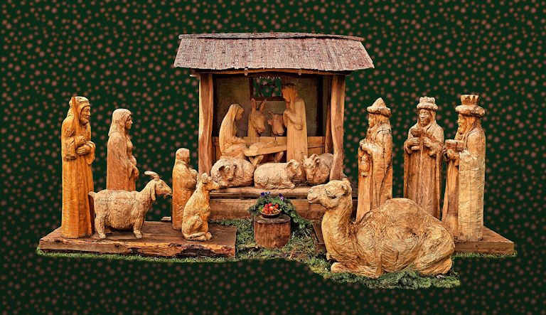

© 2021 Mark Blackham © 2021 International Urantia Association (IUA)

<figure id="Figure_1" class="image urantiapedia">

<figcaption><em>Image by Kerut</em></figcaption>
</figure>

As most of us know, Christmas began as a celebration of the birth of Jesus, and to many it still is. On Christian websites, the meaning of Christmas is said to be a celebration of God’s love for the world, or the celebration of the God-man who came to earth for the salvation of all people. And on other sites, it is a time to glorify God and Jesus.

For those who are not so religious, Christmas has come to mean something a little different. The meaning of Christmas in more secular circles also includes a celebration of love (but not God’s love), and other meanings center around friends, family traditions, helping others, and peace on earth. These are meaningful interpretations of Christmas but they do not represent the whole truth.

Fortunately, those of us blessed with the revelation have a more profound understanding of why Jesus bestowed himself on our world. Christmas, even though it does not coincide with the actual birth date of Jesus, is still a great time to celebrate, especially for the people of Urantia.

The reasons for Michael’s bestowal are many, and are best summarized in Paper 120, _The Bestowal of Michael on Urantia,_ narrated by the Melchizedek director of the revelatory commission wherein he recounts the instructions Immanuel gave to Michael just prior to his bestowal. These instructions embody the objectives, meanings, and values of Jesus’ incarnation on Urantia and, among other things, include:

1. To terminate the Lucifer rebellion in the system of Satania.
2. To atone for the sorrow and confusion brought upon Urantia by the Caligastia betrayal and the subsequent Adamic default.
3. To terminate an age and resurrect the sleeping mortal survivors.
4. To bestow the Spirit of Truth in order to make all normal mortals immediately and fully accessible to the ministry of the Thought Adjusters.
5. To make a further contribution to the sovereignty of the Supreme.
6. To function as a teacher to liberate and inspire man’s spiritual nature. To illuminate the darkened human intellect, heal the souls of men, and emancipate their minds from age-old fears.
7. To minister to the physical well-being and material comfort of his brothers in the flesh.
8. To live the ideal religious life for the instruction, inspiration, and edification of all his universe. To be the inspiration for all lives on all Nebadon worlds throughout all generations in the ages to come.
9. To make a new revelation of man to God. To reveal God in the flesh and especially to the creatures of the flesh.
10. To exhibit as never before seen in Nebadon the transcendent possibilities attainable by a God-knowing human during the short career of mortal existence.

And after all this, we are reminded to, “Never lose sight of the fact that the **supreme spiritual purpose** of the Michael bestowal was to enhance the _revelation_ of God” [[UB 120:4.4](/en/The_Urantia_Book/120#p4_4) emphasis added].

These are the many wonderful and extraordinary reasons to celebrate the bestowal of Michael on Urantia, not just at Christmas, but every day of our lives. Indeed, we are very fortunate to have been born on this “dark and confused planet.” For all eternity, Urantia will remain “the sentimental shrine of all Nebadon, the chief of ten million inhabited worlds, the mortal home of Christ Michael” [[UB 119:8.8](/en/The_Urantia_Book/119#p8_8)].

Christmas is a time to give thanks to Michael of Nebadon and to celebrate the marvel of a Creator Son being born on Urantia to deliver to all humanity, even to an entire universe, an enlightened portrayal of the true nature of a loving God.

## References

- Tidings newsletter: https://urantia-association.org/about-tidings-newsletter/
- This issue: https://urantia-association.org/newsletter/tidings-december-2021/
- This article: https://urantia-association.org/the-meaning-of-christmas