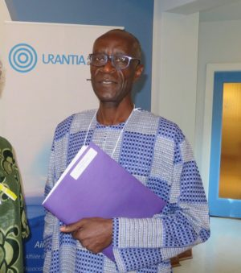
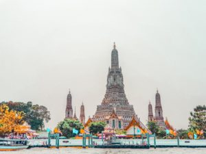

© 2019 Moustapha N’diaye © 2019 International Urantia Association (IUA)

> _And the peace of God, which transcends all understanding, will guard your hearts and your minds in Christ Jesus._ [[Philippians 4:7](/en/Bible/Philippians/4#v7)]

> _O bestow on your people Israel great peace forever, for you are King and the Lord of all peace. … Blessed are you, Yahweh, who blesses his people Israel with peace._ [[UB 150:8.7](/en/The_Urantia_Book/150#p8_7)]

> _Peace be unto you. And unto you, peace._

## Introduction

<figure id="Figure_1" class="image urantiapedia image-style-align-left">

</figure>

Who among us has paused to reflect upon the familiar greeting and response, “Peace be unto you. And unto you, peace?” This essay draws on personal experience and understandings, the testimonials from those who collaborated in its writing, and an assessment of the religious literature of the Far East (particularly the writings of Hinduism, Taoism, and Buddhism), to do just that—pause and reflect on a dynamic and living peace. In so doing, this reflection explicitly relies on the teachings of _The Urantia Book_ and the example provided by the life of Jesus as recounted in Part IV.

We have two goals. The first is to determine the extent to which human and superhuman agents contributed to this much desired peace, despite the unexpected consequences arising from the vicissitudes of our planetary history. And the second, to understand how our experience with the teachings of _The Urantia Book_ reveal the myriad problems of the modern world, the relationship of those problems to a lack of dynamic and living peace, and the practical contributions this revelation can offer for their resolution.

Our immediate observation from this reflection identifies a deep-rooted malaise that characterizes modern times. This malaise, which we refer to as “stress,” has multiple and often unsuspected sources. It results from the external conflicts and internal disturbances that increasingly pervade both our individual lives and society at large. Globalization and the interweaving of economic, cultural, political, religious, and social institutions makes this malaise one the most widely shared perils confronting us today.

This peril results from the decline in our sense of values, a decline that makes life itself seem meaningless. It is evidenced by increasingly frightening acts of antisocial behavior such as collective suicide, mass murder, and the trivialization of life. This unprecedented situation requires unprecedented solutions.

The questions are: How to give meaning to life? What can peace bring to this effort? And what should the nature of this peace be?

## The Basic Human Conception of Peace

Simply put, it is my opinion that men and women who are not at peace with themselves due to this stress tend to gravitate towards those they perceive to be more at peace. They instinctively know that such people will offer a sympathetic ear and soothing, judgment-free advice. In such circumstances, experience becomes the master datum for the acquisition of peace.

## The Supra-Human Understanding of Peace

<figure id="Figure_2" class="image urantiapedia image-style-align-right">

</figure>

While peace is both the natural state and defining characteristic of the Spirit, it is only through revelation (auto- or epochal-revelation) and personal spiritual experience that we come to understand its purpose and scope.

Peace, in its external and social form, is a dynamic process. It is punctuated by the influences of the Divine Sons as it integrates into the dynamics of evolutionary religions. Just as men and women in stress seek advice from those among them who appear more at peace, so God’s plan provides for experienced mentoring that helps us to face the challenges that arise when we stray from the divine assurance that only living and dynamic peace can confer.

Individual and collective peace on earth is not only driven by human effort but also by the ministry of supra-human personalities. These personalities nurture an ever-deeper appreciation of living and dynamic peace as the planetary ages unfold.

Unfortunately, all too often people tend to deal with the perplexities of life without including the Spirit in their efforts. It is unfortunate because it seems that peace is the nature and defining attribute of the Spirit.

Although the peace of the Lord has not yet become the natural state of our social lives, as each planetary age unfolds under the ministry of the planetary bestowal Sons, we move step-by-step away from the primitive ages of humanity—characterized by fear and ignorance, and their consequences—towards that time when we can all enjoy spiritual peace on earth.

> _Peace is not the natural state of the material realms. The world first realizes ‘peace on earth and good will among men’ through the ministry of the seraphic souls of peace._ [Paper 39:5:5, page 437.4]

This implies that the “Souls of Peace” follow several ages of stabilization as the evolution of mankind moves into alignment with the Divine Plan.

> _War is the natural state and heritage of evolving man; peace is the social yardstick measuring civilization’s advancement._ [Paper 70:1:1, page 783.4]

Planetary ages are coordinated in space, integrated in time, and unified by the Spirit in eternity. They manifest themselves by successive individual and collective contributions to the gradual manifestation of eternity in time, to the eternal now.

Planned for by the Spirit and implemented by the different Sons of planetary bestowal, the progressive individual discovery of peace is the result of this evolution. For the individual its ultimate outcome is fusion with the inner Adjuster and progress towards the ages of Light and Life.

## Planetary Bestowals and Peace

It is impossible to probe the current state of the world and consider lasting solutions for peace without taking into account the history of the planet and the divine mechanisms of creation.

### The Age of the Planetary Prince

Typically, each planetary bestowal of a divine Son brings with it the building blocks that contribute to the individual and collective establishment of this peace. Among other things, the age of the Planetary Prince should make it possible for mankind to master the forces of nature, lay the foundations of scientific knowledge, and establish a peace that provides for the material security of all people regardless of where they may live. But did our planet, being exceptional, receive the benefit of this bestowal?

The revelators advise us that, at the beginning of the 20th century, those benefits, which had failed to settle in the minds of primitive man, are being rediscovered some 300,000 years later [[UB 66:5.18](/en/The_Urantia_Book/66#p5_18)]. Early man simply did not possess the knowledge required to establish the material security necessary for our planet to benefit from the peace that the age of the Planetary Prince typically bestows upon evolutionary worlds. This delay prolonged the reign of fear and ignorance that the ministry of the Planetary Prince normally brings to an end. The disastrous consequences of the Lucifer Rebellion and the experimental work of the Life Carriers compounded the complications and obstacles that contributed to this failure.

### The Age of the Adamic Bestowal (Adam and Eve)

The primary mission of the Adamic bestowal was to enhance the evolutionary potential of humankind. This mission was intended to biologically unify the human races and, eventually, erase all traces of racism. This enhancement would have made human nature more sensitive to morontial and spiritual influences.

Because of their default, the Adamic bestowal failed in its mission and this resulted in a deficit of the violet blood required for improved health, a delay in the spiritual outcome of the races through increased morontia sensitivity, and serious complications for the cultural and political aspects affecting our lives today. These failures further complicated the establishment of peace.

### The Influence of the Lucifer Rebellion

The philosophical problems and spiritual errors arising from the Lucifer Rebellion compounded the social problems related to the failures of the Planetary Prince and Adamic bestowals.

The Lucifer declaration that the personality of the Universal Father does not exist and is a myth invented by the Sons of Paradise [[UB 53:3](/en/The_Urantia_Book/53#p3)], has left very deep traces and remains tangible even now in the 21st century. Among other things, this proclamation resulted in the diminution of living faith (especially adoration and prayer) and the perpetuation of the ancestral fears that effectively negate the ultimate goal of destiny. How can we worship a Father who does not exist? How can we pray to a son of a fictitious Father? All that remains is a science and religion largely disconnected from its life-giving roots.

The proclamation of the “equality of mind” and “the brotherhood of intelligence,” not to mention the contradiction of Caligastia’s designation of Lucifer as the “God of Liberty”, added to the diminution of the spirit and worked to separate mankind from anything other than a merely intellectual dimension devoid of any prospect for spiritual achievement. The influences of Lucifer have trapped us in fruitless tautologies that, despite the notable efforts of the prophets and other spiritual educators, led to the absence of spiritual awareness and dealt a great blow to our worldview. However, as we shall see in more detail, these philosophical problems and spiritual errors did not erase the concept of the Fatherhood of God or the Brotherhood of Man from human consciousness.

Calling “the plan of worship” a ploy to serve the ambitions of the Paradise Sons opened the door to various forms of perverse alternatives to worship. These alternatives range through various forms of occultism, esotericism, spiritualism, channeling, and other cultish practices. They attract lost souls, thirsting for salvation. Had mankind the means to probe the mystery of the Divine Plan there would be no desire to pursue these degraded forms of cult mysteries.

### Machiventa, Michael, and the Fifth Epochal Revelation

Consider the impact of the third, fourth, and fifth epochal revelations which we combine for the following reasons:

1. Machiventa (third epochal revelation), guided by of one of the most experienced Adjusters of Nebadon, performed an emergency mission to prepare us for the seventh bestowal of Michael of Nebadon who incarnated as Joshua ben Joseph (fourth epochal revelation).

> _Joshua ben Joseph, the Jewish baby, was conceived and was born into the world just as all other babies before and since, **except** that this particular baby was the incarnation of Michael of Nebadon, a divine Son of Paradise and the creator of all this local universe._ [[UB 119:7.5](/en/The_Urantia_Book/119#p7_5)]

1. The Thought Adjuster who guided the mind of Machiventa also served Joshua ben Joseph and is now personalized as the Chief of Personalized Adjusters of Nebadon.

2. The title “Planetary Prince” conferred on Michael of Nebadon following his seventh bestowal was delegated to Machiventa who, together with the twenty-four councilors, now serves Michael in the council of the Planetary Princes of Satania.

Moreover, we now more fully appreciate the contribution to the plan for the establishment of divine peace that resulted from the petition made by a commission of twelve planetary midwayers in the courts of the superuniverse. Their petition resulted in the fifth epochal revelation including Part IV—The Life and Teachings of Jesus.

## Current Situation – What Peace?

The conclusions drawn to this point help us understand how and why men have lost the true meaning of spiritual peace despite the inspiration of prophets recorded in religious texts across time and the auto-revelation that emerges through thoughtful reflection. Continuing from here, this essay attempts to coordinate the human idea of peace that has survived with the divine truth of the Spirit’s expression in humanity.

## Peace Through Human Traditions and Religions

It is worthy of note that the idea of peace that has survived did so through the great efforts of people who, inspired by God, advanced and installed the material security necessary for spiritual peace.

## Judeo-Christian and Islamic Traditions

Psalm 46 is a popular verse that never fails to bring comfort in these stressful times. Its message inspires our efforts to actualize the peace of the Lord, the divine expression of love.

<figure id="Figure_3" class="image urantiapedia">

</figure>

> _God is our refuge and strength, a very present help in trouble._  
> _Therefore, we will not fear, though the earth be removed, and though the mountains be carried into the midst of the sea;_  
> _Though the waters thereof roar and be troubled, though the mountains shake with the swelling thereof. Selah._  
> _There is a river, the streams whereof shall make glad the city of God, the holy place of the tabernacles of the most High._  
> _God is in the midst of her; she shall not be moved: God shall help her, and that right early._  
> _The heathen raged, the kingdoms were moved: he uttered his voice, the earth melted._  
> _The LORD of hosts is with us; the God of Jacob is our refuge. Selah._  
> _Come, behold the works of the LORD, what desolations he hath made in the earth._  
> _He maketh wars to cease unto the end of the earth; he breaketh the bow, and cutteth the spear in sunder; he burneth the chariot in the fire.  
> **Be still and know that I am God:** I will be exalted among the heathen; I will be exalted in the earth._

The expression, “**Be still and know that I am God**” is highlighted because it is one of the most well-known and beloved of all Bible verses. This verse is actually more of a wake-up call to be in awe than a gentle call to rest. Understanding its message allows us to approach and understand Asian-inspired works discussed later in this essay.

We could draw a parallel between this Psalm and the following excerpt from _The Urantia Book_:

> _One of the most amazing earmarks of religious living is that dynamic and sublime peace, that peace which passes all human understanding, that cosmic poise which betokens the absence of all doubt and turmoil. Such levels of spiritual stability are immune to disappointment. Such religionists are like the Apostle Paul, who said: ‘I am persuaded that neither death, nor life, nor angels, nor principalities, nor powers, nor things present, nor things to come, nor height, nor depth, nor anything else shall be able to separate us from the love of God’._ [[UB 100:6.6](/en/The_Urantia_Book/100#p6_6)]

We can measure the powerful character of this peace even in the face of the greatest disappointments imaginable. Our search for this peace is only possible by recognizing God in ourselves.

This Psalm and _The Urantia Book_ both observe that dynamic and living peace arises in this troubled world when the soul attempts first, to find peace so that everything else falls into place, rather than expecting to find peace after everything has fallen into place.

The more each of us become people of peace the more peaceful society becomes. A man of peace is not only a man in peace but also a man who, by his simple presence, gives peace wherever it is needed. Such a person shines like the sun that illuminates objects by its presence alone. If peace is proportional to the number of people who are at peace with themselves, then each person who strives to achieve personal peace becomes a shining light to transform another.

We are naturally peacemakers via our cooperation with our Adjusters. The Life and Teachings of Jesus exemplify that this drive to restore harmony where it is missing makes us peacemakers and contributes to our spiritual growth. Jesus has shown us the truth of God’s unwavering love by overcoming life’s obstacles and manifesting the will of God.

Our minds and physical being are time and space adaptations of the Spirit. Through his gift to us of divine personality guided by his second gift of a Thought Adjuster, God participates in this peacemaking through our actions. This peacemaking becomes complete once our Thought Adjuster personalizes through fusion with the personality it guides. This fusion can only occur when our human nature fully aligns with the divine within. The peace that only God can confer becomes both the means and the outcome of this fusion.

Because our planetary bestowals of a Divine Son and Adam failed to provide the building blocks necessary for the timely unfolding of God’s “Divine Plan,” we must rely on other influences to compensate for those failures and assist in the installation of peace on earth. What other influences? The Spirit of Truth, the activity of the Supreme, and the ministry of our very capable Thought Adjusters.

These other influences of the Father, Son, and Spirit can lead to the installation of living and dynamic peace provided that we make the willful choice that our Father’s will be done through adoration, prayer, and service.

## Asian-Inspired Traditions

It could be said that the Asian mindset is underpinned on the notion of a synchronicity between the material and divine. This could account for the differences in Asian philosophy as compared to the Western worldview that is more causally oriented.

### Introduction

<figure id="Figure_4" class="image urantiapedia image-style-align-left">

</figure>

Typically, religious traditions of the Far East address a profound requirement to (re-)connect with the deepest sense of our inner being so that our quest to find peace might help us find “nirvana.” The great teachers who have mastered this tradition exhort their followers to meditate and thereby actualize the potentialities found deep within their being. But this inward focus orphans them from a full understanding of a personalized Father who is both deep within our being and throughout all of creation at the same time. It is the sense of this divine presence that drives us all on our sublime quest.

The main reason for this inward focus, to the omission of all else, stems from Hindu philosophy and the rejection by the Brahmans of the Salem gospel Machiventa Melchizedek tried to introduce [[UB 94:1.5](/en/The_Urantia_Book/94#p1_5)]. _The Urantia Book_ teaches that this rejection was motivated by an Indo-Aryan obsession to preserve the privilege of the Brahman caste and their sense of racial identity [[UB 94:2.1](/en/The_Urantia_Book/94#p2_1)].

This “omission of all else” effectively orphaned them from an understanding of a personalized deity. The powerful philosophy it produced had a similar effect on subsequent Oriental philosophies. Consequently, both Hinduism and Buddhism lack a simple and clear understanding of the personality of the Universal Father as presented by the missionaries of Salem and confirmed through Michael of Nebadon’s seventh bestowal ministry.

> _…The concept of the Buddha Absolute is at times quasi-personal, at times wholly impersonal — even an infinite creative force. Such concepts, though helpful to philosophy, are not vital to religious development. **Even an anthropomorphic Yahweh is of greater religious value than an infinitely remote Absolute of Buddhism or Brahmanism**_. [[UB 94:11.12](/en/The_Urantia_Book/94#p11_12), Emphasis added.]

### Nirvana and Spiritual Peace

Although they lack the recognition of a personalized deity, and despite the vicissitudes of history, these Asian-based philosophies still came to a deep understanding of the Self. However, not recognizing that this Self arises from a personalized deity, the Father, they have not achieved a full understanding of the reality of the Self.

While their incomplete understanding does highlight very important concepts and notions as they relate to self-knowledge (know thyself), it can also lead to erroneous conclusions. The conclusions that generally arise from these thoughtful efforts suggest that the death of the ego leads to Nirvana (_consciousness of presence in the eternal now)_ and to the dissolution of the self into a form of _impersonal consciousness_. This notion of impersonal consciousness, in other words, non-personalized consciousness, can be problematic.

The problem arises from the strict logic of these philosophies, a logic that omits any consideration of a personalized Father. Orphaned in this way, these philosophies cannot delve into the full nature of being and, although they can lead to a comparable state of peace, they have a tendency to push the individual towards prolonged isolation.

> _Short seasons of retreat from the busy scenes of life may not be seriously dangerous, but prolonged isolation of personality is most undesirable._ [[UB 100:5.8](/en/The_Urantia_Book/100#p5_8)]

This isolation, deemed necessary to master the compulsive self, can end up dissociating the disciple, which then makes it difficult to reconcile society’s current confused state with the sublime peace that the follower may attain through personal isolation. There is simply no bridge connecting the ever-growing gap between the two. Followers of these philosophies often choose to spend their lives as hermits, perhaps revered by society at large but not necessarily of service to humanity. They could run the risk of unwittingly responding to the cry for self-assertion with its call for a precedence of the mind that separates them from the recognition of, and conscious shared participation with, the Father’s spirit.

Meditation that concentrates on breathing, or a thought, or a fixed observation does counter our predilection for convulsive thought. However, what we derisively refer to as “contemplating our navel” cannot and should not be an end unto itself. It cannot produce or replace the worshiping meditation and communion with the inner Spirit that motivates the quest of those who are intuitively aware of the personalized presence of the divine within.

## Lessons from Planetary Supervision

### Machiventa’s Ministry:

Machiventa exhorted his disciples to carry the message of the gospel of Salem as far as possible. Despite its alteration over the following centuries, his disciples carried this message throughout the known world.

Except for the Far East, where the reaction of Brahmanism as a shield against the teachings of Salem proved detrimental to its message, the Melchizedek teachings became the main unifying thread in human religious traditions prior to the incarnation of Michael of Nebadon as Joshua ben Joseph.

### Michael’s Outpouring

The following initiatives undertaken by Jesus would have no doubt helped to extend the gospel of the kingdom to the Far East:

- The two-year training period with the young man from India, Ganid, that possibly provided for a salutary welcome of the gospel of the Father by the philosophies of the Far East which had been orphaned from the concept of the Father.
- The Urmia teachings that expanded religious understanding may have assisted the spread of the traditions of the Eastern version of Christianity, which were less bellicose than the Western version.
- The influence of Abner’s group in Philadelphia that resulted in “The Eastern version of the message of Jesus” [[UB 195:1.11](/en/The_Urantia_Book/195#p1_11)].
- The fifth epochal revelation and current ministry.

Following the respective ministries of Machiventa and Michael of Nebadon and their contributions to the philosophy of the peoples of the Holy Land, God the Supreme takes up these efforts and calls upon all the sons of God to continue this ministry because _Nothing of survival value is ever lost in all the wide universe_ [[UB 109:3.2](/en/The_Urantia_Book/109#p3_2)].

Interestingly, the revelators inform us that they greatly regret that Abner’s teachings, which were in many respects more faithful to the message of Jesus, did not flourish in the later traditions of Western Christianity.

## The Peace of Jesus

True peace delivers us from the sufferings of the past and frees us from the anxieties of the future. It incorporates the experience gained from the lessons of the past with the vision of a better future that restores our reason for living. This reality can only be enshrined in the present, in the eternal now, if and when:

- the lessons arising from past failures are learned and corrected through adoration and the guidance of the divine inner presence.
- daily life integrates the faith established in the soul through adoration and prayer with service in the present, the eternal now.
- it is our will that the Father’s will be done.

The incarnation of Michael of Nebadon as Joshua ben Joseph provides the perfect example of Dynamic and Living Peace. This example is especially necessary because, as a consequence of rebellions and bestowal defaults, we were deprived of the building blocks that contribute to the unfolding of this peace. We have not achieved the expected state as provided for by the “Divine Sons” and present elsewhere in the current age of the universe because we have not successfully received these building blocks. Without them, our best recourse is found in spiritual pressure from above, one that benefits from a Father never short of resources.

The outpouring of the Spirit of Truth at Pentecost, which followed the seventh bestowal of our Creator Son, provides the essential lever. It marks the de-compartmentalization of individual destinies and their perfect integration into the plans of God the Supreme for eternal service. The outpouring of the Spirit of Truth combined with the guidance of our experienced Adjusters helps us to overcome the handicaps, insufficiencies, and other obstacles inherited from ages past. Ultimately it leads us into a new age in the evolution of our planetary history.

## Lessons to Learn

Recall _The Urantia Book_ teachings that include:

_It would be helpful in the study of selfhood to remember:_

1. _That physical systems are subordinate._
2. _That intellectual systems are co-ordinate._
3. _That personality is superordinate._
4. _That the indwelling spiritual force is potentially directive._ [[UB 112:2.1](/en/The_Urantia_Book/112#p2_1)]

Also remember that we are blessed with more than a simple animal consciousness. We are endowed with a conscious awareness of the divine: the consciousness of God on the first level; the search for God on the second; and, on the third level, the will to resemble God.

For those who are particularly sensitive to it, this God-consciousness seeks to find expression beyond our inner core of being with a real sense of urgency. However, when confined to the mind for reasons of inaptitude, it is poorly understood and often gives rise to humanism, even atheism.

Nevertheless, the Spirit of Truth is always there to ensure the prodigal son returns home once the illusions of mind that separate us from the reality of being are overcome.

Some final points to ponder:

- Illumination extends beyond thought through revelation.
- Sanctification ensures that “it is our will that the will of God be done.”
- The quest for sanctification is the positive response to the commandment “Be you perfect even as I am perfect.”
- The peace that flows as fruits of the Spirit, always lifts up the soul in the face of the storm and the inertia of the ego.
- Enlightenment only becomes a tool of sanctification when we commit ourselves to doing the Father’s will.

Pax vobiscum.

 

## References

- Journal newsletter: https://urantia-association.org/journal-online-archives/
- This issue: https://urantia-association.org/newsletter/journal-november-2019/
- This article: https://urantia-association.org/dynamic-and-living-peace