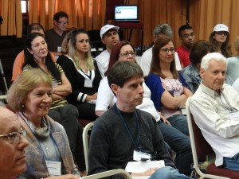

© 2015 Paulo Cesar Zapello © 2015 International Urantia Association (IUA)

<figure id="Figure_1" class="image urantiapedia image-style-align-left">

</figure>

The National Meeting for Brazilian Urantia Book readers was held in Curitiba, Paraná 9 to 12 October. Regardless of the economic crisis in Brazil, 60 people attended this event. We were pleased to welcome the Brazilian pioneer reader, Mr. Caio Mario Café, and also Andres Ramires from Colombia.

This year we celebrated the 10th Brazilian event, with three magical days of in-depth involvement from all participants. The agenda included four plenary presentations, three workshops, an interactive quiz, and a celebration party. All attendants were constantly active and deeply involved.

<figure id="Figure_2" class="image urantiapedia image-style-align-right">

</figure>

The driving theme was: “From Urantia to Paradise” proceeded by an “Introduction to _The Urantia Book_” with a vision of cosmology and the divine assistance of the Thought Adjusters.

The three days were unforgettable and we are all looking forward to the next event in 2016.

Light and Peace  
In service,  
Paulo Cesar Zapello  
President – Urantia Association of Brazil
 

## References

- Tidings newsletter: https://urantia-association.org/about-tidings-newsletter/
- This issue: https://urantia-association.org/newsletter/tidings-october-2015/
- This article: https://urantia-association.org/brazil-national-meeting