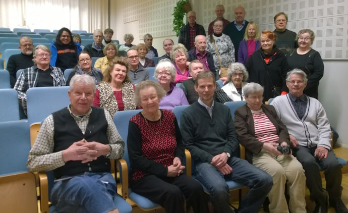
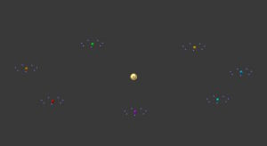

© 2016 Raimo Ala-Hynnila © 2016 International Urantia Association (IUA)

<figure id="Figure_1" class="image urantiapedia">

</figure>

Our winter conference was held 22-24 of January 2016 in the central part of Finland on the shores of Lake Paijanne. There were about 35 Finnish participants and one foreign visitor; Antonio Schefer, from the Netherlands. Two Urantia-Book readers from Cameroon wanted to participate as well, but they did not get the visa in time. The theme was _The Journey of Mortals on Urantia, the Mansion worlds and Through Spheres Toward the Isle of Paradise_.

Luckily the weather was much better during the weekend compared to the earlier three weeks when the temperature was minus 25-30 degrees Celsius.

On Saturday morning the real conference program started from the topic “A little Jesus child as a refugee in Egypt”. The refugee and asylum seeker theme here in Finland is now a topic of keen discussion since there have been hundreds of thousands of refugees escaping war torn areas of Syria and Afghanistan in recent months. Tens of thousands of refugees have also come to our country located in the north. That is why we were reminded that Jesus was also a refugee for some time in his life and we should always have a positive attitude to those who are seeking shelter.

In the afternoon we continued to the mansion worlds and listened to how the evolving mortals get a new morontia body and how they will learn about real cosmic wisdom, morontia mota itself.

<figure id="Figure_2" class="image urantiapedia image-style-align-right">

</figure>
<
Here is a picture of where Jerusem, the capital of our local system of Satania, is located in the centre and the seven transition worlds and the 49 satellites that encircle it. Seven mansion worlds are encircling transition world number one.

In the evening many of us went and had a sauna situated by the lake which was unfortunately frozen so swimming was not possible. During the evening Antonio had a study group meeting through the internet with Urantia Book readers all over the world. It was very exciting to be able to hear and see our friends located so far away from us.

On Sunday we started with beautiful music and continued listening to a lecture about the mortal journey from the local system to the local and super universes and then finally towards the billion different worlds of Havona and the Isle of Paradise. What a beautiful and adventurous journey we have ahead of us!

Raimo Ala-Hynnila  
President, Finnish Urantia Association

## References

- Tidings newsletter: https://urantia-association.org/about-tidings-newsletter/
- This issue: https://urantia-association.org/newsletter/tidings-march-2016/
- This article: https://urantia-association.org/winter-conference-finland-2