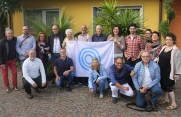
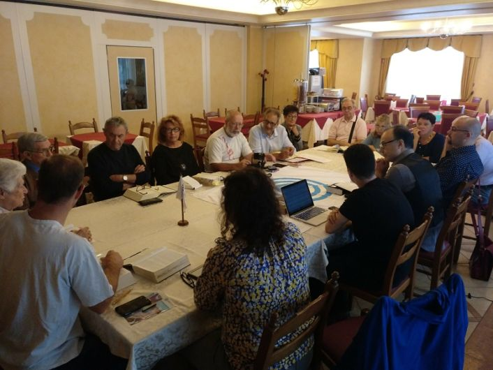

© 2018 Sebastian Nozzi © 2018 International Urantia Association (IUA)

<figure id="Figure_1" class="image urantiapedia image-style-align-left">

</figure>

A Urantia Book readers’ conference took place in Italy, near the beautiful location of the Garda Lake from 5 to 7 October. It lasted from Friday evening (dinner and get-together) to Sunday in the afternoon.

The main goal of this conference was to bring Italian and French readers together. A minority of Spanish and Portuguese speaking attendees was also present, adding to the colorful mix of languages.

The main organizer of this event, Danielle La Scala, has ties with both the French and Italian Urantia Book reader communities. Although the Italian community is very enthusiastic and growing, it is still relatively new. The Urantia movement in France is older and more established, with more experienced longtime members. These conferences in northern-Italy (this was not the first one) have the goal of bringing these two groups together to foster learning, cooperation, planning and growing.

The subject of this conference was the “Teachings of Jesus” with focus on doing the Father’s will. We read not only from Part IV of the book but also from a very well-out out pre-selection of relevant material from other papers. The sessions consisted of reading selected passages, reflecting on prepared questions and discussing freely about what had been read. Cesar Paulo, a former president of the Brazilian Urantia Association, now living in Italy served as moderator; he is a valuable addition to this growing community.

We read the material in turns—each of us reading one to two paragraphs. It was an interesting experience to follow the text in our books, in one’s native tongue, and simultaneously hearing the same text read in another, yet very similar language.

After reading we held very intense and lively discussions (as you can imagine when you put Italians and French in one room together to deal with such thought-provoking subjects as those in _T__he Urantia Book_!) We were able to understand each other pretty well, often by relying on the language similarities, but mostly thanks to the tireless efforts of Danielle to translate the dialogue back and forth. Truly, the whole event would not have been possible without her awesome multi-language capabilities and her dedication. To her we give our gratitude and appreciation!

But, understandably, this intense translation task by Danielle took its toll after so many hours. A hilarious moment ensued when, all of a sudden, we heard Danielle translate from French … back to French! (She realized what had just happened only seconds later.) We all, including her, had a good laugh at the funny situation.

Much to my amazement during the entire conference we did not need to resort to English in order to solve language misunderstandings, as is often the case. It made me realize how far we were able to come with the combination of multi-linguists (which the authors of _The Urantia Book_ call for as a means to world peace) and our common language heritage (Latin).

<figure id="Figure_2" class="image urantiapedia">

</figure>

About the last day I cannot tell much since I had to leave early. It is my understanding that a more formal planning session was held, where the Italian community laid out organizational plans for their future (probably this is where the experience of the French was beneficial.) In the evening the group spent their time at the near-by beautiful Garda Lake.

For me, it was the first time I had met many of the French and Italian readers. It was very encouraging to see Italian and French (and Spanish) readers meeting, interacting and working together. It showed how language barriers don’t matter so much if you share higher common goals and values. It also serves as an inspiration to see members of neighboring countries (even with different languages) willing to meet and help each other, and certainly an example to follow and emulate elsewhere.

The atmosphere was of friendship and brotherhood. The presence of the French contributed much to the event, and I’m sure were also very valuable during the planning session. The Italian, although a small and young group, are already getting organized and heading in the right direction (also thanks to good local leadership of the likes of Danielle and Cesar). Taking all of this into account I can say that this conference was a great success.

It was a great experience, with a very beautiful group of people I got to know during our time together. I look forward to meeting everyone again sometime in the future, be it in Italy or in France.

Sebastian Nozzi  
European Continental Coordinator  
Urantia Association International

## References

- Tidings newsletter: https://urantia-association.org/about-tidings-newsletter/
- This issue: https://urantia-association.org/newsletter/tidings-december-2018/
- This article: https://urantia-association.org/italian-french-conference