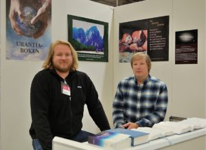
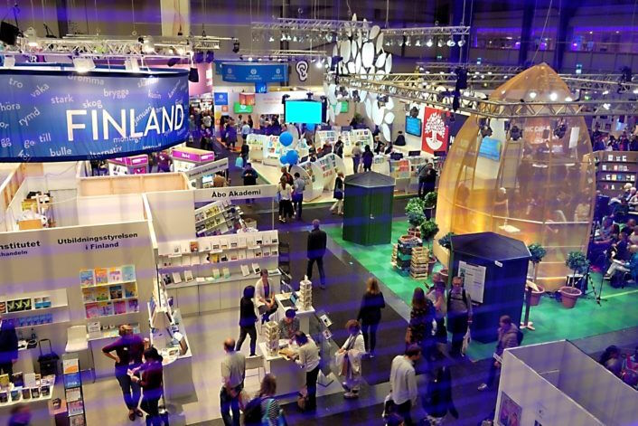

© 2017 Steve Sycamore and David Fabe © 2017 International Urantia Association (IUA)

<figure id="Figure_1" class="image urantiapedia image-style-align-left">

</figure>

Over the course of four days starting September 28th we manned a booth at the Gothenburg Book Fair in Sweden. The event was really much more than a book fair. It is essentially Scandinavia’s largest cultural gathering of the year with roughly 100,000 visitors. The floor space was mind-bogglingly large with many rooms and levels. It was quite easy to get temporarily lost as we explored the various other presentations and seminars.

Our booth was situated in probably the least visited alley although it was next to a food court with a stage where authors, even among the most well known in Sweden, gave talks. Our near neighbors also had sound systems and gave audio presentations at times during the day.

_The Urantia Book_ is largely unknown in Scandinavia; hence, few books were sold. One of the most common questions we were asked was who the Swedish translator was. We could only give scant details but after doing some initial reading and comparison to the English edition, several people commented that the translation was very good. There were similar comments on the quality of the German translation.
 

<figure id="Figure_2" class="image urantiapedia">

</figure>

It is quite expensive to exhibit at the book fair. Because of limited financial resources and available time our booth was very simplistic and rudimentary compared to most others. The amount of art and resources that went into a typical stand was stunning. We may have undergone the danger of not being perceived as a serious player in the cultural arena. Also, we didn’t seem to have a lot of drawing power which could have been attributed to the simple appearance of the booth. One could argue that it is difficult to portray spiritual inspiration and transcendent wisdom to a crowd which doesn’t spontaneously appreciate such things, even though the Catholic Church and Emanuel Swedenborg exhibits seemed to have interested visitors most of the time.

A good percentage of the people who showed the most interest or curiosity in the book were fellow exhibitors and in our spare moments we visited other stands and engaged in many interesting conversations. It was refreshing to be able to converse freely with many different people about our interpretation of the nature and value of this revelatory masterpiece. We have high hopes that one day soon this masterpiece will be recognized and fully appreciated in Scandinavia by forward-thinking people of all kinds. The Gothenburg Book Fair could be of the major means to that end, however, we may need a significantly boosted investment to really crack the ice.

## References

- Tidings newsletter: https://urantia-association.org/about-tidings-newsletter/
- This issue: https://urantia-association.org/newsletter/tidings-december-2017/
- This article: https://urantia-association.org/gothenburg-book-fair-sweden