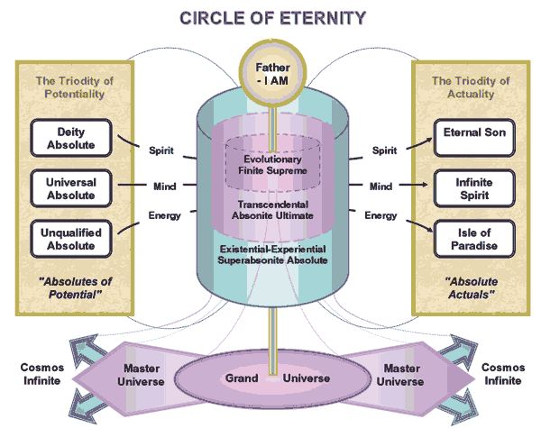
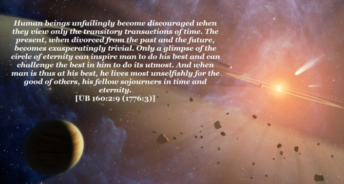

© 2017 Stuart Kerr © 2017 International Urantia Association (IUA)

<figure id="Figure_1" class="image urantiapedia">

</figure>

God inhabits and rules the circle of eternity. His eternal nature is a never-beginning and never-ending circle. The Father exercises ever-expanding consciousness and ceaseless self-realization within this never-ending circle of eternity,

> … _He upholds the worlds in space and swings the universes around the endless circle of the eternal circuit_. [[UB 3:2.2](/en/The_Urantia_Book/3#p2_2)]

Reality is without limitation within the cosmic circle of eternity—it is universal, eternal, absolute, and infinite. Within the eternity cycle, divinity transcends and masters time-space. The universe of universes eternally circles around the Paradise source and center of all things and beings.

God’s purposes and plans for his creation may seem to vary from one universe location to another and they may depend on whether we are looking at their impact on the microcosmic or the macrocosmic aspects of his creation, but looking out from the circle of eternity there is perfect unity of intent and implementation.

From the absolute perspective, all reality is majestically uniform and secure, being indelibly stamped with the divine mark of destined perfection from the circle of eternity. The Paradise Father enters into mutually interdependent partnership with the Eternal Son for carrying out their joint intentions throughout the full encompassment of the circle of eternity. In fact, all seven of the coordinated Absolutes of Infinity

> _…encompass the circle of infinity throughout the endless cycles of eternity._ [[UB 104:3.13](/en/The_Urantia_Book/104#p3_13)]

The universe of universes is overshadowed by the presence of the three Paradise Deities—their triune Deity presence arcs around the circle of eternity. Eternity is a limitless and unified cycle that is amazingly synchronized with the successive cycles of finite time. Within the circularity of endless existence, the contrast of time flashes by in the endless swing around the eternal circle encompassing the dwelling place of the Paradise Father. The entire physical cosmos itself ever swings around the circle of eternity. The mystery of eternity-infinity can best be comprehended

> _…as an almost limitless ellipse which is produced by one absolute cause, and which functions throughout this universal circle of endless diversification, ever seeking some absolute and infinite potential of destiny._ [[UB 105:0.1](/en/The_Urantia_Book/105#p0_1)]

<figure id="Figure_2" class="image urantiapedia">

</figure>

Mortal ascenders will eventually learn to transcend their limited perspective of finite time-space existence; they will begin to assimilate their experiences more holistically. The distinction of time-conditioned succession of events will begin to dissipate and such an ascender will begin to intuit a sense of the “eternal now” moment. Past, present, and future begin to be seen together in unity and events

> _…will be viewed as a whole and perfectly related cycle; in this way will circular simultaneity increasingly displace the onetime consciousness of the linear sequence of events._ [[UB 130:7.6](/en/The_Urantia_Book/130#p7_6)]

Ascenders are becoming a part of the progressive procession of eternity

> _…swinging on forever with the worlds of space around the circle of the eternal ages._ [[UB 32:5.4](/en/The_Urantia_Book/32#p5_4)]

When ascending mortals achieve spiritual perfection and can claim final residence on Paradise, they

> _…will partake of the ‘essence of divinity’ and the ‘spirit of supremacy’ and thus really begin to function in the circle of eternity and in the presence of the Trinity._ [[UB 26:7.4](/en/The_Urantia_Book/26#p7_4)]

<figure id="Figure_3" class="image urantiapedia">

</figure>

## References

- Journal newsletter: https://urantia-association.org/journal-online-archives/
- This issue: https://urantia-association.org/newsletter/journal-november-2017/
- This article: https://urantia-association.org/the-circle-of-eternity