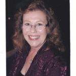

© 2020 Suzanne Kelly © 2020 International Urantia Association (IUA)

<figure id="Figure_1" class="image urantiapedia image-style-align-left">

</figure>

Greetings fellow Urantians, and welcome to the first edition of Urantia Association International’s 2020 Journal. These are truly trying times during the coronavirus pandemic and I’m sure the following insight and wisdom offered in the five incredible essays will provide guidelines for living in the 21st Century and will bring peace and enlightenment to your corner of the world at this time. “Such a life on such a planet!”

Our first contributor is Luis Garcia-Bory (Switzerland), who champions a new way of living on such a planet by reflecting on what he calls, _A Positive Shift in Planetary Consciousness_. Using the current worldwide spread of the coronavirus as a case in point, Luis summarizes the affect that this virus and the media-driven hysteria has had on the people of the world. He offers some encouraging remedies to help cure the side effects for everyone, not just those with the virus, as he states, “A conscious move from fear, inertia, and inaction might be required from each one of us so that we faithfully elevate our planetary consciousness and leave the individual selfhood-based realm of thinking in this pandemic and start reflecting on what _The Urantia Book_ calls a ‘brotherhood ministry’ that focuses on unselfishly yielding fruits the spirit. That might require the enhancing of our mindsets from the question ‘How is this pandemic going to affect me and my loved ones?’ to ‘What can I do myself and how can I collaborate with others to be helpful to a larger number of people around me, especially the most vulnerable?’”

Next is Rick Lyon (USA), who is another marvelous and prolific contributor to the _Journal_ and to all things Urantia. He provides a transcript of one of the teaching sessions he and his wife, Susan, presented to a group of online conference attendees at the Urantia Association’s ‘24-Hour Online Urantia Event,’ which he timely entitled _The Benign Virus of Love_. Rick knows that, “We have seen how quickly a harmful virus can change the world. A benign virus can do the same but in a positive way and even more so.” In keeping with the tumultuous times we are living in, Rick reminds us about the important things in life that form the backdrop of living, which we tend to forget in the hustle and bustle of a 24-hour society, but have now been catapulted to the forefront of civilized humanity. “Perhaps families will learn how to play together and talk with each other again. Perhaps we will reconnect with old friends by phone or video chat as we check on their health and well-being. Perhaps we will learn that by working together we can solve really big problems. Perhaps as people consider their future they will turn to God. Perhaps as they take a break from their ‘too busy’ lives they will find time to grow spiritually”.… Hopefully-perhaps!

The following article is, _The Beatitudes Revisited: A Philosophy of Living_ by Patty McGrath (USA), who interprets life and soul growth modeled after Jesus’ instructions to the apostles. She maintains these beatitudes were for all his children when he said, _And it will not be so much by the words you speak as by the lives you live that men will know you have been with me and have learned of the realities of the kingdom_ [[UB 140:1.7](/en/The_Urantia_Book/140#p1_7)]. Patty takes us through the beatitudes one by one and maintains that: “The beatitudes are not the gospel of Jesus, but rather a philosophy of living. The gospel that Jesus spent three years going around the countryside preaching is simple—The Fatherhood of God and the brotherhood of man. The Universal Father is our creator and the Source of all that is real. Our Creator Father is spirit, and therefore, true reality is spiritual.”

Stuart Kerr III (USA), is also a prolific author of secondary works and has given us many published articles. _Soul Rebirth and Morontia Soul Mind_ is one of my favorites. This is a wonderful snapshot of our next stop through the seven psychic circles, on the way to Paradise and finding our Father. Stuart summarizes that: “The soul is the joint creation of mortal mind and indwelling Adjuster. The soul is the child of the God-seeking mortal mind and the indwelling presence of the God-revealing and immortal Thought Adjuster. Its spiritual growth is independent of the intellectual self-consciousness, but it is capable of experiencing the presence of the Thought Adjuster and of recognizing its spirit leadings. Spirit identification is propelled by the strivings of mortal mind and survival is conditioned by the desires of mortal mind. The evolving soul will be an eventual portrait of the sum total of mortal decisions.”

Our final contributor is Mark Kurtz (USA), yet another who has been previously published in the _Journal_. He gives us a brief yet impactful vignette regarding _Managing Your Model_. It is a wonderful reminder of the plan that Jesus modeled for us. It is also poignant and bolstering at the same time. Mark, thank you for this tutorial, which is so needed now more than ever. Using a current comparison Mark asks, “…for us today, is _The Urantia Book_ a grand attempt to help humanity revise its models? I believe it is. We need progress! Those who listen carefully to the authors and discern their meanings, are those likely to progress. We will comprehend what Jesus wants for us, either here or after graduating to the next life! God’s will shall prevail.” Amen!!

And many other wise individuals have said … This too shall pass, and we will become stronger from the experience. Onward and upward in brotherhood, friendship and love! Happy and enlightened reading—on such a planet!

## References

- Journal newsletter: https://urantia-association.org/journal-online-archives/
- This issue: https://urantia-association.org/newsletter/journal-may-2020/
- This article: https://urantia-association.org/journal-editorial-may-2020