© 2001 The Brotherhood of Man Library

<figure class="table chapter-navigator">
  <table>
    <tbody>
      <tr>
        <td>
        <a href="/en/article/William_Trimble/On_Completion">
          On Completion
        </a>
        </td>
        <td>
        <a href="/en/index/articles_innerface#volume-8-no-2">
          Volume 8 - No. 2 — Index
        </a>
        </td>
        <td>
        <a href="/en/article/Ken_Glasziou/The_Least_We_Should_Know_about_the_Cross">
          The Least we should know about the Cross
        </a>
        </td>
      </tr>
    </tbody>
  </table>
</figure>

> Existential Potentials and Patterns In Universe terminology a pattern is unchangeable though copies can be projected as material, spiritual, or mindal—or in any combination ofthese energies. It can pervade personalities, identities, entities, or non-living matter. Patterns are the substance of potentials. Pattern may configure energy but does not control it. Gravity is the sole control of energy matter. Neither space nor pattern are gravity responsive and there is no relationship between space and pattern. The reality of any pattern consists ofits energies, its mind, spirit, or material components. Pattern is a master design from which copies are made. Eternal Paradise is the absolute of pattern; the Eternal Son is the pattern personality; the Universal Father is the direct ancestor-source of both. Eut Paradise does not bestow pattern and the Son does not bestow personality That quality of energy or of personality by virtue of which pattern is caused to appear may be attributed to God, and to the coexistence of personality and power.
{.is-info}

```mermaid
flowchart TB
    P1["
        Phase 1. The Trinity\n
        All possibilities, actual, and
        potential, whether existential,
        transcendental, or finite, have
        their origin with the Trinity.
        The aspect of the I AM known
        as the Unqualified Absolute is,
        effectively, a vast storehouse
        of all possible static
        potentialities and actualities.
        The initial mandate to activate
        specific static potentials
        derives from the Trinity and is
        responded to by the Deity
        Absolute.
    "]
    P2["
        Phase 2. The Deity Absolute\n
        The Deity Absolute responds
        to causations contained in
        the mandate from the Trinity
        in such a way that Will result
        in activation of potentials,
        static in the Unqualified
        Absolute, to became finite
        actuals
    "]
    P3["
        Phase 3. The Unqualified
        Absolute\n
        Is Responsive to the Deity
        Absolute through the
        activation of the appropriate
        causative impregnated static
        possibilities and potentials.
    "]
    P4["
        Phase 4. The Universal Absolute\n
        Responds to the newly causative-
        impregnated but Still static
        potentials, perfectly compensating
        the differentials inherent in the
        varying aspects of incomplete
        reality, and preparing thern to
        become active and responsive to
        the influence of certain
        transcendental agencies that Will
        be involved in their transmutation
        to finite realities.
    "]
    P5["
        Phase 5. The Deity Ultimate\n
        The eventuation of universe
        capacities in consequence of the
        original volitional mandates of the
        Trinity involves the transformation of
        these undifferentiated potentials into
        segregated and defined plans. T his is
        an act of the Ultimacy of Deity as well
        as manifold agencies of the
        transcendental level.
        Such acts are in perfect anticipation of
        the future needs of the Master
        Universe and in accordance with the
        plans of the Architects of the Master
        Universe as the embodiment of the
        Deity concept of the universes.
    "]
    P6["
        Phase 6. Role of the Conjoint Actor
        (the Infinite Spirit) as Integrator\n
        The Infinite Spirit universally
        integrates the varying functional
        aspects of all actualizad reality on all
        levels of manifestation from finites,
        through transcendentals, and on to
        the absolutes.
    "]
    P7["
        Phase 7. The Triodities of
        Actuality and Potentiality\n
        The Triodity of Potentiality consists in
        the three Absolutes of Infinity while
        the Triodity of Actuality consists of
        the Eternal Son, the Conjoint Actor
        (Infinite Sprit) and the Paradise Isle.
        (note: all things impersonal center
        and inhere in the Paradise Isle.)
        The triodities act directly on the
        Supreme and also indirectly via the
        eventuated level of the absonite and
        the co-operative actions of the
        Supreme Creator Personalities.
        These appear to be the last steps in
        the transfer of transmuted existential
        potentials to finite actuals of reality to
        the Supreme.
    "]
    P8["
        Step 8. The Supreme—
        Experiential God of the finite
        Universes\n
        Existential potentials transmute to
        actuals as they find lodgment with the
        Supreme. There, they again became
        potentials to be callad fotth into
        actuality by the Supreme Creator
        Personalities in their function as
        creators of the Master Universe.
        aut much more than the finite potentials
        of material reality are derived from the
        Supreme. Mortal man and all Other
        finite creatures are created out of the
        living potential of energy, mind, and
        spirit existent in the Supreme.
        And it is out of the reality of the
        Supreme that the God-spirit who
        indwells each human individual, with
        that individual's consent, weaves those
        patterns destinad to become an
        ascendant soul, while that same
        individual utilizes those qualities and
        quantities already existent within the
        Supreme during experiential growth
        towards the Universal Father.
        However, mankind's experience with
        the Supreme is two-way, in that the
        experiences of soul growth also
        contribute to the evolution of the
        Supreme through manifold agencies of
        divinity.
    "]
    P1 ==> P2
    P2 ==> P3
    P3 ==> P4
    P4 ==> P5
    P5 ==> P6
    P6 ==> P7
    P7 ==> P8
```

## External links

* Article in Innerface International: https://urantia-book.org/archive/newsletters/innerface/vol8_2/page8.html

<figure class="table chapter-navigator">
  <table>
    <tbody>
      <tr>
        <td>
        <a href="/en/article/William_Trimble/On_Completion">
          On Completion
        </a>
        </td>
        <td>
        <a href="/en/index/articles_innerface#volume-8-no-2">
          Volume 8 - No. 2 — Index
        </a>
        </td>
        <td>
        <a href="/en/article/Ken_Glasziou/The_Least_We_Should_Know_about_the_Cross">
          The Least we should know about the Cross
        </a>
        </td>
      </tr>
    </tbody>
  </table>
</figure>
