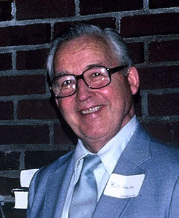
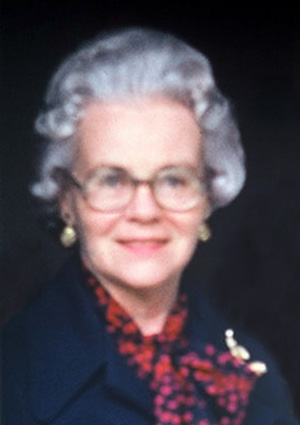

© 1985 Urantia Foundation

<figure class="table chapter-navigator">
  <table>
    <tbody>
      <tr>
        <td>
        </td>
        <td>
        <a href="/en/index/articles_uf_urantian#issue-1-july-1985">
          Issue 1, July 1985 — Index
        </a>
        </td>
        <td>
        </td>
      </tr>
    </tbody>
  </table>
</figure>

## Translations update

On May 18, 1985 another significant step was taken toward the realization of a Spanish translation of “The URANTIA Book.” A meeting was held to discuss the translation process and contract considerations. Attending the meeting were members of the Board of Directors of Andite Corporation; Maria Zadunaisky, Project Director for the translator company, Euramerica; John Hales and Frank Sgaraglino representing URANTIA Brotherhood; and Douglas Fraser and Richard Prince of the Translation Selection Committee. The meeting went very well and the translation process was agreed upon. Essentially, the work completed by Euramerica will be reviewed by teams of “URANTIA Book” readers located in Bogota, Colombia; Seville, Spain; and the U.S. The finalization and signing of the contract is expected during the third quarter of this year. Once the process begins, it is estimated the project will take a minimum of 14 months.

It is with great pleasure that the Board of Directors of Andite Corporation announce that the fund drive goal of $350,000.00 for the Spanish translation has been reached. We wish to express our deep appreciation to everyone who was able to donate funds to this important project. Further, we wish to acknowledge with grateful thanks the outstanding job done by Frank Sgaraglino and the Finance Committee of URANTIA Brotherhood in organizing and conducting the fund drive for the Spanish translation.

Also, we have received the good news that the Internal Revenue Service has recognized Andite Corporation as a tax exempt organization as defined in the U.S. Code Section 501(c)(3). This determination by the IRS certifies that all donations given to Andite Corporation to date and in the future are recognized as income tax deductions for the year contributed.

As readers of this newsletter will recollect, Andite Corporation is a subsidiary of URANTIA Foundation. The functions of Andite Corporation are to create, publish and distribute the Spanish translation of “The URANTIA Book,” as well as raise funds for this project. Andite Corporation performs these functions with the advice and consent of the Trustees of URANTIA Foundation.

Two of URANTIA Foundation's pamphlets, “Description” and “Selected Excerpts,” have been translated and are now available in French. We will be happy to send copies to anyone who wishes to have them.

Concerning the Finnish translation, steady progress continues as the Finns work on the latest revision.

## Trustee Emeritus - William M. Hales

With great regret and reluctance, the Trustees of URANTIA Foundation recently accepted the resignation of William M. Hales (known to one and all as Bill) as a Trustee. However, the Trustees have prevailed upon Bill to accept the position of Trustee Emeritus with the Foundation. In this position, Bill will be able to continue to share his wise counsel with the Trustees in their deliberations.

Bill was one of the founders of the URANTIA Foundation on January 11, 1950 and has served as a Trustee since that date (except for a brief two year period when he first served as Trustee Emeritus). He also served as its President for 23 years.

Bill has also been an active member of the URANTIA Brotherhood since 1955 when he first became a General Councilor, an office he still holds. He also served as Chairman of the Judicial Committee for nine years and Chairman of the Finance Committee for five years and was a member of the Executive Committee for fourteen years. He is also a charter member of First URANTIA Society.

The Trustees wish to take this opportunity to thank Bill and acknowledge with deep appreciation his many years of service to the URANTIA movement.

<figure id="Figure_1" class="image urantiapedia">

<figcaption><em>Bill Hales</em></figcaption>
</figure>

## New Trustee Elected - Helena Sprague

The Trustees take great pleasure in announcing the election of Mrs. Helena Sprague as a Trustee of URANTIA Foundation. Helena, now retired, spent her professional life as an educator and school administrator. She has been a student of “The URANTIA Book” since 1957, a member of URANTIA Brotherhood since 1959, and an organizer of and participant in a number of study groups over the years. Helena is a founding member of the URANTIA Society of Central Connecticut and has served that Society in a variety of elected posts. She has also been active in other capacities with URANTIA Brotherhood and is currently serving as a General Councilor, as a member of the Judicial Committee and as a Field Representative. In her capacity as a Field Representative, Helena has requently had the enjoyable and stimulating opportunity of interacting with people who are new to “The URANTIA Book” and the URANTIA movement. We know you will join with us in welcoming Helena in her new role in the URANTIA movement as a Trustee of URANTIA Foundation.

<figure id="Figure_2" class="image urantiapedia">

<figcaption><em>Helena Sprague</em></figcaption>
</figure>

## Printing error corrected

We are pleased to announce that the printing error that was discovered in the eighth printing of “The URANTIA Book” has been repaired. The error consisted of the transposition of pages xliii (43) and lxiii (63) in the table of contents of the book. The error was the responsibility of the company that printed the book and they have corrected the problem at no cost to the Foundation.

The error in the eighth printing was not discovered until after some copies of the printing had already been distributed. Anyone who receives this newsletter and has a copy of the eighth printing with the error described above can return that copy and receive a repaired copy in its place. The defective copies should be returned within 30 days to URANTIA Brotherhood Corporation, 533 Diversey Parkway, Chicago, IL 60614. These books should be sent via fourth class book rate postage and must be carefully packaged for shipment to avoid any damage as the books will be returned to the printing company for repair.

People who mail in these defective copies of the eighth printing will be reimbursed for the cost of the postage.

## Excerpts from letters...

> “...About six or seven years ago, I acquired ‘The URANTIA Book.’ At the time I thought it was an interesting book, but fantasy or someone's far out imagination. Around six or seven months ago, the book kept staring back at me from my bookshelf and after a while I began to read it. I now have a different attitude towards the book. It has also given me a renewed sense of life and the meaning of life.”

---

> “...Hello Fellow Beings, I recently read parts of ‘The URANTIA Book.’ It answered questions I didn't know how to ask. It seems to be a wonderful spiritual enlightenment. I know I must find a copy of 'The URANTIA Book' for myself and friends. I know why I haven't seen or heard of this book. Most humans here are not ready to accept the concepts discussed in it. I realize that as humans our biggest achievement is that we accept God as our Father. I knew from reading the Foreword that God is more complex than most here on this planet are ready to accept. But as Christ said when you know what's good and what's bad you'll know truth and false. From what I feel about this universal book I believe it is true. I also know I must read the whole book. I want to be informed of all aspects of our world and others as pertains to Christ and God.”

## Quotation

>  “Success may generate courage and promote confidence, but wisdom comes only from the experiences of adjustment to the results of one’s failures. Men who prefer optimistic illusions to reality can never become wise. Only those who face facts and adjust them to ideals can achieve wisdom. Wisdom embraces both the fact and the ideal and therefore saves its devotees from both of those barren extremes of philosophy—the man whose idealism excludes facts and the materialist who is devoid of spiritual outlook. Those timid souls who can only keep up the struggle of life by the aid of continuous false illusions of success are doomed to suffer failure and experience defeat as they ultimately awaken from the dream world of their own imaginations.”
> 
> “And it is in this business of facing failure and adjusting to defeat that the far-reaching vision of religion exerts its supreme influence. Failure is simply an educational episode—a cultural experiment in the acquirement of wisdom—in the experience of the God-seeking man who has embarked on the eternal adventure of the exploration of a universe. To such men defeat is but a new tool for the achievement of higher levels of universe reality.” [UB 160:4.14-15](/en/The_Urantia_Book/160#p4_14)

A URANTIA&reg; Publication

Published by:
URANTIA Foundation
533 Diversey Parkway
Chicago, IL U.S.A.

## References

- Urantia Foundation's Urantian News: https://www.urantia.org/news/1985-07

<figure class="table chapter-navigator">
  <table>
    <tbody>
      <tr>
        <td>
        </td>
        <td>
        <a href="/en/index/articles_uf_urantian#issue-1-july-1985">
          Issue 1, July 1985 — Index
        </a>
        </td>
        <td>
        </td>
      </tr>
    </tbody>
  </table>
</figure>
