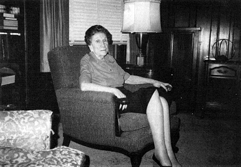
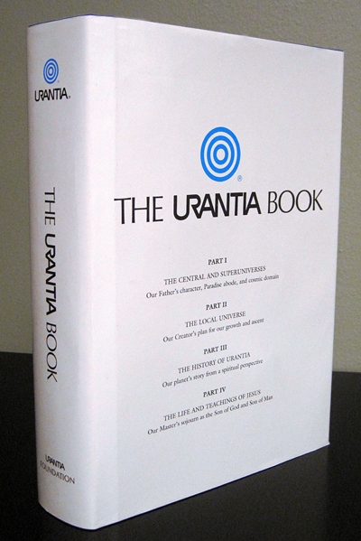
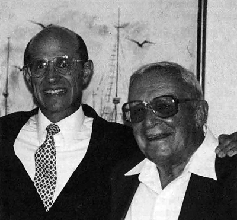
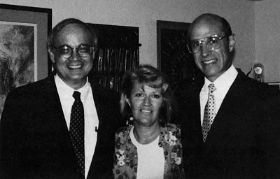
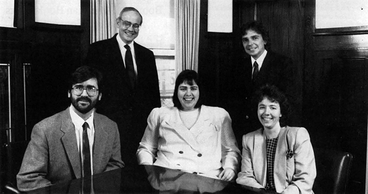
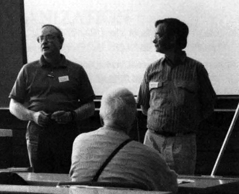
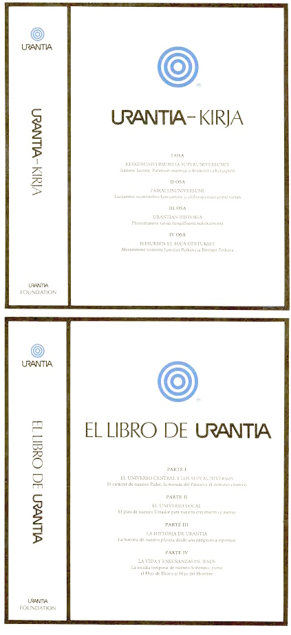

© 1991 Urantia Foundation

<figure class="table chapter-navigator">
  <table>
    <tbody>
      <tr>
        <td>
        </td>
        <td>
        <a href="/en/index/articles_uf_urantian#volume-10-issue-1-november-1991">
          Volume 10, Issue 1, November 1991 — Index
        </a>
        </td>
        <td>
        </td>
      </tr>
    </tbody>
  </table>
</figure>

## Welcome!

Refreshing winds of Change have been dramatically sweeping over the planet these past few years, and they have certainly not left URANTIA Foundation untouched. In this issue of URANTIAN News, we wish to report a number of activities which have served to position URANTIA Foundation solidly for the 1990s and into the century beyond. 

Some of the subjects we discuss in this mailing include Friends of URANTIA Foundation, URANTIA Brotherhood Association, a new Advisory Committee to the Trustees (“ACT”), progress on the Finnish and Spanish translations, an electronie version of _The URANTIA Book_, a note about the current Trustees and news about the appointment of a Trustee Emeritus, the reorganization of the Office, new staff, and office refurbishment. In addition, we report about copyright and trademark matters, including a massive infringement of the Foundation's registered marks and the copyright in _The URANTIA Book._ You will also find information about our current forty percent discount policy for the direct purchase of copies of _The URANTIA Book_ from URANTIA Foundation (and _Le Livre d'URANTIA_ from Foundation affiliate Amadon Corporation), as well as a preview of coming activities. These include fundraising, financing new translations, and other projects. In addition, we are enclosing an essay entitled _On Fanaticism, A Personal View_, which we think will be of interest to many of you.

Indeed, the winds of change have brought many new things, and, as a result, we believe you will find this issue of URANTIAN News all the more inviting and stimulating. So, Welcome! We hope you will enjoy hearing from us in this way.

## Friends of URANTIA Foundation

<figure id="Figure_1" class="image urantiapedia image-style-align-right">

<figcaption><em>A member of the “Forum” and _Chicago Group for the Study of The URANTIA Book_, Helen Carlson is also the first member of _Friends of URANTIA Foundation_.</em></figcaption>
</figure>

In August 1990, the Trustees announced the formation of Friends of URANTIA Foundation, an association of readers of _The URANTIA Book_ who wish to support the goals and purposes of URANTIA Foundation. Requests to join Friends have come from Argentina, Australia, Belgium, Bermuda, Brazil, Bulgaria, Canada, Chile, Columbia, the Congo, Cote d'Ivoire (Ivory Coast), Denmark, the Fiji Islands, Finland, France, Germany, Ghana, Guatemala, India, Japan, Mauritius, the Netherlands, New Zealand, Nigeria, Norway, Peru, the Philippines, Puerto Rico, Saudi Arabia, South Africa, Spain, Tanzania, the United Kingdom, Zaire, Zimbabwe, and all fifty of the United States. All in all, more than 1,100 households, from many parts of the world, have expressed support for URANTIA Foundation and its programs and policies.

Once URANTIA Brotherhood Association is fully operational, Friends of URANTIA Foundation may be discontinued. In the meantime, Friends will serve as an informal support group and as a forum for discussing the constitution and operation of URANTIA Brotherhood Association, as well as other programs of URANTIA Foundation.
 

Following is a sampling of the comments we have received from some of the participants in Friends of URANTIA Foundation.

> “We both feel that the one-to-one approach has always worked best when sharing our experience of reading _The URANTIA Book_ with our brothers and sisters. ”
> 
> “I feel strongly that the way to introduce _The URANTIA Book_ is by word of mouth in a grass-roots movement. The awareness of the book will grow slowly but inexorably. The concepts of Friends of URANTIA Foundation are compatible with mine. ”
> 
> “In short, I can say that the simple principles of minimal organization, proper procedures, and slow growth seem to be a good direction. ”
> 
> “Now that I have arrived at that place within myself where I can profess my belief in and commitment to the book, I feel the need to become more involved in the fellowship of readers. ”
> 
> “I can support the Foundation in whatever ways it needs. I trust the Foundation. 1 am very interested in continuing the study group here which we recently established. As of now we have only two people, but. ... ”

These are only a few of the expressions of support for, and an understanding of, Friends of URANTIA Foundation. But they are a fair cross-sampling. If you share these or similar feelings or beliefs, and you are not already a participant in Friends of URANTIA Foundation, we cordially invite you to become one. You may contact Damian Bondi at the Foundation office for an application.

## Tenth Printing Completed With Redesigned Hard Cover And Dust Jacket

<figure id="Figure_2" class="image urantiapedia image-style-align-right">

<figcaption><em>The Urantia Book - 1991 Edition</em></figcaption>
</figure>

The tenth printing of _The URANTIA Book,_ consisting of 25,000 copies, was completed in April 1990. This brings the total number of copies printed since 1955 to approximately 235,000.

A number of improvements have been made on the hard cover: the Concentric-Circles Symbol is now displayed in gold color on the front, and two of URANTIA Foundation's registered marks appear on the spine.

In addition, the Trustees approved a new dust jacket which now has a wider range of references to passages from _The URANTIA Book_ \—including a number that discuss spiritual growth and social change.

At the same time as the tenth printing of _The URANTlA Book,_ Foundation affiliate Amadon Corporation completed the fifth printing of _Le Livre d 'URANTIA,_ with 6,000 new copies. Its dust jacket follows the new English version, though the hard cover redesign was delayed until the next printing.

Overall, the Trustees believe that the physical appearance of _The URANTIA Book_ and _Le Livre d'URANTlA_ is better than ever, and we hope that you are pleased with these changes.
 

## Dr. James C. Mills joins URANTIA Foundation as Trustee Emeritus

<figure id="Figure_3" class="image urantiapedia image-style-align-right">

<figcaption><em>Richard Keeler + Jim Mills</em></figcaption>
</figure>

Trustee Richard Keeler (left) and Trustee Emeritus Jim Mills at a meeting of readers in Phoenix,Arizona.

Long-time student and teacher of _The URANTIA Book_ and friend of many of us, **Dr. James C. Mills** has accepted appointment as Trustee Emeritus of URANTIA Foundation. Dr. “Jim” Mills, a former Trustee, has a long and respected association with URANTIA Foundation and its affiliates and is a welcome addition to the Board of Trustees.

Jim was born in 1908 in Port Huron, Michigan. He received a Bachelor's degree from Albion College in 1931, a Master's degree from the University of West Florida in 1980, and a Ph.D. from Florida State University in 1985.

During his lifetime, he has worked as a chemistry instructor, sales engineer, and Associate Professor of Philosophy. Dr. Mills is currently engaged in writing a book on the Philosophy of Religion.

Dr. Mills was a member of the “Forum” from 1951 until 1955, when it became the First URANTIA Society of Chicago. He was also a member of the Executive Committee of the former URANTIA Brotherhood from 1955 to 1961 and the General Council from its inception until 1983. He was Chair of the Foreign Extension Committee and also served on the Education and Judicial Committees with **Dr. William S. Sadler**.

In 1958, Jim was elected Vice-President of the former Brotherhood and became President the following year after the death of **Warren Kulieke**. He also worked in the URANTIA Foundation offices during 1973 and 1974.

Jim is a member of the Florida and American Philosophical Associations as well as the American Academy of Religion, where he delivered several papers at both annual and regional meetings. In 1980, while attending Florida State University, Dr. Mills won the Southeastern Elder Scholar of the Year Award for students over 60.

Dr. Mills brings a good deal of ability and experience to the Board of Trustees, and we are all pleased that he has joined us. Welcome, Dr. Mills.
 

## Trustees Appoint Advisory Committee

The Trustees have been anticipating the moment when we could begin to confer with readers in a more definite way to plan for the future. That time has arrived and we have invited seven readers to become members of the Advisory Committee to the Trustees for Friends of URANTIA Foundation and URANTIA Brotherhood Association. We will call this group ACT and we are asking their, and others', help as we prepare to do just that, to act, but in a thoughtful, careful manner.

ACT will primarily serve as a sounding board and a resource for ideas on how to proceed in a practical way with the efforts of Friends of URANTIA Foundation and the implementation of URANTIA Brotherhood Association. ACT will function in an advisory capacity to the Trustees for the remainder of 1991 and all of 1992. We believe that the advisory committee should select its own operating methods, and we have asked that ACT begin its activities by formulating a general program and budget, subject to approval and funding by the Trustees.

Although we would like other readers of _The URANTIA Book_ to know that ACT exists, the advisory body is not meant to be a political body. To insulate them from political pressure, ACT members will preserve the confidentiality of their deliberations and communications with the Trustees, but they will develop and pass along to us any helpful ideas they may receive from others.

ACT's deliberations will be independent of ours, but we plan to meet with them from time to time to enhance the exchange of ideas. We know that the presentation of _The URANTIA Book_ is an evolutionary process and that human wisdom must evolve. The members of ACT bring a tested experience which we believe will further the social and fraternal aspects of our efforts to disseminate the teachings. We look forward to working with them in this challenging adventure of helping in practical and realistic ways to prepare for a new age on Urantia.

We have invited the following persons to serve on the advisory committee, and each has agreed to help:

- **Tonia Baney**
- **Seppo Kanerva**
- **Thomas C. Burns**
- **Herbert L. Klemme**
- **Catherine Jones**
- **James C. Mills**
- **Philip A. Rolnick**

Tonia will be Chairperson _Pro Tem_ until the committee has had an opportunity to select a permanent chairperson. We are looking forward to a very productive and satisfying experience working with this group. We appreciate their willingness to serve.

## Personal Contact

As previously reported to participants in Friends of URANTIA Foundation, over the last two years the Trustees have initiated a number of personal meetings and contacts with readers, at home and abroad, through travel, telephone calls, and letters. This has proved rewarding in a number of ways and we will be continuing this important aspect of communication with our supporters. These contacts have led to a number of important developments which the Trustees will be reporting on in future communications to participants in Friends of URANTIA Foundation and to other interested readers.

<figure id="Figure_4" class="image urantiapedia">

<figcaption><em>Martin Myers, Trustee (left), Tonia Baney, Chairperson _Pro Tern_ of the Advisory Committee to the Trustees (center), and Richard Keeler, Trustee (right) at a meeting with readers in Phoenix, Arizona.</em></figcaption>
</figure>

## Electronic Version of The URANTIA Book Nears Completion

The authorized electronic version of The URANTIA Book for I.B.M, compatible computers is in the final stages of production. This version not only has the full text, but also aids in finding words and quickly and easily for enhanced study. It is currently scheduled to be released in the second quarter of 1992. The price has yet to be established. Further details will be announced when available.

## Fund Raising

As a non-profit organization, fund raising is vital to our future. URANTIA Foundation has not broadly sought financial support for two years, and the time has come for us once again to ask for the help of our contributors. In the near future, we will be sending our annual solicitation letter. Many readers have often asked the question, “What can I do to help?” Financial support is one important way to do so.

There are numerous projects that require dependable long term financing to ensure that they are completed. We have listed just a few of the projects that we hope to complete or begin in the near future.

PROJECTS

- Completion of the Finnish and Spanish translations.
- Publication of _The URANTIA Book_ in electronic (computerized) format.
- Future translations.
- Publication of a printed index to _The URANTIA Book_ and additional study aids.

ONGOING ACTIVITIES

- The Library Placement Program, whereby libraries willing to put _The URANTIA Book_ in therr collections are given one or more free copies.
- The Book Consignment Program, a method for placing _The URANTIA Book_ in a bookstore. This increases the number of books available in retail outlets.
- Administrative expenses associated with the distribution of _The URANTIA Book_ and the Reader Services Program.
- Expenses associated with the printing of _The URANTIA Book_ (and _Le Livre d'Urantia_ by Foundation affiliate Amadon Corporation).

We hope that our readers will be able financially to support these and other programs. Clearly, the more support we have, the more we will accomplish.

## Book Sales Discount Policy

As many of you are aware, the Trustees have adopted an advantageous special discretionary book sales discount policy. This allows the direct purchase of up to five of _The URANTIA Book_ from URANTIA Foundation, or _Le Livre d'URANTIA_ from Amadon Corporation, at a discount of forty percent off the suggested retail price. A brochure describing the full policy terms is enclosed. Those who have not already done so for 1991 may take advantage of this program through the end of the year. We suggest that those of you wishing delivery for the holidays order your copies as early as possible.

The Trustees have been monitoring this program, and we are considering for 1992 which will be announced when finalized.

> THE URANTIA BOOK Is AVAILABLE THROUGH YOUR BOOKSTORE
> 
> If someone tells you that _The URANTIA Book_ is not available through your local bookstore, don't you believe it! Indeed, you can prove it to yourself by going to your bookstore and ordering a copy. Use the enclosed card showing our name, address, and telephone number, if the bookstore needs that information.

## URANTIA Brotherhood Association

As we have previously reported, the Trustees have approved a detailed concept paper and are in the process of drafting the organizational documents for URANTIA Brotherhood Association. Once completed, the Trustees anticipate that the proposed documents will be widely reviewed and discussed, making use of the help and insights of participants in Friends of URANTIA Foundation. We appreciate the expressions of interest and support we have received so far, and we will keep you informed of further developments.

Three URANTIA Societies have declared their intention to affiliate with URANTIA Brotherhood Association:

- Finnish URANTIA Society,
- First URANTIA Society of Western Springs,
- URANTIA Society of San Fernando Valley.

The eighteen remaining former URANTIA Societies have decided not to maintain their affiliation with URANTIA Foundation or URANTIA Brotherhood Association, and the license agreements permitting them to use the Foundation's registered marks have been terminated.

## Current Office Organization

<figure id="Figure_1" class="image urantiapedia">

<figcaption><em>The Staff of URANTIA Foundation, from left to right: **Front row:** Damian Bondi, Sheila Schneider, Joan Kang **Back row:** Martin W. Myers and Robert Solone.</em></figcaption>
</figure>

Over the last two years, the Trustees have reorganized the Foundation office, hiring new staff, but reducing the total number working at 533 Diversey. The result has been an easier, more businesslike administration of Foundation affairs. Efficiency has been boosted by office automation centered on a computer network that allows each member of the staff direct access to the central database. In addition to office automation, the offices have been refurbished, and we are better able to receive guests and to accomplish our various tasks.

Two of our busiest departments are the _Reader Services Department_ and the _Book Department._ The _Reader Services Department_ answers mail and telephone inquiries, and enables readers to find one another and to locate study groups in their areas. The _Book Department_ handles all aspects of printing and distributing _The URANTIA Book,_ its translations and associated study aids. This includes taking orders, delivering materials to the post office, attending trade shows, and working closely with our printers.

The office staff consists of four employees and the Executive Director. A Technical Editor will soon be joining our staff to help with translation matters. Also, volunteers give their time and services.

The Trustees are delighted to have the following staff to assist with the work of the Foundation.

- **Martin W. Myers:** Executive Director
- **Joan E. Kang:** Office Manager/Certified Public Accountant
- **Sheila Schneider:** Administrative Assistant
- **Robert Solone:** Publications Review/ Reader Services
- **Damian Bondi:** Reader Services/ Book Department
- **Helen Carlson:** Friend and Counselor

We hope that the following biographies will help you get to know our staff a little better.

**MARTIN W. MYERS**

Martin is currently Executive Director and President of URANTIA Foundation which he has served in various capacities since 1971. Martin was also a General Councilor of the former URANTIA Brotherhood for fifteen years, Chairman of the International Fellowship Committee and member of the Executive Committee for six years, and a member of the Judicial Committee for ten years.

Since October 1989, Martin has worked full time at the Foundation's offices. As Executive Director, Martin's experience in URANTIA affairs is a significant asset in implementing and coordinating Foundation operations.

Martin is married to **Diane Elder**, and they have a one and one-half year old son, Robert James.

**JOAN KANG**

In January 1991, Joan became the office manager at the Foundation's headquarters. Joan had been serving URANTIA Foundation and its affilliates as an independent Certified Public Accountant since October 1989. Previously, she had worked as a staff accountant for an accounting firm which provided services for URANTIA Foundation, the former URANTIA Brotherhood, and Foundation affiliates Andite Corporation, and Amadon Corporation.

In her calm, practical manner she encourages an atmosphere that emphasizes team work, cooperation, and efficiency.

Joan was graduated from the University of Illinois at Chicago with a degree in Business Administration. She is originally from a small town in Wisconsin and currently lives in a suburb of Chicago with her two children.

**SHEILA SCHNEIDER**

Sheila moved to Chicago in 1981 from her hometown, Champaign, Illinois. She has worked for the State of lllinois, an insurance company, and a tax firm. She joined the staff of the Foundation in August 1988.

She is the Administrative Assistant for the Foundation and our computer and word-processing expert. She also works with the Foundation's attorneys on trademark matters and is the editor of this newsletter.

Sheila's responsibilities are numerous and varied. Her multi-faceted abilities have been a great help to the Trustees.

Most of Sheila's family live in Illinois. She is an old movie buff, a computer devotee, and a fine arts enthusiast.

**ROBERT SOLONE**

Robert has been a reader and serious student of _The URANTIA Book_ since 1984 and has been attending the study group at 533 Diversey since 1985. In February 1990, after some volunteer work, Robert joined the staff of URANTIA Foundation on a part-time basis.

He is a person with an eye for detail, a trait which aids him in proof reading and reviewing publications that make use of material from _The URANTIA Book._ He also assists in answering letters and telephone calls.

Robert is a professional pianist and composer who has performed his own music with an orchestra at Carnegie Recital Hall. He has also performed at URANTIA conferences in the midwest and in Maine.

Robert lives on the north side of Chicago and has a 10 year old daughter.

**DAMIAN BONDI**

The newest member of our staff, Damian joined us in November 1990. He has been a student of _The URANTIA Book_ since 1975. In that same year he began attending the study group at 533 Diversey.

In late 1989, Damian began volunteering his services at 533 and now works full time in the Reader Services Department and the Book Department. He has communicated with numerous readers from across the country and from other countries.

Damian lives in Whiting, Indiana and has been employed for over eighteen years, at a local steel mill. He continues his participation in Chicago Group for the Study of _The URANTIA Book,_ the study group which meets at 533 Diversey Parkway.

**HELEN CARLSON**

As a friend of the Foundation, Helen Carlson has been of great service and support. Though not officially a staff member, Helen's presence at 533 Diversey is a continuing comfort and inspiration to the rest of the staff.

Helen began her study and association with the URANTIA Papers in 1935. She was a member of the Forum, the group that studied the URANTIA Papers before they were published.

For many years Helen served on the Education Committee. She also served as Registrar and Secretary of the URANTIA Brotherhood School. Until January 1990, Helen was treasurer of the former First URANTIA Society.

Helen's experience has made her a valuable source of insight and advice. Her enthusiasm and good humor inspire everyone at headquarters.

We are proud of our staff and, because of them, we are all the more confident of the future.

## Mr. Seppo Kanerva Joins The Foundation Staff

<figure id="Figure_1" class="image urantiapedia image-style-align-right">

<figcaption><em>Seppo Kanerva (on right) the new Technical Editor for the Finnish and Spanish translations, translating at the Summer Days Conference held in June 1991 at Hartola, Finland.</em></figcaption>
</figure>

The Trustees are proud to announce that **Mr. Seppo Kanerva** of Helsinki, Finland, will be joining the Foundation staff later this year. Mr. Kanerva, the translator of _The URANTIA Book_ into Finnish, will help to complete the Finnish translation and will format it and the Spanish translation for direct input to the printing presses. Because of his notable language skills (Finnish, English, Swedish, French, Spanish, German, and Russian) and other abilities, he also will help with certain other translation and publication duties.

Mr. Kanerva has worked as a freelance translator for many years, and is an Official Translator of English to Finnish. He has performed business translations and has also worked as a Simultaneous Interpreter (English-Finnish) at press conferences, international congresses, and meetings for such organizations as the Finnish United Nations Association and the Ministry for Foreign Affairs.

From 1974 to 1980, Mr. Kanerva served as a member of the Foreign Ministry's Advisory Committee on Finnish UN Policies. He attended the first UN General Assembly Special Session on Disarmament in 1978, as well as the General Assemblies of 1978 and 1979. He has also studied law and related subjects.

We are all very pleased that Mr. Kanerva will be joining us.
 

## Maintaining The Retail Price of URANTIA Book

More than a decade ago, in 1979, the suggested retail price of _The URANTIA Book_ was raised to $34.00. Today, it remains $34.00. This has been possible because URANTIA Foundation has been able to subsidize the costs associated with eaeh copy of _The URANTIA Book_ that is distributed. However, inflation and other factors have caused us to commence a review of the book's price, and it seems to be more a question of how much the increase must be, rather than whether an increase will occur. Future price increases appear to be inevitable.

The Trustees have previously provided the readership with a report on production and distribution costs, including an explanation of the Foundation's administration of the Perpetual Printing Fund. Reprints of this report are available upon request.

## URANTIA Foundation Hosts Booth At American Booksellers Association Conventions

Representatives of URANTIA Foundation attended the convention of the American Booksellers Association for the last two years, once in Las Vegas, Nevada during June 1990, and again in New York City during May 1991. The conventions featured over 1,400 exhibits and attracted nearly 25,000 people in 1990 and 31,000 in 1991. The Foundation exhibited _The URANTIA Book_ and _Le Livre d'URANTIA._

By participating in such conventions, URANTIA Foundation seeks to foster the slow but steady growth of trade awareness of _The URANTIA Book._ Furthermore; contacts with bookstore buyers and publishers will assist the Trustees in promoting appropriate worldwide distribution of _The URANTIA Book, Le Livre d'URANTIA,_ as well as its other translations.

The booth attracted numerous visitors, attesting to the fact that _The URANTIA Book_ is becoming well known among professionals in the book trade.

## Library Placement Program Showing Positive results

In addition to placing copies of _The URANTIA Book_ in publicly-accessible libraries throughout the world, our program includes placing copies of the book in the libraries of correctional facilities within the United States. We receive many inquiries and requests from inmates and from prison librarians. Letters from those in difficult situations describe how the teachings of _The URANTIA Book_ have enhanced their lives. Here are some excerpts:

> “ ... the library has received the copy, however there is a waiting list already ... .! am struggling for the truth and our purpose. ”
> 
> “ ... this wonderful book; it answers many of the questions I've longed to know. ”
> 
> “ ... prison is filled with negative influences .... Jesus was speaking of knowledge, wisdom and that food for the spirit, which is why I requested your Urantia Book. I have that thirst for wisdom and truth.”
> 
> “The popularity of the book is astounding. We are just unable to accommodate everyone with enough time to read this interesting book.” (A Librarian)

We welcome the support of all who wish to see the Library Placement program continued or enhanced.

## Study Group Continues At 553 Diversey Parkway

As many are aware, one of the primary duties of the Trustees of URANTIA Foundation is to disseminate the teachings of _The URANTIA Book_ and to devise, to develop, and to effectuate means and methods for accomplishing this. The Trustees thus continue to encourage the formation of study groups both at home and abroad. Close to home, in fact at our headquarters, 533 Diversey Parkway, we provide space to the independent _Chicago Group for the Study of The URANTIA Book_. This group, with some exceptions, meets every Sunday at 2:00 p.m. All are welcome, and the group has hosted visitors, not only from around the Chicago area, but also from other states and countries. Readers have a cordial invitation to join the group for what is usually lively, and always enjoyable, study of _The URANTIA Book_. For further information, please call (312) 935-8210.

## End of The World?

URANTIA Foundation has received telephone calls and letters from concerned readers who have heard predictions from self-proclaimed prophets that the destruction of our world is imminent. The Foundation has no connection with anyone making these statements. Many individuals will use _The URANTIA Book_ and its teachings to justify, explain, or to expand upon their own personal beliefs and experiences, and each of us will have to make our own appraisals insofar as the teachings of _The URANTIA Book_ are concerned. The Trustees prefer not to become involved in making official judgments about individuals' interpretations of The _URANTIA Book,_ though we believe the teachings themselves can be quite valuable in helping individuals sort out their experiences and beliefs. We are thus quite optimistic about the future of our planet.

## Copyright Litigation

For those of you not familiar with the litigation involving Kristen Maaherra (originally of Tucson, Arizona, but now of Boulder, Colorado) for copyright infringement, or who would like to review your understanding of the matter, we are enclosing a copy of our letter dated April 2, 1991. While this was initially sent to individuals reported to have had contact with the infringement, we are providing it here for your information. We have not enclosed a copy of the court order mentioned in the letter, but copies are available upon request.

> “Society is the offspring of age upon age of trial and error; it is what survived the selective adjustments and readjustments in the successive stages of mankind’s agelong rise from animal to human levels of planetary status. The great danger to any civilization—at any one moment—is the threat of breakdown during the time of transition from the established methods of the past to those new and better, but untried, procedures of the future.” [UB 81:6.41](/en/The_Urantia_Book/81#p6_41)

## Finnish and Spanish Translations of Urantia Book

Substantial progress has been made toward the completion of the Finnish and Spanish Translations of _The URANTIA Book_, and the Foundation's resources are increasingly focused on the completion of these important projects. But a good deal of work remains to be done. Although the initial renderings of the Finnish and Spanish translatiorvs have been completed — no small accomplishment in itself, concentrated checking and polishing work must be performed. That is now in process, and once it is accomplished, formatting, electronic typesetting, and other work associated with printing will follow. In fact, it is already underway to a limited extent. In order to expedite this entire process, the Trustees are providing specialized staff training and are hiring a Technical Editor. Even with this additional support, however, the remaining work presents a formidable task. It is, therefore, difficult to predict when the final texts will be available to the public. Nevertheless, we believe the translations will be ready for distribution in 1993 or 1994. This is only an estimate, however, and we shall provide more accurate information as we have it.

While we have received significant contributions of both time and money for the completion of these projects, it has become clear that additional funds will be necessary to bring these translations to a satisfactory conclusion. We are going to provide further details about this in the future.

<figure id="Figure_2" class="image urantiapedia">

</figure>

The recently completed dust jackets for the Finnish Translation (above right) and the Spanish Translation (right). Illustrated are the front and spine of each.

## Some questions and answers

**Question:** I understand that the Foundation has stopped selling books through distributors. Is it true that copies of _The URANTlA Book_ are no longer available in bookstores?

**Answer:** Copies are not only available in and from bookstores, but the Trustees are also succeeding in reversing the 1980s trend of fewer bookstores carrying _The URANTIA Book._ The direction now is clearly toward increasing availability through bookstores.

In late 1990, when the Trustees completed our review of the Foundation's distribution policy, we concluded that the high volume of sales to commercial distributors was cutting us off from the desired level of direct contact with readers. The Trustees were also aware that other organizations buying through distributors were disseminating their own literature along with _The URANTIA Book._

From 1974 to 1979, at a time when URANTIA Foundation sold 10,000 copies of _The URANTIA Book_ per year, no copies were sold to commercial distributors. Instead, all sales were made directly to bookstores and individuals. In 1974, 1,500 copies were sold to individuals and 8,500 to bookstores; in 1979, 2,500 copies were sold to individuals, and 7,500 to bookstores. However, commencing with the use of distributors in the early 1980s there was a decline in sales of books to individuals and bookstores and this became notable by the end of the decade. Thus, from 1987 to 1990, only 13 percent of the copies sold went directly to individuals, and only 12 percent went directly to bookstores. The remaining 75 percent were sold to commercial distributors, and of that, only a small fraction ended up on bookstore shelves. But the truly significant statistic is that annual sales of _The URANTlA Book_ continued to average 10,000 copies per year. In other words, though not a priority, overall sales of _The URANTIA Book_ did not increase by means of commercial distributors.

Our consideration of these facts made it clear that a new approach was necessary, and we are pleased that it is resulting in an increased availability of the book in bookstores.

**Question:** I have heard that the Trustees have made changes to the text of _The URANTIA Book._ Why have the Trustees done this when you are supposed to keep the text inviolate? Aren't you in default of your trust?

**Answer:** From time to time the Trustees have authorized changes which corrected spelling, grammatical, or printing errors. The current Trustees are also aware of a few changes to the text undertaken in the second printing.

These were corrections made necessary because of incomplete proofmg of the first printing.

**Question:** Why should I contribute to URANTIA Foundation? Aren't your legal and accounting costs excessive?

**Answer:** Questions along these lines are often a result of the criticisms of avowed opponents of the URANTIA Foundation and its policies, which obscure the true scope and emphasis of URANTIA Foundation's activities. The ultimate goal of URANTIA Foundation is the dissemination of the teachings of _The URANTlA Book._ In addition to the printing and distribution of _The URANTlA Book,_ these efforts include Foundation programs such as translations and converting the book's text to appropriate electronic and audio forms. These alone are demanding tasks. In addition, within the last few years, a number of individuals and groups have mounted major efforts which have challenged URANTIA Foundation in fundamental ways, and URANTIA Foundation has been compelled to meet these challenges directly and resolutely -and at no small expense. We certainly would like to reduce these expenses, because that would mean that interference with our carrying out our duties and responsibilities would have ceased or abated. Further, it would mean that we would have more time, energy, and resources to move ahead with other projects we have in mind.

If we could accomplish our goals without spending money on legal and accounting fees, we would certainly do so.

But there is a thicket of rules and regulations we must deal with in pursuing the worldwide goals of URANTIA Foundation, and the constant danger of legal action involving individuals and organizations forces us to seek the advice of legal and financial advisors. The only real issue is what kind of advice we need in any specific instance and how much that will cost.

The Trustees have, where possible, worked directly with those individuals who are willing to provide financial support for this important part of our responsibilities. This reduces, but does not eliminate, the need to draw upon general revenues for these crucial tasks. The Trustees have established perpetual printing, translation, library place ment, and general operation funds for those interested in supporting these specific activities, and donors have the option of specifying that their contributions should be applied to one or more of them.

Donations are essential to our continued operation. Without them, it will be difficult for URANTIA Foundation to disseminate the teachings of _The URANTlA Book._

**Question:** The Trustees are slow and unresponsive. We want to see some action!

**Answer:** The Trustees have for some time been aware of the need to upgrade our office operations. Commencing two years ago, the Trustees undertook a program to attract better staff, to upgrade the office surroundings, and to provide up-to-date equipment. It is a top priority to communicate with our readers in a more timely fashion. We have made considerable progress towards these ends, and we have done so at a reasonable cost and with the generous help of a number of interested donors. We anticipate continued improvement in all areas of our operation.

## A word about the Foundations's Mailing List

<figure id="Figure_3" class="image urantiapedia">

</figure>

We add names to our general mailing list only at your request, and we do not share our list with other organizatiorus, groups, or individuals. Further, we respect the desires of readers who wish to keep their names confidential. Thus, when responding to requests for referrals of readers, our staff only provides the names of readers who have given us permission to do so. 

Those wishing to be added to be or deleted from, our mailing list, or who wish to change their status as a referral, should put their request in writing, in a letter or on a postcard, or complete the form below. 

Please take a moment and answer the quesions on the form below and retum it to URANTIA Foundation. Thank you.

Do you wish to remain on our mailing list? Yes No

Do you wish to have your name listed as a referral in your area? Yes No

Inform us below of a Change of address:

If you would like further information about referrals, _The URANTIA Book_, study groups, or other publications, please contact us at:

533 Diversey Parkway
Chicago, Illinois 60614 U.S.A.
Office: (312) 525-3319
Telecopier: (312) 525-7739

## Reader Comments About The Urantia Book

> “I have recently found _The URANTIA Book_ and my heart is overwhelmed with joy. It is like I have found what I've been looking for all of my life. ” ~ Spokane, Washington

> “I cannot find words that would seem adequate to describe how I feel about its _(The URANTIA Book's)_ content. For me it is compelling reading. I will feel very reluctant to hand back my friend's copy.” ~ Lancashire, England

> “_The URANTIA Book_ has been the most amazing discovery for me. In fact, it's probably the most important book that I own (outside of my Grandmother's Bible).” ~ Madison, Wisconsin

> “I have derived such personal growth in my study of the URANTIA teachings and thank our Divine Eternal Father everyday that I was drawn to the work.” ~ Wynberg, South Africa

> “I have been studying _The URANTIA Book_ and have found it the most conclusive and inspiring book on our existence. ” ~ Lake Geneva, Illinois

> "After 24 years of having _The URANTIA Book,_ I have al ways had guarded reluctance in giving this book to friends. I am of the opinion that gifts are rarely appreciated by people. I have also had the belief that if a per son was interested enough in _The URANTIA Book_ after borrowing it from me, that they would surely want to pur chase it for themselves ....In my opinion, this book is priceless to those willing to read and accept these teachings that inspire profound wisdom and knowledge! ~ Quebec, Canada

> "I look at today as one of the great days of any life. Really it is when I came across one ‘Mighty and Heaven revealing book,’ entitled _The URANTIA Book ..._I was almost crying when I left that book with the owner....It will be the happiest day of my life, the day I will hold a copy of this, your book, in my hands and kiss it with love, and admiration. ~ Imo State, Nigeria

## References

- Urantia Foundation's Urantian News: https://www.urantia.org/news/1991-11

<figure class="table chapter-navigator">
  <table>
    <tbody>
      <tr>
        <td>
        </td>
        <td>
        <a href="/en/index/articles_uf_urantian#volume-10-issue-1-november-1991">
          Volume 10, Issue 1, November 1991 — Index
        </a>
        </td>
        <td>
        </td>
      </tr>
    </tbody>
  </table>
</figure>
