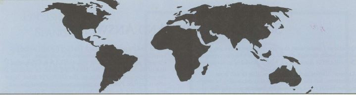

© 1994 Urantia Foundation

<figure class="table chapter-navigator">
  <table>
    <tbody>
      <tr>
        <td>
        </td>
        <td>
        <a href="/en/index/articles_uf_urantian#volume-13-issue-2-november-1994">
          Volume 13, Issue 2, November 1994 — Index
        </a>
        </td>
        <td>
        </td>
      </tr>
    </tbody>
  </table>
</figure>

## Audio Version of The URANTIA Book Scheduled for Release in December

Fall 1994

The Urantia Foundation, in association with Brilliance Corporation, an industry leader in spoken-word, audio recordings, has produced a full-length, audio version of the English edition of _The Urantia Book_. Brilliance Corporation has recorded over 200 books on tape, and its president and founder, Michael Snodgrass, has been a reader of _The Urantia Book_ for over 25 years.

The audio version of _The Urantia Book_ will not only be an excellent study-aid for visually impaired and more auditorily-minded readers, but it will also enable the study of the book by listening at times, and during activities, when reading the book would be impossible. Those who have heard the recorded papers have been impressed with the technical quality and moved by the auditory experience of _The Urantia Book_. Hearing _The Urantia Book_ provides a different access to, and a unique experience of, the fifth epochal revelation. Long-time readers will have a fresh approach, and non-English speakers will have a powerful English language aid.

Production Expertise. Producing a high-quality, audio version of _The Urantia Book_ was no small task. The Foreword and 196 Papers comprise 1,126,913 words, 2,097 pages, many names, places, and terms which are hard to pronounce, and many concepts difficult to comprehend. Before beginning recording, Brilliance Corporation's staff, working closely with The Urantia Foundation staff, did exhaustive research on the pronunciation of all the words unique to _The Urantia Book_, as well as the many references to scientific terms, historic names, and geographic places.

The recordings, which took over a year to produce, were made in state-of-the-art recording studios which were specifically designed for volume production of voice recordings. Each recording session employed the services of a producer-director, a sound engineer, and a Foundation approved professional male or female voice talent, all meticulously following the text. This three-person team helped to assure that both the technical recording and the reading performance were of the highest quality.

Special Quality Control Measures. To help the professional readers communicate the complexities of _The Urantia Book_, the Foundation asked Stephen Zendt, a long-time reader of _The Urantia Book_ with first-hand experience in professional voice recordings, to be our on-site representative and to oversee the recording sessions. In addition, Stephen personally recorded some of the book's Papers.

148 hours of _The Urantia Book_ on 96 cassettes is almost fifteen times the length of the average recorded book. At the outset of the project, we had hoped to make _The Urantia Book_ available on 48 cassettes by using a special compression-multitrack recording technique developed by Brilliance Corporation. But we decide not to use this technique because the quality of voice reproduction was not as good. The version we chose to produce will be of the highest quality and will consist of ninety-six tapes packaged in a heavy duty, vinyl carrying case.

Ordering. You may order the audio version of _The Urantia Book_ by calling the Foundation at (312) 525-3319 or by sending a check or money order to The Urantia Foundation, 533 Diversey Parkway, Chicago, Illinois 60614. The price is US $285.00 plus shipping and handling.

We are pleased to announce _The Urantia Book_ on audio tape, and as funding allows, we intend to produce audio versions of other languages.

## Authorized Computer Version in Production

Urantia Foundation is pleased to announce that the computer version of _The Urantia Book_ is now in the final stages of production and will be available by Christmas. The text has been mated to the latest version of the Folio View search program.

Publication of the computer version was stalled for some time as a result of legal considerations related to litigation. But the difficulty has finally been resolved by mastering and duplicating in France.

Although the delay has been unfortunate, it has resulted in a new generation of more powerful and user-friendly software, which was not available even a year ago. The version, which the Foundation will be making available, runs in the Windows® environment on IBM-compatible computers. The five disk set is packaged in a storage folder which resembles the book. The program provides state-of-the-art search capabilities, allowing for single word searches, searches for phrases, limited searches (scope control), and a search history which allows retracing the search path.

Although the software does not allow changes to be made to the text “infobase,” it does make possible many useful editing features. The electronic equivalent of “sticky notes” can be stuck to chosen paragraphs. These notes can contain any information the user wants to enter. A visual indicator shows that a note has been attached to a certain paragraph, and by a click of the mouse, the note can be brought up on the screen. To those accustomed to writing comments in the margins of the book, this notation capability will be a valuable enhancement.

For those who use highlighters, this program allows the use of many different colors. For example, if one wants to highlight passages about “love,” one can do so by using a color specific to “love” and can even name the color “love.” Many colors are available and can be used for tracking many different subjects.

The program has many features, too numerous to mention here, but to name a few, it has pop-up links, multiple bookmarks, and linked table of contents. In addition, since it runs under Windows®, it has split screen, multiple windowing, and the convenience of mouse access.

If you want to order the computer version of _The Urantia Book_  
Price: US $150, call The Urantia Foundation at (312) 525-3319 or send a check or money order to:

Urantia Foundation  
533 Diversey Parkway  
Chicago, Illinois 60614.

## Defending the Copyright and Trademarks

In 1993, Thomas A. Kendall, a former Trustee of Urantia Foundation, who served on the Board for almost 21 years, delivered a talk on the copyright and trademarks. He has given us permission to print the following excerpt.

> “...It is also apparent that the name was to be owned and managed by a legal entity—URANTIA Foundation. ‘URANTIA’ was not to be ‘pre-empted’ by individuals for personal or commercial purposes, nor by groups not related to _The Urantia Book._ ‘URANTIA’ is a material symbol; not a spiritual symbol. While ‘Urantia’ is the name of our planet, it is also used in the title of a book and in the name of organizations-all material designations, hence, legally protectable. The concentric circles symbol is also owned by Urantia Foundation. The Trustees decided to register and protect it along with the name URANTIA.
> 
> “... The Foundation was established in 1950 under a Declaration of Trust The concordant object in the trust documentis to maintain the text of _The Urantia Book_ inviolate. A copyright is the means to accomplish this task.
> 
> “In 1980, the Federal District Court in Michigan ruled that the Foundation's claim to copyright of _The Urantia Book_ was valid. The declared intent of the infringer in filing suit was to get the copyright annulled to the end that NO ONE would own the rights to the book.
> 
> “Throughout the 20 years I served on the Board of Trustees of Urantia Foundation, every lawyer we consulted was a specialist in the field of copyright or mark law, and none ever raised a question about the copyrightability of _The Urantia Book_. We were completely forthcoming and shared everything we knew about the origin of the book. The Trustees did not conspire to hoodwink the copyright office in the renewal of the copyright in 1983. No reputable attorney colluded with the Foundation to perpetrate a fraud....
> 
> “Do not lightly dismiss the importance of copyright. The Contact Commissioners were warned that the greatest danger to the revelation would be in the first 50 to 100 years. If the copyright were lost and the book fell into the public domain, the book could be dismembered. It could be chopped up into 197 pamphlets; ‘embarrassing’ portions excised; ‘difficult stuff’ omitted; outdated scientific material updated with new theories; artwork, charts and footnotes inserted; an introduction and commentary included in the text. Simplified versions would proliferate. None of these was the intent of the revelators, and in fart, some were specifically proscribed. The book was intended to be an integrated whole, published without distracting contrivances.
> 
> “The only way a challenge to the integrity of the text can be met is through aggressive action by the owner of the copyright. An ‘interested party’ cannot launch a suit to defend a book that has no copyright.
> 
> “We live short lives, literally small time segments. The Urantia Book's teachings are meant for many decades, even a thousand years; who can say precisely? The book's mission transcends individual lives, world trends and events. These teachings need an environment of stability, not constant battles for control or influence.
> 
> “Many people in the readership believe that the pending suit will invalidate the copyright. I suppose that anytime you face a judge or jury your rights are in jeopardy. However, I believe that the revelators must have had solid reasons for the creation of a Foundation which would maintain the text inviolate. I hope the judge will rule in favor of the copyright.”

The current Trustees continue the commitment of their predecessors in defending the copyright and trademarks as part of their trust to protect inviolate the text of _The Urantia Book_.

## Korean Translation

French, Spanish, Finnish, Dutch, Russian, and now Korean _The Urantia Book_ has been translated and will be translated into many different languages.

The chief translator of the Korean translation has been a reader since 1976 and has read the book about ten times. He was born and raised in Korea but has lived in the United States since 1972. He is a professor of economics and publishes a professional journal dealing with international trade. He is married and has three sons. His wife, who is also Korean, and his oldest son are both readers.

In the opinion of the chief translator, a Korean translation will greatly facilitate the translation of _The Urantia Book_ into Japanese, a project which we look forward to beginning.

## Revised and Corrected Version of Le Livre d'Urantia

The Urantia Foundation is pleased to announce the opening of a Foundation office in Paris, France. The work of the office will be carried out by a volunteer staff of French readers, managed by Georges and Marlène Michelson-Dupont. The address of the office is:

> Urantia Foundation  
> 8, Passage de la Bonne Graine  
> 75011 Paris, FRANCE  
> Tel.: (33)1.48.06.60.11  
> Fax: (33)1.48.06.59.09

The opening of an office in France promises many benefits for the dissemination of _Le Livre d'Urantia_ and its teachings. First, French readers can more easily find other readers or study groups in their area. Second, The Urantia Foundation can respond more easily and quickly, in French, to inquiries from French-speaking readers. Third, because the new version was printed in France, bookstores are able to sell the book at a less expensive price. And fourth, because the book is now listed in the computer databases of the French bookstores, and because the books are shipped within France, the time between ordering and receiving the book has been cut from several weeks to several days.

We salute those French readers, whose desire to work interdependently with the Foundation, has brought about enhanced possibilities for the orderly dissemination of _Le Livre d'Urantia_. We also want to express our gratitude to the French readers who volunteered their efforts for more than ten years, making more than 40,000 revisions and corrections to _Le Livre d'Urantia_, and who generously paid for much of the cost of printing the revised and corrected translation. They have also made a commitment to pay for much of the cost of printing the Dutch translation. We can all be challenged to new levels of service by the example of these anonymous readers.

<figure id="Figure_1" class="image urantiapedia">

</figure>

## Reader Comments about The Urantia Book

> “It is such a comforting book, as well as being enlightening, intelligent, beautiful, truthful, motivating, unique and marvelous. It's a breath of fresh air to me, and I simply love it and its messages. My copy has been made a part of my daily study.” ~ Ithaca, New York, U.S.A.

> “Brasil is becoming a center and a good harbour for all sorts of evolutionary families... And those families will be better inspired, oriented and anchored, if they get in touch with such papers \[_The Urantia Book_\].” ~ Sao Paulo, BRASIL

> “I find it fascinating and enlightening. The simplicity and beauty of the message makes current day religions look like dinosaurs. As I say I continue to read the book for insight and solace.” ~ Surrey, British Columbia, CANADA

> “For so long, I have sought answers to my questions concerning God, Jesus, life, love, spiritual ways, etc. but to no satisfaction of me (the inner man). Now I have in my possession forever, everlasting truth and wisdom. No longer do I need to look to man for wisdom, instead now we URANTIA Readers can look with the aid of the revelations to God, and the Spirit of Truth, for deeper insight and understanding.” ~ Transvaal, SOUTH AFRICA

> “... I am studying the book. It requires perusal and it must be clear for the reader from the very beginning that 'thinking men and women want religion redefined, and this demand will compel religion to re-evaluate itself.” ~ Riga, LATVIA

> “I am in the process of reading _The Urantia Book_ and have found it very helpful in my spiritual unfoldment.” ~ Colorado Springs, Colorado, U.S.A.

## References

- Urantia Foundation's Urantian News: https://www.urantia.org/news/1994-11

<figure class="table chapter-navigator">
  <table>
    <tbody>
      <tr>
        <td>
        </td>
        <td>
        <a href="/en/index/articles_uf_urantian#volume-13-issue-2-november-1994">
          Volume 13, Issue 2, November 1994 — Index
        </a>
        </td>
        <td>
        </td>
      </tr>
    </tbody>
  </table>
</figure>
