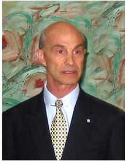
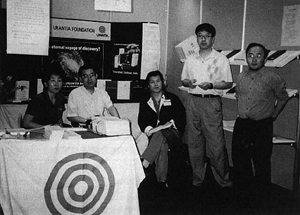
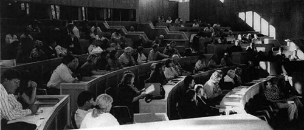
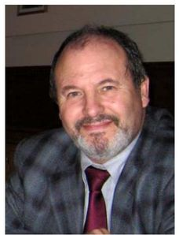
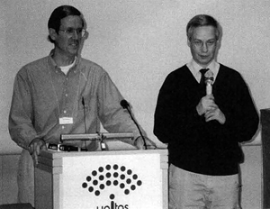

© 1998 Georges Michelson-Dupont, Gard Jameson © 1998 Urantia Foundation

<figure class="table chapter-navigator">
  <table>
    <tbody>
      <tr>
        <td>
        </td>
        <td>
        <a href="/en/index/articles_uf_urantian#volume-17-issue-2-september-1998">
          Volume 17, Issue 2, September 1998 — Index
        </a>
        </td>
        <td>
        <a href="/en/article/Georges_Michelson_Dupont/IUA_Conference_in_Helsinki">
          IUA Conference in Helsinki
        </a>
        </td>
      </tr>
    </tbody>
  </table>
</figure>

## Trustees Put Unity Policy Into Action

In January of this year, the Trustees announced a policy of support for unity and cooperation among readers and reader groups. This policy-decision was followed by decisive action when, in February, the Trustees invited two leaders of the Fellowship, Gard Jameson and Mo Siegel, to join the Board of Trustees. They graciously accepted.

Then in April, the Trustees sponsored a meeting between the Executive Committee of the Fellowship and IUA leaders, the Coordinating Committee, and the Trustees. The purpose of this meeting was to discuss matters of common interest, address organizational differences, and explore possible joint projects. Most attendees felt hopeful after the meeting, and some agreement was reached in the area of joint projects.

Also in April, and continuing into the summer, the Trustees embarked on a tour to visit readers in Vancouver, Seattle, Portland, San Francisco, San Diego, Los Angeles, Boston, New York, and Boulder. Many thoughts and feelings were exchanged during these meetings; old friendships were renewed and new ones made. The prevailing sentiment at the meetings was one of hope ó that we may all work together, united by our common desire to disseminate the supernal teachings of _The Urantia Book_.

## From the President: Why Unity is Needed

Richard Keeler

<figure id="Figure_1" class="image urantiapedia image-style-align-right">

<figcaption><em>Richard Keeler</em></figcaption>
</figure>

Look at your Urantia Book. At the spine it is stitched and tightly bound together. But around the remaining edges, all of the pages are free. You can flip through them with ease and turn to any page.

The publishing responsibility of Urantia Foundation is like that. The Foundation's legal mandate is “to perpetually preserve inviolate the text of _The Urantia Book_.” By the copyright, the Foundation “stitches the spine so firmly” that not a page can be added or lost. But at the same time, the Book is flexible in that, with freedom and ease, all who desire to study it may open it and engage in the exhilarating quest for spiritual truth.

In our ongoing mission to make the Book and its teachings available to all the peoples of our planet and to generations yet unborn, the Urantia Foundation needs the good will and cooperation of everyone.

Consider the geometry of concentric circles. Webster's New World Dictionary defines “concentric” as “having a center in common.” If you had an infinitely large sheet of paper, you could draw an infinite number of different concentric circles on it, and none of them would ever intersect, interfere, or conflict with another because all of them would share the same invisible center-point.

Likewise, all of the individuals and organizations dedicated to _The Urantia Book_ share the same center-point of God. If our heavenly Father is the invisible center of our various social circles, we can at least experience spiritual unity. “ _\[We\] do not have to see alike or feel alike or even think alike in order to spiritually be alike”_ \[1591:6\]. We shall not agree on everything, but we can work together in the spirit of love, understanding, and tolerance.

Let us therefore pray that we may stay centered on our heavenly Father and seek, above all, to do his will in the advancement of the kingdom and the resolution of any differences. Spiritually unified and motivated by the spirit of cooperation, we can help one another and all of our brothers and sisters fulfill our highest potentials as children of God.
 

## Korean Book Fair

In April, for the first time, the Foundation had a booth at the Seoul International Book Fair in Korea. The interest in _The Urantia Book_ shown by the Koreans was impressive. A draft copy of the Korean translation was on display and, as many Koreans are bilingual, the English editions were browsed at length. Over 8,000 brochures, briefly describing the contents of _The Urantia Book_, were handed out during the six day book fair.

Several contacts were made with book distributors, printers, and large bookstores. Unfortunately, due to the Asian financial crisis, the two major book distributors (that formerly distributed 85% of books in Korea) went bankrupt. Nonetheless, the Foundation's representatives achieved their objectives, which were to plant the seeds of interest in the Book, to inform people that the translation would be available next year, and to meet with Korean readers. These readers, who kindly assisted at the booth, already have a Urantia Book study group in Seoul and are eager to serve and anxious to have the entire book in their language.

## Singapore Book Fair

For the past two years the Australian Foundation office has had a booth at the Singapore Book Fair. This year a Foundation representative from the Australian office was sent to “walk the floor,” that is, to visit with booksellers and distributors at the book fair.

It was discovered that large distributors in Singapore are not interested in dealing with a publisher that carries only one title. However, a smaller distributor was found who is interested in carrying _The Urantia Book_. This distributor supplies books to mainstream bookstores throughout Singapore, Malaysia, the Philippines, Thailand, South Africa, Taiwan, and Hong Kong. The manager of this distributor offered to display _The Urantia Book_ at their booth while at the fair and gave us a special stand. Four books were sold. Our representative was also taken to some of their retail outlets to introduce _The Urantia Book_ to the store managers.

We are pleased to report that _The Urantia Book_ is carried by Borders bookstore in Singapore. The store has been open since November of 1997 and so far it has sold eight Urantia Books. Several other major book chains were visited, and all showed an interest in the Book. A representative from one of the major chain stores said that they had received ten requests for _The Urantia Book_ in the past year. English is one of the two official languages of Singapore, and English books are big sellers.

## Hong Kong Book Fair

<figure id="Figure_2" class="image urantiapedia image-style-align-right">

<figcaption><em>Urantia Foundation at Hong Kong Book Fair</em></figcaption>
</figure>

For the first time this year, Urantia Foundation also had a booth at the Hong Kong Book Fair. A representative from the Australian office, as well as a third generation Chinese-Canadian reader, managed the booth and visited with bookstore owners and distributors. One distributor that distributes to Hong Kong, Shenzen, and Macão placed its first order for three hundred books. Our representatives also obtained information about Chinese companies that translate, print, and distribute foreign books in China.

During the book fair, an audiovisual on computer gave an overview of _The Urantia Book_ in Chinese. An introductory brochure in Chinese was handed out, and many showed a genuine interest in the Book.

Our representatives also visited bookstores and distributors in Taiwan, where they secured another Asian book distributor for the English Urantia Book.

With three Asian book fairs visited by the Foundation this year - Korea, Singapore, and Hong Kong - and judging from the positive response, we feel that we have truly embarked on the challenging journey of introducing _The Urantia Book_ to our Asian brothers and sisters.
 

## Trade Shows And Book Fairs

In addition to attending the three book fairs in the Orient, URANTIA Foundation continued to take _The URANTIA Book_ “on the road” internationally. In 1998 the Book has been (or will be) presented at book fairs in London, Chicago, Hong Kong, Seoul, Singapore, Melbourne, Sao Paulo, Buenos Aires, Puerto Rico, Guadalajara, and Washington, D.C. (at the American Library Association).

If you are interested in assisting with book fairs, especially if you speak a foreign language, please contact the Foundation. 

## Polish Translation Team Formed

The Polish translation team visited Foundation headquarters in June. This rendezvous was the first time that the two-member team and the Trustees, staff, and Translation Manager, Seppo Kanerva, had met face-to-face. In addition to discussing the Polish translation, the translators formally established themselves as a team and signed a translators agreement with the Foundation. We are pleased to announce that immediately after the signing of this agreement, the Foundation received the first donation to the Polish translation.

With the Polish translation, there are eleven translations in progress: German, Italian, Arabic, Korean, Swedish, Lithuanian, Estonian, Portuguese, Chinese, Romanian, and Polish.

## International Conference of IUA in Helsinki, Finland

The fourth International Study Conference of IUA, held in August in Helsinki, was sponsored by the Finnish Urantia Association. This was the first International IUA Study Conference held outside of the United States.

The theme for the Helsinki Conference was Facts, Meanings, and Values. During the four-day conference, this theme was examined from various viewpoints and perspectives by all of the speakers. Readers from all over the world, the majority being Europeans, attended the conference. This was a new and invigorating experience for many of the English speaking readers, who were given the opportunity to appreciate the dedication of readers from other cultures.

The Finnish hosts provided copies of all lectures in both English and Finnish prior to each talk. The talks were also projected on screen in the two conference languages. All talks are available in English in a special conference issue of the IUA Journal that can be obtained from the Foundation headquarters in Chicago. Copies of the talks in Finnish may also be obtained from the Foundation office in Helsinki.

## International Council of National Presidents and Vice-Presidents

The Trustees are pleased to announce the creation of the “International Urantia Association Council of National Presidents and Vice Presidents” (CNP). This Council was formed at a meeting of the Presidents and Vice-Presidents (or their representatives) of the National Associations of IUA, a meeting held in Helsinki during the IUA Study Conference on 7 August 1998.

The Council consists of the Presidents and Vice-Presidents of National Associations of IUA and a Recorder (who may or may not be a President or Vice-President of a National Association). The Chairman and the Recorder are elected by the council members and serve for two years.

The purpose of the CNP is to serve, integrate, and co-ordinate the functions of the IUA constituencies worldwide.

At their meeting in Helsinki, the members of the CNP adopted tentative Rules for the CNP and elected Seppo Kanerva (Finland) as the CNP Chairman and Kathleen Swadling (Australia) the CNP Recorder.

<figure id="Figure_3" class="image urantiapedia">

<figcaption><em>International Council of National Presidents and Vice-Presidents</em></figcaption>
</figure>

## The Structure Of IUA 

The entities and bodies comprising the structure of the International Urantia Association are as follows:

1. **URANTIA Brotherhood Association** is a not-for-profit, charitable corporation whose Directors are the Trustees of URANTIA Foundation and whose reader-members constitute the IDA.
2. **International URANTIA Association (IUA)** is the reader membership arm of URANTIA Brotherhood Association. It is a task-oriented, social and service organization formed to foster indepth study of The URANTIA Book and the orderly dissemination of its teachings.
3. **Co-ordinating Committee**, whose assignment is defined in the Charter and Bylaws of the IUA, currently consists of 18 members who chair 15 subcommittees. They are appointed by the Trustees as an advisory body and perform assigned tasks for the Trustees and for the IUA.
4. **IUA Council of National Presidents and Vice·Presidents (CNP)** is a newly formed body (referred to in the IUA Charter and Bylaws as the “international service group”) and is now the international administrative board of the IUA. The actions of the CNP shall be consistent with the needs and requirements of its National Associations, with the objectives of the IUA, and with the teachings of The URANTIA Book.
5. **National Associations**. Currently, there exist six National Associations: Finland, Australia-New Zealand, the United States, France, Colombia, and Peru. Any number of Local Associations may exist in any country, but just one National Association. At present, only the United States URANTIA Association unites several Local Associations. If there are Local Associations in a given country, the Presidents and Vice-Presidents of the Local Associations elect the officers of the National Association. In countries where there is only one Association, the members elect the officers of the National Association. National Associations, provided they respect and observe the objectives of the IUA as defined in the IUA Charter, enjoy full organizational freedom to plan for and carry out their activities.
6. **Local Associations.** This is the smallest organizational unit. Ten readers can form a Local Association of IUA. The officers of a Local Association are elected at annual meetings of the Association. If several Local Associations exist in a given country, the Presidents and VicePresidents of Local Associations may form a National Association. A Local Association enjoys the same organizational freedom as does a National Association. All members of all Associations, Local National, are required to have read The URANTIA Book in its entirety.
7. **Friend of IUA**. A Friend of IUA is a reader who has not yet read the entire book, and thus does not qualify for full membership in a Local or National Association, but who nevertheless subscribes to the principles of IUA and wishes to be involved. Any reader can become a Friend of IUA if the Bylaws of his Association provide for such a category, and if the Governing Board of the Association admits him. A Friend of IUA may participate in any and all IUA activities as a non-voting member.
8. **IUA Administrator** is a salaried position, which was created to ensure the smooth and consistent administration of IUA operations. The IUA Administrator facilitates the formation of new Associations, provides assistance and advice to Association officers and members, manages the Foundation's budget for IVA, and maintains the IVA membership records.
9. **IUA Co-ordinator** is a volunteer position at the Foundation office in Chicago. The IUA Co-ordinator assists the IVA Administrator. The IUA Co-ordinator is also responsible for the physical production and mailing of the IVA Journal and for maintaining and updating the records of IUA.

For more information on how to be a member or friend of IUA, contact our toll-free number at 1-888-URANTIA (within the USA and Canada) or +1-773-525-3319. 

## Trustees Speak At Helsinki Conference

Trustees Georges Michelson-Dupont and Gard Jameson delivered  speeches at the International IDA Conference in Helsinki. Their re marks focused on protecting and maintaining the integrity of the text of The URANTIA Book for future generations. Following are edited and adapted excerpts from their speeches (*): 

(*) Links to full speeches in next separated articles.

## The Revelators' Plan and Urantia Foundation

<figure id="Figure_4" class="image urantiapedia image-style-align-right">

<figcaption><em>Georges Michelson-Dupont</em></figcaption>
</figure>

_by Georges Michelson-Dupont, Trustee_
_(Speech at the International IDA Conference in Helsinki.)_

First of all I would like, in the name of my fellow Trustees, the Executive Director Tonia Baney, and all the staff of Urantia Foundation, to welcome you to the first international IUA conference ever held outside the US territory.

The year 1986 was an exceptional year for international contact within the Urantia movement. The first International Conference for readers of _The Urantia Book_ ever held outside the US took place in Montvillargennes (France) and twelve Finnish people attended!

Facts, meanings, and values is the general theme of this international conference. Another significant and related threefold association of words is Origin, History, and Destiny. While the entire conference will be devoted to the general theme, I would like to take advantage of the next 30 minutes to talk about the origin and development of the Urantia Papers in the early days, to introduce Urantia Foundation in this historical context, its trust, responsibilities, and programs and, from there, I will try to explain how we conduct ourselves to fulfill that purpose and the direction that Urantia Foundation is taking for the future.

**The fifth epochal revelation: _The Urantia Book_.** Regarding the succession of Epochal Revelations, we are told that Urantia is a decimal planet and subject to experiments. We are also told that our unfortunate world has suffered from betrayal, impatience, and quarantine and therefore we know that “ _Urantia is not proceeding in the normal order_.” \[597:2\].

I guess the spiritual beings in charge of the welfare of our planet were confronted with the following problem: what sort of epochal revelation would they offer to Urantia as the fifth, keeping in mind that the first two failed, the third was an emergency revelation, and the fourth died on the cross with Jesus' teachings and became somewhat distorted and occidentalized.

As we see, they have chosen a book. And of course we can conjecture about the many reasons for such a choice. Following are two that I believe are important:

1. A book _is a perfect modern vehicle to convey information and concepts to people_. Therefore any individual, as well as each and every family, can be exposed to it. It can also be translated and widely spread at low cost all over the world. _But there are also some dangers_: for instance, the text can be modified, altered, simplified, digested, and/or dismembered. All of this would lower the strength and efficiency of the revelation. It could simply be destroyed or lost if not enough of the integral text is spread. The quality and accuracy of the translations will be a determining factor for its success to all non-English speaking countries.
2. A book _is an intellectual challenge to the human mind_. We had the physical upliftment of humanity with Adam and Eve. We had the spiritual upliftment with Jesus and his unmatchable teachings. We now have the intellectual upliftment with _The Urantia Book_. Therefore it is important that the integrity and the integrality of the text, as well as the quality of the translations, be respected and spread as a whole, in order to be safe and to continue, century after century, to challenge the human mind.

While the revelators were preparing to launch this revelation, it is my belief that they were also conscious of the possible dangers mentioned above. As part of their investigations for the place, the timing, and the people, they also looked very carefully at human laws and organizations.

In the early twentieth century Dr. William S. Sadler, a prominent physician and psychiatrist practicing in Chicago, became the acknowledged head of the group known as the Contact Commission, who received the messages and instructions from the Revelators which resulted in _The Urantia Book_. In a document by Dr. Sadler, he states, “_The Commissioners were the custodians of the Urantia manuscript... They were also charged with the full responsibility for supervising all the details connected with the publication of the Book, securing the international copyrights, etc._”

These statements make it very clear that the Revelators had concerns for the protection of the Papers under copyright laws. The question is “who charged them” with those responsibilities? And the only rational answer is: the Revelators did. And the full authority for the protection of _The Urantia Book_ as it is stated in its Declaration of Trust was placed in the hands of the Trustees of Urantia Foundation.
 

> _“I admonish you ever to remember that your mission among men is to proclaim the gospel of the kingdom - the reality of the fatherhood of God and the truth of the sonship of man. Proclaim the whole truth of the good news, not just a part of the saving gospel.”_ [UB 193:0.4](/en/The_Urantia_Book/193#p0_4)

## The Trademarks: The Concentric-Circles Symbol and the words “Urantia” and “Urantian”

We are told that the symbol is “the material emblem of the Trinity government” ([UB 53:5.4](/en/The_Urantia_Book/53#p5_4)). The circles were displayed as “the banner of Michael” under which the “loyalists” rallied when “there was war in heaven,” during the Lucifer rebellion. The circles were used by Machiventa during his time on earth, and many readers therefore associate them with the Third Epochal Revelation.

It is only natural that _The Urantia Book_, as the material manifestation of the fifth epochal revelation, bear the Concentric-Circles Symbol. It is only natural that Urantia Foundation, as the publisher-custodian of _The Urantia Book_ and the owner of the copyright in _The Urantia Book_, register the Concentric-Circles Symbol a service mark, trademark, and collective membership mark. This trademark identifies the organization charged with custodianship of _The Urantia Book_, as well as identifying the affiliated organizations that support Urantia Foundation in its duties of dissemination and protection of the Book. These affiliated organizations are those groups desirous of co-operating with the plan of the Revelators.

But, let's suppose that the copyright were in the public domain, and that Urantia Foundation had lost its trademarks. What would be the consequences?

Immediately, a number of commercial publishers would break the Book into separate parts and publish them. Simplified versions of the text would flourish on the market. Digests would be published. And great confusion would ensue because people would not know which book carried the entire and authentic revelation.

Immediately, there would be dozens of translations of different Papers and parts of the Book. Many translations would be done by professional translators working, not for love of the Revelation, but for money. There would likely be no or few mechanisms in place to ensure translations of beauty and accuracy, resulting in pandemonium and leading to confusion in all countries and among actual and especially potential readers.

Social groups of readers would also become publishers and enter into competition for control of both the market and the readership, instead of being busy with social activities such as education, dissemination, and brotherhood.

Is this what we want for the unfolding of the fifth epochal revelation? Is this the desire of the Revelators? Will this help the development of a worldwide brotherhood of believers?

**What is Urantia Foundation going to do?** Urantia Foundation will continue on the course set in 1950 by the first Trustees and the _Declaration of Trust_. Urantia Foundation will continue to fulfil its trust and its duties.

**Translations**. Urantia Foundation plans to translate _The Urantia Book_ into 60 languages by the year 2030. We shall concentrate on the most important languages so that more than 80% of the world population will have access to the Revelation in their own language by that time.

**Publishing and distributing _The Urantia Book_ worldwide.** Publishing and distribution of _The Urantia Book_ is a business task and therefore needs a professional approach. Urantia Foundation attended more than 12 international book fairs last year and has expanded its network of distributors.

**Promotion of a friendly environment for Co-operation.** Teamwork is based on trust and respect for one other. We are all dedicated readers. The Trustees of Urantia Foundation are willing to cooperate and work in harmony with individuals or groups who believe in the importance of the Revelation for our planet, and who are willing to work in partnership with the Revelators and in support of the _Declaration of Trust_.

**Secondary works**. Most of us agree that derivative works are sometimes necessary and desirable. Even so, we should remember that _The Urantia Book_ is the revelation and should not be supplanted in the mind of the potential reader by any human interpretations.

**Promotion of Unity and Peace Among Readers.** Genuine, justifiable and lasting unity can be built only on wise co-operation and recognition of the Revelators' plan for the revelation. Unity must be principled.

**Conclusion.** Most of us observe and experience that, for the present time, _The Urantia Book_ appeals only to a few individuals. This may be regarded as proof that the Book was given to us before the world was ready for it.

Therefore, and I say again, Urantia Foundation is willing to cooperate with all individuals and all service-oriented groups who realize the importance of such a project, who understand the necessity for friendly cooperation, for loyalty to the Revelators' plan, and for a solid and stable foundation for the day when the teachings will be accepted on a broader scale.

## Our Responsibility to the Revelatory Commission

<figure id="Figure_5" class="image urantiapedia image-style-align-right">

<figcaption><em>Gard Jameson & Seppo Kanerva</em></figcaption>
</figure>

_By Gard Jameson, Trustee._
_(Speech at the International IDA Conference in Helsinki.)_

I wish to thank the European community for their participation in this conference. Gathering with you people from France, England, Scotland, The Netherlands, Norway, Belgium, Malta, Sweden, Finland, Estonia, Russia, Spain, Columbia, Peru, Australia, Canada and the U.S. in this beautiful conference setting is a small taste of the future age of light and life. It should give us hope for the future of the planet and of the revelation.

We have been given a tremendous gift in the fifth epochal revelation. With that gift comes both rights and responsibilities. There are many who would immediately claim the rights without living up to the responsibilities of this great gift.

With respect to dissemination, the Trustees have developed policies recently that will, in our opinion, provide for 98% of all the people who desire to be about the work of dissemination and have felt hampered by previous copyright policy. It is our prayer that with these policies in place we can promote an environment of cooperation globally that will truly allow for an effective dissemination of the revelation.

I would share with you an image of a home, your home. There are those who would suggest that locking the doors to your home at night represents a policy of fear. I would suggest that it represents not fear but caution. In this world, as we have clearly seen from the experience of previous epochal revelations, such caution is a reflection of wisdom. Again, I ask do we truly appreciate that there was a revelatory commission of beings from all parts of the universe, from the United Midwayers to Divine Counselors, who were in some fashion concerned with this revelation being well rooted and providing some safeguards at the outset of its development? Do we appreciate their request for policies of effective but patient dissemination? Do we appreciate the global nature of the revelation and the need for such policies globally?

We on this planet, as evolutionary creatures on the very first rung of universe existence, have a very immature concept of time, and therefore our projects. We unwisely measure time and therefore _The Urantia Book_ project by our incredibly short lifetime, by our seventy some years, often-times without due consideration of the longer tem vista. _The Urantia Book_ project is a long term project.

We must rest our souls in wisdom and learn to be more compassionate toward one another and take seriously the long-term nature of the adventure of which we are all a part. We should do our best to acquire the perspective of the revelatory commission and take responsibility, collectively, for that perspective.

Urantia Foundation has formally adopted a policy of unity. The Trustees have sought the wisdom of the community, travelling globally to garner that wisdom. We humbly request that those who would destroy the copyright or violate the integrity of the revelatory picture consider the consequences of such actions, consequences such as bleeding the resources from the work of publication, translations (which are so expensive and so greatly needed), and dissemination of the fifth epochal revelation. Other consequences include further division in an already divided community and the very real possibility of failing to respect the instructions of the revelatory commission, itself.

The Master sought and now seeks unity in every possible way known to a Creator Son here on Urantia. The Master sought and now seeks to find healing within the divided community of war-weary citizens of the World of the Cross. We who have been given so much have a tremendous responsibility to try with all out hearts, minds, and souls to respond to the wishes of our Creator Son. His last prayer on Urantia was a prayer requesting that there be unity among the brotherhood of believers. We are told that we have a sacred obligation toward one another in the fulfillment of these duties. Do we have the gracious courage to try to give Jesus the gift, which he so ardently desired and desires?
 

## Foundation Introduces New Policies

URANTIA Foundation has recently announced new policies regarding Copyright Permission and Trademark Usage. We think that many readers of _The URANTIA Book_ will be pleased to learn of the new policies, which allow readers a wide latitude in their efforts to disseminate the teachings of the Revelation without the direct involvement of The Foundation. **The new policies are the following:**
- Permission-to-Quote Policy for Commercial Works
- Permission-to-Copy Policy for Educational Purposes
- Internet Downloading and Printing Policy
- Permission-to-Quote Policy for Labors-of-Love
- License to Reproduce _The URANTIA Book_ on an Internet Web Site
- Policy Regarding Use of “URANTIA,” “URANTIAN,” and the Three Blue Concentric-Circles Symbol

If you would like information on any of these policies, contact URANTIA Foundation.

## Visit Our Web Site: http://www.urantia.org

We encourage you to visit URANTIA Foundation's Web Site. You can now order books and other products direct from the Foundation through our Web Site, or you may order from Internet links from our Site to bookstores such as amazon. com and book.com. These Internet bookstores offer discounts on The URANTIA Book. For instance, Amazon.com is currently selling the soft cover for US $15.96 and the hardcover for $20.97, while Book.com is selling the soft cover for $15.91 and the hardcover for $20.91.

You can contact IUA Associations around the world for study group information, the latest news, and reader contacts. You can join Internet reader discussion groups in English, Spanish, French, and Finnish.

Also, our Web Site now has a feature called Newsflash, a monthly report for those who are interested in the latest news from the Foundation.

You can still access the text of The URANTIA Book, and archives of our newsletters, brochures, information pieces, and study aides. And, over the  next six months, the Foundation will be adding to and improving our Web Site with a new look and more resources for readers worldwide.

## Announcements 

**Referral Service and Mailing List Update.** To the surprise of some readers, a majority of the names on the Foundation's mailing list are listed as non-contactable. That is, we do not have their permission to give out their telephone numbers to other readers. Our referral service is a key aspect in the formation of local study groups. The Foundation's database is a central place where readers can obtain contact information on other readers in their area. This, in tum, can evolve into the formation of study groups and the many rich and valuable experiences that may result from these groups. If you would like contact with other readers, or are unsure of how you are listed in our database, please fill out and return the enclosed mailing list card so that we can update our records.

**Holiday Open House at 533.** Once again, the Trustees and staff at 533 are welcoming all who would like to join If you would like contact with other readers, or are unsure of how you are listed in our database, please fill out and return the enclosed mailing list card so that we can update our records. us for an open house-holiday celebration on December 12, 1998, from 3:00 to 7:00 pm. There will be a brief program presented by First Society of Chicago, and refreshments will be served. All are welcome. If you are planning to join us, please contact our Chicago office so we may better plan for refreshments.

**Christmas Discounts.** Once again we are offering special Christmas discounts of up to 40% on our products. See the enclosed order form for more information.

**1999 United States National Conference.** The United States National Conference for the International URANTIA Association will be held in Nashville, Tennessee, April 30th thru May 2, 1999. The conference, produced by the Southern Kindred Spirits Association, will take place at the Scarritt-Bennett Center, adjacent to Vanderbilt University. Additional information and registration forms will be mailed early January, 1999. Mark your calendars now to save the dates. We look forward to seeing you there.

## Reader Comments About The Urantia Book

> “In my private prayer time, I asked God, 'Please give me all the information about you that I can possibly handle.” Two months later I discovered _The Urantia Book_. I would go to the library to read parts of it. One day I came out of the library and just looked up into the clear blue sky and said, 'My God, I had no idea.' " ~ Tennessee, USA

> “I read it with open heart and excited outlook on our future. It gives us hope and knowledge we count on as being from the true God of love. Our lives are different now. We have a clearer purpose than the ‘Christian’ churches could ever hope to give us. Thank you Urantia Foundation for being there.” ~ E-mail

> “After years and years of futile search, only then was I guided into the Real Source of my peace and happiness, your compilation of the Angelic Revelations about everything in _The Urantia Book_. I am going through it for the second time presently.” ~ Jamil Nadu, INDIA

> “Since March, I have been reading _The Urantia Book_. Little did I know that the beginning of a new and imposing book would embark me on a crusade of my soul. Many things have I learned like achieving knowledge of truth. This almost sudden change of life leaves me in a never-ending ecstasy of appreciating life.” ~ Montreal, CANADA

## References

- Urantia Foundation's Urantian News: https://www.urantia.org/news/1998-09

<figure class="table chapter-navigator">
  <table>
    <tbody>
      <tr>
        <td>
        </td>
        <td>
        <a href="/en/index/articles_uf_urantian#volume-17-issue-2-september-1998">
          Volume 17, Issue 2, September 1998 — Index
        </a>
        </td>
        <td>
        <a href="/en/article/Georges_Michelson_Dupont/IUA_Conference_in_Helsinki">
          IUA Conference in Helsinki
        </a>
        </td>
      </tr>
    </tbody>
  </table>
</figure>
