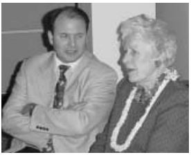
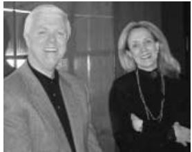
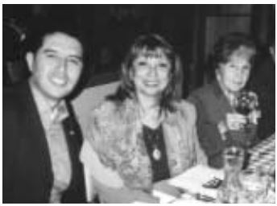

© 2002 K. Richard Keeler © 2002 Urantia Foundation

<figure class="table chapter-navigator">
  <table>
    <tbody>
      <tr>
        <td>
        </td>
        <td>
        <a href="/en/index/articles_uf_urantian#volume-21-issue-2-september-2002">
          Volume 21, Issue 2, September 2002 — Index
        </a>
        </td>
        <td>
        </td>
      </tr>
    </tbody>
  </table>
</figure>

## Trustees Give Keynote Address At Expo Ser

Trustees Gard Jameson and Richard Keeler were keynote speakers at Expo Ser y Primer Congreso Mundial del Ser held in Mexico City May 24 through 26, 2002. Expo Ser was an international exposition dedicated to physical health, intellectual enlightenment, and spiritual illumination that attracted approximately 15,000 people. It was held at the World Trade Center, the premier location for exhibitions in Mexico, and included presentations, exhibits, workshops, and artistic performances.

_Expo Ser_ was promoted throughout Latin America-from Florida to Argentina-via the Internet, cable TV, radio, magazines, billboards, and direct mail. Promotional materials were also placed at schools, health and sports clubs, universities, spas, bookstores, cultural centers, and other institutions.

Approximately 350 individuals attended the Urantia Foundation presentations, a number exceeded by only one other presenter. Gard Jameson gave an introduction to _El libro de Urantia_ and Richard Keeler gave a brief history of the _Urantia Papers_ and information about Urantia Foundation. Excerpts from Mr. Keeler's presentation appear below.

In exchange for Gard and Richard's participation, Urantia Foundation was given a 14 square meter booth with an excellent location. _El libro de Urantia_ was available at the Foundation's booth and at two booths sponsored by one of our distributors, Random House-Mondadori.

_El libro de Urantia_ was the single best selling title at the fair. It accounted for 50% of Random House's total sales.

_Expo Ser_ provided a wonderful opportunity to get in touch with people interested in _El libro de Urantia_. Members of the Asociacion Urantia de Mexico (AUM), Mexico's new affiliate of the International Urantia Association, helped to set up the booth and greet visitors. We enjoyed the kind support and assistance of AUM members L.P., Mary Tere Ortega, Janette Becerra, Maria del Refugio Fragoso, Mercedes Heredia, Edgar Ibarraran, and Jesus Rodriguez. Hundreds of people stopped to ask about the book, including many current readers making contact with Urantia Foundation and AUM for the first time.

This event provided an extraordinary opportunity to plant seeds for the future spread of the teachings of _The Urantia Book_ in Latin America. Through contacts made, a prison book placement program has been initiated in Mexico and AUM members were able to put together several potential new study groups.

## Expo Ser Speech

<figure id="Figure_2" class="image urantiapedia">

</figure>

_By Richard Keeler_

> \[Note: This speech is based upon the booklet _Golden Years: One Hundred Years of Revelation_, prepared as a commemorative history for Urantia Foundation's fiftieth anniversary based upon writings and recollections of members of the Contact Commission and Forum. It quotes extensively from the [_History of the Urantia Movement_](/en/article/William_S_Sadler/A_History_of_the_Urantia_Movement) by William S. Sadler, M.D., available at [https://www.urantia.org/urantia-foundation/history](https://www.urantia.org/urantia-foundation/history). Urantia Foundation plans to release a book-length publication of the history with supporting documentation.\]

My friend, Gard Jameson, has told you something about _The Urantia Book_, which claims to be, and which we believe is, the latest revelation of truth to the peoples of our planet. Gard told you that _The Urantia Papers_ are a composite presentation by numerous celestial beings.

Some of you may be wondering just how did such a work come into existence. Therefore, I have been asked to make a brief presentation about the circumstances surrounding the creation of _The Urantia Book_ and to tell you about Urantia Foundation, the organization founded in 1950 to oversee its publication, translation, and dissemination of its teachings.

The story of the _Urantia Papers_ begins in the first decade of the twentieth century. Two medical doctors, a husband and wife, who were practicing medicine in the Chicago area, began seeing a man who was having unusual experiences in his sleep. In the beginning, the doctors investigated the phenomena exhibited by this sleeping subject from a medical and scientific point of view.

During this same period, the doctors were also engaged in exposing false mediums and spiritualists who were popular at the time. They had, in the words of one of the doctors, “considerable experience in the investigation of psychic phenomena.” They “early arrived at the conclusion that the phenomena connected with the personality” were “in no way similar to any other well-known type of psychic performance-such as hypnotism, automatic writing, clairvoyance, trances, spirit mediumship, telepathy, or double personality.” They indicated “that the antecedents of the _Urantia Papers_ were in no way associated with so-called spiritualism-with its seances and supposed communication with the spirits of departed human beings.”

This individual through whom the _Urantia Papers_ were later communicated became known as the “contact personality” or “sleeping subject” but his identity was never revealed by the doctors who, with four other persons, became known as the Contact Commission. _The Urantia Book_ identifies the sleeping subject as a male ([UB 110:5.7](/en/The_Urantia_Book/110#p5_7)). Although the doctors were able to rule out the subject's own mind as the source of the material, they were never able to explain fully the phenomena. They did determine that the subject was unconscious throughout each episode and relatively unconcerned. The subject's health was not adversely affected by his experiences. In fact, he felt better after a “session.”

One of the doctors, the husband, described these preliminary contacts as a time in which they “were introduced to many new and . . . somewhat strange concepts of the universe of universes and as concerned man and his life on earth.” These “new ideas of cosmology and philosophy” included “a new concept of a far-flung cosmos,” “millions of other inhabited worlds,” and “introduction to scores of different and varied echelons of celestial personalities.” Numerous theologic concepts were presented, including terms such as “First Source and Center,” “Havona,” “superuniverses,” the “Supreme Being,” and “Thought Adjusters.” Voluminous notes were made during these sessions by a stenographer who was a member of the Contact Commission.

> It was the work of this secondary group \[of midwayers\] ably seconded by certain of the primary corps that brought about the co-ordination of personalities and circumstances on Urantia which finally induced the planetary celestial supervisors to initiate those petitions that resulted in the granting of the mandates making possible the series of revelations of which this presentation is a part. ([UB 77:8.13](/en/The_Urantia_Book/77#p8_13))

“The midwayers,” an order of personalities midway between humans and angels ([UB 77:6.1](/en/The_Urantia_Book/77#p6_1)), “were very real to us,” he wrote. “We frequently talked with them during our varied ‘contacts.’ We quite fully understood that the secondary midwayers supervised the contacts.” He continued, “We gained the impression that there were special reasons for Jesus' bestowal on Urantia . . . \[and\] listened to occasional references to Jesus' life and teachings. . . . While we did not hear the term ‘Corps of The Finality,’ we did pick up a hazy idea that Paradise might be the destination of surviving mortals.” He concluded, “Our superhuman friends thus spent upward of two decades in extending our cosmic horizons, enlarging our theologic concepts, and expanding our overall philosophy.”

“We never realized,” he explained, “how much our religious thinking had been expanded until the _Papers_ began to arrive. As the Revelation progressed we came to more fully appreciate how we had been prepared for the vast alteration of our religious beliefs by these preliminary contacts extending over a period of twenty years of pre-education.”

The doctor referred to this time as “our apprenticeship training for subsequent service in association with the presentation of the _Urantia Papers_.” He concluded that “during these early years, our unseen friends were engaged in a thoroughgoing testing of the contact personality, rehearsing the technique of communication, and selecting the Contact Commissioners.” The “Contact Commission” served as custodians of the _Urantia Papers_ during their creation and were later responsible for such matters as raising funds, taking care of the details surrounding publication of the book, and securing international copyrights.

In December of 1924, a group that came be to be known as the Forum began to participate in the process. This group had been meeting at the home of the physicians for almost two years. Both physicians were well-versed on the subjects of health and religion, and the Forum started when the doctors invited family, friends, and former patients to meet informally at their home on Sunday afternoons to discuss arious topics. As time passed, this group became a diverse and cosmopolitan group consisting of professional men and women-doctors, lawyers, dentists, ministers, teachers-together with individuals from all walks of life: farmers, housewives, secretaries, office workers, and common laborers.

In the course of delivering a series of talks to the Forum, one of the doctors, the husband, mentioned that nearly every case of psychic phenomena he had studied involved either self-delusion or fraud. He mentioned that the case involving the contact personality was an exception. The Forum manifested a great interest in the case.

It was about this time that a challenge came from a celestial being communicating through the contact personality. The being suggested that if the Contact Commission would ask more serious questions, they might get information of value to all mankind. The Contact Commissioners told the Forum about this challenge and invited them “to join us in the preparation of questions.” The husband said, “We decided to start out with questions pertaining to the origin of the cosmos, Deity, creation, and such other subjects as were far beyond the present-day knowledge of all humankind.” On the following Sunday “several hundred questions were brought in. We sorted out these questions, discarding duplicates, and in a general way, clarifying them,” he explained.

> \[H\]is passive reaction to and inactive concern toward the phenomena associated with the presence in his mind of this versatile Adjuster is . a rare and fortuitous reaction . favorable both to the Adjuster in the higher sphere of action and to the human partner from the standpoints of health efficiency and tranquillity. ([UB 110:5.7](/en/The_Urantia_Book/110#p5_7))

“Shortly thereafter, the first _Urantia Paper_ appeared in answer to these questions,” he continued. “From first to last, when Papers appeared, the questions disappeared. This was the procedure followed for the many years of the reception of the _Urantia Papers_. No questions, no _Papers_.” During this period, the revelators-that is, the celestial beings-instructed that the Forum should become a “‘closed group’- requiring each member to sign a pledge of secrecy and to discuss the _Papers_ and all matters pertaining thereto with only those persons who were members of the Forum.” The Contact Commission also had been sworn to secrecy concerning the identity of the contact personality.

Forum meetings were held every Sunday afternoon. _Papers_ were read aloud by a leader and then discussed by the group. The following Sunday, new questions would be presented. This adventure of questioning and discovery during which the _Urantia Papers_ were developed continued over the next two decades. Forum participants “could hardly wait” for the next meeting, the next installment. They questioned everything. Over the years, approximately 400 people participated in this questioning process.

The Contact Commissioners were charged with the responsibility of gathering up the questions. They also had the responsibility of comparing the typewritten text with the original manuscripts. From the beginning, the Contact Commissioners were the custodians of the manuscripts, keeping a “carbon copy of the typewritten _Papers_ in a fireproof vault.” The Forum read typewritten copies; they never saw any handwritten manuscripts. None of the handwritten or typewritten material remains in existence. “Only the Contact Commissioners attended ‘contacts’ and received written communications through the contact personality.”

Regarding the technique by which the communication of information transferred from the revelators through various links, the doctor explained that “all of our observations and investigations utterly failed to reveal the technique of reducing messages to writing.” The final _Papers_ were handwritten, although even the Contact Commissioners never understood the process by which they came to be handwritten. Thus there were many unanswered questions about the details of transmissions, even among the contact group. The fact that there were so many “unknown features” of the process was one of the reasons the humans involved were sworn to silence regarding the origin. The doctor explained:

> There is much connected with the appearance of the _Urantia Papers_ which no human being fully understands.... There are numerous missing links in our understanding of how this revelation came to appear in written English.
> 
> If any one of us should tell any one <ins>all</ins> he really knows about the technique and methods employed throughout the years of our getting this revelation, such a narration would satisfy no one-there are too many missing links.

He further stated:

> The main reason for not revealing the identity of the Contact Personality is that the Celestial revelators do not want any human being—any human name—ever to be associated with _The Urantia Book_.
> 
> They want this revelation to stand on its own declarations and teachings. They are determined that future generations shall have the book wholly free from all mortal connections—they do not want a Saint Peter, Saint Paul, Luther, Calvin, or Wesley. 

The Contact Commissioners and Forum members noted that few of the celestial authors of the _Papers_ were identified by name, only by order of being.

One of the doctors, the husband, who had originally been a surgeon, eventually became a psychiatrist. He once said that although he accepted the value of the _Papers_, he was not definitively convinced of their validity until the _Paper_ on the twelve apostles was presented. The doctor said, “I'm a psychiatrist, and I think I know my business, but this _Paper_ is a real blow to my pride. If I had a half dozen psychiatrists to help me and years to prepare it, I was convinced that I couldn't fabricate a _Paper_ with this ring of genuineness and insight. So I said to myself, 'I don't really know what it is, but I do know that it's the highest quality of philosophical-religious material that I have ever read.'”

Then, as now, every reader of _The Urantia Book_ must decide for himself or herself, based on his or her own inner experience of truth, whether or not _The Urantia Book_ is what it claims to be, namely, a revelation by celestial beings. “_\[R\]evelation is validated only by human experience_” ([UB 101:2.8](/en/The_Urantia_Book/101#p2_8)). Said the doctor, “You could appreciate a good poem-even if you did not know the author. Likewise, you could enjoy a symphony even if you were ignorant of the composer.”

Most of the men and women who participated in this process served a lifetime without human recognition. We do not even know many of their names. All of them, including their leaders, thought and hoped that their names would never be associated with _The Urantia Book_. They wanted the focus to be on the revelation itself, and the revelators carefully instructed them to do nothing that would detract from the revelation.

In 1950, responsibility for publishing _The Urantia Book_ was entrusted to Urantia Foundation, a non-profit, charitable trust headquartered in Chicago, Illinois, in the building that earlier had served as the residence and offices of the doctors who were involved in bringing the book into existence. _The Urantia Book_ was published in 1955, and the Trustees of Urantia Foundation are charged with the duty to perpetually preserve inviolate the text of _The Urantia Book_ to maintain control over the printing and reproduction of _The Urantia Book_ and all translations thereof, and to disseminate its teachings throughout the world. Through the years Urantia Foundation has steadily reached out to the world community and has witnessed an increasing interest in these teachings, with the book now available in seven languages and numerous additional translations in progress.

## The Matthew Project

The Matthew Project is an undertaking of a unique group of readers devoted to ensuring that _The Urantia Book_ will be available to the peoples of the world far into the future. This goal, they believe, will be best achieved by ensuring the long term financial health of Urantia Foundation so that it can continue its mission of translating, publishing, and disseminating the teachings of _The Urantia Book_.

Fifty years ago when Urantia Foundation was established, the early readers were thrilled to see the book in any bookstore. Today one can find the book-in several languages-in bookstores from Paris to Perth, from Moscow to Mexico City, from Helsinki to The Hague, from Delhi to Dakar, from Seoul to Santiago. The teachings of _The Urantia Book_ are spreading quietly and steadily to all corners of the globe.

This growth has not happened by chance. Much planning and effort has been necessary to lay the foundations for worldwide dissemination. As Urantia Foundation expanded its work throughout the world, a more formalized planning process was implemented. Beginning in 1997, hundreds of individuals from across the readership joined the Trustees, Executive Director, and staff for a series of planning workshops.

<figure id="Figure_3" class="image urantiapedia image-style-align-right">

<figcaption><em>Marjorie Reed and Georges Michelson-Dupont</em></figcaption>
</figure>

The strategic plan that evolved through this process called for:

- translating _The Urantia Book_ into all of the major languages of the world;
- establishing perpetual printing funds for the English and other language editions;
- developing and carrying out a business plan to ensure availability of the book through normal channels of trade;
- responding to reader inquiries and the fostering of study groups;
- addressing international needs with representatives and branch offices to disseminate the book and its teachings in a manner consistent with local culture;
- supporting gift book programs for libraries, religious institutions, and for the poor;
- publishing study aids in all languages;
- protecting the copyright and trademarks;
- maintaining the headquarters building at 533 Diversey Parkway; and
- providing office support and administration required to carry out all of these activities.

<figure id="Figure_1" class="image urantiapedia image-style-align-right">

<figcaption><em>Quin Frazer and Nancy Shaffer</em></figcaption>
</figure>

From among the interested readers who developed the strategic plan, a task-oriented group was formed of individuals who were thrilled with the anticipation of attaining these goals and devoted to developing the financial resources required to realize them. This group included members from the International Urantia Association and the Fellowship, as well as readers not associated with any membership group. Inspired by the example of Matthew Levi, whose efforts supplied the needs of Jesus' apostles, they chose the name “The Matthew Project.”

The Matthew Project is led by people of integrity and discretion who are dedicated to helping Urantia Foundation grow into a strong institution focused on the principles and ideals it was formed to support. While the members come from various backgrounds, they are united in their support of Urantia Foundation's unique and critical role in preserving and disseminating the fifth epochal revelation.

Permit us to introduce you to these companions of the Matthew Project who have been working together with Urantia Foundation's Trustees, Executive Director, and staff for more than four years to find ways of funding what they consider to be the most important work on the planet today.

**Bill and Share Beasley**—Active members of Florida Students of _The Urantia Book_, an unaffiliated reader organization. They built a successful business in Florida which they recently turned over to their children in order to devote themselves to Urantia Book related work.

**Dorothy Elder**—Second generation Urantia Book reader for 35 years. Formerly active in First Urantia Society of Los Angeles, now active in IUA. Former Vice President of United States Urantia Association. Serves as Director of _The Urantia Book_ Internet School (UBIS), an educational outreach program provided through the Urantia Foundation website.

**John Farrow**—Urantia Book reader for 25 years, active in his community with hospice and with Catholic church. No affiliation with reader groups.

**Quin Frazer**—Associated with Urantia Foundation for many years, Quin's expertise for his firm of Gardner Carton & Douglas is with nonprofit charities.

**John Hales**—Former President of Urantia Brotherhood, currently Resident Director of The Fellowship and member of First Society for Readers of _The Urantia Book_.

**Mary Lou Hales**—Perhaps the oldest living Urantia Book reader. She was a member of the Forum prior to publication of _The Urantia Book_, served as one of the original General Councilors of Urantia Brotherhood, and for many years chaired its Charter Committee. Mary Lou is the widow of Urantia Foundation's first President, William M. Hales, and was instrumental in laying the foundation for the early spread of _The Urantia Book_ and its teachings.

**Marian Hughes**—Long-time member of Urantia Brotherhood and Founding Member and current Vice President of HULA (Hawaii Urantia Local Association). A reader for 34 years, she spends two months each year in Chile, planting seeds for the spread of the revelation there.

**Tom & Carolyn Kendall**—Both were members of the Forum. Tom served as Trustee of Urantia Foundation for twenty years; its President for ten years. They have been members of the First Society for Readers of _The Urantia Book_ since 1956 and have served in numerous capacities within Urantia Brotherhood and The Fellowship. They bring a critical historical perspective to The Matthew Project. (As this goes to press, we learned of Tom's passing. We shall miss him.)

**Marjorie Reed**—An active reader and supporter since 1970. She served nine years on the Education Committee of Urantia Brotherhood and is a member-at-large of _The Urantia Book_ Fellowship.

**Nancy Shaffer**—President of PURE, the San Francisco area IUA. Active reader for 25 years. Serves as Chair of the Transitional Coordinating Committee and as a Consultant to the Trustees.

**Paul and Mary Snider**—Paul is a former President of Urantia Brotherhood and a current member of the Fellowship's General Council. Mary is a former member of the Fellowship, currently independent of affiliation. Both are long-time readers.

**Bryan Snowden**—Founding member and current Secretary/Treasurer of Lone Star Urantia Association. Bryan has served as an advisor to the Trustees on the Coordinating Committee regarding Public Relations and on the Building Committee for 533 Diversey Parkway.

**Neal Waldrop**—Former Trustee of Urantia Foundation and active reader since 1973. He has served on five continents during his career as a diplomat. No affiliation with reader organizations.

**Ralph and Betty Zehr**—Active in Urantia Book circles in New York for 34 years, and now active in the IUA. Betty is a past President of the United States Urantia Association.

Together with Urantia Foundation this group has worked behind the scenes to ensure that _The Urantia Book_ will be available to the peoples of the world far into the future. Soon they will be reaching out to like-minded individuals to join them in this exciting project. This goal, they believe, is obtainable, and they have devoted their energies to seeing it achieved.

For more information about The Matthew Project contact Tonia Baney or Jay Peregrine at the Chicago office or any of the above members.

## Thank You L'association Francophone!

The 2004 International Urantia Association Conference in Dourdan, France, was a success _extraordinaire!_ Our French hosts did a superb job in organizing the conference and making sure that we were all comfortable and well nourished, both physically and spiritually. The French tradition of gourmet dining afforded us with ample opportunities to get to know one another better as we enjoyed leisurely meals together each afternoon and evening.

The presentations offered by devoted readers from around the world added unique insights into the conference theme, “Living the Ascension Plan in Terrestrial Human Experience.” Successive days were devoted to the ascension plans of the Universal Father, the Eternal Mother Son, and the Infinite Spirit, as described in _The Urantia Book_. IUA members from each continent collaborated on their topics for the presentations and workshops. They also provided background and updates on the various activities of their associations. The main presentations will be available soon in the _IUA Journal_. (Non-members of IUA may subscribe to the _Journal_ by contacting Urantia Foundation.)

> Train your memory to hold in sacred trust the strength-giving and worth-while episodes of life which you can recall at will for your pleasure and edification. Thus build up for yourself and in yourself reserve galleries of beauty goodness and artistic grandeur. But the noblest of all memories are the treasured recollections of the great moments of a superb friendship. ([UB 160:4.12](/en/The_Urantia_Book/160#p4_12))

Everyone enjoyed the opportunities for relaxation and the excursion to Vaux-le-Vicomte, the chateaux that inspired Louis XIV to commission the creation of Versailles by the same designer. The grandeur and splendor of the 1661 castle and gardens was breathtaking!

Congratulations to all who helped make the French conference an experience to remember. Kudos to the planners, the volunteers, the facilitators, the presenters, and the translators who enabled participants from twenty-five countries to enjoy this shared experience of learning and growing together. The friendships initiated and renewed at reader conferences are a treasure to be valued, a comfort to the soul.

## Copyright Update

In March 2002, the last of the appellate briefs was filed with the United States Tenth Circuit Court of Appeals in the case of _Michael Foundation Inc. v. Urantia Foundation_. This case arises out of the publication by Harry McMullan III of a work that copied all but one of the _Papers_ from Part IV of _The Urantia Book_. Information about this case is provided at [https://www.urantia.org/sites/default/files/newsinfo/mcmullan.html](https://www.urantia.org/sites/default/files/newsinfo/mcmullan.html)

Because it appears the issues are fully addressed in the briefs and in the record of the proceedings at the trial court, Urantia Foundation filed notice it was withdrawing its request for oral argument, which would have occurred on September 27, 2002. We understand the panel of three judges assigned to rule on the case met on that date to reach a preliminary decision and to assign the writing of the court's opinion. We will not know the outcome until the written decision is issued, which could be weeks or months after the initial determination. We look forward to a prompt and proper resolution of this matter.

This case only affects the United States renewal copyright in the English text of _The Urantia Book_. Urantia Foundation continues to display copyright notices in the English books, as required by law, to preserve its international copyrights. In addition, all of the translations have separate copyrights that remain valid in the United States and throughout the world.

## Audits Available, IRS Visits The Foundation

The annual audited statements of financial position of Urantia Foundation and the combined statements of financial position of Urantia Foundation and Affiliates including the related statements of activities and cash flows as of December 31, 2000 are now available. If you are interested in obtaining a copy, please send a request along with $10.00 USD to cover copying and postage.

Additionally, Urantia Foundation's Federal Form 990-Return of Organization Exempt from Income Tax, for the 2000 calendar year is available, either for a nominal $5.00 USD charge to cover copying and postage expenses, or free of charge online at [https://www2.guidestar.org/organizations/36-2435086/urantia-foundation.aspx](https://www2.guidestar.org/organizations/36-2435086/urantia-foundation.aspx) . All state and federal filings have been made, and Urantia Foundation remains in good standing with both the Internal Revenue Service and the Illinois Attorney General.

Independent auditors from the firm of Altschuler Melvoin and Glasser, LLP recently performed year 2001 audit testing and fieldwork. This summer work schedule allows Urantia Foundation to obtain lower off-season rates for these services while meeting state and Federal extended filing dates. Audits of calendar year 2001 should be available approximately November 2002.

In March 2002, Urantia Foundation received a notice of selection for a compliance audit for the year ending December 31, 1999 from the Internal Revenue Service. During April and May 2002, an IRS field agent examined the correctness of income or gross receipts, deductions, and credits to determine that the organization is operating in the manner stated and for the purpose set forth in its application for recognition of exemption. Records examined during this audit included: governing instruments, minutes of meetings, all records of assets, liabilities, receipts, and disbursements (including check register, canceled checks and bank statements), auditor's report, prior and subsequent year tax returns, correspondence files, pamphlets, brochures, and other literature printed.

We are happy to report that on August 27, 2002 Urantia Foundation received a letter from the Internal Revenue Service reporting that the examination disclosed the organization continues to qualify for exemption. The return filed for the period ending December 31, 1999 was accepted as filed.

If you would like to receive copies of the audited financial statements or tax returns, or if you have any questions, please contact F. Gard Jameson, CPA, Treasurer, or Marcia Lansu, CPA, Finance Manager, at the Chicago office.

## Upcoming Urantia Conferences

**Southern Cone.** The next conference of the Southern Cone Urantia Association will be held in Santiago de Chile November 15-17, 2002. Information: Carlos Rubinsky carlosrubinsky@inea.com.ar

**Finland.** The 2003 Winter Conference of Finnish Urantia Book readers will be held January 24-26, 2003. Information: www.urantia.fi

**Estonia.** The Estonian Urantia Association will hold conferences on March 29, 2003 in Tallinn, and August 22-24, 2003 at Karepa, Estonia. Information: Peep Sõber psober@hot.ee.

United States. The 2003 USUA National Conference will be hosted by Southern Kindred Spirits Urantia Association at Scarritt-Bennett Center in Nashville June 19-22, 2003. Information: www.urantiausa.com

**International Urantia Conference 2004**. The USUA will sponsor the 2004 International Urantia Conference to be hosted in Chicago by the Greater Lake Michigan Urantia Association. The proximity to the historic headquarters of Urantia Foundation, the many cultural attractions, beautiful lakefront, excellent public transportation within the city, and the convenience of transportation to Chicago from all parts of the world make it an attractive venue for an international conference. Information: www.urantia.org/iua

## New Products And Gifts For The Christmas Season

Every year, Urantia Foundation offers one or two new gift items, and this year is no exception. We have a number of new products that you may want to put under your tree for that special someone. Sales of gift items subsidize the work of Urantia Foundation and enable us to keep book prices low.

**The Classic Book**—New this fall! This book looks and feels just like the original 1955 First Printing complete with the original dust jacket. The paper is the thinnest and most opaque we have ever used, making it the lightest study edition ever printed. We are offering it at $39.95, a special price for the holidays. Beginning January l, 2003 it will be $49.95. The “Classic” dust jacket is available only through Urantia Foundation.

**Glass Tumblers**—Designed to express the universal appeal of the book, we are offering for the first time this set of four beautiful glass tumblers etched with the name for _The Urantia Book_ in many different languages. See ifyou can guess which is Korean or Chinese! These are available for $20.00 per set.

**Bring on the Winter in Your New Urantia Sweatshirt**—The Concentric-Circles Symbol and “Urantia” are embroidered over the heart on this cotton-polyester gray sweatshirt suitable for the entire family. The price is $34.95 just for Christmas giving.

**Inevitabilities T-Shirt: No. 3 in the Series**—These T-shirts bear the Concentric-Circles Symbol and “The Urantia Book” on the front and a quotation from page 51 on the back about certain inevitabilities of life. They are specially priced at $10.00 each. Please note that Inevitabilities T-shirt No. 1 is no longer available and limited quantities of T-shirt No. 2 remain.

**New Soft Caps Arrive**—Our washed cotton caps are back, just in time for the Christmas season. Khaki with blue brims, they are $12.50 each and, as always, a percentage goes to the youth fund.

## Study Group And Mailing List Updates

We offer a special “Thank You!” to all those who responded to the request for updates in our last newsletter. We received many Referral/Study Group
forms and lots of calls and emails.

We appreciate your help in keeping our records up-to-date. This enables us to provide accurate information to readers looking for referral contacts, reduces wasted mailings, and ensures that you receive the latest news about Urantia Foundation and _The Urantia Book_.

Please continue to inform us whenever changes occur with your address or contact details. And remember, we are here to help with new and existing study groups.

## Christmas Open House

Urantia Foundation once again will open its doors for the annual Chfistmas Open House on Saturday, December 7, 2002, from 3:00 to 9:00 p.m. Please plan tojoin us for this event being cosponsored by the Greater Lake Michigan Urantia Association and the First Society for Readers of _The Urantia Book_. A brief program will be presented at 3:30 followed by refreshments. We look forward to this opportunity to visit with friends, old and new. Please join us! For further infonnation call the Chicago office at +1 (773) 525-3319.

## Price Increases

_The Urantia Book_ for $8.00! Can you imagine paying that price today for this unique book that we all cherish? That was the original price of _The Urantia Book_ when it was first published in 1955. Over the years, the price has increased periodically to be certain books are available at the lowest possible price while continuing to make the book widely available in order to give more individuals the opportunity of owning a copy.

While we want to continue the subsidy of books to individuals in nations that cannot afford to purchase _The Urantia Book_, it is becoming increasingly dificult to do so. In addition to providing these gift books, the cost of paper, printing, binding, and shipping are steadily increasing. We receive donations to assist us in providing free and subsidized books to those who cannot afford them, but we find that donations alone have not met the costs ofthe steady demand ofthese requests.

> “3. Is *hope—*the grandeur of trust—desirable? Then human existence must constantly be confronted with insecurities and recurrent uncertainties.” [UB 3:5.8](/en/The_Urantia_Book/3#p5_8)

To continue providing the same quality books worldwide, and at reasonable prices, some of the current editions of _The Urantia Book_ and available translations will have a slightly higher price beginning January 1, 2003. Listed below are the editions and their new prices.

&nbsp; | &nbsp;
--- | ---
_The Urantia Book_, Classic Edition with 1955 Dust Jacket | $49.95
_The Urantia Book_, Classic Edition with Blue Dust Jacket | $49.95
_The Urantia Book_, Small Hard Cover | $34.95
_The Urantia Book_, Gift Boxed Leather | $39.95
_El libro de Urantia_, Hard Cover | $29.95
_El libro de Urantia_, Paperback | $24.95

These modest increases will help us to continue to provide the quality products and services that you have come to expect from Urantia Foundation.

## Urantia Foundation and GLMUA host USUA Meeting

The staff of Urantia Foundation and members of the Greater Lake Michigan Urantia Association (GLMUA) were delighted to host association leaders from around the United States who gathered for the Annual Business Meeting of the United States Urantia Association (USUA) in Chicago June 1, 2002.

The weekend started on Friday evening with a lively reception on the third floor of Urantia Foundation headquarters. Old and new friends greeted one another and engaged in animated discussions of activities within the United States and abroad. The common bond of service to our fellows and a shared interest in disseminating the teachings of _The Urantia Book_ united this diverse group.

Twenty-seven national officers, committee chairs, and local officers representing twelve local associations attended the business meeting, along with ten members who attended as observers. We heard presentations from the chairs of several active committees who inspired us to greater commitments in these areas of service, including Conference, Education, Membership, and Publications.

Amidst their busy day of association activities, this body of Local Presidents and Vice-Presidents unanimously voted for the adoption by the USUA of the following statements:

> We believe that _The Urantia Book_ is the fifth epochal revelation to the planet.
> 
> We wholeheartedly support Urantia Foundation in their dedicated work as the publisher, translator and protector of _The Urantia Book_.
> 
> We sincerely regret the actions of a few to undermine the work of Urantia Foundation in its effortsto fulfill the requirements of its Declaration of Trust as clearly demonstrated by the decision to print an alternate version of _The Urantia Book_ and translations thereof.

Second, in response to allegations impugning the character of Dr. William S. Sadler made by Harry McMullan III in a court of law last year, the group voted to make this public statement:

> _In our opinion William S. Sadler, M.D., was a man of the highest integrity and honor, who devoted his life and his resources to the Urantia Revelation with no expectation of personal gain._

In making this statement, the United States Urantia Association joined with the early leaders of Urantia Brotherhood who, in 1959, honored Dr. Sadler by presenting him with the Van Award for his outstanding contributions, character, and leadership and his many years of devoted and distinguished service.

## National Public Library Association

Urantia Foundation was one of 357 participants in this year's National Public Library Association Book Fair held recently in Phoenix, Arizona. Approximately five thousand librarians from various countries visited Phoenix for this event. Each year this book fair gives publishers an opportunity to display their books to the people responsible for choosing works for public libraries around the world.

Our purpose in attending this fair was to create awareness of _The Urantia Book_ and to encourage librarians to carry it in their collection. Many librarians showed a keen interest in the book, and consequently many books were donated during this event.

The Foundation's display was professional, colorful, and informative. Urantia Books were donated to libraries in twenty-seven of the United States and to libraries in Mexico, Canada, Singapore, and China.

From the shelves of these libraries the message of _The Urantia Book_ will be made available to countless numbers of readers who browse libraries searching for truth. We thank Rick Warren, Cathy Jones, and the other staff and volunteers who helped with this event.

## New Partnership Program For Library Placements

Through the years, many readers have partnered with Urantia Foundation to ensure that books are available in their local libraries. We are now offering to extend this program to all interested readers by offering low cost books to be used expressly for library placement. Please contact the local office of Urantia Foundation for details.

## BookExpo America (BEA)

In May Urantia Foundation attended the BookExpo America in New York City. BEA is the largest book trade show in the United States. The Foundation's consistent attendance over the past thirteen years has afforded it recognition and respect within the publishing industry. Urantia Foundation's stature as a small independent publisher has grown parallel with the growth in spiritual and inspirational publishing and the tremendous increase of Spanish titles in the genre.

Mayor Rudolph Giuliani delivered the opening address this year. All 2000 participants stayed the course, not wavering in their decision to attend despite the atrocity of September 11, and the Mayor expressed his gratitude and appreciation on behalf of the city.

Urantia Foundation was featured as an inaugural participant in the launch of R. R. Bowker's Publisher Pages on their Books in Print Website and was invited to attend a special luncheon celebrating this accomplishment.

<figure id="Figure_4" class="image urantiapedia">

<figcaption><em>Víctor García-Bory, Hilvania Canella-Adams, María de Aguilera</em></figcaption>
</figure>

A new Spanish Pavilion was featured at this year's event. Urantia Foundation was able to serve Spanish visitors thanks to the help of volunteers Maria de Aguilera and Hilvania Canella-Adams, who assisted the Foundation's Spanish Marketing and Reader Services Representative.

> “Evolutionary man does not naturally relish hard work. To keep pace in his life experience with the impelling demands and the compelling urges of a growing religious experience means incessant activity in spiritual growth, intellectual expansion, factual enlargement, and social service. There is no real religion apart from a highly active personality.” [UB 102:2.7](/en/The_Urantia_Book/102#p2_7)

## IUA Update-Where In The World Are We?

The International Urantia Association now has approximately 1,150 members, over half of whom live outside of the United States. There are now 8 National Associations and 34 Local Associations of IUA. The National Associations are in Australia-New Zealand, Canada, Colombia, Finland, France, Peru, Senegal, and the USA. Of the 34 Local Associations, 25 are in the United States, 3 in Canada, 2 in Colombia, 1 in Estonia, 1 in Mexico, 1 in Spain, and 1 in the Southern Cone of South America. The most recent associations to be chartered are in Mexico and Alaska.

## The Urantia Book Series Of Workbooks

By the time _The Urantia Book_ was published in 1955, many of the Forum members had been studying the Urantia Papers for decades. In order to introduce and teach new readers the basic doctrines and concepts in the book, as well as to further their own studies, workbooks were created, typed, mimeographed, and bound for use in the early Urantia Brotherhood School. The workbooks were never widely distributed, and their author felt they needed improvement. Nevertheless, they are helpful study aids and they provide an interesting perspective of the earliest students of _The Urantia Book_.

Urantia Foundation is therefore making these workbooks available to the public for the first time. The books were originally prepared on typewriters making it impossible to simply scan the pages into a computer for today's printing presses. Therefore, we re-typed and formatted each page. These are now being printed by Urantia Foundation as 6 x 9 inch paperback books. The first four books are now in production. Each book will include two to three volumes of the original workbooks on a selected topic:

- [A Study of Part One of _The Urantia Book_](/en/article/William_S_Sadler/Workbook_1_Foreword_and_Part_I)—Contains: Transcript of Lecture and Discussion of the Foreword and An Analytic Study of Part One of _The Urantia Book_ (volumes one and two).
- [Science in _The Urantia Book_](/en/article/William_S_Sadler/Workbook_2_Science)—Contains: Science in _The Urantia Book_ (volumes one and two).
- [Topical Studies in _The Urantia Book_](/en/article/William_S_Sadler/Workbook_3_Topical_and_Doctrinal_Studies)—Contains: Topical Studies in _The Urantia Book_ (volumes one and two) and A Short Course in Doctrine.
- [_The Urantia Book_ and the New Testament](/en/article/William_S_Sadler/Workbook_4_Jesus)—Contains: The Teachings Of Jesus in _The Urantia Book_; The Life of Jesus Compared to the Four Gospels; and _The Urantia Book_ and the New Testament—The Apocrypha.

We hope to have these available before Christmas, so please Check our web store at [www.urantia.org](https://www.urantia.org) for the addition of these items.

> “Do not overlook the value of your spiritual heritage, the river of truth running down through the centuries, even to the barren times of a materialistic and secular age. In all your worthy efforts to rid yourselves of the superstitious creeds of past ages, make sure that you hold fast the eternal truth.” [UB 195:9.1](/en/The_Urantia_Book/195#p9_1)

## Reader Comments About The Urantia Book

> “I discovered _The Urantia Book_ seven years ago at a friend's house and perused it, amazed by the content. It has since been in my mind and I recently purchased it at a local book store. What is so impressive to me is that it doesn't seem to contradict any current spiritual or religious understandings, only adding to them.” - Athens, Georgia, USA

> “_The Urantia Book_ is the most beautiful collection of truths accessible to any of us Urantians. It reveals God's style for advancing His vast, majestic creation in time-space. The complete life of Jesus, moreover, describes the loving and loveable personality of our Creator Son, in a way that gives us the trusting cosmic identity we so much needed.” - Brasilia, Brazil

> “Having studied for over twenty-five years, both in the traditional manner, the study and meditation of world religions, the traditional Christian and Jewish Scriptures, as well as subjects generally regarded as more esoteric, I find my life and my attitude altered and uplifted by my study of _The Urantia Book_. I believe it to be truth.” - Sanger, California, USA

> “_The Urantia Book_ opens so many doors for the thinking mind that it is impossible to put it on paper.” - Johannesburg, South Africa

## References

- Urantia Foundation's Urantian News: https://www.urantia.org/news/2002-09

<figure class="table chapter-navigator">
  <table>
    <tbody>
      <tr>
        <td>
        </td>
        <td>
        <a href="/en/index/articles_uf_urantian#volume-21-issue-2-september-2002">
          Volume 21, Issue 2, September 2002 — Index
        </a>
        </td>
        <td>
        </td>
      </tr>
    </tbody>
  </table>
</figure>
