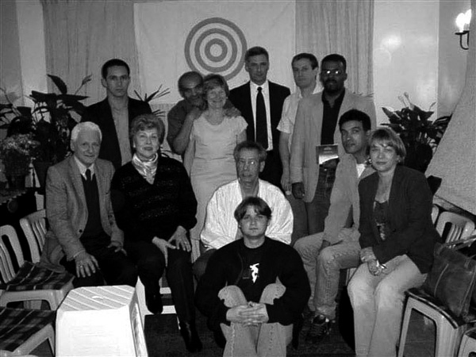
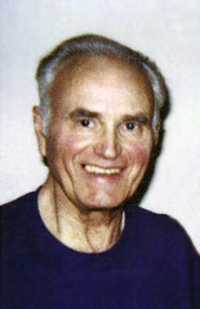
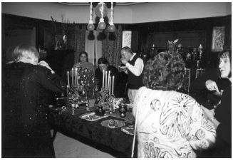
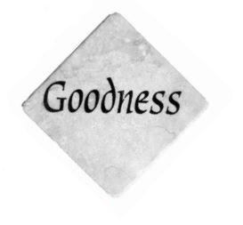
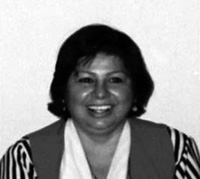
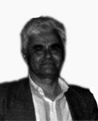

© 2003 K. Richard Keeler © 2003 Urantia Foundation

<figure class="table chapter-navigator">
  <table>
    <tbody>
      <tr>
        <td>
        </td>
        <td>
        <a href="/en/index/articles_uf_urantian#volume-22-issue-2-october-2003">
          Volume 22, Issue 2, October 2003 — Index
        </a>
        </td>
        <td>
        </td>
      </tr>
    </tbody>
  </table>
</figure>

## Welcome, O Livro de Urântia!

Richard Keeler

<figure id="Figure_1" class="image urantiapedia image-style-align-right">

</figure>

In July, Portuguese joined the growing family of Urantia Book translations! Urantia Foundation is pleased to announce the publication of _O Livro de Urântia_, the Portuguese-language edition of _The Urantia Book_. This translation is now available on computer CD-ROM for a suggested retail price of $14.95 (ISBN 1-883395-24-0).

The CD-ROM contains the text in HTML format, which is universally accessible on computers using any web browser software. (Internet access is not required.) As an added bonus, the CD-ROM contains reference copies of the authentic English text and the Spanish translation, _El libro de Urantia_.

Following its U.S. release in July, the CD became available for worldwide distribution on August 21, 2003. Readers who gathered in Brazil to celebrate the bestowal life of Jesus of Nazareth were the first to receive copies of this much-awaited work. We hope that publication of this CD version of the translation will stimulate interest and financial support for the printed edition. Brazilian readers launched the printing fund by collecting over $700.

The publication of _O Livro de Urântia_ will give nearly 200 million Portuguese speakers the opportunity to study The Urantia Book in their native language. Even prior to this publication, we witnessed a growing interest in The Urantia Book among native speakers of Portuguese. Readers in Brazil recently formed an affiliate of the International Urantia Association, a worldwide association devoted to studying _The Urantia Book_ and disseminating its teachings. 

Urantia Foundation now publishes _The Urantia Book_ in English, Dutch, Finnish, French, Korean, Portuguese, Russian, and Spanish, with fifteen additional translations in progress. In addition, Urantia Foundation offers a variety of workbooks and study aids that are popular with students of _The Urantia Book_. The Foundation has published over 600,000 copies of _The Urantia Book_ worldwide. Its publications and services are identified with the trademarks URANTIA and the Concentric-Circles Symbol.

<figure id="Figure_2" class="image urantiapedia">

<figcaption><em>Readers gather in São Paulo to celebrate the release O Livro de Urântia   <b>Front Row, on the floor:</b> Leandro <b>Second Row, sitting:</b> Caio Mário Caffé and Nancy, Luiz Carlos Dolabella, Mingo, Nivea   <b>Third Row, standing:</b> Nemias Mol, Sabino Hüttner, Susana Hüttner, Romualdo Salata, Rogério Reis, (unknown)</em></figcaption>
</figure>

## President’s Message: Removing The Wedges

Richard Keeler

<figure id="Figure_3" class="image urantiapedia image-style-align-right">

</figure>

Perhaps the simplest of all tools is the wedge–a tapered piece of wood, metal, or stone used to pierce and split wood or stone and to lift heavy loads.

Members of the Contact Commission said they were warned that Caligastia’s favorite technique for disrupting spiritual unity is to drive wedges of suspicion and misunderstanding between personalities. The time has come to take the crowbar of courage and start prying out the wedges that have generated unproductive division.

We know that unique personalities never agree on all things, but we can and should work together in love, understanding, and tolerance.
 

Consider this quote from [UB 21:0.5](/en/The_Urantia_Book/21#p0_5):

> _“Not long since on Uversa we recorded a universal broadcast of a conclave extraordinary on the eternal Isle of one hundred fifty thousand Creator Sons assembled in the parental presence and engaged in deliberations having to do with the progress of the unification and stabilization of the universe of universes.”_

As in the macrocosm, so in the microcosm.

The trustees and staff of Urantia Foundation earnestly desire to foster “the progress of the unification and stabilization” of Urantia, and we desire to work with all fellow readers of _The Urantia Book_ worldwide in accomplishing this mighty mission.

With spiritual unity and cooperation we can help each other and all humankind to fulfill our highest potentials as children of God and as brothers and sisters.

> _“Peacemaking is the cure of distrust and suspicion.”_ ([UB 140:5.18](/en/The_Urantia_Book/140#p5_18))

## IUA News

**Brazil**. Another light was lit for the Revelation in São Paulo, Brazil on June 1, 2003. Associação Urântia de Brasil is now a Local Association of the International Urantia Association. The formation of this new association came just weeks before the completed Portuguese translation, _O Livro de Urântia_, was delivered in CD format to the translation team and presented to Brazilian readers at their celebration of Jesus’ birthday on August 21.

Urantia Foundation President Richard Keeler, IUA President Gaétan Charland, and IUA Administrator Cathy Jones were warmly received by Urantia Book readers from São Paulo and Rio de Janeiro for the inauguration ceremony. Cathy commented, “On the highest mountain overlooking the city of Rio de Janeiro, visible to all, there stands a huge figure which has been viewed by thousands of people. This is a statue of Jesus, with outstretched arms. This welcoming, symbolic replica of Jesus and his all-encompassing love seemed to be saying, ‘Thank you for bringing the fullness of my message to the truth-seeking children of the world’.”

The largest communities of Chinese and Japanese people living outside of their countries live in São Paulo. Brazil is famous for its multi-cultural population. So it will be fertile soil for many of the upcoming Urantia Book translations.

> _“To become acquainted with one's brothers and sisters, to know their problems and to learn to love them, is the supreme experience of living.”_ ([UB 130:2.6](/en/The_Urantia_Book/130#p2_6))

**Grat Britain**. After many years of slow and steady growth, Urantia Book readers in Great Britain, the second largest English speaking nation, have decided to join the ever-growing family of IUA. In July, at their annual Summer Meeting on the Isle of Wight, the attendees discussed the pros and cons of formally organizing themselves. They agreed that the revelation would benefit in their country if they formed an association and joined the global community of readers dedicated to the study of _The Urantia Book_ and the dissemination of its teachings. We are pleased to announce that an inauguration ceremony for the Urantia Association of the British Isles was held on October 12, 2003. We welcome our brothers and sisters from the British Isles into IUA service.

**Ecuador**. Ecuadorian Readers are forming an Association of IUA. Thanks to Rodrigo Miño Colina, the Foundation’s Representative in Ecuador, the new association will be a not-for-profit organization established in full compliance with Ecuadorian law. Cathy Jones has been in close contact with Rodrigo, and they are making plans for an inauguration gathering.

**New Member-at-Large Category**. The revised IUA Charter provides that a reader may become an IUA Member-at-Large if he or she lives in a country where there are not yet enough people to form an association. This allows isolated Urantia Book readers to join in the growing global family of IUA and to actively participate in its service programs.

## Calling All Cooks!

Have you taken a Special dish or dessert Birthday Celebration or Other gathering of readers of The Urantia Book? Do you have Photos of the gathering? Do you have a story about the gathering and the recipe of that special dish? The Greater Lake Michigan Urantia Association is looking for recipes, stories, and Photos for a fundraiser cookbook to contribute toward seed funds for future IUA and UAUS Conferences. They anticipate having the book available for the International Urantia Conference in 2004, and therefore would appreciate your submitting recipes in the near future! We'll include some recipes from past Christmas Open Houses and Other special events. If you have questions or if you would like to submit your recipes, stories, and Photos for consideration, please contact Sheila Schneider at sheila@urantia.org, include “cookbook” in the subject line.

## Urantia 2004 International Conference

_The Urantia Book_ describes some of the great conclaves and fraternal gatherings that await us throughout our universe career. Those fortunate enough to have experienced a Urantia conference have had a foretaste of these _“reunions of the struggles and triumphs of the ascendant career.”_ (199:3) These gatherings provide a wonderful opportunity to get to know one another and to gain a more diverse and in-depth perspective on the teachings of _The Urantia Book._

Individuals from around the world will gather in Chicago from July 28 through August 1, 2004 to attend the International Urantia Association’s biennial conference. Greater Lake Michigan Urantia Association is hosting the 2004 International Conference in cooperation with the United States Urantia Association. IUA international conferences accommodate individuals of many different languages and cultures.

The theme of the conference, “The Mind Arena of Choice,” provides a rich source of programs exploring this important and intriguing subject. Attendees will have a choice of study paths, designing their conference course according to interests and experience levels with _The Urantia Book_. A variety of interactive workshops, instructive lectures, quiet reflection, and engaging social and recreational activities will be offered. You can enjoy Chicago’s world class cultural attractions and tour the historic Urantia Foundation Headquarters at 533 Diversey Parkway.

Please join the International Urantia Association as it welcomes its worldwide members to the friendly Midwest of the United States. Make plans now to attend this international event. We urge international visitors to apply early for any necessary US visas. If you are not already an IUA member and would like to receive conference registration information, please contact [urantia@urantia.org](mailto:urantia@urantia.org) or write to Urantia 2004 at 533 W. Diversey, Chicago, IL 60614, USA.

IUA Members receive a discount on registration fees. Space is limited. Please register early for the best room selections and special discounted rates.

## Former Trustee Tom Kendall (1925 - 2002)

<figure id="Figure_4" class="image urantiapedia image-style-align-right">

<figcaption><em>Tom Kendall</em></figcaption>
</figure>

Thomas Alden Kendall was introduced to the Forum in June 1952 by his future wife, Carolyn Bowman. After the customary interview by Dr. William S. Sadler, he attended study groups regularly for over fifty years.

Tom was appointed to the Board of Trustees in 1963 and served as President from 1973 to 1983. He traveled frequently on behalf of Urantia Foundation, meeting with translation groups in Finland, France, and Italy. Joel R of Finland spoke of his efforts: “Tom was such an agreeable, charming and well balanced person to deal with.” He was the first to promote a Spanish translation to the other Trustees.

Tom worked with legal counsel to renew the copyright of The Urantia Book in 1983. He actively communicated with Urantia Societies to help explain how trademark licensing agreements would help maintain the safety of the name Urantia and the Concentric-Circles Symbol for the benefit of future reader-believers. He was always approachable to anyone seeking clarification of Foundation actions and policies.

Tom was also dedicated to the Brotherhood. He served on the General Council for a total of 29 years. Tom completed the Brotherhood School program in the late 1950s and was awarded Certified Leader and Ordained Teacher certificates. He served on the Domestic Extension of the Brotherhood for 20 years, 19 of those as its chairman. Later, he was a member of the Judicial Committee for six years.

In recent years Tom assisted the Foundation by providing personal files, historical background, and advice to current Trustees and their legal counsel. He served on the fundraising and advisory group known as the Matthew Project as his health permitted.

Tom died at home October 13, 2002, leaving his wife Carolyn, five children, and seven grandchildren. Urantia Foundation has cast a memorial plaque as a “tribute in recognition of and with deep appreciation to Tom for his twenty years of service as a Trustee of Urantia Foundation,” which now hangs at 533 Diversey. We thank Tom for his many years of devoted service and for the inspiration he has provided to those who continue this work today.
 

> “In the eternal ages men and angels will co-operate in the divine service as they did in the career of time.” [UB 113:7.6](/en/The_Urantia_Book/113#p7_6)

## The Matthew Project Meets Manhattan

More than fifty readers of The Urantia Book gathered in Midtown Manhattan on Sunday, July 27, 2003 to socialize, share stories, and learn more about the Matthew Project, an endeavor initiated by devoted readers dedicated to developing financial resources to support the long-term success of Urantia Foundation’s mission.

Urantia Foundation President Richard Keeler “warmed up” the crowd with one-liners, and Executive Director Tonia Baney rallied the guests with an impassioned appeal for aid. Carolyn Kendall inspired everyone with her unique and far-reaching perspective on the history, current state, and destiny of the fifth epochal revelation. A panel session followed allowing for valuable interaction. Trustees Richard Keeler, Georges Michelson- Dupont, and Seppo Kanerva, former Trustee Neal Waldrop, Associate Trustee Carolyn Kendall, and Urantia Foundation staff members Tonia Baney, Jay Peregrine, and Victor García Bory addressed areas within their individual expertise. Afterwards many of the attendees had dinner together at a familystyle Greek restaurant a few blocks away.

In the next twelve months, supporters of the Matthew Project want to hold similar gatherings in areas where there is interest in learning more about Urantia Foundation’s current and long-term goals. Supporters of this project are inspired by the Apostle Matthew, who was _“supremely devoted to the task of seeing that the messengers of the coming kingdom were adequately financed.”_ ([UB 139:7.6](/en/The_Urantia_Book/139#p7_6)) If you are interested in having a Matthew Project event in your area, please contact Jay Peregrine at Urantia Foundation headquarters.

## Christmas At 533

Everyone is invited to come and share some holiday cheer at the eighth annual _533 W. Diversey Christmas Open House_ on Saturday, December 13, 2003. The event is co-sponsored by Urantia Foundation, Greater Lake Michigan Urantia Association, and First Society of Readers of _The Urantia Book_. These festive gatherings are enjoyed by young and old alike.

Please plan to arrive at 3:00 p.m. for a short program followed by a reception and buffet beginning at 5:30 p.m. We’ll sing some carols, listen to some inspiring readings from _The Urantia Book_, share insights, renew old friendships, and make some new ones. This is a great opportunity to see the headquarters building of Urantia Foundation beautifully decorated for the holidays.

If you are planning to attend please RSVP to the Chicago office so that we can provide enough refreshments for everyone.

<figure id="Figure_5" class="image urantiapedia">

<figcaption><em>Guests share in Christmas festivities at 533 Diversey</em></figcaption>
</figure>

> “[N]o man is a stranger to one who knows God. In the experience of finding the Father in heaven you discover that all men are your brothers, and does it seem strange that one should enjoy the exhilaration of meeting a newly discovered brother?” [UB 130:2.6](/en/The_Urantia_Book/130#p2_6)

## New Urantia Book Study Aids

Urantia Foundation is pleased to announce that _The Urantia Book_ Workbooks series Will soon comprise a total of eight workbooks with the addition of four new ones available this holiday season. The new books include:
- [Volume V: Theology](/en/article/William_S_Sadler/Workbook_5_Theology) (ISBN 0-942430-95-6), with an in-depth study of _The Urantia Book_'s concepts of divinity;
- [Volume VI: Bible Study](/en/article/William_S_Sadler/Workbook_6_Bible_Study) (ISBN 0-942430-94-8), including a history of fie Bible as well as detailed studies of each of its books;
- [Volume VII: Terminology](/en/article/William_S_Sadler/Workbook_7_Terminology) (ISBN 0-942430-93-X), a quick reference dictionary of terms as defined in _The Urantia Book_, compiled over the years by translators of _The Urantia Book_; and
- [Volume VIII: Worship and Wisdom](/en/article/William_S_Sadler/Workbook_8_Worship_and_Wisdom) (ISBN 0-942430-92-1), a collection of inspirational quotations compiled by some of the earliest readers of _The Urantia Book_.

All eight volumes of _The Urantia Book_ Workbook series are now on sale for the holidays! Please see the order form on pages nine and ten of the newsletter for prices and ordering information for these valuable study aids.

## Gifts That Give Twice

<figure id="Figure_6" class="image urantiapedia image-style-align-left">

</figure>

At Christmas, people around the world celebrate the gift of the bestowal Son, Jesus of Nazareth, by sharing in the spirit of giving. In that spirit, Urantia Foundation is offering, as our gift to you, special discounts on selected items for holiday giving. Your order of gift items produced by Urantia Foundation means you give twice—once to the person who receives your gift, and once to benefit the programs and services of Urantia Foundation. Sales of these gift items subsidize the work of Urantia Foundation and enable us to keep book prices low.

**New this Year! Truth, Beauty, & Goodness Tile Coasters**. Made of Italian tumbled stone, each set of three tiles is beautifully silk-screened with the words “Truth,” “Beauty,” and “Goodness.” Hand crafted by members of Southern Kindred Spirits Urantia Association, these 3-7/8“ x 3-7/8” tiles are great as beverage coasters or for decorative use. Just $15.00 per set. Limited Offer for Christmas.

**Sweatshirt with Urantia Emblem**. The Concentric-CircIes Symbol and “Urantia” are embroidered over the heart on this hooded cotton-polyester gray, zippered sweatshirt, suitable for the entire family. Holiday price is $34.95.

**Inevitabilities T-Shirt #3**. These T-shirts bear the Concentric-Circles Symbol and “Urantia” on the front and a quotation from page 51 on the back. They are specially priced at $10.00 each.

**Caps with Urantia Emblem**. Your choice of colors: Khaki with blue brim or White with black brim—both are embroidered in front with the Concentric-Circles Symbol and “Urantia.” Just $12.50 each.

> “The God of universal love unfailingly manifests himself to every one of his creatures up to the fullness of that creature’s capacity to spiritually grasp the qualities of divine truth, beauty, and goodness.” [UB 1:4.5](/en/The_Urantia_Book/1#p4_5)

<figure id="Figure_7" class="image urantiapedia image-style-align-right">

</figure>

**Glass Tumblers**. A limited number of glass tumbler sets are available for holiday giving. Designed to express the universal appeal of the book, this set of four beautiful glass tumblers is etched with the name for _The Urantia Book_ in many different languages. Just $20.00 per set. Only a few sets remain!

**Special Pricing on Urantia Books & Aids.** (A complete list of holiday specials is found on page 10.)

**Searchable CD-ROM** contains _The Urantia Book_ in English, French, and Finnish, with versatile search engine. Regularly $19.95—now $9.95. (Notcompatible with some versions of Windows XP.)

If someone special would enjoy one of our **Deluxe Leather Editions** of _The Urantia Book_, now is the time to order with discounts of at least 50% on the most exquisite books offered by Urantia Foundation. These 8“ x 10” Deluxe Leather Editions are made of the finest leather and have gold leafed pages. They feature navy blue, padded leather covers embossed in gold with the book title and the Urantia Emblem. Available with or Goodness without a matching custom leather slip case. A beautiful addition to your personal library!

<figure id="Figure_8" class="image urantiapedia image-style-align-left">

</figure>

**_The Urantia Book_ Concordance** is an alphabetic listing of page references for every occurrence of any word in _The Urantia Book_. Regularly $34.95, this terrific study aid is priced for holiday giving at $19.95.

**_The Urantia Book_ Workbooks Volumes I through IV**. We are offering special holiday prices for these workbooks, reprints of those produced by the earli-
est students of the Urantia Papers. The next four volumes are available for pre-orders, which Will be filled by Christmas (see separate article).

**Keyword Index**. This handy reference index is just $6.00.
 

## Latin American Library Placement

<figure id="Figure_9" class="image urantiapedia image-style-align-left">

<figcaption><em>Yolanda Ballesteros</em></figcaption>
</figure>

<figure id="Figure_10" class="image urantiapedia image-style-align-left">

<figcaption><em>Ramón Ortiz</em></figcaption>
</figure>

 

In the last issue of Urantia News, we reported that there was a large quantity of _El libro de Urantia_ available for distribution as gift books from a print run undertaken in Colombia. The books contain the complete text of _El libro de Urantia_, but they have uneven page margins. They fail, therefore, to meet Urantia Foundation’s quality standards for sale in the book industry. We called for assistance distributing these books in Latin America, where people are hungry for the Urantia teachings.

Since then, Urantia Foundation Staff, Foundation Representatives, and numerous other volunteers in Latin America have been working together to coordinate a major library placement program in Mexico and in Central and South America. Nearly fifty volunteers in fifteen countries are involved in this dissemination effort. This has presented a wonderful opportunity for readers to serve their local communities and to plant the valuable seeds of the fifth epochal revelation.

> “Life is but a day’s work—do it well. The act is ours; the consequences God’s.” [UB 48:7.13](/en/The_Urantia_Book/48#p7_13)

This project is complicated by the fact that each country has different import regulations and library networks. Volunteers in various countries in Latin America have been helping the Foundation to find efficient, reliable, and economical methods to distribute large quantities of books tagged for non-commercial purposes. These volunteers have also been studying the national library systems in order to find the most efficient means to distribute these books to local libraries in each country.

Foundation Field Representative Mark Bloomfield, who has placed thousands of books in libraries throughout India and Asia, has volunteered to work with volunteers in Latin America to place books in libraries from Mexico to Chile and Argentina. His technique has been to personally visit with local librarians, to explain the book, and to highlight the value it could have in their country.

Many people have told us that they first found _The Urantia Book_ in their local library. We hope this Latin American Library Placement Program will help our unseen friends to lead their wards to those places where they may find the book.

## Which “Urantia Book” Will Future Readers Have?

Readers play a vital role in ensuring that the authentic Urantia Book remains readily available in bookstores. By purchasing _The Urantia Book_ locally, you encourage bookstores to stock the book so that it will be available for discovery by the next spiritual explorer and truth seeker!

Please be aware that some stores have replaced the original Urantia Book with substitutes published by other publishers. Because bookstores will carry whatever sells the best, it remains to be seen what will be available on shelves 100 years from now under the title The Urantia Book. Some popularized version may supplant the original, inviolate text. By purchasing only the original, identified with the Concentric-Circles Symbol, you can help ensure that it will not be left to market forces to determine the content of _The Urantia Book_ available to the world in the years to come. Insist on editions published by Urantia Foundation, the original and authorized publisher commtted to safeguarding the inviolate text for future generations.

If your local bookstore does not already carry _The Urantia Book_, they can order it through most major book distributors or directly from Urantia Foundation, referencing the ISBN Numbers found on the attached order form.

> “No professed revelation of religion could be regarded as authentic if it failed to recognize the duty demands of ethical obligation which had been created and fostered by preceding evolutionary religion. Revelation unfailingly enlarges the ethical horizon of evolved religion while it simultaneously and unfailingly expands the moral obligations of all prior revelations.” [UB 101:9.1](/en/The_Urantia_Book/101#p9_1)

## English And Spanish Ebooks!

Urantia Foundation recently published ebooks in English and Spanish. ñese two languages together represent approximately 75% of Urantia Foundation's total annual print distribution. We hope to make ebooks available in additional languages as time and resources permit.

_The Urantia Book_ (English) is now available in two prominent electronic book formats for computers and Other electronic devices—**Adobe Reader** and **Microsoft Reader**. These ebooks have a suggested retail price of $19.95 and are available for download through major online retailers such as Amazon.com and Powells.com, where discounted prices may be found.

The Adobe ebook edition utilizes the same fonts as, and is identical to, Urantia Foundation's printed books. The Microsoft ebook edition utilizes a format similar to Urantia Foundation's HTML version of _The Urantia Book_, where page numbers are indicated between dividing lines. Maintaining uniform pagination is important because it permits easy use of the many study aids that dedicated students have produced over the years.

Because of their smaller file size, Microsoft Reader ebooks are often favored by those using handheld devices. Many readers using PCs favor the Adobe ebook due to its similarity to the printed text.

_El Libro de Urantia_ is also now available as an Adobe ebook through amazon.com and powells.com. Urantia Foundation produced the Spanish ebook only for Adobe Reader because its software interface is available in the Spanish language.

Ebooks are a great, lightweight way to travel with _The Urantia Book_. Download your copy today!

## New Secure Server For Online Orders And Contributions

Urantia Foundation has established a secure web server for those who wish to have the convenience of ordering or making donations using their credit or debit card. The webstore and the contributions page can be accessed through Urantia Foundation's main website at www.urantia.org, or you can access the webstore directly at www.urantiastore.org.

## Reader Services In Your Inbox!

A majority of the inquiries received by Urantia Foundation now come in the form of emails or website submissions. Also, many of the cards and inquiries received by mail include an email address for the sender. In order to save costs and expedite services, Urantia Foundation's Reader Services Department has begun to reply to as many of these inquiries as possible via Internet email. All of Urantia Foundation's printed brochures and handouts are now available for distribution in electronic form. We hope this new system Will provide enhanced service for readers who contact Urantia Foundation.

> “The characteristic difference between evolved and revealed religion is a new quality of divine wisdom which is added to purely experiential human wisdom. But it is experience in and with the human religions that develops the capacity for subsequent reception of increased bestowals of divine wisdom and cosmic insight.” [UB 100:6.9](/en/The_Urantia_Book/100#p6_9)

## Reader Comments About The Urantia Book

> “I found _The Urantia Book_ in our National Library and I got that wonderful book. I have an interest to organize a study circle in my locality. Concerning the book I don’t have words. I am so empowered, motivated, uplifted.”– Ethiopia

> “I live in Lithuania and knew about _The Urantia Book_ from a wonderful seminar. We gather once a month or more often and discuss about what is written. I would like to say that the book has changed my life and I am so thankful to God that He gave such wonderful opportunity for people to know all truth.” – Vilnius, Lithuania

> “The teachings in _The Urantia Book_ have changed my outlook on the world. I have a deeper desire to know about people of other religions and to seek fellowship with them. Thank you for spreading God’s Word! God bless you all.” – Texas, USA

## References

- Urantia Foundation's Urantian News: https://www.urantia.org/news/2003-10

<figure class="table chapter-navigator">
  <table>
    <tbody>
      <tr>
        <td>
        </td>
        <td>
        <a href="/en/index/articles_uf_urantian#volume-22-issue-2-october-2003">
          Volume 22, Issue 2, October 2003 — Index
        </a>
        </td>
        <td>
        </td>
      </tr>
    </tbody>
  </table>
</figure>
