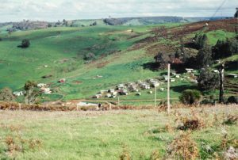

© 2021 Wilson Leon © 2021 International Urantia Association (IUA)

## Interview with Isabel Reinoso Manrique, President of Urantia Association Colombia 

<figure id="Figure_1" class="image urantiapedia image-style-align-left">

</figure>

**Isabel, what new project are you considering for this time of “pandemic?”** 

Because of the obligatory lock-down, we set out to organize virtual study groups. I learned a lot of new technology with great results. Originally, I had a single study group and now I have seven virtual study groups during the week, and every Friday at 7:00pm I give an introductory talk on _The Urantia Book_ for new readers interested in the book. 

Now, considering that our reality has changed forever, several Urantia Book reader friends feel we need to develop “transition communities” and correct the mistakes we made when we first created the ecovillages.\* 

These “transition communities” that we are creating represent a middle ground that allows us, on the one hand, to take advantage of all that Mother Nature can offer, such as healthy eating and an outdoor life, yet on the other hand offers all the advantages of technology and progress, as long as it does not adversely affect the well-being of the planet, its peoples, and societies. 

We see these “transition communities” as independent nuclei offering self-sufficiency with food and energy (alternative sources for electricity generation) as well as spiritual growth for all who are interested in adopting healthier habits, offering an attainable model for those who are yearning for a good life. It’s not intended to lock us up in the countryside, isolated from society but instead to allow us to live the teachings of _The_ _Urantia_ _Book_ in our daily lives and to influence others. 

**Isabel, since you mention it, what does this “transition communities’ project have to do with the teachings of _The Urantia Book_?** 

Perhaps we are trying to adopt the model of life based on Dalamatia and Eden, and the great gift that _The_ _Urantia_ _Book_ gives us through its account of life on a culturally, nationally, and spiritually developed  neighboring planet. This narrative shows us what the future might be like on our planet if anyone comes up with a way of making it a reality. 

What we are doing as this “group of dreamers”–because that is what we are–is to first try to change ourselves internally, because if we do not live the teachings of _The Urantia Book_, if the fruits of the spirit are not expressed in us, and if we do not manage to abandon our tendency towards procrastinating ways and vices, then we will not build anything—we will just keep on living the same way we always have. 

What we are all focused on is the internalization of the teachings of _The Urantia Book_, looking inside ourselves and studying and correcting our behavior in our daily routine. What does this mean? That you must, in your daily life, in every detail of your life, seek perfection. I think that is what the Father told us, “Be you perfect, even as I am perfect” [[UB 1:0.3](/en/The_Urantia_Book/1#p0_3)]. 

By giving us so many opportunities, so many stages of life, from this perspective of spiritualization of everyday life, we will, step by step, achieve circles of perfection. But it’s no use reading and rereading the book for years, if you don’t transform, if you don’t change. If you do not take the sincere and real decision to be a righteous person who seeks perfection in all your deeds, including thought, word, feelings, emotions, and actions, then nothing will ever happen. 

That’s why all the affairs of the household should be dealt with intelligently. We must always seek to do our best—seek perfection in every detail. We should not repeat the same habit every day in the same way, with the same mistakes, perhaps copying the ways of our parents or those of the people we live with. We must strive for excellence in everything. 

**Isabel, where do you feel this kind of experiential model will take us?** 

<figure id="Figure_2" class="image urantiapedia image-style-align-right">

</figure>

Undoubtedly, these communities and “transition populations” will form the nuclei from which will spring forth, when the time is right, a brand new culture on Urantia. 

We must begin with ourselves in order to set an example and to influence those who live in our immediate surrounds so that they may emulate this model for living and, in that way, establish for all involved a new culture. What are we going to call this new culture? I have no idea. It will be up to my children’s children to name it!  

What is needed is that we try, at least, to contribute to the establishment of a new, more humane, healthier, and more equitable model for all. Every one of us must be free to choose how we wish to live. 

\*Ecovillage definition: _Ecovillages are a manifestation of conscious human innovation and creativity: groups of people living out_ _their_ _principles__, regenerating their environment, and increasing their sense of belonging and purpose as a community._ \[Gen Europe Ecovillage Network\]

 

## References

- Tidings newsletter: https://urantia-association.org/about-tidings-newsletter/
- This issue: https://urantia-association.org/newsletter/tidings-march-2021/
- This article: https://urantia-association.org/spiritualizing-everyday-life