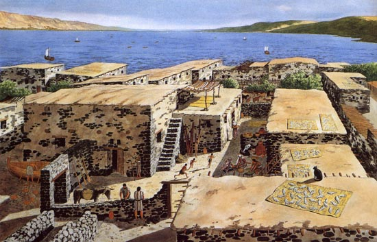
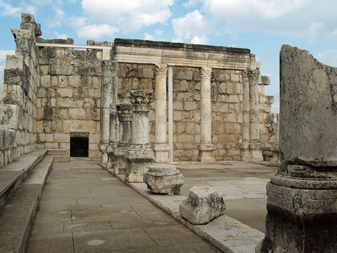
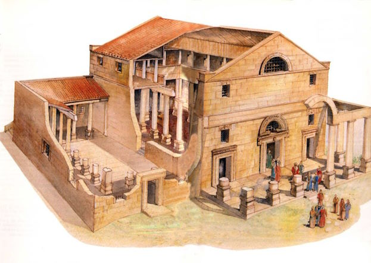

© 2005 Jan Herca (licencia <a href="/es/license">Creative Commons Attribution-ShareAlike 4.0</a>)

Podemos decir sin temor a equivocarnos que Cafarnaúm fue el auténtico hogar de Jesús. Es mencionado en multitud de ocasiones en los evangelios como escenario de interesantes pasajes de su vida. Nazaret, por supuesto, fue el lugar de su niñez y adolescencia. Pero, si nos ceñimos a los evangelios, el evangelista Mateo lo dice claro: en un determinado momento Jesús decidió abandonar Nazaret para irse a vivir a Cafarnaúm ([Mt 4:13](/es/Bible/Matthew/4#v13)). A partir de ese momento, pasó a considerarla como su propia ciudad ([Mt 9:1](/es/Bible/Matthew/9#v1)).

Pero, ¿cómo fue esta población en la época de Jesús?

Por suerte, conocemos el exacto emplazamiento, y no porque esté poblado, sino porque unas estupendas ruinas han dejado patentes las huellas de la historia.

Para mi resumen voy a utilizar dos fuentes (ver [Referencias](#referencias)). De una parte, la información de la página web del Studium Biblicum Franciscanum , los encargados de las excavaciones que se están efectuando en el emplazamiento. De otra parte, las opiniones vertidas en el recomendable libro _Jesús desenterrado_, por dos buenos expertos en arqueología y exégesis evangélica como son John D. Crossan y Jonathan L. Reed. Estos autores elaboran una lista de los diez hallazgos arqueológicos y exegéticos más importantes de los últimos años, y entre ellos sitúan el descubrimiento en Cafarnaúm de una supuesta «casa del apóstol Pedro».

En términos generales, y esto es lo importante, las dos fuentes describen la Cafarnaúm de tiempos de Jesús, al hilo de los hallazgos arqueológicos encontrados, como una pequeña aldehuela de pescadores con no más de mil habitantes.

Y esta descripción parece bastante adecuada si examinamos la notoria ausencia de restos que delaten un núcleo urbano importante.

## El emplazamiento

La Cafarnaúm de tiempos de Jesús se encontraba situada en un lugar estratégico y privilegiado. En la orilla noroeste del Kinneret, el mar de Galilea, a unos 210 m bajo el nivel del mar Mediterráneo. Distaba 16 km de Tiberíades (Tiberias), 3 km de Tabgha y 5 km del punto en que el río Jordán vierte sus aguas al lago.

Las ruinas se extienden unos 200 a 300 metros en el sentido longitudinal de la costa, y no más de 110 metros hacia el interior desde la playa. En total la superficie no superaría los 60.000 metros cuadrados.

Ha estado deshabitada durante mil años, aunque algunos beduinos que la ocuparon construyendo rústicas barracas la llamaron durante este tiempo Talhum.

La via Maris, o camino del mar, que los romanos convirtieron en una de las calzadas del imperio, y que unía Damasco con la costa mediterránea y el sur, pasaba a unos 100 m al noreste de los restos de la actual sinagoga. Un miliario encontrado, de época posterior, en tiempos del emperador Adriano, atestigua la existencia de la vía y su importancia romana.

<figure id="Figure_1" class="image urantiapedia">

<figcaption><em>Ruinas de Cafarnaúm con su sinagoga al fondo. </em> <a href="http://es.wikipedia.org/wiki/Archivo:Kafar1.jpg">Wikipedia</a></figcaption>
</figure>

El lugar era especialmente propicio para la pesca. Cafarnaúm estaba situada en un litoral con abundancia de peces, que se extendía hasta Tabgha. Se ha encontrado también una gran abundancia de vajillas y mobiliario de piedra, lo que indica la existencia de una industria pétrea típica. También restos atestiguan la existencia de una industria de producción de vasijas de vidrio, así como de aceite (se han desenterrado prensas para las olivas). Otra de las ocupaciones lógicas era la agricultura.

## Edificios públicos

En cuanto a los edificios, no se han encontrado restos grecorrománicos similares a los de otras poblaciones judías más romanizadas. No se han hallado restos de muralla, ni de puertas de acceso a la ciudad, ni ningún tipo de edificación defensiva. Tampoco estructuras cívicas como teatros, anfiteatros, hipódromos, termas o letrinas. Las termas encontradas a cierta distancia del núcleo central de población datan del siglo II de nuestra era, cuando seguramente se estableció en Cafarnaúm un contingente de tropas romanas más significativo que el que debió existir en época de Jesús. Tampoco hay rastro de basílicas, altares, templos, estatuas, y ágoras o mercados, ni de inscripciones públicas.

Los dos únicos edificios notorios en las ruinas son una sinagoga imponente y muy bien conservada, y los restos de una antigua iglesia octogonal. Pero ambos corresponden al período bizantino. En tiempos de Jesús, todo lo más, debió de existir una sinagoga de dimensiones más modestas que la que se puede contemplar en la actualidad, situada en el mismo lugar. Volveremos sobre el asunto de la sinagoga más adelante.

## Las calles

Según Reed y Crossan, el trazado de las calles no sigue el clásico cardo máximo y decumano de las poblaciones romanizadas. Pero si se consulta la página web de los franciscanos, se dice todo lo contrario. En mi opinión, los arqueólogos franciscanos utilizan términos aplicables a ciudades de cuño romano un poco a la ligera para explicar sus hallazgos de Cafarnaúm, mencionando la existencia de un cardo, un decumano, insulae, etc. Y aunque puede que hubiera varias calles transversales de cierta importancia, la disposición de las arterias no obedece a un orden establecido como ocurría en las ciudades romanas cuadriculadas y que dio origen a la denominación cardo-decumano. Tampoco hay pavimentos de piedra ni tuberías de agua corriente ni cloacas de aguas residuales en las calles, como las encontramos en otras ciudades de cuño romano.

<figure id="Figure_2" class="image urantiapedia">

<figcaption><em>Vivienda del primer siglo en Cafarnaúm. </em>  © John Dominic Crossan and Jonathan L. Reed, <em>Excavating Jesus</em>, 2001.</figcaption>
</figure>

## Las viviendas

Las viviendas siguen una disposición caótica en torno a grandes espacios centrales o patios interiores, con estrechas callejuelas y pasadizos reptando tortuosas entre medias. En las casas no se encuentran restos de atrios y _triclinium_ o comedores de respeto. Las jambas de las puertas se muestran poco sólidas y seguras. En las estancias no se han encontrado ánforas de vino importado ni _unguetaria_, pequeños contenedores de aceite y perfumes de la gente rica, ni lamparitas de aceite con rica ornamentación. 

Por el contrario, los hallazgos encontrados hablan de una aldea rústica, pequeña, de gentes humildes dedicadas a la pesca. Aunque los franciscanos han hallado ciertas unidades domésticas a las que han denominado insulae, no se parecen a las viviendas romanas clásicas, con planificación reticulada. Más bien estas unidades son una serie de estancias amontonadas en torno a un único patio cerrado, pertenecientes a una sola familia. En algunas zonas las callejuelas que quedaban entre estas edificaciones se ensanchaban formando pequeñas plazoletas, probablemente lugares destinados al remiendo de redes o a disponer de rediles para cabras u ovejas.

Así lo indican Reed y Crossan:

> Las casas de Cafarnaúm son como las que encontramos en otras aldeas judías de la Galilea oriental y de la zona sur del Golán, donde los materiales de construcción habituales eran el basalto oscuro de la región, algunas vigas retorcidas de madera, la paja, las cañas y el barro. [...]

> La calidad de las construcciones era baja, [...]. Las paredes se levantaban sobre unos cimientos de cantos rodados de naturaleza basáltica; las hiladas inferiores que se han conservado estaban formadas por dos filas de piedras sin labrar mezcladas con cantos de menor tamaño, barro y arcilla rellenando los intersticios; y en vez de estuco o pinturas al fresco, la superficie de las paredes estaba recubierta de una capa de barro o de estiércol mezclado con paja, destinada a cumplir una función más aislante que estética.

El pasaje de la curación del paralítico ([Mc 2:4](/es/Bible/Mark/2#v4), [Lc 5:19](/es/Bible/Luke/5#v19)) evidencia un tipo de techumbre en los edificios, como muy bien apuntan los autores de _Jesús desenterrado_, de poca consistencia. «Unas vigas de madera sustentaban un espeso lecho de juncos que protegía los leños de la humedad, y todo ello se cubría con barro apisonado para obtener un mayor aislamiento». Estas sencillas cubiertas eran normalmente accesibles mediante escaleras de piedra o de peldaños de madera acopladas a una pared interior. Servían como lugar de juegos para los niños, como secadero de frutos, cosechas y pescados, o bien como dormitorio al aire libre en verano. Esto aclara perfectamente el pasaje en el que los amigos del paralítico le hacen descender a la estancia por medio de un agujero en el techo. No debía resultar difícil destapar parte de la urdimbre y hacer un boquete.

La vivienda, por tanto, se componía de un gran patio central al que desembocaban varias habitaciones. Vivían familias completas, con los suegros y los padres inclusive (véase por ejemplo la curación de la suegra de Pedro en [Mc 1:29](/es/Bible/Mark/1#v29)). Este patio hacía durante los largos meses estivales de sala de estar, comedor y cocina, así como de taller, garage y almacén. La cocina se componía de un sencillo horno de barro y una piedra para moler el grano y formar la harina para el pan. Se han desenterrado patios con aperos agrícolas, como grandes muelas y prensas de aceite movidas por mulas o bueyes. En invierno toda la familia dormía en el interior de las habitaciones, normalmente en el suelo, sobre sencillas esteras, o todo lo más en literas plegables.

Como mobiliario los arqueólogos han desenterrado numerosas vasijas de piedra, pero no muy grandes: sencillas jarritas, tazas o cuencos hechos a mano o fabricados con ayuda de un pequeño torno. Las lámparas eran sencillas, carentes de decoración, o todo lo más con sencillos motivos florales. La cerámica encontrada, al parecer, procedía de la aldea de Kefar Hananya, en la Alta Galilea, y constaba de cazuelas, pucheros, cántaras para el agua y jarras de diferentes tipos. No eran muy frecuentes objetos más refinados como platos, fuentes y tazas.

## La sinagoga

Actualmente, en las ruinas visibles, pueden admirarse los restos de una hermosa sinagoga judía, probablemente los restos mejor conservados de un edificio de este tipo en todo el territorio judío. Sin embargo, el edificio data del siglo V. Curiosamente, descansa muy cerca de donde se han encontrado los restos de la iglesia octogonal de época bizantina, lo cual da a entender que quizá Cafarnaúm, en tiempos más recientes, fue escenario de una creciente rivalidad entre el lugar de culto judío y el cristiano.

Ésta, evidentemente, no es la sinagoga que conoció Jesús. Pero, ¿podría estar construida sobre los cimientos de la original que sí conoció el Maestro? Así lo afirman los arqueólogos franciscanos que han examinado la base del edificio, aunque esta opinión no es compartida por Reed.

Las sinagogas del siglo I no solían ser edificios especiales. En muchos yacimientos se ha tenido que presuponer como sinagogas algunas viviendas que eran adaptadas para tal uso. En otros casos sí se realizaba alguna construcción, pero de gran sencillez. Crossan y Reed apuntan muy acertadamente que «sinagoga», en la época de Jesús, no solía designar a un tipo de edificio concreto, sino a la asamblea o lugar de reunión habitual para celebrar los ritos religiosos. Este lugar no tenía porqué ser una construcción sancionada o sacralizada para tal fin.

<figure id="Figure_3" class="image urantiapedia">

<figcaption><em>Sinagoga de Cafarnaúm supuestamente construida sobre la de tiempos de Jesús. </em> <a href="http://es.wikipedia.org/wiki/Capernaum_synagogue_by_David_Shankbone.jpg">Wikipedia</a></figcaption>
</figure>

Según el evangelio de Lucas la sinagoga como tal sí existió en el caso de Cafarnaúm ([Lc 7:1-10](/es/Bible/Luke/7#v1)), pues el evangelista incluso menciona al benefactor que la construyó. Está claro que no está hablando de una vivienda cualquiera o un lugar público, como una plaza. Habla de una construcción concreta. Esto me hace estar en desacuerdo con las sorprendentes interpretaciones de Crossan y Reed en esta cuestión. Para ellos la ausencia de unos restos claros y rotundos de una sinagoga del siglo I implican necesariamente que no hubo tal edificio, a pesar de que la sinagoga es mencionada incluso en otros pasajes de los evangelios ([Mc 1:21](/es/Bible/Mark/1#v21), [Jn 6:59](/es/Bible/John/6#v59)). 

<figure id="Figure_4" class="image urantiapedia">

<figcaption><em>Reconstrucción figurada de la sinagoga.</em></figcaption>
</figure>

## La guarnición romana

Crossan llega a la conclusión de que el pasaje de Lucas en el que se menciona a un «centurión romano» como el benefactor, no es una buena traducción del griego _hekatonarchos_ o del _basilikos_ de [Jn 4:43-54](/es/Bible/John/4#v43). Es decir, que todo el pasaje está mal traducido. El centurión no era centurión, los soldados a su cargo no podían ser romanos, y en modo alguno fue el constructor de una sinagoga. «Durante el reinado de Antipas no hubo nunca oficiales romanos estacionados con carácter permanente en Galilea», afirman los autores mencionados.

Sin embargo, discrepo de estas apreciaciones. Quizá no se trataba de un centurión, pero sí podría ser un cargo de rango inferior, y Lucas lo llama centurión por generalizar. La cuestión es que era un gentil que sentía cierta estima por Cafarnaúm por llevar allí sirviendo durante bastante tiempo, y donó dinero para la construcción de una nueva sinagoga.

LU 147:1 resulta bastante clarificador:

> El día anterior a la partida del grupo apostólico para la fiesta de la Pascua en Jerusalén, Mangus, un centurión, o capitán, de la guardia romana estacionada en Cafarnaúm, fue a ver a los rectores de la sinagoga, [...]. [LU 147:1.1](/es/The_Urantia_Book/147#p1_1)

Aquí se utiliza indistintamente la expresión «centurión» o «capitán». Es decir, que seguramente no se trataba de un comandante de legiones, que era lo que realmente representaba centurión en terminología latina, sino simplemente un jefe de un reducido destacamento romano.

Pero, ¿por qué un destacamento romano en una población tan modesta y de escaso interés como Cafarnaúm? La frase de Crossan es cierta: no hubo tropas regulares romanas estacionadas en territorio gobernado por Antipas. Tiempo después sí las hubo, cuando mucho cambió la actitud de Roma hacia su provincia de Judea. ¿Entonces?

Una posible explicación para todo esto, y así lo utilizaré en mi libro[^1], es que esta guardia lo que vigilaba en realidad era la calzada o via Maris, que sí era propiedad romana y no judía. Muy probablemente tenían su guarnición junto a la frontera del reino de Antipas con el de Filipo, su hermanastro. Su función, creo yo, fue la de dotar de cierta protección a los publicanos, los funcionarios encargados de exigir un peaje o tributo por el tránsito de mercancías entre ambas fronteras, y el de velar por la seguridad del camino. Pensemos que esta calzada tenía una importancia estratégica: unía capitales romanizadas de aquella época como Damasco y Cesarea Marítima. 

Este papel de protectores de los publicanos podía resultar más cercano al pueblo que el de un destacamento militar al uso, realizando en cierta manera funciones similares a la de los publicanos, que muchos de ellos eran judíos. Mateo, el apóstol, fue precisamente uno de estos publicanos. Esto explica que el «capitán» tuviera una casa en Cafarnaúm («Señor, no te molestes. Yo no soy digno de que entres en mi casa.» [Lc 7:6](/es/Bible/Luke/7#v6)), viviera como uno más de la comunidad, y fuera un personaje querido por los rectores de la sinagoga por sus donaciones para el nuevo edificio.

_El Libro de Urantia_ realiza una mención clara sobre esta guarnición en el documento 129, sección 1:

> Jesús construyó barcas durante todo este año y continuó observando cómo vivían los hombres en la tierra. Iba a visitar con frecuencia la parada de las caravanas, pues la ruta directa de Damasco hacia el sur pasaba por Cafarnaúm. Cafarnaúm era un importante puesto militar romano, y el oficial que mandaba la guarnición era un gentil que creía en Yavé, «un hombre piadoso», como los judíos solían designar a estos prosélitos. Este oficial pertenecía a una rica familia romana, y se había echado la obligación de construir una hermosa sinagoga en Cafarnaúm, que había donado a los judíos poco antes de que Jesús viniera a vivir con Zebedeo. Jesús dirigió los oficios en esta nueva sinagoga más de la mitad de las veces de ese año, y algunos de los viajeros de las caravanas que asistieron por casualidad, le recordaban como el carpintero de Nazaret. [LU 129:1.7](/es/The_Urantia_Book/129#p1_7)

Si era un «importante puesto militar romano», ¿cómo es que no se han encontrado restos de fortificaciones o campamentos romanos de la época de Jesús? Sí se han encontrado restos de unas termas y de fortificaciones, pero parece que datan siglo II. Sin embargo, ¿qué hacen unas termas junto a una localidad tan poco importante como Cafarnaúm? Existen evidencias de que sí hubo tropas acantonadas permanentemente después de la segunda revuelta judía (132-135 d.C.). En mi opinión estas tropas no hacían más que reforzar a otras que probablemente ya existieron con anterioridad.

Estaremos atentos a futuras campañas arqueólogicas en la zona de Cafarnaúm. Creo que aún queda mucho por descubrir junto al lago. Pero en principio, me decanto por la idea que expresa _El Libro de Urantia_, y que confirma lo sugerido por los evangelios. Debió de existir un campamento militar de cierta entidad en Cafarnaúm, situado probablemente cerca de los actuales restos de termas romanas, y a no mucha distancia de la casa de aduanas, vigilando la calzada via Maris.

## La parada de las caravanas

Crossan y Reed no mencionan ni de pasada la posibilidad de una parada de caravanas en Cafarnaúm, aun cuando está constatado que una de las calzadas romanas más habituales de los viajeros, la via Maris, pasaba por allí. Tampoco los excavadores franciscanos de Cafarnaúm incluyen en sus informes datos que evidencien la existencia de alguna edificación destinada a albergar caravanas.

Resulta sorprendente que ninguna de las fuentes tenga en cuenta que la proximidad de la via Maris supondría un lógico trasiego ingente de caravanas con mercancías y viajeros.

La mal llamada via Maris, que en tiempos antiguos se denominó «Camino de los Filisteos», provenía de Mesopotamia, enlazaba con Anatolia y Siria, y descendía hacia Egipto usando dos ramales: uno se dirigía a la costa mediterránea a través de Meggidó, y el otro seguía tierra adentro a través de Dan (Cesarea de Filipo), el mar de Galilea (Cafarnaúm, Magdala y Tiberias) y el valle de Jezreel.

Esto hace bastante plausible la idea de _El Libro de Urantia_ de que hubo un edificio o explanada cercana, probablemente junto a la calzada, que sirviera de punto de parada. Sin embargo, no he podido encontrar ningún dato entre las fuentes consultadas que atestigüe la existencia de esta construcción.

## La casa de aduanas

Otro edificio de singular interés es la casa de aduanas o peaje mencionado en los evangelios ([Mt 9:9](/es/Bible/Matthew/9#v9), [Mc 2:14](/es/Bible/Mark/2#v14), [Lc 5:27](/es/Bible/Luke/5#v27)). Es de suponer que se trataría de un edificio de escasa entidad, por lo que resulta fácil comprender que no se hayan encontrado restos que lo delaten, como un edificio junto a la calzada con un inusual número de monedas bajo el suelo. Este edificio, como ya he indicado, resulta lógico imaginar que tuviera una garita adyacente para albergar a los soldados romanos encargados de proteger el dinero de las recaudaciones.

## Conclusiones

Las excavaciones arqueológicas y el análisis de los expertos están aclarando muy bien cómo pudo ser el ambiente judío en el que se desenvolvió Jesús y cómo pudo ser su vida rutinaria junto al mar de Galilea. Sin embargo, un examen de los planos de las excavaciones permiten contemplar que sólo se ha excavado sistemáticamente un pequeño recinto de la totalidad potencial del yacimiento. Creo que futuras campañas sacarán a la luz nuevos interesantes hallazgos.

## Enlaces externos

* Artículo original: https://buscandoajesus.wordpress.com/articulos/como-era-cafarnaum/

## Referencias

- John D. Crossan y Jonathan L. Reed, _Jesús desenterrado_, Editorial Crítica, 2001.

- Web de los santuarios custodiados por el Studium Biblicum Franciscanum: https://www.custodia.org/en/sanctuaries, que incluye Cafarnaúm

- http://198.62.75.1/www1/ofm/sites/TScpmain.html, yacimientos arqueológicos de Cafarnaúm. (El enlace original está roto pero se puede acceder a una copia en [Internet Archive](https://web.archive.org/web/20120118210609/http://198.62.75.1/www1/ofm/sites/TScpmenu.html).)

- http://en.wikipedia.org/wiki/Via_Maris, la via Maris.

## Notas

[^1]: Este libro es la novela [«Jesús de Nazaret»](/es/book/Jan_Herca/Jesus_of_Nazareth), una biografía sobre el Maestro basada en _El Libro de Urantia_ que está en preparación por el autor.