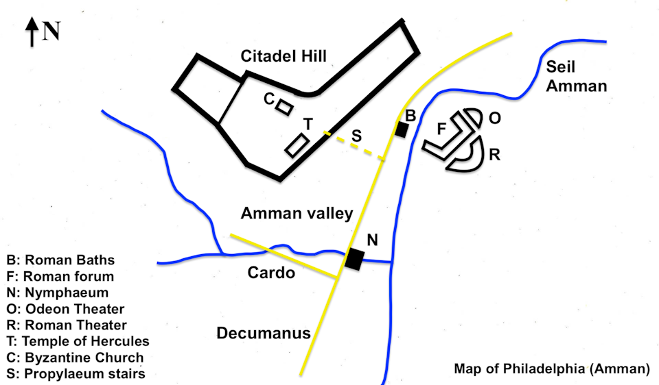

© 2009 Jan Herca (licencia <a href="/es/license">Creative Commons Attribution-ShareAlike 4.0</a>)

<figure class="table chapter-navigator">
  <table>
    <tbody>
      <tr>
        <td></td>
        <td>
        <a href="/es/index/articles_jan_herca">
          Artículos de Jan Herca — Índice
        </a>
        </td>
        <td></td>
      </tr>
    </tbody>
  </table>
</figure>

La Decápolis la componían un conjunto de unas cuantas ciudades (como de unas diez, de ahí su nombre) originadas durante la influencia helénica del siglo II a.C. No era propiamente un territorio de Palestina, como Judea y Galilea, sino que la zona que comprendía era aproximada y no tenía una demarcación territorial definida.

La mayoría de las ciudades, como hemos dicho, se constituyeron cuando los descendientes de los generales de Alejandro, lágidas de Egipto y seléucidas de Siria, conquistaron Palestina. Comprendía estas diez poblaciones: Escitópolis, Pella, Gerasa, Filadelfia, Hipos, Gadara, Abila, Dium, Rafaná y Damasco. Las más notables eran Gerasa, Pella, Hipos, Gadara, Filadelfia y, más al norte, Damasco.

Todas se hallaban en la transjordania, excepto Escitópolis, que era la única en el lado oeste del Jordán. Comprendían una zona una tanto indefinida, como hemos dicho, rodeando por el norte y el este a Perea.

## Historia

<figure id="Figure_1" class="image urantiapedia image-style-align-right">

<figcaption><em>Mapa de la Decápolis. </em><a href="https://en.wikipedia.org/wiki/File:The_Decapolis_Map.png">Wikipedia</a></figcaption>
</figure>

Pompeyo les había concedido la autonomía municipal, siempre bajo el gobierno y la soberanía de Roma. Los macabeos lucharon por devolver estas ciudades al judaísmo, pero su éxito fue relativo. El propio Alejandro Janeo tuvo que rendirse a la evidencia: la Decápolis, a pesar de hallarse incrustada en los territorios de Israel, era un mundo aparte, claramente helenizado, bajo el comercio, la cultura y los dioses griegos. El caso de Pella, por ejemplo, fue dramático. Prefirió que la destruyeran a caer bajo la órbita de Jerusalén. Herodes el Grande, más astuto que los macabeos, llegó a un pacto con la Decápolis, beneficiándose de su indudable progreso. 

Debe decirse que no eran las únicas ciudades helenizadas del territorio israelita. Con el tiempo, otras ciudades, tales como Tolemaida (la antigua Acca o Acre), Gaza y Cesarea (el gran puerto de Israel), también acabaron entrando en el ámbito griego. Siquem fue reconstruida igualmente por Herodes, recibiendo el nombre de Sebaste y alojando una importante población griega. Lo mismo sucedería con Tiberíades y con Séforis, la capital de Galilea. Los romanos, al hacerse con el poder en Palestina tras la muerte de Herodes, contribuyeron al distanciamiento y al recelo entre los judíos y los habitantes de estas ciudades, estableciendo en ellas guarniciones militares, con importantes tropas auxiliares de origen samaritano.

Por consiguiente, el sentimiento generalizado hacia estas ciudades era de prevención. Si se podía evitarlas, no se pasaba ni siquiera cerca de ellas. Para los puritanos habitantes de Judea, el contacto con estas poblaciones extranjeras impurificaba su persona. Sin embargo, estas exageraciones no se cumplían entre las gentes más abiertas del resto de regiones de Palestina.

 

## Filadelfia

Filadelfia estaba situada hacia el sur de la región de la Decápolis. Hoy en día se conoce a esta ciudad como Ammán, la capital de Jordania.

<figure id="Figure_2" class="image urantiapedia image-style-align-center">

<figcaption><em>Mapa de Filadelfia. </em><a href="https://commons.wikimedia.org/wiki/File:Map_of_Philadelphia_(Amman).png">Wikimedia</a></figcaption>
</figure>

 

### Historia

Las excavaciones dentro y fuera de la actual ciudad de Ammán han revelado hallazgos de hasta el 3500 a.C. La ocupación de la ciudad, llamada Rabbath Ammón en el Antiguo Testamento, ha sido continua y los objetos encontrados en una tumba que data de la Edad de Bronce muestran que la antigua ciudad mantenía una gran actividad comercial con Grecia, Siria, Chipre y Mesopotamia.

Las referencias bíblicas son muchas y revelan que, por el año 1200 a.C., Rabbath Ammón era la capital de los ammonitas. Durante el reinado del rey David, éste envió a Joab frente a los ejércitos israelitas para poner sitio a Rabbath, después de haber sido insultado por el rey ammonita Nahash.

Parece que David no fue el más benevolente de los monarcas. Después de tomar Rabbath, quemó vivos a sus habitantes en un horno de ladrillos y, antes de tomar la ciudad, envió a Uriah el hitita “a la vanguardia de la más encarnizada batalla”, donde éste moriría, simplemente porque David se había encaprichado de la esposa de Uriah, Betsabé.

La ciudad siguió prosperando y suministraba armas a David para sus continuas guerras. Su sucesor, Salomón, erigió un templo en Jerusalén al dios ammonita Molech. A partir de este momento, las únicas referencias bíblicas a Rabbath son profecías de su destrucción a manos de los babilonios, que de hecho sí llegaron a tomar la ciudad, pero no la destruyeron.

La historia de Ammán desde entonces (aprox. 585 a.C.) hasta el tiempo de los tolomeos de Egipto no está clara. Ptolomeo Philadelphus (283-246 a.C.) reconstruyó la ciudad durante su reinado y la llamó Filadelfia según su propio nombre. La dinastía tolemaica fue seguida a su vez por los seléucidas y, brevemente, por los nabateos, antes de que Ammán fuera tomada por Herodes cerca del año 30 a.C. y por tanto cayera en manos de los romanos. La ciudad, que incluso antes de la llegada de Herodes había sentido la influencia romana como miembro de la semiautó-noma Decápolis, fue vuelta a planificar por completo y reconstruida en un grandioso estilo típicamente romano.

### Descripción

<figure id="Figure_3" class="image urantiapedia image-style-align-right">

<figcaption><em>Filadelfia. Teatro romano. </em><a href="https://en.wikipedia.org/wiki/File:Roman_theater_of_Amman_01.jpg">Wikimedia</a></figcaption>
</figure>

En tiempos de Jesús tenemos que imaginar a Filadelfia como una ciudad romana en pleno esplendor. La ciudadela se asentaba en una colina que formaba, junto a otras cinco colinas, un círculo. Entre estas colinas, en el sur de la ciudadela, cruzaba un río por el actual wadi Abdoun.

El teatro romano era impresionante. Estaba excavado en la ladera norte de una colina que antiguamente sirvió de necrópolis. En el siglo II d.C. se construyó otro sobre el existente, con cabida para 6000 personas; el de tiempos de Jesús era algo más modesto. Tenía no sólo la función de entretenimiento propias de un teatro, sino también religiosa, porque sobre la fila de asientos superior albergaba una estatua de la diosa Atenea, de especial importancia para la ciudad.

Justo en frente del teatro están los restos de una plaza con columnas que antiguamente formó parte del foro de la ciudad.

<figure id="Figure_4" class="image urantiapedia image-style-align-left">

<figcaption><em>Filadelfia. Columnata suroccidental del foro. </em><a href="https://en.wikipedia.org/wiki/File:Amman_Forum_South-western_colonnade.jpg">Wikimedia</a></figcaption>
</figure>

Al lado este de lo que fue el foro está el Odeón, que aunque está construido en el mismo tiempo que el teatro romano, ya existía en tiempos de Jesús uno en la misma zona. Servía principalmente para representaciones musicales. Los asientos daban al oeste. Estaba protegido por un techo temporal de tela durante las representaciones para proteger a los músicos y el público de la intemperie.

El _Nimphaeum_ estaba al oeste del teatro; tenía un bella fachada decorativa.

Dentro de los muros de la ciudadela, en la colina, había varios palacios (hoy no queda nada de ellos, es una suposición). Al sur se disponía un templo dedicado a Hércules (la actual ruina pertenece a una reconstrucción hecha por Marco Aurelio). En la ladera norte de la ciudadela había una enorme cisterna de agua excavada en la roca.

Es de suponer que debían existir edificios públicos (quizá unos baños), un pequeño castillo o fortaleza con la tropa romana acuartelada, templos dedicados a los dioses griegos, y algún que otro edificio en plena construcción en aquella época.

 

### El Libro de Urantia

Durante el viaje que Jesús hizo con su hermano pequeño Simón, el 17 d.C., con motivo de la Pascua, conocieron en Filadelfia a un mercader de Damasco. Éste quedó tan encantado con los dos hermanos que les invitó a su establecimiento en Jerusalén, donde Jesús pudo admirar el enorme negocio que tenía este hombre por medio mundo ([LU 128:3.2-3](/es/The_Urantia_Book/128#p3_2)).

Fue una de las poblaciones visitadas por los doce, los doce evangelistas y otras evangelistas durante la segunda gira por la Decápolis del 18 de agosto al 16 de septiembre de 29 ([LU 159:0.2](/es/The_Urantia_Book/159#p0_2)). Allí Jesús dio un discurso sobre la naturaleza positiva de su religión ([LU 159:5.1](/es/The_Urantia_Book/159#p5_1)). Fue también una de las poblaciones recorridas en la misisón de Perea, desde el 3 de enero de 30 hasta la muerte de Jesús ([LU 165:0.1](/es/The_Urantia_Book/165#p0_1)).

Jesús y los doce estuvieron en Filadelfia durante su gira del 11 al 20 de febrero del año 30 por el norte de Perea. Allí había establecido Abner su cuartel general con sus asociados. Jesús llegó a Filadelfia el miércoles 22 de febrero seguido de más de 600 seguidores, mientras Pedro y Andrés permanecían en Pella atendiendo a las multitudes. Pasó el jueves y viernes descansando ([LU 167:0.3](/es/The_Urantia_Book/167#p0_3)). El sábado 25, durante el desayuno, Jesús impartió su enseñanza sobre lo que es lícito hacer en sábado a un público formado por fariseos ([Lc 14:1-6](/es/Bible/Luke/14#v1), [LU 167:1](/es/The_Urantia_Book/167#p1)), explicando su postura con la parábola de la gran cena ([Mt 22:1-10](/es/Bible/Matthew/22#v1); [Lc 14:16-24](/es/Bible/Luke/14#v16), [LU 167:2](/es/The_Urantia_Book/167#p2)). Ese mismo día, en los oficios de la sinagoga, Jesús dirigió la lectura y después curó a una mujer de su depresión ([Lc 13:10-17](/es/Bible/Luke/13#v10), [LU 167:3](/es/The_Urantia_Book/167#p3)). Dos días después llegó a Filadelfia un mensaje de Betania: Lázaro estaba muy enfermo.

La décima aparición morontial de Jesús tras su muerte tuvo lugar el martes 11 de abril del año 30, poco después de las ocho, en la sinagoga de Filadelfia, ante un grupo de seguidores que contaba con Abner, Lázaro y unos 150 de sus compañeros que incluía a parte de los evangelistas ([LU 191:4.1](/es/The_Urantia_Book/191#p4_1)).

La sinagoga de Filadelfia nunca había estado sometida a la supervisión del sanedrín de Jerusalén, por lo que allí las enseñanzas de Jesús perduraron más. En el mismo emplazamiento de la antigua sinagoga después hubo una iglesia cristiana en Filadelfia. Abner fue el director de esta iglesia lo mismo que Santiago, el hermano de Jesús, lo fue de la iglesia de Jerusalén. Hubo una permanente enemistad entre ambas iglesias durante mucho tiempo ([LU 166:5.1-3](/es/The_Urantia_Book/166#p5_1)). Abner contó con el apoyo de Lázaro, el amigo de Jesús, de David Zebedeo, y del apóstol Natanael ([LU 168:5.3](/es/The_Urantia_Book/168#p5_3), [LU 171:1.5](/es/The_Urantia_Book/171#p1_5), [LU 193:6.4](/es/The_Urantia_Book/193#p6_4)). La iglesia de Filadelfia es la que permaneció más fiel a las enseñanzas de Jesús de todas las que existieron ([LU 130:2.3](/es/The_Urantia_Book/130#p2_3), [LU 166:5.7](/es/The_Urantia_Book/166#p5_7)). Lamentablemente con el ascenso del Islam esta iglesia y su área de influencia fueron barridas de la faz de la Tierra ([LU 171:1.6](/es/The_Urantia_Book/171#p1_6)) y sus enseñanzas se perdieron.

Estos últimos datos proporcionados por _El Libro de Urantia_ acerca de una incipiente iglesia cristiana en Filadelfia no son corroborados por las evidencias arqueológicas e históricas. No se han encontrado evidencias de cristianismo primitivo en Filadelfia durante los tres primeros siglos d.C. (véase la Wikipedia).

### Referencias

- [Wikipedia](https://en.wikipedia.org/wiki/Philadelphia_(Amman))

## Escitópolis (Betsán)

<figure id="Figure_5" class="image urantiapedia image-style-align-right">

<figcaption><em>Plano de detalle de Escitópilis. </em></figcaption>
</figure>

A los pies de la fortaleza antigua en cuyas murallas se expusieron los restos del rey Saúl, se construyó una de las ciudades helenísticas más bellas de Palestina, llamada Escitópolis (Ciudad de los Escitas) en el siglo I. La ciudad se llamó así sin duda para recordar que la guarnición estaba formada por mercenarios de este pueblo de las estepas. Fue dedicada al dios griego Dioniso, cuya nodriza, Nisa, fue inhumada en la colina según una tradición traída por Plinio el Viejo.

 

### Historia

<figure id="Figure_6" class="image urantiapedia image-style-align-center">

<figcaption><em>Plano general de Escitópilis. </em><a href="https://www.uni-muenster.de/Archaeologie/forschen/projekte/german-israelitelliztabbaproject/index.html">German-Israeli Tell Iẓṭabba Excavation Project</a></figcaption>
</figure>

La Biblia identifica Beit She'an como el lugar donde el rey Saúl y sus tres hijos fueron colgados por los filisteos después de la batalla de Gilboa. A pesar de ello, no se ha encontrado evidencia arqueológica de una ocupación filistea de Beit She'an.

En época griega el sitio de Beit She'an fue reocupado con el nombre griego de Escitópolis. Se sabe poco sobre la ciudad helenística, pero durante el siglo III a.C. se construyó un gran templo en el _tell_, la colina. Se desconoce qué deidad se veneraba allí, pero el templo continuó usándose durante la época romana. Entre el 301 y el 198 a.C. la zona estuvo bajo el control de los Ptolomeos. En el 198 a.C. los seléucidas finalmente conquistaron la región.

En el 63 a.C. Pompeyo incorporó Judea a la República Romana. Beit She'an fue refundada y reconstruida por Gabinio, patrocinado por Pompeyo. El centro de la ciudad se trasladó de la cima del montículo, o tell, a sus laderas. Escitópolis prosperó y se convirtió en la principal ciudad de la Decápolis, la única al oeste del río Jordán.

La ciudad floreció bajo la Pax Romana, como lo demuestra la planificación urbana y la extensa construcción, incluyendo un teatro, el mejor conservado hasta la fecha, aunque del siglo II; un hipódromo; un cardo o calle principal con columnatas; una basílica; y los odeones romanos, típicos de una ciudad romana de urbanismo refinado. El monte Gilboa, a 7 km, proporcionó piedra de basalto para las construccciones y agua que se traía por medio de un acueducto.

Debido a la proximidad del río Harod y de un suficiente régimen de lluvias, Beit Shean era un área muy fértil con centenares de hectáreas de campos de cultivo.

 

<figure id="Figure_7" class="image urantiapedia image-style-align-center">

<figcaption><em>Vista general de las ruinas de Escitópilis. </em><a href="https://www.uni-muenster.de/Archaeologie/forschen/projekte/german-israelitelliztabbaproject/index.html">This week in Palestine</a></figcaption>
</figure>

 

### Descripción

<figure id="Figure_8" class="image urantiapedia image-style-align-right">

<figcaption><em>Modelo del centro de la ciudad de Bet She'an durante el período romano. </em><a href="https://thisweekinpalestine.com/scythopolis-nysa/">Biblical Archaeology Society</a></figcaption>
</figure>

Cuando en época de Jesús un visitante entraba a la ciudad por la puerta nororiental, o puerta de Damasco, y rodeaba por el nahal Amal la colina de la antigua Bet she'an, lo primero que encontraría sería el Ninfeo, la fuente monumental, una gran fuente decorativa con esculturas y nichos, alimentada por el acueducto. Era un punto de encuentro y refresco, además de un símbolo del poder urbano.

El viajero ingresaría entonces al cardo de la ciudad, con su majestuosa columnata a ambos lados y sus pórticos, donde se dispondrían muchos comerciantes con sus puestos. Avanzando, el visitante pasaría por la zona de la Basílica romana, un gran edificio administrativo y comercial. Al costado, el Ágora bizantina (ya existente en época romana temprana) funcionaba como centro comercial y social. Del lado este aparecería una gran plaza pública rodeada de pórticos. Entre ellos destacaba el Portico romano (luego conocido como Salón de Silvano), con columnas y techumbre que daban sombra a las tiendas o salas.

Ya en la parte más meridional, el visitante se encontraría con el imponente Teatro romano, cuya fachada daba hacia el cardo a través del Porticus del Teatro, una galería columnada monumental que anunciaba el acceso a los espectáculos. Todo este paseo se desarrollaba entre columnas corintias, pavimentos de piedra, estatuas, fuentes, y edificios revestidos con mármol o estuco. La calle estaría animada por comerciantes, peregrinos, locales y visitantes de toda la Decápolis. En definitiva, una populosa y vibrante ciudad.

 

<figure id="Figure_9" class="image urantiapedia image-style-align-center">

<figcaption><em>Una ilustración del altar de César y el camino de las ninfas, con el Ninfeo a la derecha. </em><a href="https://www.uni-muenster.de/Archaeologie/forschen/projekte/german-israelitelliztabbaproject/index.html">This week in Palestine</a></figcaption>
</figure>

 

### El Libro de Urantia

Cuando Jesús contaba con 11 años acompañó a su padre a Escitópolis por temas de negocios. Jesús se maravilló ante la belleza de la ciudad, sobre todo el teatro y el templo pagano. Expresó gran interés por los juegos atléticos que se celebraban en ese momento en el anfiteatro, lo que causó gran consternación en José y un serio enfado con su hijo, algo que dejó un recuerdo permanente en el joven Jesús ([LU 124:3.6-8](/es/The_Urantia_Book/124#p3_6)).

Jesús volvió a ver la ciudad, pero ya de lejos, el año 7 d.C., cuando viajó por primera vez con sus padres a Jerusalén ([LU 124:6.4](/es/The_Urantia_Book/124#p6_4)).

Fue uno de los sitios visitados por Jesús, los doce de Jesús y los doce de Juan durante la primera gira de predicación por la Decápolis, entre noviembre y diciembre de 27 ([LU 144:7.1](/es/The_Urantia_Book/144#p7_1)).

También fue visitada durante la segunda gira de predicación pública por Galilea, del domingo 3 de octubre al 30 de diciembre del 28 d.C. ([LU 149:0.1](/es/The_Urantia_Book/149#p0_1)).

Por último, fue una de las poblaciones visitadas por los doce, los doce evangelistas y otras evangelistas durante la segunda gira por la Decápolis del 18 de agosto al 16 de septiembre de 29 ([LU 159:0.2](/es/The_Urantia_Book/159#p0_2)).

### Referencias

- [Wikipedia](https://en.wikipedia.org/wiki/Beit_She%27an)
- [This week in Palestine](https://thisweekinpalestine.com/scythopolis-nysa/)
- [Biblical Archaeology Society](https://www.biblicalarchaeology.org/daily/bas-onsite/onsite-beth-shean/)
- [German-Israeli Tell Iẓṭabba Excavation Project](https://www.uni-muenster.de/Archaeologie/forschen/projekte/german-israelitelliztabbaproject/index.html)

## Pella

<figure id="Figure_10" class="image urantiapedia image-style-align-right">

<figcaption><em>Pella. Mapa con curvas de nivel. </em><a href="https://en.wikipedia.org/wiki/File:Pella_Contour_Plan.jpg">Wikipedia</a></figcaption>
</figure>

Pella (de nombre griego), fue una antigua ciudad de la Decápolis situada al noroeste. Está ubicada cerca de una rica fuente de agua en las colinas orientales del Jordán, cerca de una población actual llamada Tabaqat Fahl (nombre árabe). Las ruinas actuales dejan muy poco entrever la próspera ciudad que fue en época romana.

 

### Historia

Aunque el lugar estuvo habitado desde tan temprano como el año 5000 a.C. y los textos egipcios hacen varias referencias a ella en el segundo milenio a.C., fue durante el período grecorromano que Pella floreció. El nombre original de la ciudad, Pehel, parece que fue cambiado por el del lugar de nacimiento de Alejandro Magno. Pella siguió el destino de muchas otras ciudades de la zona, que pasaron a ser sucesivamente controladas por los tolomeos, los seléucidas y los judíos, que destruyeron Pella en gran parte en el año 83 a.C. porque sus habitantes no mostraban tendencia a adoptar las costumbres de sus conquistadores. Durante algún tiempo recibió los nombres de Berenike y Philippeia, seguramente en honor de sendas ilustres protectoras, pero pronto volvió a su nombre original de Pella.

Pella fue una de las importantes ciudades de la Decápolis. Durante el siglo I d.C. fue un lugar floreciente que contaba con una buena población cosmopolita de gentiles y judíos. Fue uno de los once distritos administrativos (o toparquías) en la Judea romana. Durante el estallido de la Primera Guerra Judeo-Romana (66-74 d.C.), cuando los habitantes sirios de Cesarea asesinaron a sus ciudadanos judíos, hubo un levantamiento judío general contra las aldeas sirias vecinas, buscando venganza, y Pella fue saqueada y destruida.

En lo que se conoce como «huida a Pella», algo antes de la destrucción romana de Jerusalén en el 70 d.C., una tradición sostiene que un grupo de judeocristianos nazarea se refugió en Pella, convirtiendo a esta ciudad en un centro cristiano. Según Epifanio, Jesús había aconsejado a los discípulos abandonar Jerusalén antes de que fuera asediada. _El Libro de Urantia_ nos muestra en un pasaje que esto ocurrió efectivamente así ([LU 176:1.4-5](/es/The_Urantia_Book/176#p1_4)): «...todo el grupo de creyentes y discípulos huyó de Jerusalén en cuanto aparecieron las tropas romanas, encontrando un refugio seguro al norte de Pella». Y además nos menciona a uno de esos judeocristianos que encontró refugio en allí ([LU 121:8.7](/es/The_Urantia_Book/121#p8_7)): «Isador [un discípulo del apóstol Mateo] huyó de Jerusalén en el año 70, después del bloqueo de la ciudad por los ejércitos de Tito, y se llevó a Pella una copia de las notas de Mateo. En el año 71, mientras vivía en Pella, Isador escribió el evangelio según Mateo. También poseía las cuatro primeras quintas partes del relato de Marcos.»

### Descripción

<figure id="Figure_11" class="image urantiapedia image-style-align-right">

<figcaption><em>Pella. Basílica bizantina del siglo V, construida usando materiales de edificios previos. </em><a href="https://pbase.com/dosseman_jordan../../../image/151312756">PBase</a></figcaption>
</figure>

La ciudad estuvo amurallada desde antiguo, con un montículo principal en torno al cual se disponía la ciudad antigua. La zona más moderna se había extendido sobre un wadi (llamado hoy Al-Jirm).

Disponía de un teatro u Odeón en este wadi, un Nimpheum romano o baños, y en definitiva, de los típicos edificios públicos de los funcionarios romanos que en ella vivían.

La proximidad del Jordán hacían de esta ciudad un centro vital en la ruta del camino judío por el Jordán. Los cultivos por regadío hacían de la ciudad un lugar de gran riqueza.

 

### El Libro de Urantia

Jesús y su hermano Simón pasaron cerca de Pella en su viaje a Jerusalén con motivo de la Pascua, el 17 d.C.

Cuando Juan el Bautista llegó al vado del Jordán delante de Pella, en enero de 26, eso marcó el momento en que Jesús se decidió a iniciar su actividad pública, dejando definitivamente su trabajo como carpintero y constructor de barcas ([LU 134:9.8](/es/The_Urantia_Book/134#p9_8)). El domingo 13 de enero Jesús se presentó en el vado ante su primo, solicitando ser bautizado ([LU 135:8.3](/es/The_Urantia_Book/135#p8_3)). Tras el bautismo Jesús se retiró a las colinas situadas al este de Pella ([LU 136:4.14](/es/The_Urantia_Book/136#p4_14)). Regresó a Pella el sábado 23 de febrero de 26, donde se reencontró con Juan y sus discípulos y atendió a un muchacho que se había lastimado. ([LU 137:0.1](/es/The_Urantia_Book/137#p0_1))

Jesús y los doce pasaron cerca de Pella en su viaje a Jerusalén del 27, para celebrar la Pascua ([LU 141:1.2](/es/The_Urantia_Book/141#p1_2)). Después de la primera gira de predicación por la Decápolis, entre noviembre y diciembre de 27, Jesús estabelció su cuartel general en Pella ([LU 144:8.1](/es/The_Urantia_Book/144#p8_1)). Allí recibieron la noticia de la muerte de Juan Bautista. 

Tras enviar en misión a los 70 evangelistas, Jesús volvió a situar su cuartel general en Pella el 6 de diciembre de 29 ([LU 163:5.1](/es/The_Urantia_Book/163#p5_1), [LU 163:6.1](/es/The_Urantia_Book/163#p6_1)). Durante la misisón de Perea, desde el 3 de enero de 30 hasta la muerte de Jesús, Pella fue el cento de operaciones donde se recibía a las multitudes, donde enseñaba Jesús si estaba presente o si no, una pareja de apóstoles ([LU 165:1](/es/The_Urantia_Book/165#p1)). Durante ese tiempo, mientras los discípulos llevaban a cabo su misión por Perea, Jesús pronunció muchas notables enseñanzas en Pella, como el sermón del Buen Pastor ([LU 165:2](/es/The_Urantia_Book/165#p2)), el sermón sobre no tener miedo ([LU 165:3](/es/The_Urantia_Book/165#p3)), el sermón sobre la codicia y la división de las herencias ([LU 165:4](/es/The_Urantia_Book/165#p4)), sobre la riqueza ([LU 165:5](/es/The_Urantia_Book/165#p5)) y otros ([LU 165:6](/es/The_Urantia_Book/165#p6)). El campamento de Pella fue definitivamente levantado el 13 de marzo de 30 ([LU 171:1.1](/es/The_Urantia_Book/171#p1_1)).

### Referencias

- [Wikipedia](https://en.wikipedia.org/wiki/Pella,_Jordan)
- [wikipedia, «Huida a Pella»](https://en.wikipedia.org/wiki/Flight_to_Pella)

## Gerasa

<figure id="Figure_12" class="image urantiapedia image-style-align-right">

<figcaption><em>Mapa de la zona central de Gerasa. </em><a href="http://www.art-and-archaeology.com/jordan/jerash/jerash.html">Art and Archaeology</a></figcaption>
</figure>

La ciudad es un prodigio de conservación por la calidad de las ruinas que aún preserva. Se encuentra ubicada en las colinas de Gilead. Hoy se llama Jerash.

Esta ciudad moderna se dispone en la orilla oriental de un pequeño afluente del río Zarqa, mientras que la antigua ciudad estaba en la orilla occidental.

Se calcula que en su momento de esplendor Gerasa pudo albergar una población de unos 15000 habitantes (lo cual da una buena idea de su prosperidad para la época, y del tamaño que podían alcanzar otras poblaciones similares).

Aunque no estaba en ninguna de las rutas caravaneras, sus habitantes prosperaron gracias a la buena tierra que la rodea, idónea para producir cereales.

La antigua ciudad que hoy se conserva en el lado occidental era el centro administrativo, cívico y comercial de Gerasa, y la mayoría de sus habitantes residían en el lado oriental del wadi Jerash.

 

<figure id="Figure_13" class="image urantiapedia image-style-align-center">

<figcaption><em>Mapa de Gerasa. </em><a href="https://www.cambridge.org/core/journals/antiquity/article/mapping-gerasa-a-new-and-open-data-map-of-the-site/5071C6A16B5F92350A3C967617835970#figures">Cambridge University Press</a></figcaption>
</figure>

 

### Historia

Aunque se han encontrado restos que indican que el lugar estaba habitado en tiempos del Neolítico, fue a partir del reinado de Alejandro Magno (332 a.C.) en que la ciudad empezó realmente a destacar.

En el año 63 a.C. el emperador romano Pompeyo conquistó la región y Gerasa pasó a formar parte de la provincia romana de Siria y, poco después, a ser una de las ciudades de la Decápolis. En los dos siglos siguientes se restableció el comercio con los nabateos y la ciudad se enriqueció grandemente. La agricultura local y la extracción de hierro de la zona de Ajlun contribuyeron a su bienestar económico. Se trazó un plan totalmente nuevo en el siglo I d.C. y la característica principal fue una calle central con columnas cruzada por dos calles laterales.

Debemos pues pensar que en la época de Jesús esta ciudad estaba en pleno proceso de cambio y urbanismo. Las actividades de construcción eran, pues, muy importantes.

Algunas ruinas hoy existentes son posteriores a la época de Jesús, como el arco del Triunfo al sur de la ciudad, que erigió Adriano cuando residió en esta ciudad una temporada. Sin embargo, el resto está casi igual que estaba cuando vivía Jesús, a pesar de que algunas de las actuales ruinas descansan sobre edificios levantados previamente y luego engrandecidos en épocas posteriores del Imperio.

### Descripción

Viniendo desde Filadelfia lo primero que aparecería a la vista del viajero sería el hipódromo, el antiguo campo de deportes que solía estar rodeado por asientos para hasta 15000 espectadores. Tenía su entrada en su extremo norte y algunas de las gradas han sido restauradas hoy en día. La arena, de 244 x 50 m, era básicamente para competiciones atléticas y, como su nombre sugiere, para carreras de caballos.

Cerca del hipódromo está la puerta sur. La puerta, originalmente una de las cuatro que había en la muralla de 3500 m de largo, tenía una decoración hecha con hojas de acanto.

Una vez dentro de la puerta, el Templo de Zeus era el edificio más inmediato, a la izquierda. Tenía un tramo de escaleras sostenido por bóvedas que llevaba al interior desde un recinto sagrado más bajo. El templo mismo se continuaba construyendo en tiempos de Jesús. En la parte inferior o _temenos_ había un altar y servía como lugar sagrado para sacrificios. Desde tiempos antiguos este lugar había sido sagrado, conteniendo a lo largo del tiempo distintos templos.

<figure id="Figure_14" class="image urantiapedia image-style-align-right">

<figcaption><em>La Plaza Oval. </em><a href="http://www.art-and-archaeology.com/jordan/jerash/je01a.html">Art and Archaeology</a></figcaption>
</figure>

El Foro es poco corriente debido a su forma oval, y algunos lo atribuyen al deseo de enlazar elegantemente el principal eje norte-sur (_cardo_, la clásica calle principal romana) con el lugar helenístico sagrado ya existente del Templo de Zeus. De hecho, algunos historiadores sostienen que era un foro (mercado) en el sentido estricto de la palabra, sugiriendo que también pudo haber sido un lugar de sacrificio relacionado con el templo. Las columnas jónicas reconstruidas indican que era algo impresionante. El centro estaba pavimentado con piedra caliza y otros bloques de piedra blanda. En el podio del centro había una estatua.

El Teatro Sur, detrás del Templo de Zeus, se construyó en la época de Jesús y tenía cabida para 5000 espectadores. La parte trasera del escenario tenía originalmente dos pisos de altura. Desde la parte superior de las gradas había una envidiable vista de la ciudad.

En el extremo lejano del forum el cardo, o calle con columnas, se extiende por más de 600 m hacia la puerta norte. La calle todavía conserva hoy su pavimento original y pueden verse los surcos dejados por miles de carros a lo largo de los años.

En los dos cruces principales se construyeron _tetrapila_ ornamentales. El Tetrapilon del Sur consistía en cuatro bases, cada una de ellas con una columna que sostenía una estatua. 

La calle transversal (_decumanus_) va hacia el este, bajando hasta un puente sobre el pequeño río y siguiendo hasta los Baños Orientales, y hacia el oeste hasta una puerta en la muralla de la ciudad. A la izquierda, antes de esta calle transversal, estaba el Ágora de la ciudad. Tenía una fuente en su parte central.

A unos cien metros después del cruce se hallaba un templo (olvidado en tiempos de Jesús) dedicado al dios nabateo Dhushara.

Siguiendo el _cardo_ estaba el Nimpheum, la principal fuente ornamental de la ciudad y un templo dedicado a las ninfas. El que había en tiempos de Jesús fue sustituido el siglo siguiente por otro más lujoso. La construcción, normalmente de dos pisos, dejaba bajar el agua en un estanque del que pasaba a unos desagües hacia la calle que había más abajo.

 

<figure id="Figure_15" class="image urantiapedia image-style-align-right">

<figcaption><em>Propileo norte del Templo de Artemisa. Estaba flanqueda por dos magníficas puertas, siendo la norte la de la foto. Fue contruido a mediados del siglo II d.C.</em><a href="http://www.art-and-archaeology.com/jordan/jerash/je11.html">Art and Archaeology</a></figcaption>
</figure>

Siguiendo a la izquierda estaba el edificio más impresionante del lugar, el Templo de Artemisa, dedicado a la diosa patrona de la ciudad. Después de la Gran Puerta del Templo vienen dos tramos de escaleras que conducían al patio donde estaba el templo. Se tuvieron que construir grandes bóvedas al norte y al sur del templo para lograr nivelar el patio. Originalmente el templo estaba rodeado de columnas, pero hoy sólo quedan las dobles filas del frente, ya que las columnas y otro material del que estaba construido el templo fueron reutilizados para edificios posteriores como las iglesias.

Siguiendo de nuevo por la calle principal estaba el segundo cruce importante y el Tetrapilon del Norte. Difería de la del Sur en que consistía en cuatro arcos que sostenían una bóveda.

Los Baños Occidentales estaban bajando desde el tetrapilon del Norte. Había unos en tiempo de Jesús y luego se construyeron encima los que hoy se conservan.

El Teatro del Norte, justo al Oeste del Tetrapilon, era más pequeño que el teatro del Sur. Desde el tetrapilon del Norte sólo hay unos 200 m hasta la puerta Norte.

Justo al oeste y al sur del templo de Artemisa se disponían otros templos dedicados a otros tantos dioses griegos y romanos (recordemos que la población se componía tanto de unos como de los otros).

 

<figure id="Figure_16" class="image urantiapedia image-style-align-center">

<figcaption><em>Gerasa. Calle columnada.</em><a href="https://en.wikipedia.org/wiki/File:Jerash_-_colonnaded_street.JPG">Wikipedia</a></figcaption>
</figure>

 

### El Libro de Urantia

Se nos cuenta que Jesús pasó por esta ciudad en su viaje a Jerusalén cuando llevó a su hermano pequeño Simón para celebrar allí la Pascua ([LU 128:3.2](/es/The_Urantia_Book/128#p3_2)). También estuvo de paso con Juan Zebedeo cuando Jesús marchó por unos días a Jerusalén antes de iniciar su labor pública ([LU 134:9.1](/es/The_Urantia_Book/134#p9_1)).

Es una de las poblaciones visitadas durante la primera gira de predicación en el mar de Galilea, del 23 de junio al 7 de julio de 26, que realizaron los doce en solitario. ([LU 138:9.3](/es/The_Urantia_Book/138#p9_3))

Es una de las poblaciones visitadas durante la primera gira de predicación por la Decápolis, de noviembre a diciembre del 27, realizada por Jesús, sus doce apóstoles y los doce apóstoles de Juan Bautista ([LU 144:7.1](/es/The_Urantia_Book/144#p7_1)). Después de su regreso de Fenicia en agosto de 29 Jesús viajó a Jerusalén y pasó por Gerasa ([LU 152:7.1](/es/The_Urantia_Book/152#p7_1)).

Es una de las poblaciones visitadas durante la segunda gira de predicación por la Decápolis, de agosto a septiembre de 29, realizada por los doce y un grupo de evangelistas sin la continua presencia de Jesús ([LU 159:0.2](/es/The_Urantia_Book/159#p0_2)). Es una de las poblaciones visitadas en la misión de Perea, el último esfuerzo misionero de Jesús en el año 30 ([LU 165:0.1](/es/The_Urantia_Book/165#p0_1)). Allí Jesús pronunció un memorable discurso sobre «cuántos serán salvados» ([LU 166:3](/es/The_Urantia_Book/166#p3)).

### Referencias

- [Wikipedia](https://en.wikipedia.org/wiki/Jerash)
- [Urantiapedia](/es/topic/Gerasa)
- [Art and Archaeology](http://www.art-and-archaeology.com/jordan/jerash/jerash.html)
- [Mapping Gerasa: a new and open data map of the site. Cambridge University Press](https://www.cambridge.org/core/journals/antiquity/article/mapping-gerasa-a-new-and-open-data-map-of-the-site/5071C6A16B5F92350A3C967617835970#figures)

## Hipos (Susita)

<figure id="Figure_17" class="image urantiapedia image-style-align-right">

<figcaption><em>Hipos, foto aérea, vista desde el sudeste.</em><a href="https://www.dighippos.com/sussita/">Hippos Excavations Project</a></figcaption>
</figure>

Hippos o Hipos (del griego «caballo») o también Susita (en arameo y hebreo) es una antigua ciudad, hoy unas ruinas arqueológicas, situada en una colina a 2 km al este del mar de Galilea. Tras formar parte de la Decápolis se transformó en ciudad cristiana hasta que fue abandonada por causa de un terremoto en el 749.

Fue contruida en una colina de cima plana a 350 metros de altitud sobre el nivel del mar de Galilea.

Además de la ciudad fortificada en lo alto del montículo, Hipos tuvo dos puertos en el mar de Galilea y una gran zona circundante bajo su dominio (ver mapa de los territorios de la Decápolis).

 

### Historia

<figure id="Figure_18" class="image urantiapedia image-style-align-left">

<figcaption><em>Territorios circundantes de la Decápolis.</em><a href="https://www.dighippos.com/regional">Hippos Excavations Project</a></figcaption>
</figure>

La ciudad fue fundada a mediados del siglo II a.C. como _Antioquía de Hipos_. Hipos significa caballo en griego y era un nombre común entre los monarcas seléucidas. En algunas referencias a la ciudad se la identifica por su nombre en arameo, Susita, que también significa caballo.

La evidencia arquológica muestra que Hipos estuvo habitado desde el período Calcolítico Temprano o Medio. El sitio fue rehabilitado en el siglo III a.C. por los Ptolomeos, aunque no se sabe si únicamente como asentamiento militar o como urbe. Durante este tiempo, la región, denominada Celesiria, sirvió como campo de batalla para los generales de Alejandro Magno a la muerte de éste. Más tarde, ya construida como ciudad por los seléucidas, adquiere el nombre de _Antioquía Hippos_. Se construye un templo, un mercado central y otros edificios. La carestía de agua en un lugar tan elevado obligó a la construcción de cisternas.

En el siglo I a.C. el asmoneo Alejandro Janeo se hace con el control de la ciudad y según Flavio Josefo, los habitantes fueron obligados a convertirse al judaísmo.

En el 63 a.C. Pompeyo conquista Celesiria, junto a Judea, y pone fin a la independencia asmonea. Hipos es incorporada a la provincia romana de Siria. Bajo dominio romano Hipos adquiere cierta independencia y logra acuñar sus propias monedas, con la imagen de un caballo inscrita en ellas.

Entregada a Herodes el Grande en el año 27 a.C., fue devuelta a Siria a la muerte de éste en el año 4 a.C. Según Josefo, durante este tiempo Hipos, una ciudad pagana, era el «enemigo declarado» de la nueva ciudad judía al otro lado del lago, Tiberíades. Josefo relata que durante la Primera Guerra Judeo-Romana del 66-70 d.C. los judíos de Hipos sufrieron una masacre.

Tras la revuelta de Bar Kokhba, sofocada por los romanos, la ciudad pasó a formar parte de la provina de Siria Palestina en el 135. A principios del siglo II d.C. Hipos alcanzó su apogeo de prosperidad y crecimiento.

### Descripción

<figure id="Figure_19" class="image urantiapedia image-style-align-center">

<figcaption><em>Plano general de Hipos con las principales zonas de excavación.</em><a href="https://www.dighippos.com/regional">Hippos Excavations Project</a></figcaption>
</figure>

 

La ciudad fue construida a lo largo de un patrón de cuadrícula, centrado alrededor de un _decumanus maximus_ con columnas que corría de este a oeste a través de la ciudad. Estaba atravesado por varias _cardinas_ o calles en dirección norte-sur. En el centro de la ciudad había un amplio foro de forma rectangular pavimentado con losas de basalto. Debajo del foro había un depósito de agua techado con una impresionante bóveda de cañón. Otros monumentos cercanos incluían un _Kalybe_ (un santuario al Emperador) del siglo II o III d.C., un santuario o _témenos_ de época helenísitica, una basílica de finales del siglo I, un odeón, unos baños al sur del foro, y las obligadas murallas. Sin embargo, lo más destacado fue un acueducto, que conducía agua a Hipos desde el arroyo El-Al en los Altos del Golán, de 24 km de largo.

La ciudad tenía dos puertas, una situada en el extremo oriental y otra en el extremo occidental del _decumanus maximus_. Las puertas tenían un pasadizo de 3.15 m de ancho rodeado de dos torres redondas. Las fortificaciones debieron de ser de época romana. A lo largo de la muralla, a intervalos irregulares, se erigieron un pequeño número de torres cuadradas o rectangulares.

El ejemplo más singular de arquitectura militar romana excavado en Hippos es el bastión (batería para proyectiles, catapultas y balistas antiguas). El bastión, una construcción de basalto de 51 x 10 m, se erigió en el borde del acantilado sur, a unos 40 m al sur del foro. Su sólida estructura de muro de basalto, totalmente expuesta, está intersectada por cuatro bóvedas de cámara y dos torres. Las bóvedas de cámara estaban cubiertas con pisos, de los cuales se conservan pocos. El bastión se construyó en el siglo I d.C. y fue parcialmente desmantelado durante el siglo II reutilizándolo para las termas meridionales.

Respecto al puerto en el mar de Galilea, éste fue el segundo puerto más importante de la costa este del lago Tiberíades. La verdad es que las dimensiones y configuración de este muelle no se correspondían en tamaño con el villorio situado junto a la costa. Esta aldea tan sólo hacía las veces de puerto fluvial de Hipos. Una calzada romana ascendía hasta lo alto de la ciudad y entraba por la puerta occidental.

El puerto tenía unas características únicas. El rompeolas principal tenía una longitud de 120 m, con una anchura en su base, de 5 a 7 m. Partía perpendicular a la costa, y a los 15 m cambiaba de dirección, discurriendo paralelo al litoral, con rumbo sur. Este segundo tramo alcanzaba una longitud de 85 m. Súbitamente, el terraplén variaba de orientación, enfilando hacia el oeste. Esta curiosa Z invertida, maltratada sin duda por los vientos del sur, era cerrada por un segundo rompeolas de 40 m, que arrancaba en perpendicular desde la costa. Lo más curioso era que aquel muelle de 20 m de largo se aventuraba hacia el oeste, en aguas relativamente profundas (entre 4 y 5 m). El motivo de tan desproporcionado lugar portuario era que de este modo se usaba para el atraque y las operaciones de descarga sin necesidad de penetrar en el puerto. La explicación de este embarcadero tan notable es que con la adquisición por parte de Pompeyo la ciudad superior, Hipos, y su puerto, se convirtieron en un floreciente emporio, creciendo y transformándose en la segunda entidad urbana de la costa oriental del mar de Galilea.

### El Libro de Urantia

Hipos fue uno de los lugares visitados durante el período de preparación de los doce, la primera gira de predicación en el mar de Galilea, del 23 de junio al 7 de julio de 26, que realizaron los doce en solitario ([LU 138:9.3](/es/The_Urantia_Book/138#p9_3)).

También fue uno de los sitios visitados por Jesús, los doce apóstoles y los 117 evangelistas durante la segunda gira de predicación en Galilea, entre el 3 de octubre de 28 y el 30 de diciembre de 28 ([LU 149:0.1](/es/The_Urantia_Book/149#p0_1)).

Fue una de las poblaciones visitadas por los doce, los doce evangelistas y otras evangelistas durante la segunda gira por la Decápolis del 18 de agosto al 16 de septiembre de 29. Aquí Jesús pronunció un sermón acerca del perdón en respuesta a la pregunta de un discípulo ([LU 159:0.2](/es/The_Urantia_Book/159#p0_2), [LU 159:1.1](/es/The_Urantia_Book/159#p1_1)).

### Referencias

- [Hippos Excavations Project](https://www.dighippos.com/sussita/)
- [Modelo 3D de Hippos](http://hippos.byethost11.com/3d/HipposGen2020/App/index.html?i=1#%2F)
- [Wikipedia](https://en.wikipedia.org/wiki/Hippos_(Golan_Heights))

## Gadara

Situada hacia el norte de la Decápolis, en las cercanías del río Yarmuk, con vistas sobre los altos del Golán y el mar de Galilea al Norte, y el valle del Jordán al sur. Actualmente es la ciudad de Umm Qais.

<figure id="Figure_20" class="image urantiapedia image-style-align-center">

<figcaption><em>Mapa topográfico de Gadara.</em><a href="https://www.researchgate.net/figure/Topographic-map-of-Gadara-Umm-Qais-showing-the-location-of-the-five-aisled-basilica-and_fig2_358283097">Archaeological and Anthropological Sciences Journal</a></figcaption>
</figure>

### Historia

La ciudad fue capturada a los tolomeos por los seléucidas en el año 198 a.C., y los judíos bajo el mando de Hircano la tomaron de ellos en el año 100 a.C. Cuando los romanos (dirigidos por Pompeyo) conquistaron Oriente y se formó la Decápolis, las fortunas de Gadara, tomadas de los judíos en el 63 a.C., se incrementaron rápidamente y se iniciaron las típicas construcciones a gran escala.

Los nabateos controlaban las rutas comerciales al Norte hasta el propio Damasco. Esta interferencia en los intereses de Roma llevó a Marco Antonio a enviar a Herodes el Grande para que los conquistara. El rey nabateo fue finalmente vencido en el 31 a.C. A Herodes le dieron Gadara después de una victoria naval y la gobernó hasta su muerte en el año 4 a.C., para disgusto de los lugareños, que lo habían intentado todo para que perdiera el favor de Roma. A su muerte, la ciudad volvió a ser una semiautonomía como parte de la provincia romana de Siria.

Gadara siguió prosperando durante todo el tiempo posterior, en el siglo I de nuestra era y siguientes. Su importancia queda patente por el hecho de que llegó a convertirse en un obispado, que solo desapareció con la conquista musulmana.

### Descripción

<figure id="Figure_21" class="image urantiapedia image-style-align-center">

<figcaption><em>Ruinas de Gadara.</em><a href="https://universes.art/en/art-destinations/jordan/gadara-umm-qais">Universes in Universe</a></figcaption>
</figure>

 

Las pocas ruinas que nos han llegado nos muestran una típica ciudad romana fortificada, con una calzada romana, una calle columnada (que fue probablemente el centro comercial de la ciudad), y un teatro en la zona oeste. El teatro debía ser colosal, con unas vistas magníficas sobre el mar de Galilea.

El teatro y algunas de las columnas son de basalto negro (así como muchas de las casas modernas de la zona, construidas sin duda con materiales robados de las ruinas). Más al oeste de lo que queda de la calzada romana, hay un mausoleo, luego unos baños a la derecha y, más abajo, otro mausoleo a la izquierda. Unos centenares de metros más nos llevarían a los contornos de lo que antiguamente fue un hipódromo. En 2017, arqueólogos descubrieron un antiguo templo construido en la época helenística, en el siglo III a. C. Se cree que estaba dedicado a Poseidón.

Un acueducto romano del siglo II d. C. suministró agua potable a Gadara a través de un _qanat_ (un acueducto subterráneo) de 170 km de longitud. Su tramo subterráneo más largo, de 94 km de longitud, es el túnel más largo conocido de la antigüedad.

<figure id="Figure_22" class="image urantiapedia image-style-align-center">

<figcaption><em>Trazado del acueducto. Rastros hipotéticos (trazo punteado) y comprobados (trazo sólido) del sistema de acueductos gemelos que abastecía a las ciudades de Adraa (Edrei), Abila y Gadara.</em><a href="http://www.romanaqueducts.info/aquasite/gadara/foto2.html">Roman Aqueducts</a></figcaption>
</figure>

 

### Personajes ilustres

Gadara fue famosa ya desde el siglo III a.C. por su importancia cultural. Varios filósofos, poetas y matemáticos nacieron allí. Gadara fue llamada en su día la «ciudad de los filósofos». Menipo fue un esclavo convertido en filósofo, del siglo III a.C., cuyas obras fueron imitadas por Varrón y Luciano; Meleagro, del siglo I a.C., fue uno de los poetas helenísticos más admirados; Filodemo, también del siglo I a.C., estudió filosofía en Atenas y fue uno de los máximos exponentes del epicureísmo; Filón, del siglo II d.C., fue un matemático que logró calcular con gran precisión el valor de π.

### Hammat Gader

Los baños de Hammat Gader estaban a unos 10 km de Gadara, bajando la colina hacia el río Yarmouk y el Golán. La zona cercana al río y a las fuentes es muy verde, haciendo un fuerte contraste con la empinada y árida meseta del Golán.

Los baños eran famosos en tiempos de los romanos por sus propiedades salutíferas y todavía se utiliza en la actualidad.

### El Libro de Urantia

Tomás Dídimo era pescador de Tariquea pero en otro tiempo fue carpintero y albañil en Gadara ([LU 138:2.5](/es/The_Urantia_Book/138#p2_5)). Gadara fue una de las poblaciones recorridas durante el primer trabajo de los doce, de mediados de agosto de 26 a finales de 26 ([LU 138:9.3](/es/The_Urantia_Book/138#p9_3)).

Fue uno de los sitios visitados por Jesús, los doce de Jesús y los doce de Juan durante la primera gira de predicación por la Decápolis, entre noviembre y diciembre de 27 ([LU 144:7.1](/es/The_Urantia_Book/144#p7_1)).

También fue uno de los sitios visitados por Jesús, los doce de Jesús y los 117 evangelistas durante la segunda gira de predicación en Galilea, entre el 3 de octubre de 28 y el 30 de diciembre de 28 ([LU 149:0.1](/es/The_Urantia_Book/149#p0_1)).

Fue una de las poblaciones visitadas por los doce de Jesús, los doce evangelistas y otras evangelistas durante la segunda gira por la Decápolis del 18 de agosto al 16 de septiembre de 29 ([LU 159:0.2](/es/The_Urantia_Book/159#p0_2)). Fue una de las poblaciones recorridas en la misisón de Perea, desde el 3 de enero de 30 hasta la muerte de Jesús ([LU 165:0.1](/es/The_Urantia_Book/165#p0_1)).

En los evangelios se menciona un suceso, el [exorcismo del endemoniado gadareno](https://en.wikipedia.org/wiki/Exorcism_of_the_Gerasene_demoniac) ([Mt 8:28-34](/es/Bible/Matthew/8#v28); [Mc 5:1-20](/es/Bible/Mark/5#v1); [Lc 8:26-39](/es/Bible/Luke/8#v26)), que es sugerido como sucediendo en Gadara, pero que _El Libro de Urantia_ identifica en realidad con [Jeresa](https://urantiapedia.org/es/topic/Kheresa) (llamada también en español Gergesa), el hogar de los gemelos Alfeo. Tiene mucho más sentido que fuera esta localidad. Ni Gadara ni la otra solución propuesta, Geresa, son poblaciones cercanas a la orilla del mar de Galilea. Véase [Amós, el lunático de Jeresa](https://urantiapedia.org/es/topic/Amos_(Kheresa_lunatic)).

### Referencias

- [Wikipedia](https://en.wikipedia.org/wiki/Gadara)
- [Universe in Universes — Gadara (Umm Qais)](https://universes.art/en/art-destinations/jordan/gadara-umm-qais)
- [Roman Aqueducts](http://www.romanaqueducts.info/aquasite/gadara/index.html)
- [The white marbles and polychrome stones of the five-aisled basilica at Gadara (Umm Qais), Jordan: archaeometric characterization for provenance identification](https://www.researchgate.net/publication/358283097_The_white_marbles_and_polychrome_stones_of_the_five-aisled_basilica_at_Gadara_Umm_Qais_Jordan_archaeometric_characterization_for_provenance_identification)
- [The Easstern City Area of Gadara (Umm Qais): Preliminary results on the Urban and Functional Structures Between the Hellenistic and Byzantine Periods](https://publication.doa.gov.jo/uploads/publications/25/SHAJ_10-369-376.pdf)
- [Heritage Management: Analytical Study of Tourism Impacts on the Archaeological Site of Umm Qais—Jordan](https://www.mdpi.com/2571-9408/4/3/138)

## Damasco

Damasco es hoy la capital de la actual Siria, una ciudad sagrada del Islam, y un importante centro cultural del Levante y el mundo árabe. En tiempos de Jesús la ciudad formaba parte de la Decápolis.

### Historia

Damasco se autoproclama como la más antigua ciudad del mundo habitada en forma continua, a pesar de que su rival del norte, Alepo, le disputa ardientemente este título.

Las tablas jeroglíficas de Egipto hacen referencia a _Dimashqa_ como una de las ciudades conquistadas por los egipcios en el siglo XV a.C., pero excavaciones hechas en el patio de la Mezquita Omeya han dejado al descubierto hallazgos que se remontan al tercer milenio a.C.

Damasco ha sido objeto de luchas en numerosas ocasiones y algunos de sus primeros conquistadores son el Rey David de Israel, los asirios en el 732 a.C., Nabucodonosor (cerca 600 a.C.) y después los persas en el 530 a.C. En el 333 a.C. cayó en manos de Alejandro Magno. La influencia griega declinó cuando los nabateos ocuparon la ciudad en el 85 a.C. Poco después, en el 64 a.C., los romanos obligaron a los nabateos a partir y Siria pasó a ser provincia romana. Fue aquí donde Saulo de Tarso pasó a ser Pablo el Apóstol.

### Descripción

Vamos a hacer un intento de aproximarnos a lo que fue la ciudad en tiempos de Jesús.

<figure id="Figure_23" class="image urantiapedia image-style-align-center">

<figcaption><em>Mapa de Damasco, por J.L. Porter, 1855.</em><a href="https://en.wikipedia.org/wiki/File:1855_Damascus_map_byPorter.png">Wikipedia</a></figcaption>
</figure>

 

**Ciudad vieja**

La mayoría de los atractivos del Damasco de hoy están en la ciudad vieja, rodeada por lo que fue la antigua muralla romana. La muralla ha sido derrumbada y reconstruida numerosas veces en los últimos 2000 años. La que hoy está en pie data del siglo XIII, pero sigue las directrices de la existente en el siglo I.

Diversas puertas abrían el paso a través de la muralla, pero sólo una de las que hoy existen (la Puerta Este) se remonta a tiempos de los romanos.

**Ciudadela**

Se encontraba en la muralla occidental. Está siendo restaurada hoy.

<figure id="Figure_24" class="image urantiapedia image-style-align-right">

<figcaption><em>El templo de Júpiter.</em><a href="https://commons.wikimedia.org/wiki/File:The_Jupiter_temple_in_Damascus.jpg">Wikimedia</a></figcaption>
</figure>

**Templo de Júpiter**

Situado cerca de la Ciudadela, junto a la gran mezquita omeya, en el sector occidental. Se construyó en lo que antiguamente era un templo al dios arameo Hadad (el dios de la tormenta) en el siglo IX a.C. Es una suposición que en tiempo de Jesús existiera aquí un templo a un dios romano, aunque las ruinas del templo actuales responden a un templo del siglo III d.C. Es de suponer que se construyó para engrandecer el ya existente. Hoy el templo es la Mezquita Omeya.

**Calle Recta**

Era el antiguo _decumanus maximus_, la principal calzada romana, que iba de este a oeste. Es famosa por un pasaje de los Hechos de los Apóstoles ([Hch 9:11](/es/Bible/Acts_of_the_Apostles/9#v11)), donde se menciona a un hombre (Judas) a quien Ananías, un discípulo, debía preguntar por Pablo. Es curioso que en vida de Jesús esta casa y calle también debía existir.

 

### El Libro de Urantia

Jesús conoció a un profesor de matemáticas de Damasco, y después de aprender algunas nuevas técnicas aritméticas, dedicó mucho tiempo a las matemáticas durante varios años ([LU 123:6.3](/es/The_Urantia_Book/123#p6_3)).

El año 17 d.C., tras una visita a Jerusalén en la que Jesús llevó a su hermano Simón por la Pascua, conocieron a un mercader de Damasco. Este hombre ofreció trabajo a Jesús en Damasco pero éste rehusó amablemente ([LU 128:3.3](/es/The_Urantia_Book/128#p3_3)). Más tarde, ante la insistencia del mercader, Jesús aceptó pasar unos meses de ese año en Damasco organizando una nueva escuela ([LU 128:4](/es/The_Urantia_Book/128#p4)). Este evento de la vida de Jesús provocó que durante un tiempo se le conociera como el «escriba de Damasco» ([LU 129:3.2](/es/The_Urantia_Book/129#p3_2)).

Jesús pasó por Damasco en su viaje de regreso de Roma con Ganid y Gonod ([LU 130:0.3](/es/The_Urantia_Book/130#p0_3), [LU 133:8](/es/The_Urantia_Book/133#p8)), el año 23 d.C.. A su regreso de Charax, donde Jesús se despidió de Ganid y Gonod, regresó a Damasco ([LU 134:1.1](/es/The_Urantia_Book/134#p1_1)).

Después de su viaje hasta el mar Caspio, Jesús regresó en una caravana que pasó por Damasco ([LU 134:2.5](/es/The_Urantia_Book/134#p2_5)).

El apóstol Pablo experimentó una conversión repentina y espectacular un día memorable en el que iba camino de Damasco ([LU 100:5.3](/es/The_Urantia_Book/100#p5_3)). Aunque _El Libro de Urantia_ no especifica a qué se debió, es llamativo que no dice nada acerca de una aparición o una voz de Jesús ([Hch 9:1-9](/es/Bible/Acts_of_the_Apostles/9#v1)).

<figure id="Figure_25" class="image urantiapedia image-style-align-center">

<figcaption><em>Damasco en tiempos romanos.</em></figcaption>
</figure>

 

### Referencias

- [Wikipedia](https://en.wikipedia.org/wiki/Damascus)
- [Wikipedia, calle Recta](https://en.wikipedia.org/wiki/Straight_Street)
- [Wikipedia, templo de Júpiter](https://en.wikipedia.org/wiki/Temple_of_Jupiter,_Damascus)

## Abila

<figure id="Figure_26" class="image urantiapedia image-style-align-right">

<figcaption><em>Vista del tell septentrional (Tell al-Abila) y la basílica del siglo VI.</em><a href="https://www.jbu.edu/academics/bible/abila/resources/">John Brown University</a></figcaption>
</figure>

Abila, distinguida como «Abila en la Decápolis», y también conocida durante un tiempo como Seleucia y _Abila Viniferos_, fue una ciudad de la Decápolis; el sitio, ahora conocido como Qweilbeh, ocupa dos tell, Tell al-Abila y Khirbet Tell Umm al-Amad.

El nombre de Abila proviene de la palabra semita Abel («prado», en árabe «verdor»). El emplazamiento se encuentra entre verdes campos agrícolas, cerca del actual manantial de Ain Quweilbeh, con olivares y campos de trigo.

 

### Historia

<figure id="Figure_27" class="image urantiapedia image-style-align-left">

<figcaption><em>Vista del tell meridional (Tell Umm al-Amad) y la basílica del siglo VII-VIII.</em><a href="https://www.jbu.edu/academics/bible/abila/resources/">John Brown University</a></figcaption>
</figure>

El sitio estuvo en uso desde el Neolítico hasta los períodos abasí / fatimí y ayubí / mameluco, desde el 4000 a.C. al 1500 d.C. Las excavaciones han sido más intensas desde 1980 aunque mucho permanece sin excavar.

Polibio y Josefo mencionan la captura de la ciudad por el rey seléucida Antíoco III en el 218 a.C. Luego el rey asmoneo Alejandro Janneo conquistó Abila durante sus guerras de expansión. Finalmente, Abila fue tomada por el general romano Pompeyo en el 63 a.C. y se le concedió la independencia. En los períodos romano y bizantino posteriores, Abila alcanzó una posición de importancia regional al formar parte de la Decápolis, como lo demuestra una inscripción de la época del emperador Adriano (117-138).

Las evidencias arqueológicas de esta época incluyen un templo y monedas que muestran la veneración en la ciudad de Heracles, Tique (diosa de la fortuna) y Atenea (diosa de la sabiduría).

Abila continuó prosperando durante el período bizantino y se convritió en un importante centro cristiano regional (con una sede episcopal), como lo demuestra la presencia de varias iglesias grandes. Sufrió un período de abandono en el siglo VII hasta que fue reocupado en el período omeya.

 

### Descripción

<figure id="Figure_28" class="image urantiapedia image-style-align-right">

<figcaption><em>Vista general del yacimiento. A la derecha, la franja de árboles es el cauce del wadi Qweilbeh, atravesado por un puente. Las flechas marcan emplazamientos de hallazgos destacados.</em><a href="https://www.jbu.edu/academics/bible/abila/resources/">John Brown University</a></figcaption>
</figure>

La arqueología confirma que el asentamiento en la colina norte (Tell al-Abila) fue el Abila original. La mayor parte de la ciudad se encontraba en la superficie en forma de silla de montar entre las dos colinas, con las pendientes salvadas mediante terrazas.

La muralla, construida inicialmente en la Edad de Hierro y reforzada bajo el dominio macedonio y romano, definía un rectángulo alargado que comenzaba en la ladera del tell norte y continuaba hasta la cima de la colina sur. Se ha propuesto la existencia de un _cardo maximus_ que trascurría de norte a sur en paralelo a la muralla occidental, y un _decumanus_ que serpenteaba por el cauce entre las colinas en dirección este-oeste.

En la colina norte se ha desenterrado una iglesia del siglo VI (Área A). En la colina sur se ha hecho lo mismo con otra iglesia, del siglo VII a VIII (Área D). Aprovechando la ladera de la colina sur se creó un teatro, encima del cual se situó posteriormente una fortaleza omeya. Al norte del teatro se ha encontrado un Ninfeo y unos baños. También cerca del teatro se ha descubierto una plaza romana de unos 12 metros de lado.

Al oeste de la depresión entre ambas colinas se ha desenterrado una basílica bizantina de cinco naves. La basílica se encontraba próxima al puerte romano oriental que cruzaba el cauce del Wadi Qweilbeh, que bordeaba la ciudad por el este.

### El Libro de Urantia

Fue uno de los lugares donde predicaron los doce apóstoles durante el primer trabajo de los doce entre mediados de agosto de 26 y finales de ese año ([LU 138:9.3](/es/The_Urantia_Book/138#p9_3)).

Jesús, los doce apóstoles y los doce de Juan predicaron en esta ciudad durante la primera gira de predicación en la Decápolis, entre los meses de noviembre y diciembre de 27 ([LU 144:7.1](/es/The_Urantia_Book/144#p7_1)). Natanael estuvo aquí predicando durante la segunda gira por la Decápolis entre el 18 de agosto y el 16 de septiembre de 29 ([LU 159:4.1](/es/The_Urantia_Book/159#p4_1)). Allí tuvo una provechosa conversación con el Maestro acerca de la verdad contenida en las Escrituras judías.

### Referencias

- [Wikipedia](https://en.wikipedia.org/wiki/Abila_(Decapolis))
- [Información del yacimiento, John Brown University](https://www.jbu.edu/academics/bible/abila/resources/)
- [The 1996 Season o Excavation at Abila of the Decapolis](https://publication.doa.gov.jo/uploads/publications/194/ADAJ_1997_41--303-310.pdf)

## Dium

<figure id="Figure_29" class="image urantiapedia image-style-align-right">

<figcaption><em>Vista del yacimiento de Dium desde el este.</em><a href="https://www.google.com/maps/place/Tell+el+Achaari/@32.7449259,36.0259328,356a,35y,256.69h,72.93t/">Google Maps</a></figcaption>
</figure>

Dium o Dión, o Dia, fue una ciudad de la antigua Celesiria mencionada por numerosos escritores antiguos. Según Esteban de Bizancio la ciudad fue fundada por Alejandro Magno y recibió su nombre de la ciudad de Dium en Macedonia. Se la identifica principalmente con Tell el-Ash'ari, de la gobernación de Daraa, en el suroeste de Siria, aunque otra identificación posible es Beit Ras, que es otra ubicación que se baraja para Rafaná y Capitolias.

Por tanto, la ubicación de Dium no está probada con certeza. Según Ptolomeo, la ciudad se encontraba entre Pella y Gadara. Josefo, en su relato de la marcha de Pompeyo por la zona, afirma que llegó desde Damasco vía Dium a Pella, situando a Dium al norte de Pella. Las ruinas de Tell Ash'ari reflejan el concepto de una pequeña ciudad griega situada en un monte y sus alrededores. Un teatro situado en lo alto del barranco del río Yarmuk se encuentra, lamentablemente, en muy mal estado debido a la guerra civil.

Como curiosidad conviene apuntar que Dium, a diferencia de todas las demás ciudades de la Decápolis, no fue una sede episcopal.

 

### Historia

<figure id="Figure_30" class="image urantiapedia image-style-align-center">

<figcaption><em>Ciudades de la Decápolis.</em></figcaption>
</figure>

Esteban habla de ella y comenta que su agua era insalubre. Se sabe poco de su historia. Como la mayoría de las ciudades helenísticas de la región, fue sometida a los judíos bajo el mando de Alejandro Janeo, quien la conquistó, y posteriormente fue conquistada por Pompeyo recuperando su libertad en el 62 a.C. Las monedas acuñadas en Dium datan de la época pompeyana. Plinio el Viejo y Ptolomeo la incluyen entre las ciudades de la Decápolis.

 

### Descripción

<figure id="Figure_31" class="image urantiapedia image-style-align-center">

<figcaption><em>Sur de Siria y norte de Trasjordania en el siglo II d.C.</em></figcaption>
</figure>

Poco podemos decir de cómo era esta población en tiempos de Jesús. El emplazamiento más probable, _Tell Al-Ash'ari_, cerca de una población llamada _Tafas_, es una colina situada junto a los barrancos que forma el río Yarmuk (Hieromykes) a su paso por la zona. Es una zona bien irrigada y con extensos campos de cultivo.

El elemento más destacado de la colina es una muralla defensiva muy gruesa, que rodea la zona suroriental, dejando abierta la noroccidental, la que da al barranco, que crea una fortificación natural. Hay trazas también de torres a los lados. Una rampa conduce hasta el lado sur y termina en una puerta de la ciudad. Todos estos restos datan de la era del Bronce.

De época romana se han podido identificar restos de un pequeño teatro de 20 metros de diámetro, en la ladera este y mirando al sudoeste. También han aparecido unas ruinas de una piscina de 100 metros para recoger agua de la fuente cercana, que algún arqueólogo ha identificado como una naumaquia. Otro hallazgo es una necrópolis situada al noreste.

Partiendo del límite este del montículo se ha observado la existencia de una antigua senda que conducía al puente principal sobre el Wadi al-Ehrer, el afluente que luego desemboca en el Yarmuk.

### Calzadas romanas

Tres carreteras principales en el sur de Siria conectaban Damasco con Arabia y las ciudades de la Decápolis. Dos de ellas conducían a Bostra, el principal centro urbano de la mitad norte de la provincia de Arabia, sede de la legio III Cirenaica y quizás sede del gobernador; una seguía el límite oriental del desierto basáltico de Traconítide (_Leja_), y la otra, aún en perfecto estado de conservación, lo atravesaba.

El acceso de Dium a la red de carreteras se realizaba a través de la más occidental de estas tres calzadas romanas, que seguía una conexión de gran antigüedad desde Damasco hasta el norte de Transjordania. Evitaba la peligrosa zona fronteriza al este y, en su lugar, cruzaba la llanura de Batanaea (Basán). La evidencia escrita de esta calzada proviene del _Itineraria Antoninianum_, el principal catálogo de estaciones de carretera con distancias relativas entre sí desde el siglo III d. C. Dos itinerarios enumeran las siguientes estaciones: Damasco 23 m.p. – Aere (_as-Sanamen_) 32 m.p. – Neve (_Nawa_) 30 m.p. – Capitolias (_Bet Ras_) 36 m.p. – Gadara (_Umm Qes_) 16 m.p. etc.

Solo una pequeña parte de esta ruta es visible, desde Damasco hasta poco antes de _As-Sanamen_. Su recorrido posterior, especialmente el largo tramo entre Neve y Capitolias, es motivo de debate. Existe una escasez significativa de evidencias.  Lo que es seguro es que la carretera de Damasco a Capitolias cruzaba el _Wadi al-Ehrer_ en el Jisr (puente) al-Ehrer, a 2.5 km al norte de _Tell al-Ash‘ari_. Como se ha mencionado antes se sabe que hubo un puente romano. Además se ha encontrado la base de un miliario romano en el lado norte del _Jisr al-Ehrer_. Justo en _Jisr al-Ehrer_, este camino en dirección sur estaba unido por un eje transversal que descendía de la meseta del Golán pasando Bet Akkar y Sahm al-Jolan. Al sur de _Wadi al-Ehrer_, el camino pasaba entre Tafas y _Tell al-Ash‘ari_, cruzaba el _Wadi ed-Dahab_ (poco profundo) y el _Wadi al-Meddan_. Para llegar a la llanura de ‘Ajlun en la Jordania moderna y continuar hacia Capitolias (_Bet Ras_), el camino tenía que doblar hacia el oeste alrededor de _Turra_, cruzar el empinado y ancho _Wadi esh-Shellaleh_, e inmediatamente después el _Wadi er-Rahub_ hasta continuar por la llanura hacia Capitolias. En resumen, la distancia de 50.4 km entre Neve y Capitolias indicada en el Itinerario puede parecer excesiva, ya que son solo 35 km en línea recta. Pero estos inevitables desvíos a través de los _uadis_ confirman de hecho el kilometraje indicado.

Debió de existir otra carretera que conectaba Adraa (Edrei) directamente con Dion y Neve. Adraa era el punto central de las rutas desde Capitolias y Bostra, así como desde Gerasa. No hay evidencia epigráfica de una conexión entre Neve y Adraa, pero su existencia se confirma mediante una discusión halájica del Talmud palestino. Procedentes del Golán, los sacerdotes no solo llegaban hasta Neve, sino que desde allí se dirigían a Adraa y finalmente a Bostra. Podemos mantener pusto el punto indiscutible de que el puente romano sobre el _Wadi al-Ehrer_ es el punto por donde discurría la gran ruta de Damasco hacia el sur y pasaba cerca de el _Tell al-Ash‘ari_ (Dium) para entrar en la Decápolis. Al igual que sus ciudades griegas vecinas, Dium debió beneficiarse de este acceso privilegiado a esta ruta comercial, especialmente rentable para el suministro de incienso procedente del sur de Arabia. Al mismo tiempo, Dión estaba estratégicamente situado en una zona fronteriza muy disputada entre las esferas de interés nabateo, judío y romano, junto a la ruta frecuentada tanto por soldados como por peregrinos de Babilonia en su camino a Jerusalén.

### El Libro de Urantia

Dium (Dion) es mencionada como una de las poblaciones visitadas por Jesús, los doce y los setenta, durante la misión en Perea entre el 3 de enero de 30 hasta la muerte de Jesús ([LU 165:0.1](/es/The_Urantia_Book/165#p0_1)).

### Referencias

- [Wikipedia](https://en.wikipedia.org/wiki/Dium_(Coele-Syria))
- [Dion of the Decapolis. Tell al-Ash'ari in southern Syria in the light of ancient documents and recent discoveries](https://www.academia.edu/1850849/Dion_of_the_Decapolis_Tell_al_Ashar%C4%AB_in_southern_Syria_in_the_light_of_ancient_documents_and_recent_discoveries)

## Rafaná

Rafaná fue una de las ciudades de la Decápolis mencionadas por Plinio el Viejo en su _Naturalis Historia_ (Libro V.74).

No está aún muy claro el emplazamiento de esta ciudad. Se ha identificado con la Rafón de los Macabeos o con Abila, en el wadi Queilbeh, pero no hay evidencia arqueológica de que Abila se haya llamado otra cosa que _Abila dekapoleos_, _Abila Seleukia_ o _Abilia viniferos_, y Eusebio la menciona en su _Onomastikon_ como 12 millas al este de Gadara.

Investigaciones recientes han hallado una ubicación plausible en el noroeste de la Decápolis, lo que coincide con un relato de Flavio Josefo acerca de unas fortalezas en un lugar llamado Raepta, quizá un asentamiento predecesor de Rafaná. Otra evidencia es una anotación en la _Notitia Dignitatum_ (un antiguo manuscrito administrativo del imaperio romano tardío) habla de una población llamada Arefa que tuvo una unidad militar romano, un ala, en ese lugar. Parece que, con gran probabilidad, la Rafaná de la Decápolis, su predecesora Raepta y su sucesora Arpha / Arefa se encuentra en las ruinas de Khirbet ar-Rafi'ah, situada en Ard al-Fanah, al sureste de Damasco.

Durante un tiempo, la ciudad parece haber sido el campamento base de la XII legión romana, Legio XII Fulminata, así como de la Legio III Gallica.

### El Libro de Urantia

Aunque Jesús y los doce predicaron en la Decápolis, esta población no es mencionada nunca en el _El Libro de Urantia_. No está claro si su situación tan al este (es la población de la Decápolis más oriental) tuvo algo que ver con esto y significa que Jesús y sus discípulos no se alejaron tanto del mar de Galilea. Tampoco se nos menciona que Jesús entrase en Damasco durante sus predicaciones por la Decápolis, por lo que tiene sentido que un territorio tan distante fuera excluido por Jesús y los apóstoles para realizar su ministerio. Esta suposición se confirma por el hecho de que Canata, otra población de la Decápolis, que está más o menos tan al este como Rafaná, tampoco es mencionada como parte de las predicaciones de Jesús, sino de Aden, un predicador espontáneo que inició un movimiento en favor del Maestro después de escuchar al famoso lunático que había sido curado por él ([LU 159:2.4](./es/The_Urantia_Book/159#p2_4)).

### Referencias

- [Wikipedia](https://en.wikipedia.org/wiki/Raphana)
- [Raphana of the Decapolis and its succesor Arpha — The search for an eminent Greco-Roman City](https://peercommunityjournal.org/item/10.24072/pcjournal.201.pdf), Perr Community Journal, Archaeology.

## Canata

Canatá es una ciudad situada muy al este. Se haya en la pendiente occidental del Haurán, y sus ruinas se llaman hoy Kanawât o Qanawat. Se encuentra a una altura de 1200 m, cerca de un río y rodeada de bosques.

### Historia

Es una de las ciudades más antiguas de las zonas de Basán y Haurán. Probablemente es la mencionada en la Biblia como Kenath ([Nm 32:42](/es/Bible/Numbers/32#v42), [1 Cr 2:23](/es/Bible/1_Chronicles/2#v23)). En época romana se la menciona por primera vez durante el reinado de Herodes el Grandes, cuando las fuerzas nabateas derrotaron al ejército judío. Desde Pompeyo en adelante pasó a formar parte de la Decápolis. En el siglo I d.C. fue anexionada a la provincia romana de Siria, y en el siglo II, bajo Septimio Severo, pasó a ser colonia romana rebautizada como Septimia Canatha, ya como parte de la provincia romana de Arabia.

Existió una notable comunidad cristiana. Conocemos el nombre de un obispo, Teodosio, que participó en varios concilios celebrados en el siglo V.

### Descripción

Las extensas ruinas antiguas de la ciudad tienen 1500 m de largo y 750 m de ancho. Entre ellas se encuentran un puente romano y un teatro excavado en la roca, con nueve gradas y una orquesta de diecinueve metros de diámetro, además de un ninfeo, un acueducto y un gran templo próstilo con pórtico y columnatas. Al noroeste de la ciudad se encuentra un templo peripteral de finales del siglo II o principios del III, construido sobre una plataforma elevada rodeada por una columnata. Durante años, se creyó que este templo honraba a Helios, pero una inscripción descubierta en 2002 muestra que estaba dedicado a un dios local, Rabbos.

El monumento mejor conservado hoy se conoce como Es-Serai, Seraya o Seraglio (palacio). Los historiadores creen que era una combinación de templos, cuyo edificio más intacto data de la segunda mitad del siglo II d.C. Debemos pues suponer que los griegos y romanos levantaron este templo encima de un templo anterior.

 

<figure id="Figure_32" class="image urantiapedia image-style-align-center">

<figcaption><em>Templo Seraglio en Canata, dedicado al dios Rabbos.</em> <a href="https://en.wikipedia.org/wiki/File:Al_Quanawat-Kanatha_-_GAR_-_8-05.jpg">Wikipedia</a></figcaption>
</figure>

 

### El Libro de Urantia

Como se ha indicado antes para Rafaná, Jesús parece que nunca pisó esta localidad. Es únicamente mencionada como lugar de predicación de Aden, un predicador con quien se enfrentó el apóstol Juan en Astarot, pero que no hizo caso y llegó a formar un grupo de seguidores en Canata.

### Referencias

- [Wikipedia](https://en.wikipedia.org/wiki/Qanawat)

## Bosora (Bosra)

La ciudad de Bosra yace entre dos wadis, ambos de los cuales llegan hasta el río Yarmuk. Se encuentra también hacia el este, a través de fértiles llanuras repletas de orcas de basalto negro. Era muy importante en la antigüedad por su situación en la encrucijada de varias rutas comerciales.

Se trata de un lugar extraño y maravilloso. Aparte de poseer el que quizá sea el teatro romano mejor conservado existente, el resto de la población se construye sobre, en y alrededor de antiguos restos de edificios romanos, casi enteramente levantados con bloques de basalto negro.

 

<figure id="Figure_33" class="image urantiapedia image-style-align-center">

<figcaption><em>Teatro romano de Bosra.</em> <a href="https://www.orangesmile.com/travelguide/bosra/high-resolution-maps.htm">Mapa ata resolución</a></figcaption>
</figure>

 

### Historia

Bosra aparece mencionada en registros egipcios tan antiguos como del año 130 a.C. y durante el siglo I d.C. se convirtió en la capital septentrional del reino Nabateo; la capital meridional era Petra.

En el 106 d.C. la zona fue anexionada por los romanos y Bosra se convirtió en la capital de la Provincia de Arabia, rebautizada como Nova Trajana Bostra.

### Descripción

La ciudadela es una curiosa construcción ya que en buena parte consiste en un teatro romano fortificado. Ambas estructuras son de hecho una misma (la fortaleza fue construida alrededor del tearo romano para hacer de él un reducto inexpugnable).

Al entrar en la ciudadela resulta sorprendente ver ese magnifíco teatro con capacidad para 15.000 personas. En comparación con otros teatros de su época, resulta de una gran rareza debido a que no se inclina sobre la ladera del montículo, como era lo habitual, sino que se levanta apoyándose sobre sí mismo.

<figure id="Figure_34" class="image urantiapedia image-style-align-center">

<figcaption><em>Teatro romano de Bosra.</em> <a href="https://en.wikipedia.org/wiki/Roman_Theatre_at_Bosra#/media/File:Syria_bosra_theater.jpg">Wikipedia</a></figcaption>
</figure>

El escenario queda delimitado en su parte posterior por filas de columnas corintias y toda la fachada estaba originalmente cubierta de mármol blanco. Un techo de madera solía cubrir el escenario, mientras que el resto del teatro quedaba protegido de los elementos por toldos de seda. Por si esto no fuera suficiente refinamiento, se rociaba el ambiente con agua perfumada que caía finamente sobre las cabezas de los espectadores.

Al norte de la ciudadela está la calle principal de la ciudad vieja que transcurre aproximadamente en sentido este-oeste. En el extremo occidental está la Gran Puerta del Viento. A lo largo de la calle principal se pueden ver restos de las columnas encontradas en las excavaciones.

Otro vestigio son cuatro enormes columnas corintias, restos del ninfeo, que abastecía de agua a personas y jardines.

Justo detrás hay otra columna de lo que queda de un templo erigido por un rey de Bosra para proteger a su hija contra la muerte.

Justo en frente estaban los baños romanos. Consistían en una serie de salas de baño que el bañista recorría sumergiéndose en ellas hasta llegar finalmente al baño de vapor.

Debido a la presencia de iglesias en la calle principal debemos suponer que quizá estaban construidas sobre lo que fuesen templos paganos.

En el extremo oriental de la calle se encuentran la puerta y columna nabateas. La puerta es la principal entrada al palacio en el que vivió el rey nabateo Rabel II. La columna es la única es su estilo en Siria y sostiene el típico y simple capitel nabateo.

Algo más alejadas de la población están dos cisternas que solían abastecer de agua a la cudad.

### El Libro de Urantia

Bosora sólo es mencionada en El Libro de Urantia como parte de las poblaciones que constituyeron el último esfuerzo misionero de Jesús y sus seguidores, desde el 3 de enero del año 30 hasta el final de su vida. En esta labor se recorrieron decenas de localidades de Perea y la Decápolis ([LU 165:0.1](/es/The_Urantia_Book/165#p0_1)).

### Referencias

- [Wikipedia](https://en.wikipedia.org/wiki/Roman_Theatre_at_Bosra)

## Referencias

- [Wikipedia](https://en.wikipedia.org/wiki/Decapolis)

<figure class="table chapter-navigator">
  <table>
    <tbody>
      <tr>
        <td></td>
        <td>
        <a href="/es/index/articles_jan_herca">
          Artículos de Jan Herca — Índice
        </a>
        </td>
        <td></td>
      </tr>
    </tbody>
  </table>
</figure>