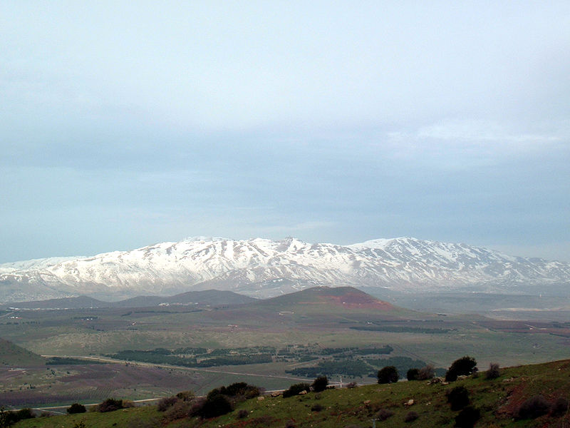
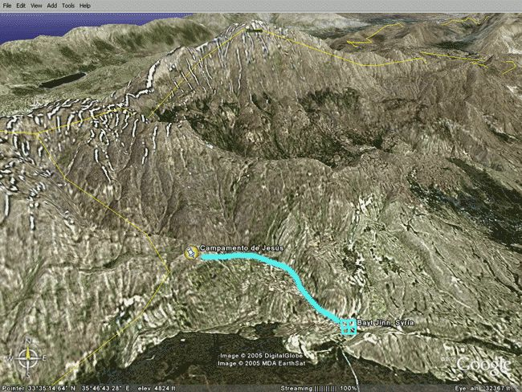
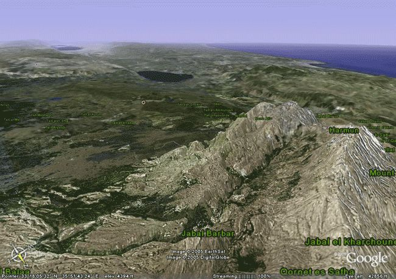

© 2005 Jan Herca (licencia <a href="/es/license">Creative Commons Attribution-ShareAlike 4.0</a>)

Con tantos detalles como ofrece _El Libro de Urantia_ sobre el lugar donde permaneció Jesús retirado seis semanas, no podía resultar muy difícil ubicar el lugar y hacerse un poco a la idea de cómo es y sobre todo, como fue.

En [LU 134:8](/es/The_Urantia_Book/134#p8) («Los años de transición»), se nos dice que Jesús y Tiglat construyeron un depósito de piedra en un lugar situado a 2000 metros de altitud. También se nos comenta que para ascender hasta allí pasaron por una aldea conocida entonces como Beit Jenn.[^1] [^2]

No me costó mucho encontrar Beit Jenn en un mapa. En una carta general del Líbano a escala 1:200.000 del Instituto Geográfico Nacional francés[^3] aparecía clarísima la aldea, que todavía hoy existe y se llama Beït Jinn. Además, cerca de la aldea se alza una cumbre de 2224 metros (pero no es la cumbre más alta, que se alza hasta los 2814 metros). Era fácil suponer que la ascensión de Jesús a la que se refiere _El Libro de Urantia_ es esta «pequeña» cumbre. Consultando otros datos, averigüé que en total, desde Beit Jenn, que está situado a 1100 metros, fueron unos 900 metros de ascensión hasta el lugar en el que construyeron el depósito de alimentos.

<figure id="Hermon_figure_1" class="image urantiapedia">

<figcaption><em>El recuadro rojo marca Beit Jenn, la línea roja la posible ruta de Jesús y Tiglat y el círculo rojo el posible lugar del depósito. Carta general del Líbano, IGN francés.</em></figcaption>
</figure>

También se puede apreciar en el mapa que desde esta cumbre de 2224 metros descendían hasta Beit Jenn dos torrentes, uno de ellos siguiendo una pendiente más suave, que fue por la que probablemente ascendió Jesús.

Un hecho curioso que se desprende de todo esto es que todos los sucesos extraordinarios que sucedieron allí tuvieron lugar en territorio de la actual Siria, no en Líbano o en Israel. Debe recordarse que esta frontera norte de Israel ha estado en permanente conflicto.

El punto exacto quedaba de este modo un poco más claro. Pero, ¿cómo era en aquel entonces esta montaña?

<figure id="Hermon_figure_2" class="image urantiapedia">

<figcaption><em>Monte Hermón visto desde el monte Bental</em>, <a href="http://en.wikipedia.org/wiki/File:Hermonsnow.jpg" target="_blank">Wikipedia</a></figcaption>
</figure>

El Hermón es en realidad una extensa cordillera conocida como Jabal Ech Cheikh con varias cumbres permanentemente nevadas y que cuenta hoy en día con una estación de esquí. Debido a la tala intensiva, los frondosos bosques de cedros han quedado desolados, dejando sólo pequeñas zonas de este fantástico árbol.[^4] Por eso, las fotografías que unas viajeras nos han brindado sólo muestran laderas descarnadas y solitarias.[^5]

Para hacerse una idea de cómo fue el abigarrado lugar en tiempos de Jesús recurrí a la inestimable narración de _Caballo de Troya 6_, el best-seller de J.J. Benítez,[^6] que en sus páginas finales reproduce con un detalle asombroso esta ascensión. Todo este lujo de detalles fue reutilizado por mí al escribir mi versión novelada[^7] de la Parte IV de _El Libro de Urantia_ en la que estoy trabajando desde hace años. De ese modo utilizo ciertos elementos como el _asherat_ (una construcción conmemorativa fenicia aborrecida históricamente por los judíos) y el claro con el cedro en el centro, que aparecen en la obra de Benítez.

<figure id="Hermon_figure_3" class="image urantiapedia">

<figcaption><em>Ruta de ascensión de Jesús al monte Hermón</em></figcaption>
</figure>

Me pareció una buena idea hacer en mi novela[^7] que Jesús tuviera un gesto de adoración sincero ante el monumento del _asherat_ (en _Caballo de Troya 6_ no se narra la ascensión de Jesús, sino la de Tiglat y sus dos acompañantes y es Tiglat el que hace la reverencia). Este gesto de Jesús da una muestra de su carácter personal y contrasta con la típica actitud judía hacia estos monumentos extranjeros (véase [2 Cr 34:1-7](/es/Bible/2_Chronicles/34#v1); [Miq 5:14-15](/es/Bible/Micah/5#v14)). Los reyes y los profetas de la antigüedad habían luchado por destruir estas construcciones, que les resultaban odiosas por el simple hecho de que conmemoraban a un dios distinto de Yavé, el dios judío. Sin embargo, para el Jesús de mi novela, el lugar donde se adora a Dios es lo de menos, lo importante es que todas las construcciones han sido realizadas por las manos de personas creyentes, tengan la concepción de Dios que sea.

<figure id="Hermon_figure_4" class="image urantiapedia">

<figcaption><em>Panorámica desde lo alto del Hermón obtenida con Google Earth</em></figcaption>
</figure>

En mi novela[^7], Jesús le cuenta a Tiglat leyendas acerca del monte Hermón. Este monte siempre estuvo asociado en la literatura judía con historias mitológicas. En el _Libro de Enoc_, un apócrifo de la época de Jesús, podemos leer:

> Entonces juraron todos de consuno y se comprometieron a ello bajo anatema. Eran doscientos los que bajaron a Ardis, que es la cima del monte Hermón, al que llamaron así porque en él juraron y se comprometieron bajo anatema. Estos eran los nombres de sus jefes: Semyaza, que era su jefe supremo; Urakiva, Rameel, Kokabiel, Tamiel, Ramiel, Daniel, Ezequiel, Baraquiel, Asael, Armaros, Batriel, Ananel, Zaquiel, Samsiel, Sartael, Turiel, Yomiel y Araziel: éstos eran sus decuriones. [1 Enoc 6:5-8](/es/Bible/Enoch/6#v5) [^8]

Es curioso pero este libro narra que seres venidos del cielo, a los que el _Libro de Enoc_ llama «los Vigilantes», desciendieron al monte Hermón, donde planearon su modo de actuación hacia los hombres. Una historia de contenido muy parecido con lo que le ocurre a Jesús en la montaña. ¿Quizás eligió Jesús el monte Hermón por esta significación, o era un lugar retirado como otro cualquiera?

## Enlaces externos

* Artículo original: https://buscandoajesus.wordpress.com/articulos/el-monte-hermon-pero-donde-estuvo-jesus/

## Referencias y Notas

[^1]: Visualizar Beit Jenn en Google Earth: introduzca «Bayt Jinn, Syria» en la casilla de búsqueda.

[^2]: http://www.fallingrain.com/world/SY/8/Bayt_Jinn.html, información de localización de Beit Jenn.

[^3]: Institut Geographique National du France, _Liban. Carte Générale au 1:200.000_.

[^4]: http://www.imagenesdeisrael.com/Imagen-988.html, imágenes de una montaña que ha cambiado mucho en la actualidad.

[^5]: http://www.squarecircles.com/articles/joysastrip/joysastoryD2.htm, el interesante viaje de dos entusiastas lectoras de _El Libro de Urantia_.

[^6]: J.J. Benítez, _Caballo de Troya 6_, Editorial Planeta, 1999.

[^7]: Este libro es la novela [«Jesús de Nazaret»](/es/book/Jan_Herca/Jesus_of_Nazareth), una biografía sobre el Maestro basada en _El Libro de Urantia_ que está en preparación por el autor.

[^8]: A. Diez Macho, Federico Corriente, Antonio Piñero, _Apocrifos del Antiguo Testamento_, _Libro 1 de Enoc o Enoc etiópico_ 6:5-8, Ediciones Cristiandad, 1984. Existen fragmentos de este versículo en el manuscrito 4QEna y 4QEnb de Qumran.

