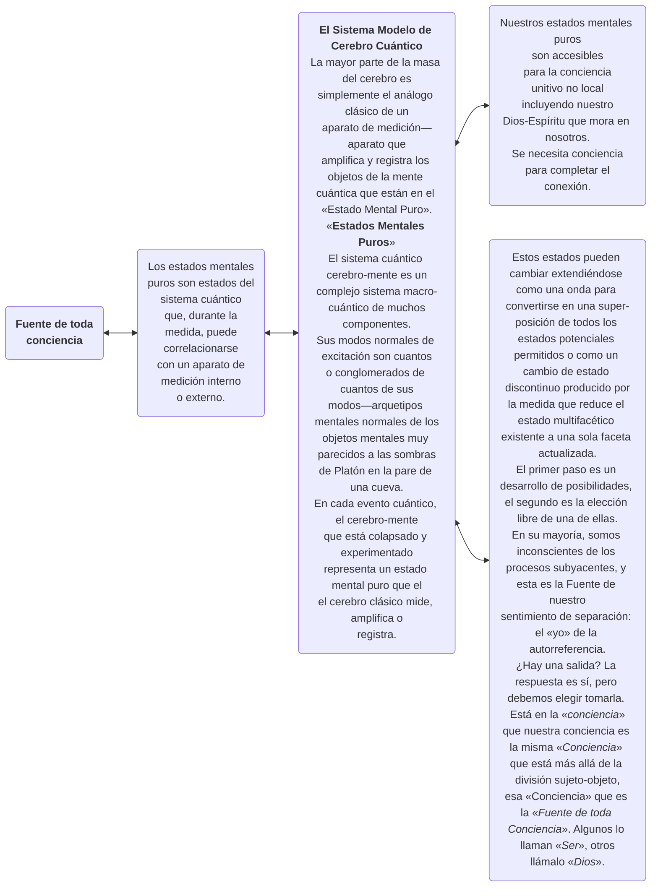

© 2004 Ken Glasziou © 2004 The Brotherhood of Man Library

<figure class="table chapter-navigator">
  <table>
    <tbody>
      <tr>
        <td>
        <a href="/es/article/Ken_Glasziou/The_Challenge">
          El desafío
        </a>
        </td>
        <td>
        <a href="/es/index/articles_innerface#volumen-11-no-5">
          Volumen 11 - No. 5 — Índice
        </a>
        </td>
        <td>
        <a href="/es/article/Ken_Glasziou/The_Earth_Moon_System">
          El Sistema Tierra-Luna
        </a>
        </td>
      </tr>
    </tbody>
  </table>
</figure>

La mayoría de los occidentales aceptan como un hecho científico la idea de que vivimos en un mundo materialista, un mundo en el que todo está hecho de materia y en el que la materia se considera la única realidad fundamental.

En gran parte, este escenario debe su origen al matemático francés René Descartes, quien, hace 400 años, propuso su famosa filosofía del dualismo, que divide el mundo en una esfera objetiva de materia y una subjetiva de mente. Juntos, estos consagraron sus ideas del mundo como una simple máquina.

Peor aún, un siglo más tarde, Newton y sus herederos establecieron de manera concluyente el principio del determinismo causal: el concepto de que todo movimiento se puede predecir con exactitud usando solo las leyes físicas del movimiento y las condiciones iniciales del sistema en movimiento.

Imagina un montón de bolas de billar en una mesa de billar perfectamente nivelada. Dadas las ecuaciones de movimiento de Newton y las posiciones iniciales, masas y velocidades de todas estas bolas en algún momento inicial, entonces, según afirma el determinismo, se puede calcular todo el futuro de estas bolas de billar.

La importancia filosófica de este tipo de pensamiento arraigó hasta tal punto que otro filósofo-científico francés, Pierre Laplace, pudo proponer que si alguna inteligencia superior, en un momento dado, estuviera familiarizada con todas las fuerzas que animan la naturaleza , y en algún momento inicial conociera también la posición y velocidad de todas y cada una de las partículas de materia pues, para esa inteligencia-superior, ni el pasado ni el futuro del universo serían inciertos.

Laplace también escribió un libro de gran éxito sobre la mecánica celeste. Esto llamó la atención de su emperador, Napoleón, quien preguntó por qué no mencionaba a Dios, a lo que Laplace respondió: «Su majestad, no necesito esa hipótesis». En un mundo newtoniano completamente determinista, ¡Dios ya no era necesario!

A estos principios de objetividad y determinismo de la física clásica, Einstein añadió un tercero. Esto se produjo como consecuencia de su declaración de que la velocidad de la luz era una velocidad límite en el vacío: la velocidad de la luz era una constante que ninguna cosa material podía superar.

Las implicaciones de este límite de velocidad eran de largo alcance, y tal vez ninguna fuera más importante que el hecho de que todas las interacciones entre cosas materiales en el espacio-tiempo deben viajar a través del espacio pieza por pieza y con una velocidad finita. Por lo tanto, todas estas interacciones deben estar «localizadas», deben ocurrir dentro de los límites establecidos por la velocidad de la luz. A este hecho se le ha dado el nombre de «principio de localidad». Más adelante aprenderemos que ciertos eventos cuánticos importantes ignoran el principio y pueden ocurrir instantáneamente, incluso en extremos opuestos del universo. Se dice que tales eventos son ‘no locales’.

Durante unos 200 años, el dualismo cartesiano permaneció más o menos indiscutido. Pero luego, los científicos, en particular, comenzaron a desafiar el lado mental del dualismo, sustituyéndolo por el principio del monismo material, lo que significa que solo hay un principio central, en este caso, la materia. Por lo tanto, la mente, la conciencia y el espíritu fueron relegados a ser epifenómenos, existiendo solo como derivados de la materia.

Y ahí, aproximadamente, es donde se encuentra la mayoría del mundo occidental hoy en día, todo sin darse cuenta de que están más de cincuenta años por detrás de los hallazgos empíricos de la ciencia moderna, algo que ahora intentaremos demostrar.

<figure class="image urantiapedia image-style-align-left">

<figcaption><em>El experimento de Thomas Young de 1803. La luz de la fuente de luz (extremo izquierdo) pasó a través de un pequeño orificio (A), luego a través de dos rendijas paralelas (B) para brillar en una pantalla (C) y producir una serie de barras claras y oscuras que Young interpretó en términos de ondas de luz que interfieren entre sí.</em> </figcaption>
</figure>

<figure class="image urantiapedia image-style-align-right">

<figcaption><em>En el experimento de Thomas Young, las ondas de luz brillan a través de un agujero de alfiler hacia dos rendijas, desde allí se enfocan en una pantalla para producir un patrón de interferencia de bandas alternas de luz y oscuridad.</em> </figcaption>
</figure>

## Más allá del espacio, más allá de cualquier cosa

Primero, debemos saber que existe una brecha de tamaño enorme entre el micromundo del átomo y ese mundo que normalmente consideramos microscópico, algo visible bajo un microscopio. Con un muy buen microscopio, las bacterias y otros organismos unicelulares pueden volverse visibles. Su tamaño está mayormente en el rango de 1-10 x 10^-4^ cm. Un átomo mide aproximadamente 10^-8^ cm; el núcleo de un átomo mide unos 10^-13^ cm; un electrón de unos 10^-21^ cm. (10^-6^ = 1 millonésima; 10^-9^ = 1 billonésima)

Quizás nuestras primeras insinuaciones de las peculiaridades del mundo cuántico se produjeron a principios del siglo XIX cuando el británico Thomas Young obtuvo pruebas inequívocas de que la luz tenía características similares a las que se observan en un estanque de agua cuando los frentes de onda que emanan de diferentes perturbaciones se encuentran entre sí. . Donde se encuentran los picos de sus olas, se refuerzan. Cuando el valle se encuentra con el pico, se cancelan.

El concepto de Young de las características ondulatorias subyacentes de la luz dominó la física durante los siguientes cien años. Pero luego llegó el joven Einstein para lanzar un martillo en los trabajos con su interpretación del llamado efecto fotoeléctrico que implicaba que la luz también se comportaba como si consistiera en partículas. Resultó que tanto Young como Einstein tenían razón: la luz se comporta como onda y como partícula.

La partícula de luz recibe el nombre de «fotón». También se determina que no tiene masa. Entonces, ¿qué pasa con otras partículas subatómicas, aquellas que sí tienen masa e incluso carga eléctrica, como el electrón, por ejemplo?

Experimentos del mismo tipo que los de Young en los que un estrecho haz de electrones pasó a través de dos rendijas paralelas y luego a una pantalla dieron el mismo resultado que obtuvo Young: un patrón de interferencia de barras estrechas intercaladas por espacios. Así que los electrones también parecen tener características ondulatorias. Sin embargo, cuando se usaron electrones, también fue técnicamente posible reducir su velocidad de presentación hasta que solo se presentó un electrón a la vez.

Al principio, el resultado parecía ser que cada electrón se registraba en la pantalla como un único punto, el esperado para un comportamiento similar al de una partícula. Pero a medida que pasaba el tiempo y se acumulaban miles de anuncios en la pantalla, el resultado fue extraordinario: una serie de barras intercaladas con espacios que se acumulaban lentamente (ver más abajo). Y dado que cada electrón atravesó las rendijas, uno a la vez, para que se formara este patrón de barras claras y oscuras, ¡cada electrón seguramente tuvo que atravesar ambas rendijas y de alguna manera interferir consigo mismo!

Fueron necesarios muchos años de experimentación bastante ingeniosa para catalogar lo que sucede.

> Dios posee un poder ilimitado para conocer todas las cosas; su conciencia es universal. [LU 3:3.3](/es/The_Urantia_Book/3#p3_3)

<figure class="image urantiapedia image-style-align-right">

<figcaption><em>Con nuestra configuración experimental similar a la de Thomas Young, pero usando electrones en lugar de luz para bombardear las rendijas, obtenemos resultados similares a los de la luz: un patrón de interferencia cuando ambas rendijas están abiertas y una sola barra para una sola rendija. abierto. Pero la tasa de presentación de electrones podría reducirse hasta que solo se presente uno a la vez. Inicialmente, esto dio una sola barra directamente detrás de cada rendija. Pero a medida que pasaba el tiempo, una vez más el patrón de interferencia se fue acumulando lentamente. La conclusión: ¡cada electrón interfiere consigo mismo!</em> </figcaption>
</figure>

## ¿Elección retrasada es igual a «nigromancia»?

En vista de los sorprendentes resultados ya obtenidos, era inevitable que, tarde o temprano, alguien hiciera la pregunta aparentemente estúpida: «¿Qué pasaría si la segunda rendija no se abriera hasta que su fotón o electrón ya hubiera atravesado la rendija alternativa abierta? »

El resultado real de probar esta hipótesis se ilustra a continuación. Con solo una rendija abierta, se obtuvo una sola barra (no mostrada).

Cuando se abrió la segunda rendija, pero solo después de que el fotón ya había pasado a través de la primera rendija, los puntos individuales se acumularon gradualmente en las barras del patrón de interferencia. Esto siguió siendo cierto cuando cualquier señal para abrir la segunda rendija tendría que exceder la velocidad de la luz. Por lo tanto, cualquier señal de este tipo debería ser no local. (ref. Hellmuth y colaboradores, 1986)

Etiquetada como ‘nigromancia’ (utilizando información de los muertos) cuando se propuso por primera vez, la prueba experimental real de «no localidad» tuvo que esperar el desarrollo de la tecnología apropiada antes de ser alcanzable. Mientras tanto, los avances tanto en la teoría como en la tecnología ya indicaban cuál sería el resultado probable.

> Todo debe hacerse lo más simple posible, pero no más simple.
> Alberto Einstein

<figure class="image urantiapedia image-style-align-right">

<figcaption><em>El diagrama anterior ilustra los principios de la «elección tardía». Con una rendija cerrada, no hay interferencia y solo aparece una barra en la pantalla. Con 2 rendijas abiertas, tenemos una repetición del trabajo de Thomas Young. ¿Qué pasaría si la apertura de la segunda rendija se retrasara hasta después de que el fotón ya hubiera pasado por la única rendija abierta? ¿La respuesta? Obtenemos el patrón de interferencia, incluso cuando no hay tiempo suficiente para que una señal luminosa viaje desde el punto de toma de decisiones (flecha) hasta la rendija.</em> </figcaption>
</figure>

## Variables ocultas y no localidad

El avance crítico en la teoría vino del físico irlandés John Bell, cuyo teorema de 1965, entre otras predicciones importantes, mostró que para ser compatibles con la teoría cuántica, las variables ocultas deben ser no locales. Esto era contrario a la crítica de la teoría cuántica por parte de Einstein, quien insistía en que la teoría era incompleta, que debía haber «variables ocultas» sin descubrir que completarían la teoría y harían racionales sus extraordinarios resultados. Hasta el día de su muerte, Einstein no aceptaría el concepto de señales no locales. Para él, todo tenía que ser predecible, determinista y dentro de los límites establecidos por la señalización local, siendo la velocidad de la luz el límite superior.

Einstein murió mucho antes de que la tecnología avanzara lo suficiente como para permitir que el concepto de no localidad fuera puesto a prueba empíricamente.

Aunque el teorema de Bell había sido examinado en el laboratorio y había dado algunos resultados positivos, fue solo en el año 1982 que la evidencia incontrovertible, aceptable para el escrutinio de pares, estuvo disponible a través del trabajo de un grupo francés de físicos dirigido por Alain Aspect.

Este grupo francés aprovechó el hecho de que un isótopo radiactivo de calcio emitía pares gemelos de fotones correlacionados en direcciones opuestas. Estar correlacionados significa que comparten ciertas propiedades, de modo que si se conoce la magnitud de tal propiedad para uno de los gemelos, también se puede determinar la del otro.

El resultado de sus experimentos fue mostrar que cualquier cosa que le sucediera a uno de los fotones correlacionados afectó a su gemelo aunque ninguna señal a la velocidad de la luz o menos pudiera pasar entre ellos, lo que implica que la comunicación instantánea de alguna manera ocurrió y aún lo haría incluso si los fotones fueran en extremos opuestos del universo...

Por lo tanto, el grupo de Aspect demostró que la crítica de Einstein y sus colaboradores, Podolsky y Rosen, con respecto a las variables ocultas y las propiedades correlacionadas, era completamente errónea. También estableció la realidad más allá de toda duda del fenómeno de la no localidad y demostró que si existieran variables ocultas, deberían ser no locales, es decir, en una dimensión trascendente fuera de nuestro espacio-tiempo...

Desde entonces, el experimento de Aspect ha sido confirmado por trabajadores independientes; uno de esos grupos se encuentra en Suiza, donde se utilizó el sistema de fibra óptica entre dos pueblos separados por una alta montaña. La distancia entre ellos era de unos 15 kilómetros. Pero eso fue hace algún tiempo. El registro es probablemente mucho mayor en la actualidad.

Entre los muchos experimentos confirmatorios que demuestran la realidad de los efectos no locales, se encuentra un grupo de pruebas ópticas que «hacían correr» fotones gemelos hacia un objetivo, uno de los cuales tenía que hacer un túnel a través de una barrera colocada en su camino. Curiosamente, el fotón que atravesó la barrera llegó al objetivo antes que su gemelo (que viajó a la velocidad de la luz). Para el gemelo que atravesó la barrera, la velocidad promedio del túnel fue 1,7 veces la de la luz, por lo que un efecto local”. Una segunda curiosidad fue que el gemelo que hizo el túnel pudo «sentir» el lado más alejado de la barrera y cruzarlo en la misma cantidad de tiempo, sin importar cuán gruesa fuera la barrera. (ver Chiao et al. 1993)

Pregunta: ¿cómo «siente» un mero fotón el grosor de una barrera?

<figure class="image urantiapedia image-style-align-right">

<figcaption><em>El experimento de Aspect. El calcio radiactivo emite pares gemelos de fotones correlacionados en direcciones opuestas. Cada uno de un par se pasa a través de un polarizador antes de medir su polarización. El polarizador de la derecha tiene un dispositivo de conmutación que cambia el ángulo de polarización cada diez mil millonésimas de segundo. Este intervalo de tiempo es demasiado corto para que cualquier señal que viaje a la velocidad de la luz abarque la distancia entre los dispositivos de medición.  El experimento demostró que lo que le sucedía al fotón que pasaba por el polarizador conmutado se reflejaba en su gemelo. Se espera este resultado incluso si los fotones correlacionados estuvieran en lados opuestos del universo. Denominado efecto no local, el comportamiento vinculado de los fotones correlacionados es consistente con la teoría cuántica y refuta directamente la expectativa de Einstein-Podolsky-Rosen de ningún efecto no local.</em> </figcaption>
</figure>

<figure class="image urantiapedia image-style-align-right">

<figcaption><em>Cuando intentamos identificar por qué rendija pasa la partícula. usando algún medio para identificar qué rendija el fotón o el electrón muestra su naturaleza de partícula y da solo las dos barras directamente detrás de las rendijas. Conclusión: cualquier intento de descubrir «qué camino» dará como resultado un comportamiento similar al de una partícula.</em> </figcaption>
</figure>

## No localidad: su suprema importancia

La teoría cuántica tiene muchas peculiaridades extrañas que están correctamente etiquetadas como «fuera de este mundo». De estos, seguramente el más significativo para nosotros los seres humanos es la prueba del Bell-Aspect de la realidad de la no-localidad, que es una arena trascendente de la realidad fuera del espacio-tiempo, cuya existencia constituye el último desafío al materialismo.

Llevado a una conclusión lógica, la no localidad implica la existencia de una conciencia universal trascendente (es decir, ¿cómo «siente» un mero fotón el grosor de una barrera?), y esa conciencia está tanto dentro como más allá de este mundo material. Para los realistas materiales, las interpretaciones alternativas son:

Aceptar que hay señales más rápidas que la luz en un reino trascendente en el que existen variables ocultas. O renuncias a la objetividad fuerte o bien aceptas un papel para la conciencia del observador. Barra el trabajo de Bell-Aspect debajo de la alfombra.

Los resultados de Bell-Aspect y su confirmación independiente ocurrieron hace más de 20 años. Y aunque destruyeron los cimientos del materialismo, pueden dar sentido a la vida, incluso abrir el camino hacia Dios, y son, con mucho, los logros más significativos de la ciencia cuántica para la humanidad hasta el día de hoy; sin embargo, siguen siendo ignorados y casi desconocidos. .

### Lo que creen la mayoría de los físicos cuánticos

En 1911, Ernest Rutherford propuso un modelo planetario para los electrones atómicos que, dijo, circulaban alrededor del núcleo del átomo de forma muy parecida a como los planetas giran alrededor del sol.

Sin embargo, este modelo tenía una debilidad en el sentido de que era intrínsecamente inestable y eventualmente debería dar como resultado que los electrones chocaran contra el núcleo o su átomo los perdiera.

Supongamos, dijo el físico noruego Neils Bohr, que las órbitas que describen los electrones son discretas. Cada una de esas órbitas, desde el nivel de energía más bajo hasta el más alto, tiene una trayectoria fija e inalterable: una órbita estacionaria, que no cambia en su valor de energía. Para cambiar esa órbita, la energía debe ser absorbida o emitida en cuantos discretos. Pero al hacerlo, se trata de un salto cuántico, sin que ese electrón se encuentre en ningún punto intermedio.

Estas órbitas de electrones también se visualizaron como ondas estacionarias, cada una de las cuales, según Max Born, era en realidad una onda de probabilidad que nos dice dónde es probable que encontremos un electrón en cualquier intento de observación. Sin embargo, para hacerlo con un solo electrón, el observador se ve obligado a colapsar el patrón de onda. Por lo tanto, los electrones individuales solo se pueden observar en forma de partículas.

Estos conceptos fueron desarrollados lentamente por físicos como Heisenberg, Dirac y Schrödinger: la ecuación de onda de la materia, conocida como ecuación de Schrödinger, surgió como la conexión para las matemáticas que reemplazó a las leyes de Newton en la nueva física.

La revolución en todo esto fue que el cambio de la física clásica a la cuántica introdujo incertidumbre, porque ya no podemos pensar en términos de la posición y el momento absolutos de ningún objeto. Ahora, y presumiblemente para siempre, solo podemos proporcionar una estimación de probabilidad de dichos parámetros, y estos deben estar de acuerdo con el principio de incertidumbre de Heisenberg, que establece que cuanto más exactamente conocemos la posición de un objeto, menos podemos saber sobre su momento. o la velocidad, y viceversa.

Estos son tiempos «inciertos» en los que el átomo y sus componentes subatómicos pertenecen al mundo cuántico, un mundo de componentes que existen en estados de «no ser ni esto ni aquello», y se desalojan de tales estados solo cuando se observan.

<figure class="image urantiapedia image-style-align-left">

<figcaption><em>Resultados de mediciones repetidas de la posición de un electrón de hidrógeno en su órbita de menor energía. La distribución es ilustrativa de la distribución probabilística del electrón.</em> </figcaption>
</figure>

<figure class="image urantiapedia image-style-align-right">

<figcaption><em>La visión de De Broglie de los electrones como ondas estacionarias que rodean el núcleo en el confinamiento del átomo.</em> </figcaption>
</figure>

## Decisiones: ¿quién o qué las toma?

Más allá de todo esto está el problema de la toma de decisiones. Quién, qué y dónde se toman las decisiones sobre las acciones a realizar. ¿Y quién o qué lleva los registros? Después de que un observador colapsa una onda de electrones para convertirla en una partícula a fin de realizar una medición, una partícula de electrones, por sí sola, se propagará con bastante rapidez, pero solo como una onda de probabilidad.

Con el tiempo suficiente, podría extenderse por todo el universo, solo para recibir la orden de colapsar instantáneamente a un estado de partículas nuevamente porque algún ser humano curioso quiere hacer una medición. ¿Quién tiene el registro de su distribución de probabilidad para que el colapso pueda realizarse instantáneamente de manera ordenada?

En el experimento de Aspect, fue la medición de la polarización de uno de los dos fotones correlacionados lo que colapsó su función de onda, e instantánea y automáticamente provocó la alineación de la polarización en el mismo eje de su compañero correlacionado. Sin embargo, ninguna señal a la velocidad de la luz o menos podría pasar entre ellos.

Fue la decisión consciente de los experimentadores lo que inició la cadena y desencadenó el segundo colapso. Una conciencia que puede desencadenar ambos colapsos, el segundo colapso de alguna manera recibiendo sus instrucciones desde más allá del espacio y el tiempo, seguramente debe ser en sí misma no local o trascendente, o al menos ser contigua a una conciencia que es tan capaz.

La física cuántica ha demolido el materialismo como concepto válido. Entonces, ¿qué alternativas hay que sean consistentes con los ‘hechos’ actualmente conocidos? Una posibilidad es alguna forma de idealismo monista como la conocida versión platónica de personas que se sientan en una cueva oscura mirando las sombras en su pared trasera. Según Platón, esa es la realidad, porque lo que experimentamos en este mundo no es más que los reflejos de la realidad del mundo perfecto que se encuentra más allá de nuestra visión.

¿Es nuestra ciencia compatible con una forma apropiada de idealismo (basada en ideas), y si es así, podemos interpretar tanto la ciencia como la filosofía en alguna formulación mutuamente compatible?

Al menos superficialmente, existe una semejanza entre las respuestas a las preguntas clave que da la física cuántica y las que dan los maestros zen:

«¿Qué es Buda?» preguntó un monje estudiante. «La mente es Buda», respondió el maestro. «Entonces, ¿qué es la mente?» preguntó otro estudiante. «La mente no es Buda», respondió el maestro.

Imagina a un estudiante preguntándole al fantasma del físico Neils Bohr si un electrón es una partícula. «Lo es», es su probable respuesta. Otro estudiante le pregunta: «¿Es un electrón una onda?» Nuevamente, Bohr responde: «Lo es». «¿Dónde podemos encontrar tal ola?» pregunta otro. «Más allá del tiempo y el espacio», dice Bohr. «¿Y, dónde está eso?» es la siguiente pregunta, a la que Bohr responde enigmáticamente: «¿Dónde está la ola?».

Cuando disparamos electrones, uno a la vez a través de rendijas paralelas, al principio se registran golpes individuales en nuestra pantalla, lo que es consistente con el electrón como partícula. Pero si disparamos miles de electrones individuales, uno a la vez, a través de las mismas rendijas, obtenemos un patrón de interferencia, que es consistente con el electrón como onda. Este aspecto de onda persiste, incluso para un solo electrón: ¿una ondulación? ¿Dónde está este aspecto de onda antes de que se dispararan los miles de otros electrones individuales, antes de que comenzara a registrarse el patrón de interferencia? Nunca se manifiesta en el espacio ordinario, entonces, ¿dónde se escondía y cómo se manifiesta como difracción solo después del evento?

> Ni el fuego ni el viento, ni el nacimiento ni la muerte, pueden borrar nuestras buenas obras.
> Buda

<figure class="image urantiapedia image-style-align-left">

<figcaption><em>Este patrón de difracción se produjo al pasar un haz de electrones a través de un cristal y es ilustrativo de la naturaleza ondulatoria de los electrones.</em> </figcaption>
</figure>

Si deseamos observar el único electrón de un átomo de hidrógeno, solo podemos hacerlo colapsando su forma de onda y observándolo como una partícula. Tan pronto como dejamos de observar, comienza a extenderse probabilísticamente de acuerdo con la ecuación de Schrödinger. ¿A dónde va? Dondequiera que sea, en el momento en que nuevamente elegimos observarlo, colapsa instantáneamente.

Según los físicos, el colapso de tal onda es demasiado rápido para estar dentro de los límites establecidos por la velocidad de la luz, por lo que no puede estar dentro de nuestro espacio-tiempo. Entonces, ¿dónde estaba? Heisenberg llamó a su ubicación «potentia», una palabra que tomó prestada de Aristóteles. Estar en «potentia» es estar en un dominio trascendente que parece ser conceptualmente idéntico a la «no localidad» tal como la define el trabajo de Bell-Aspect.

Los idealistas también consideran que ser no local es estar en el dominio de la «conciencia», que, para ellos, es también el «fundamento de todo ser», un dominio que es «original, autónomo y constitutivo de todo». cosas, manifestándose como el sujeto que elige, experimenta lo que elige, y que colapsa la función de onda en presencia de la conciencia mental”.

Entonces, la teoría cuántica, cuando se interpreta de acuerdo con la metafísica idealista, está allanando el camino para una ciencia idealista en la que la conciencia es «el todo del ser», y la materia y el materialismo palidecen y pasan a una importancia secundaria.

Sin embargo, una contribución principal de la física cuántica a este escenario es que ha demostrado positivamente una nueva dimensión, la no localidad, que muestra que hay más en este mundo que solo materia, el espacio-tiempo de Einstein y un universo mecanicista predeterminado.

> el universo de universos en su totalidad está planeado por la mente, construido por la mente y administrado por la mente. [LU 42:11.2](/es/The_Urantia_Book/42#p11_2)

## Conciliando Realismo e Idealismo

En lo que parecía haber sido una idea absurda, los filósofos Gottfried Leibniz y Bertrand Russell sugirieron que las opiniones de los realistas y los idealistas pueden reconciliarse si cada uno de nosotros tiene dos cabezas. Los objetos empíricos, los objetos ordinarios de nuestra vida cotidiana, estarían fuera de nuestra «Cabeza Pequeña» para ser utilizados o experimentados. Pero simultáneamente estos mismos objetos serían ideas teóricas dentro de nuestra «Cabeza Grande» –que también abarca nuestra «Cabeza Pequeña»– y así se convierte ella misma en objeto de escrutinio empírico.

En realidad, este «Cabeza» no tiene por qué ser solo nuestro, sino que puede estar compuesto por todos esos Cabezas. Y dado que esta súper cabeza contendría toda la realidad dentro de ella, todos podríamos estar compartiendo la única «Cabeza grande».

Este concepto nos proporciona dos formas de compartir la realidad. Un aspecto, todas nuestras cabezas pequeñas, es «local»: está dentro de los confines del espacio-tiempo einsteiniano con accesibilidad limitada por la velocidad de la luz. Pero Big Head no es local, es instantáneamente accesible y abarca las experiencias de todos los objetos empíricos, incluidos nuestros Small Heads, nuestros cerebros empíricos.

Dada la existencia de aspectos tanto locales como no locales de la mente, siendo este último un principio organizador que conecta con la mente-cerebro y la conciencia local y no local, tanto el idealismo como el realismo pueden ser válidos, ya que si la mente-cerebro es un objeto en una conciencia no local que abarca toda la realidad, entonces lo que los materialistas denominan como realidad empírica objetiva está también dentro de esta misma conciencia.

Pero, ¿por qué hay tanto consenso acerca de un mundo objetivo aparentemente material y determinista que parece ser tan permanente? Si es cierto que la luna está allí solo cuando la miramos, como afirmarán la mayoría de los físicos cuánticos, ¿por qué esa luna parece ser tan real, tan permanente?

En primer lugar, incluso los objetos clásicos más pequeños, en relación con los objetos cuánticos, tienen masas enormes, lo que significa que sus ondas de probabilidad cuántica se propagan muy lentamente. Tal propagación lenta hace que la trayectoria de su centro de masa aproximado sea altamente predecible. Así, cada vez que miramos la luna, la encontramos donde la esperamos. Además, la complejidad de los macrocuerpos se traduce en un tiempo de regeneración muy largo para su función de onda, lo que nos induce a mirarlos en términos causales.

En la conciencia universal no local todos los fenómenos, incluso los llamados objetos empíricos clásicos, son simplemente objetos en la conciencia.

**El mundo, todo el universo, está hecho de conciencia y existe solo en la conciencia**. Esa es una lección de física cuántica y su diferenciación entre localidad y no localidad.

Con la ciencia idealista hemos llegado a una ciencia que no excluye ni lo subjetivo ni lo objetivo, ni el espíritu ni la materia, y así es capaz de resolver los profundos cismas de nuestro pensamiento.

> Todos los mundos de cada universo están constantemente en la conciencia de Dios. [LU 3:3.2](/es/The_Urantia_Book/3#p3_2)

> Todo el Universo está hecho de conciencia, y existe sólo en la conciencia.
> Idealismo monista

## ¿Qué dice la Revelación de Urantia?

(Tenga en cuenta que las palabras «conciencia» y «mente» no están definidas con precisión ni en la filosofía ni en la revelación de Urantia y tienden a ser intercambiables).

> En la valoración y el reconocimiento de la mente, se debe recordar que **el universo** no es ni mecánico ni mágico; **es una creación de la mente** ([LU 42:11.1](/es/The_Urantia_Book/42#p11_1))

> «Los mecanismos no dominan de manera absoluta toda la creación; **el universo de universos en su totalidad está planeado por la mente, construido por la mente y administrado por la mente**. Pero el mecanismo divino del universo de universos es demasiado perfecto como para que los métodos científicos de la mente finita del hombre puedan discernir siquiera una huella de la dominación de la mente infinita. Pues esta mente creadora, controladora y sostenedora no es ni una mente material ni la mente de una criatura; es una mente espiritual que ejerce su actividad en, y desde, los niveles creadores de la realidad divina.». ([LU 42:11.2](/es/The_Urantia_Book/42#p11_2))

> «*La mente cósmica*. Es la séptuple mente diversificada del tiempo y del espacio, y cada uno de los Siete Espíritus Maestros aporta su ministerio a una fase de esta mente en uno de los siete superuniversos. La mente cósmica abarca todos los niveles de la mente finita y se coordina experiencialmente con los niveles de la deidad evolutiva de la Mente Suprema, coordinándose trascendentalmente con los niveles existenciales de la mente absoluta —con los circuitos directos del Actor Conjunto». ([LU 42:10.6](/es/The_Urantia_Book/42#p10_6))

> «El Padre Universal es la única personalidad en todo el universo que sabe realmente el número de las estrellas y de los planetas del espacio. Todos los mundos de cada universo están constantemente en la **conciencia** de Dios». ([LU 3:3.2](/es/The_Urantia_Book/3#p3_2))

> «Dios posee un poder ilimitado para conocer todas las cosas; su **conciencia** es universal. Su circuito personal abarca a todas las personalidades, y su conocimiento de las criaturas, incluidas las humildes, lo completa indirectamente mediante la serie descendente de los Hijos divinos, y directamente a través del Espíritu del Padre que mora en nosotros». ([LU 3:3.3](/es/The_Urantia_Book/3#p3_3))

> «El Padre Universal es consciente, en la plenitud de la **conciencia** divina, de toda la experiencia individual de las luchas progresivas de las mentes en expansión y de los espíritus ascendentes de cada entidad, ser y personalidad de toda la creación evolutiva del tiempo y del espacio. Y todo esto es literalmente cierto, porque «**en Él todos vivimos, nos movemos y tenemos nuestra existencia**»». ([LU 1:5.16](/es/The_Urantia_Book/1#p5_16))

> Con lazo y paciencia, la hoja de morera se vuelve seda.
> proverbio chino

## La teoría cuántica y el observador

En los experimentos de Chaio et al. presentado a continuación, la configuración básica utilizó un convertidor descendente, un instrumento que divide un fotón en gemelos que tienen la misma energía. Luego, estos fueron a un divisor de haz que presentó dos vías alternativas a un sistema de detección que midió la llegada simultánea del par de gemelos, un evento que señaló un comportamiento similar a una onda.

La adición de un polarizador a solo una de las rutas alternativas etiquetó esa ruta e inmediatamente destruyó todas las propiedades ondulatorias de los fotones. La pregunta que se hizo entonces fue: «¿qué sucedería si la información sobre la ruta marcada se dejara intacta mientras los fotones pasaban por el polarizador P1, pero los polarizadores P2 la destruyeron justo antes de llegar al sistema de detección?» La respuesta fue inequívoca: se restauró el comportamiento de las ondas.

Una versión más elaborada de este tipo de experimento se llevó a cabo en la Universidad de Rochester que demostró que incluso cuando no había una diferencia observable en los fotones que llegaban al sistema de detección, si era teóricamente posible que se pudiera volver a trazar su camino, entonces eso fue suficiente para colapsar la función de onda y provocar un comportamiento similar al de una partícula.

### Más rapido que la luz

Los experimentos de Aspect que confirmaron los resultados teóricos predichos por Bell demostraron que cualquier señal que pase entre el par gemelo de fotones correlacionados emitidos por el calcio radiactivo debe exceder la velocidad de la luz.

Los experimentos ópticos de alta tecnología han confirmado esta conclusión. Para hacerlo, se compitieron pares de fotones gemelos entre sí. Después de ajustar sus pistas para que fueran idénticas, se colocó una barrera a lo largo de una ruta para aprovechar el efecto de túnel, un efecto utilizado durante mucho tiempo en electrónica con el diodo de túnel en el que las relaciones de probabilidad para la distribución de energía permiten que el electrón supere lo «imposible». barreras energéticas.

Curiosamente, el túnel de fotones a través de una barrera llegó a su objetivo antes que su gemelo sin obstáculos, la velocidad promedio en muchos ensayos fue 1,7 veces la velocidad de la luz. También se descubrió que, en el proceso de tunelización, un fotón de alguna manera es capaz de sentir el lado opuesto de la barrera y cruzarlo en la misma cantidad de tiempo, sin importar cuán gruesa sea la barrera. Extraño, ¿no? ¿Es un fotón de alguna manera consciente?

<figure class="image urantiapedia image-style-align-left">

<figcaption><em>Experimento de Pritchard a nivel atómico: un haz de átomos de sodio vaporizados envía los átomos a un interferómetro que proporciona vías alternativas para que los átomos individuales entren en un sistema de detección para señalar un comportamiento similar a una onda. Cuando una luz láser brilla en una sola vía (B), dando así conocimiento de ‘en qué dirección’, la señal de onda se pierde. Pero cuando la longitud de onda de la luz láser se acorta para brillar en ambos caminos, ya no se puede determinar un camino de ‘cuál camino’ y se restablece el comportamiento ondulatorio de los átomos de sodio. La ‘información’ parece ser la única variable lógica que afecta las diferencias en el comportamiento ondulatorio del experimento. Pero, ¿quién o qué está interpretando? Este resultado con átomos completos que son del orden de miles de millones de veces más grandes que un electrón trae un comportamiento de tipo cuántico al mundo macro.</em> </figcaption>
</figure>

<figure class="image urantiapedia image-style-align-right">

<figcaption><em>Chian et al (1992). Cómo el borrado y la información solo pueden cambiar el comportamiento de los fotones de onda a partícula y viceversa. Pl y P2 son polarizadores removibles. Sin ninguno en su lugar, el par de fotones gemelos de un convertidor descendente golpean un divisor de haz y desde allí pueden ir a un sistema de detección de coincidencias que señala el comportamiento de ondas o partículas. Sin polarizadores en su lugar, cada fotón toma ambos caminos y se observa el comportamiento de onda. Agregue el polarizador P1 y una ruta se etiqueta. Ahora solo observamos el comportamiento de las partículas. Dejando Pl donde está pero agregando polarizadores idénticos, P2 y la etiqueta que nos permite distinguir las vías se destruye. Se restablece el comportamiento de onda.</em> </figcaption>
</figure>

## En busca de la mente cuántica

La evidencia empírica derivada de la investigación de la teoría cuántica ha demostrado que a nivel molecular, atómico y subatómico, antes de la observación, los objetos están compuestos de algo indeterminado que no es ni onda ni partícula, no está ni aquí ni allá sino que está distribuido ‘quién sabe’. donde' como una distribución de probabilidad que se materializará instantáneamente a instancias de un observador. Y lo hace ya sea como onda o partícula, o como un conglomerado de partículas dependiendo de la metodología del observador.

En su formato indeterminado de «ni onda ni partícula», tales objetos pueden estar distribuidos en, incluso en todo, el mundo del espacio-tiempo, o alternativamente, en una dimensión más allá del espacio-tiempo que algunos denominan «no local».

No local es una zona, dimensión o lo que sea, en la que el tiempo parece no existir, una zona de realidad a la que se puede acceder instantáneamente bajo demanda desde el espacio-tiempo.

### El cerebro-mente como sistema cuántico y como aparato de medida.

Vemos el sistema cuántico del cerebro-mente como un sistema macro-cuántico complejo que consta de muchos componentes.

Podemos representar los estados de un sistema cuántico complejo por sus llamados modos normales de excitación, sus cuantos o, más generalmente, por conglomerados de los modos normales. Supongamos que estos modos normales representan arquetipos mentales de objetos mentales (al igual que las sombras de Platón en la pared de la cueva). Llame a estos estados del sistema del cerebro estados mentales puros.

Supongamos también que la mayor parte del cerebro es el análogo clásico de un aparato de medición y este aparato clásico del cerebro amplifica y registra los objetos mentales cuánticos.

En este modelo cuántico, los estados mentales son estados del sistema cuántico que, con una medida, se correlacionan con los estados de su aparato de medida.

Así, en cada evento cuántico, el estado cerebro-mente colapsado y experimentado representa un estado mental puro que el cerebro clásico mide, amplifica o registra.

El concepto de que la mayor parte del cerebro es simplemente un aparato de medición conduce a una forma nueva y útil de pensar sobre el cerebro y los eventos conscientes.

Entonces, ¿podría ser que un mecanismo cuántico en nuestra cabeza abra el camino para la supervención de la conciencia no local?

La evidencia experimental definitiva de un sistema cuántico no local en el cerebro-mente proviene de Grinberg-Zyllerbaum y sus colaboradores, en los que dos sujetos mantienen su contacto directo mientras cada uno está en una jaula de Faraday a cierta distancia el uno del otro. Cuando el cerebro de uno responde a un estímulo externo con un potencial evocado, el cerebro del otro también muestra un potencial, en forma, similar a ese potencial evocado.

Esto se interpreta como un ejemplo de no localidad cuántica debido a la correlación entre dos cerebros-mentes que se establece a través de su conciencia no local.

Los conceptos clásicos sobre el sistema cerebro-mente en su mayoría tratan al cerebro mismo como un hardware similar a una computadora, siendo la mente el software. En el modelo idealista, los estados mentales que experimentamos se derivan de la interacción de los sistemas clásico y cuántico.

Es importante destacar que, en cualquier individuo, la potencia causal del sistema cuántico cerebro-mente surge de la conciencia no local que colapsa la función de onda de la mente y experimenta el resultado. Los objetos aparecen desde un dominio trascendente de posibilidad hacia el dominio de manifestación cuando la conciencia unitiva no local colapsa su función de onda.

Sin embargo, para que se complete el colapso, debe estar en presencia de una conciencia del cerebro-mente para que se realice la «medición». Por lo tanto, tenemos una situación de circularidad: no hay finalización de la medición sin conciencia, pero no hay conciencia sin finalización de la medición.

Para ver nuestro camino libre de esta circularidad, podemos aplicar la teoría de la medición cuántica al cerebro-mente. Según von Neumann, el estado de un sistema cuántico cambia de dos formas. La primera es extendiéndose como una onda para convertirse en una superposición coherente de todos los estados potenciales permitidos. El segundo es un cambio discontinuo en el estado producido por una medición, reduciendo así el estado multifacético existente a una sola faceta actualizada. Ese primer paso es un desarrollo de un conjunto de posibilidades y el segundo, la elección de una de ellas.

La mayoría de los físicos ven esto como una elección aleatoria, pero de acuerdo con la interpretación idealista, es la conciencia la que hace la elección, una conciencia, con conciencia, que puede trascender la localidad para volverse tanto no local como unitiva.

Mientras que es nuestra conciencia la que elige este resultado del colapso del estado cuántico de nuestro cerebro-mente, sin embargo, permanecemos bastante inconscientes del proceso subyacente. Y es esta misma inconsciencia la que conduce a nuestro sentimiento de separación: el «yo» de la circularidad, la autorreferencia y la jerarquía enredada en lugar del «nosotros» de la conciencia unitiva.

¿Hay alguna salida a la circularidad y la autorreferencia? La respuesta es sí, pero debemos elegir tomarla. Es el reconocimiento de que nuestra conciencia es la misma conciencia que está más allá de la división sujeto-objeto: la conciencia de la fuente de toda conciencia. Algunos lo llaman «Ser»; otros lo llaman «Dios».

De valor inestimable para la humanidad es el hecho de que la física cuántica ha proporcionado una prueba empírica incontrovertible de la existencia de órdenes trascendentes de realidad que el materialismo negaba por completo. Y al hacerlo, los mortales nos hemos liberado de la rigidez del determinismo y nuestras mentes se han liberado para explorar el camino hacia la creencia en una Primera Causa que, a su vez, puede llevarnos a descubrir al Dios que es amor.

> De los muchos particulares surge la unidad, y de la unidad surgen todos los muchos particulares.
> Heráctilo

> La conciencia es el fundamento de todo Ser.
> (Idealismo Monista)

## ¿Qué dice la revelación de Urantia sobre nuestras mentes y nuestro contacto con la «no-localidad»?

Toda la mente del universo se deriva inicialmente de la tercera persona de la Trinidad: el Espíritu Infinito. La distribución general de la mente a los universos es como Mente Cósmica, pero a un universo individual es a través del Espíritu de la Madre del Universo.

La excepción es para la mente mecánica no enseñable presente en las formas más primitivas de vida material, que es atendida por los Controladores físicos maestros. Este nivel mental también puede ser funcional en algún nivel, incluso entre las formas más avanzadas de vida animal.

La vida animal, incluidos los seres humanos, es atendida por los siete Espíritus Ayudantes de la Mente, que son derivados no personales del Espíritu Materno del Universo. Estos son conocidos por nombres que reflejan su funcionalidad: los ayudantes de la intuición, la comprensión, el coraje, el conocimiento, el consejo, la adoración y la sabiduría.

El hombre mortal primero experimenta el ministerio del espíritu en conjunción con la mente cuando la mente puramente animal de las criaturas evolutivas desarrolla la capacidad de recepción para los ayudantes de adoración y sabiduría. Este ministerio de los ayudantes sexto y séptimo indica la evolución de la mente cruzando el umbral del ministerio espiritual.

Pero para la recepción del llamado Ajustador del Pensamiento, el Espíritu de Dios que mora en nosotros, la mente de la criatura debe exhibir un alcance de adoración e indicar una función de sabiduría al exhibir la capacidad de elegir entre los valores emergentes del bien y el mal: la elección moral.

Desde la fiesta de Pentecostés que siguió a la resurrección de Jesús, todas las personas de mentalidad normal han sido recipientes del Espíritu del Padre que mora en nosotros. Lo más común es que esto haya ocurrido después de la primera decisión moral del individuo, actualmente en promedio alrededor de los 6 años de edad.

Este Espíritu residente obviamente forma un vínculo directo que une tanto la mente como la conciencia de cada individuo con la conciencia de Dios. Este Espíritu de Dios, debido a que ocupa un lugar central en el cerebro-mente del individuo, forma un vínculo por el cual el Espíritu de la Verdad y otras fuerzas espirituales pueden acceder al cerebro-mente humano.

Por lo tanto, concluimos que los conceptos del idealismo monista y los pensamientos que se nos presentan en la revelación de Urantia son complementarios.

> En el corazón de cada hombre hay un nervio secreto que responde a las vibraciones de la belleza.
> Cristóbal Morley

## De la Revelación de Urantia

> La conciencia cósmica implica el reconocimiento de una Causa Primera, la sola y única realidad sin causa. Dios, el Padre Universal, actúa en tres niveles de personalidad de la Deidad, que tienen un valor subinfinito y expresan de manera relativa la divinidad:
>
> 1. *Prepersonal* —como en el ministerio de los fragmentos del Padre, tales como los Ajustadores del Pensamiento.
> 2. *Personal* —como en la experiencia evolutiva de los seres creados y procreados.
> 3. *Superpersonal* —como en las realidades existenciadas de ciertos seres absonitos y otros seres asociados. ([LU 0:2.2-5](/es/The_Urantia_Book/0#p2_2))

> Dios posee un poder ilimitado para conocer todas las cosas; su conciencia es universal. Su circuito personal abarca a todas las personalidades, y su conocimiento de las criaturas, incluidas las humildes, lo completa indirectamente mediante la serie descendente de los Hijos divinos, y directamente a través de los Ajustadores del Pensamiento interiores. Además, el Espíritu Infinito está constantemente presente en todas partes. ([LU 3:3.3](/es/The_Urantia_Book/3#p3_3))

> El Padre Universal es la única personalidad en todo el universo que sabe realmente el número de las estrellas y de los planetas del espacio. Todos los mundos de cada universo están constantemente en la conciencia de Dios ([LU 3:3.2](/es/The_Urantia_Book/3#p3_2))

> La mente cósmica abarca todos los niveles de la mente finita y se coordina experiencialmente con los niveles de la deidad evolutiva de la Mente Suprema, coordinándose trascendentalmente con los niveles existenciales de la mente absoluta —con los circuitos directos del Actor Conjunto. ([LU 42:10.6](/es/The_Urantia_Book/42#p10_6))

> La mente siempre conlleva la actividad y la presencia de un ministerio viviente además de los diversos sistemas energéticos, y esto es así en todos los niveles y en todos los tipos de mente. Pero más allá de la mente cósmica, las relaciones de la mente con la energía no espiritual se vuelven cada vez más difíciles de describir. ... La mente paradisiaca está más allá de la comprensión humana; es existencial, no espacial y no temporal. ([LU 42:10.7](/es/The_Urantia_Book/42#p10_7))

> En el mundo espiritual, la fe transmuta los potenciales en actuales, pero los potenciales sólo se vuelven actuales, en los reinos finitos del Supremo, llevando a cabo la experiencia de la elección y a través de ella. ([LU 110:6.17](/es/The_Urantia_Book/110#p6_17)) [Nota: el Supremo es el Dios finito de lo finito.]

> La conciencia humana descansa suavemente sobre el mecanismo electroquímico situado debajo, y toca delicadamente el sistema energético morontial-espiritual situado encima. El ser humano nunca es completamente consciente de ninguno de estos dos sistemas durante su vida mortal; por eso tiene que trabajar en la mente, de la cual sí es consciente. Lo que asegura la supervivencia no es tanto lo que la mente comprende como lo que la mente desea comprender; lo que constituye la identificación con el espíritu no es tanto cómo es la mente sino cómo la mente se esfuerza por ser. Lo que conduce a la ascensión por el universo no es tanto que el hombre sea consciente de Dios como que el hombre anhele a Dios. Lo que sois hoy no es tan importante como lo que vais siendo día tras día y en la eternidad. ([LU 111:1.5](/es/The_Urantia_Book/111#p1_5))

> La conciencia de Dios, tal como la experimentan los mortales evolutivos de los mundos, debe consistir en tres factores variables, en tres niveles diferenciales de comprensión de la realidad. En primer lugar está la conciencia mental —la comprensión de la idea de Dios. Luego le sigue la conciencia del alma —la comprensión del ideal de Dios. Finalmente despunta la conciencia del espíritu —la comprensión de la realidad espiritual de Dios. ([LU 5:5.11](/es/The_Urantia_Book/5#p5_11))

> La concesión de la personalidad es una ocupación exclusiva del Padre Universal, es la personalización de los sistemas energéticos vivientes, a los cuales dota de los atributos de una conciencia creativa relativa y del control de la misma por medio del libre albedrío. ([LU 5:6.4](/es/The_Urantia_Book/5#p6_4))

> El Ser Supremo no ha creado al hombre, pero el hombre fue creado literalmente a partir de la potencialidad del Supremo, y su misma vida deriva de esta potencialidad. El Supremo tampoco hace evolucionar al hombre, y sin embargo el Supremo es la esencia misma de la evolución. Desde el punto de vista finito, vivimos, nos movemos y tenemos realmente nuestra existencia dentro de la inmanencia del Supremo. ([LU 117:3.12](/es/The_Urantia_Book/117#p3_12))

> El alma evolutiva del hombre mortal es creada a partir de la posibilidad preexistente dentro del Supremo para llevar a cabo esta experiencia. 
> 
> De esta manera, las múltiples experiencias de toda la creación se vuelven una parte de la evolución de la Supremacía. Las criaturas se limitan a utilizar las cualidades y cantidades de lo finito a medida que ascienden hacia el Padre; las consecuencias impersonales de esta utilización forman parte para siempre del cosmos viviente, de la persona Suprema. ([LU 117:5.11-12](/es/The_Urantia_Book/117#p5_11))

> El tiempo, el espacio y la experiencia son los mayores auxiliares del hombre para percibir, de manera relativa, la realidad, y son sin embargo sus obstáculos más formidables para percibir, de manera completa, la realidad. Los mortales, y otras muchas criaturas del universo, necesitan pensar en los potenciales como que se hacen reales en el espacio y evolucionan hasta su fructificación en el tiempo, pero todo este proceso es un fenómeno espacio-temporal que no ocurre realmente en el Paraíso ni en la eternidad. En el nivel absoluto no existe ni el tiempo ni el espacio; todos los potenciales se pueden percibir allí como actuales. ([LU 106:9.3](/es/The_Urantia_Book/106#p9_3))

> Aquellos que conocen a Dios han experimentado el hecho de su presencia; estos mortales que conocen a Dios poseen, en su experiencia personal, la única prueba positiva de la existencia del Dios viviente que un ser humano pueda ofrecer a otro. La existencia de Dios sobrepasa por completo toda posibilidad de demostración, excepto en lo que se refiere al contacto entre la conciencia de Dios que posee la mente humana y la presencia de Dios representada por el Ajustador del Pensamiento que reside en el intelecto mortal, y que es otorgado al hombre en calidad de regalo gratuito del Padre Universal. ([LU 1:2.8](/es/The_Urantia_Book/1#p2_8))

> Conocemos plenamente las dificultades de nuestra misión; reconocemos la imposibilidad de traducir completamente el lenguaje de los conceptos de la divinidad y de la eternidad a los símbolos lingüísticos de los conceptos finitos de la mente mortal. Pero sabemos que un fragmento de Dios vive en la mente humana y que el Espíritu de la Verdad reside con el alma humana; y sabemos también que estas fuerzas espirituales conspiran para permitir que el hombre material capte la realidad de los valores espirituales y comprenda la filosofía de los significados universales. Pero sabemos incluso con mayor seguridad que estos espíritus de la Presencia Divina son capaces de ayudar al hombre para que se apropie espiritualmente de toda verdad que contribuya a realzar la realidad siempre en progreso de la experiencia religiosa personal —la conciencia de Dios. ([LU 0:12.13](/es/The_Urantia_Book/0#p12_13))

### Creación de valor

> La mente humana no crea valores reales; la experiencia humana no ofrece una perspicacia del universo. En lo que concierne a la perspicacia, el reconocimiento de los valores morales y el discernimiento de los significados espirituales, todo lo que la mente humana puede hacer es descubrir, reconocer, interpretar y *elegir*.
>
> Los valores morales del universo se vuelven posesiones intelectuales mediante el ejercicio de los tres criterios básicos, o elecciones, de la mente mortal:
>
> 1. El criterio de sí mismo —la elección moral.
> 2. El criterio social —la elección ética.
> 3. El criterio de Dios —la elección religiosa.
>
> Así pues, parece ser que todo progreso humano se efectúa mediante una técnica de *evolución revelatoria* conjunta.
>
> Si un amante divino no viviera en él, el hombre no podría amar de manera desinteresada y espiritual. Si un intérprete no viviera en su mente, el hombre no podría comprender realmente la unidad del universo. Si un evaluador no residiera en él, al hombre le sería totalmente imposible apreciar los valores morales y reconocer los significados espirituales. Y este amante procede de la fuente misma del amor infinito; este intérprete es una parte de la Unidad Universal; este evaluador es el hijo del Centro y la Fuente de todos los valores absolutos de la realidad divina y eterna.
>
> ... La supervivencia humana depende, en gran parte, de que la voluntad humana se consagre a escoger los valores elegidos por este clasificador de los valores espirituales —el intérprete y unificador interior. ([LU 196:3.10-17](/es/The_Urantia_Book/196#p3_10))

## ¿Que significa todo esto?

**En primer lugar**, hemos revisado la confirmación experimental de la realidad de la «no localidad» como un fenómeno científico establecido que existe independientemente del espacio-tiempo del universo y libre de sus restricciones, como la velocidad límite impuesta por las propiedades de la luz.

Mientras que las extrañas nuevas propiedades de la no localidad parecían estar confinadas al reino subatómico, la tecnología inteligente ahora ha llevado la extrañeza cuántica, como mínimo, al nivel molecular y ha fortalecido la creencia de la mayoría de los físicos cuánticos de que se extiende a todas las cosas, incluido que incluso nosotros mismos tenemos un comportamiento tanto de «partículas» como de ondas.

**En segundo lugar**, hemos aprendido que, para ser funcional, la no localidad a menudo debe contener y hacer disponible una gran cantidad de información relevante para la situación bajo observación. Por ejemplo, para el tipo de experimento de elección retardada (p. 5), su creador, el premio Nobel John Wheeler, sugiere que el experimento podría realizarse utilizando la luz de un cuásar (un objeto similar a una estrella excepcionalmente brillante) que se enfoca en dos haces alrededor una galaxia que actúa como una lente gravitatoria (existen varias). Si se hiciera, sería con fotones emitidos hace miles de millones de años pero, sin embargo, capaces de exhibir un comportamiento de partículas u ondas a instancias del observador. (Nota: este experimento se ha realizado desde entonces con el cuásar 0956+A,B).

Este notable potencial de que un fotón parezca poseer información sobre todas las posibilidades actualmente disponibles o que puedan estar disponibles también se ilustra en los experimentos de Chiao et al. presentado en la p.10.

Imagina que eres un fotón que tiene que comportarse de esta manera. ¿Cuántas páginas de instrucciones necesitarías para poder cumplir con cualquier tarea susceptible de ser establecida?

**En tercer lugar**, la complejidad misma de estos posibles resultados es tal que parece que el fotón individual tiene una visión de la mente del observador y el conocimiento de las intenciones del observador, lo que le permite cumplirlas o frustrarlas.

¿Podría un mero fotón tener tal información y capacidad? Seguramente la mayoría de nosotros sacaría una conclusión negativa. Entonces, ¿cuál es nuestra explicación?

Siguiendo el principio de la navaja de Occam de seleccionar la hipótesis más simple, podríamos hacer algo mucho peor que aceptar la suposición idealista de que todo el universo está hecho de la conciencia y existe solo en la conciencia. O la revelación paralela de Urantia de que el universo de los universos está hecho por la mente, planificado por la mente y administrado por la mente.

Filosófica y científicamente, la revelación de Urantia concuerda bien con lo que muchos consideran el pensamiento humano más avanzado del siglo XXI (es decir, el idealismo monista). Que, después de todo, es lo que la mayoría de los lectores deberían esperar.

<figure class="image urantiapedia image-style-align-left">

<figcaption><em>Dios dijo: «Hágase la luz». Y hubo luz. Y vio Dios que era bueno.</em> </figcaption>
</figure>

> Los idealistas monistas (IM) postulan la primacía de la conciencia, siendo la mente y el cuerpo epifenómenos.
>
> La Revelación de Urantia (UR) establece que el universo de los universos está planeado por la mente, hecho por la mente y administrado por la mente.
>
> Todo el universo está hecho de conciencia y existe solo en la conciencia. (MI)
>
> Todos los mundos de cada universo están constantemente dentro de la conciencia de Dios. (RU)
>
> La conciencia es el fundamento de todo ser. (MI)
>
> El universo no es mecánico ni mágico; es una creación de la mente. (RU)
>
> En la filosofía idealista, la conciencia es fundamental; por lo tanto, nuestra espiritualidad y experiencia espiritual son significativas. (MI)
>
> Dios, ser autoexistente también se explica por sí mismo. Dios realmente vive dentro de cada mortal racional, donde su propósito es revelarse a sí mismo. (RU)

## Referencias

- R.Y. Chiao, P.G. Kwiat, & A.M. Steinberg (1993) Scientific American 269, (2), 52.
- J. Horgan (1992) _Filosofía cuántica_, Scientific American 267 (1) 72
- Goswami, A., R.E. Reed, & M. Goswami 1993. _El universo autoconsciente_ (Simon & Schuster.)
- Hellmuth, T.,Zajonc, A.G. y H. Walther. En _Nuevas técnicas e ideas en la teoría de la medición cuántica_. Editor. Greenberger. (Academia de Ciencias de Nueva York)
- Grinberg-Zylberbaum et al. _La paradoja EPR en el cerebro humano_. Ensayos de física 7 (4) 1994.

## Enlaces externos

- Artículo en Innerface International: https://urantia-book.org/archive/newsletters/innerface/vol11_5/page3.html

<figure class="table chapter-navigator">
  <table>
    <tbody>
      <tr>
        <td>
        <a href="/es/article/Ken_Glasziou/The_Challenge">
          El desafío
        </a>
        </td>
        <td>
        <a href="/es/index/articles_innerface#volumen-11-no-5">
          Volumen 11 - No. 5 — Índice
        </a>
        </td>
        <td>
        <a href="/es/article/Ken_Glasziou/The_Earth_Moon_System">
          El Sistema Tierra-Luna
        </a>
        </td>
      </tr>
    </tbody>
  </table>
</figure>
