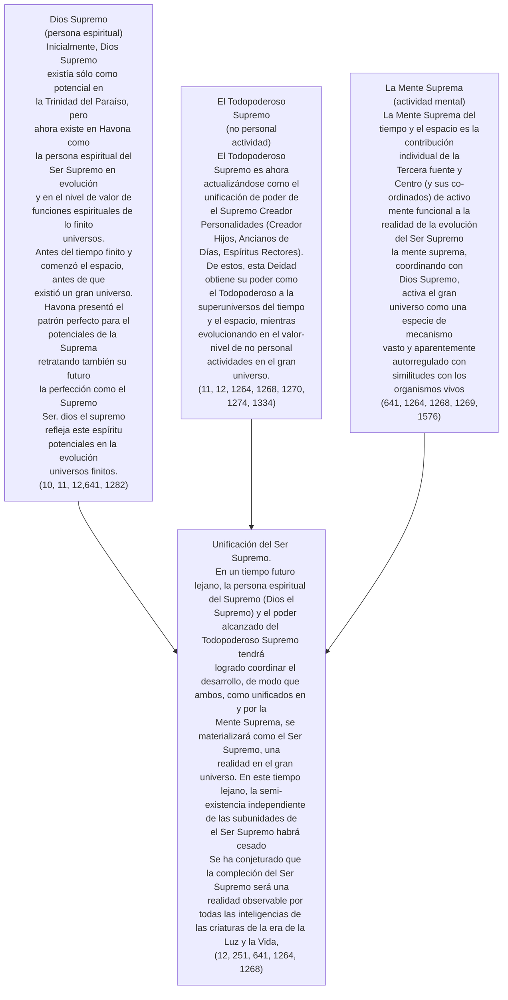

© 2000 Ken Glasziou © 2000 The Brotherhood of Man Library

En los Documentos de Urantia, algunos autores tienden a referirse al Ser Supremo como existente y aún no existente, por lo tanto, de manera similar a cómo los físicos de partículas tratan a las partículas como ondas y partículas simultáneamente.

Aunque el Ser Supremo en evolución aún debe completar su existencia, y aún permanece en una realidad finita en formas fragmentadas como Dios el Supremo, el Todopoderoso Supremo y la Mente Suprema, sin embargo, en los dominios trascendentes del Paraíso, el Ser Supremo ya «es».

Es un hecho que en algunos Documentos se hace una distinción muy concisa entre el Ser Supremo incompleto y aquellas partes que ahora son funcionales durante las etapas evolutivas del gran universo. En otros, el término «el Supremo» o «el Ser Supremo» se puede usar de tal manera que deja al lector la tarea de averiguar qué significa realmente. Otro término que se usa ocasionalmente es «Supremacía», y se refiere principalmente a los efectos conjuntos del Ser Supremo y la Trinidad del Paraíso.

Para aquellos con un interés incipiente en la filosofía y la teología, los conceptos expresados ​​en los Documentos de Urantia sobre las relaciones de la Deidad finita (inmanente) y trascendente tienen algunas similitudes con las ideas actuales de la filosofía y la teología del proceso. Sin embargo, en detalle y concepto, los Documentos de Urantia parecen estar muy por delante de cualquier trabajo actual.

Incluso un conocimiento modesto de la teología del proceso como se presenta, por ejemplo, en la Enciclopedia Británica, puede ser muy útil para profundizar nuestra comprensión de los Documentos de Urantia.

En los Documentos, se nos informa que la creatividad de nosotros, los humanos, se limita a clasificar las ideas básicas más que a su creación. Quizás esto confirme lo que muchos de nuestros más grandes matemáticos siempre han creído: no «crean» nuevos teoremas o leyes, sino que los «descubren». Naturalmente, esto genera muchos argumentos sobre dónde estaban estos teoremas antes de su descubrimiento, y también sobre quién los creó.

Los Documentos nos informan que todas las posibles ideas originales, conceptos, etc., ya están presentes como potenciales y posibilidades en el mantenimiento de los Absolutos del Infinito. ([LU 115:2.1](/es/The_Urantia_Book/115#p2_1), [LU 115:4.6](/es/The_Urantia_Book/115#p4_6))

Aquellas que se vuelven disponibles para nosotros los humanos aparentemente lo hacen porque ya han sido «procesadas» y están presentes y disponibles en la Mente Suprema ahora funcional. ([LU 117:5.10](/es/The_Urantia_Book/117#p5_10))

A través de la mente cósmica del Espíritu Infinito y los Espíritus Ayudantes de la Mente del Espíritu Madre del Universo, estos pensamientos preexistentes se presentan para nuestra selección, clasificación, recombinación y toma de decisiones. ([LU 117:4.8](/es/The_Urantia_Book/117#p4_8), [LU 117:5.11](/es/The_Urantia_Book/117#p5_11))

Al menos, así es como parece ser. Los cuadros que siguen pueden ser de ayuda para la realización de algunas clasificaciones autodirigidas.

> El Ajustador teje en la realidad misma del Supremo, con el consentimiento de la voluntad humana, los modelos de la naturaleza eterna de un hijo ascendente de Dios. ([LU 117:4.8](/es/The_Urantia_Book/117#p4_8))

## La Creación de los Universos

```mermaid
flowchart TB
    P1["Los Absolutos del Infinito
    Todas las posibilidades y potenciales, ya sean de materia,
    mente, espritu, evento o idea, todos son inicialmente y
    permanentemente existente en los Absolutos del Infinito,
    incluyendo todo lo que es, o puede llegar a ser, finito.
    Es a partir de estas posibilidades y potencialidades que el
    superuniversos (y todo lo que hay en ellos), más el
    cuerpos del espacio exterior, se crean como nuestra realidad finita.
    (1155, 1261, 1264, 1298)"]
    P2["Transmutando lo Trascendente
    Dado que estas posibilidades y potenciales residen en
    los Absolutos son trascendentes, es decir «fuera» de
    espacio y tiempo, para convertirse en realidad finita deben ser
    transmutado (transformado) para aparecer como actualizado
    realidad en un espacio y tiempo finitos.
    Esta es una tarea compartida, cuya integración es el
    función del Espíritu Infinito. Por cuestiones de no
    realidad personal, la actualización inicial es
    emprendida por los Arquitectos del Universo Maestro,
    luego por las Supremas Personalidades Creadoras (las
    Hijos Creadores, Ancianos de Días y Espíritus Maestros),
    que involucran al Ser Supremo.
    (1150, 1264, 1284, 1287, 1298)"]
    P3["El Ser Supremo Evolutivo
    Ahora presente como Dios. el Supremo (espíritu), la Mente
    del Supremo (mente), y el Todopoderoso Supremo
    (poder y actividades no personales), estos aspectos
    de la Deidad finita son funcionales durante la evolución de
    el Gran Universo a la Luz y la Vida.
    Cuando todo sea perfecto, la evolución del Supremo
    esta completado. Los aspectos transitorios del Supremo
    Entonces se unirá en lo inmanente y
    Dios perfeccionado de los Universos finitos, el Supremo
    Ser (251, 1268, 1269)"]
    P1 --> P2
    P2 --> P3
```

## Evolución del Ser Supremo

## Enlaces externos

- Artículo en Innerface International: https://urantia-book.org/archive/newsletters/innerface/vol7_3/page7.html

