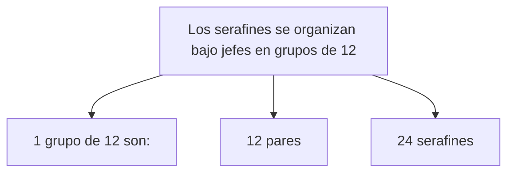
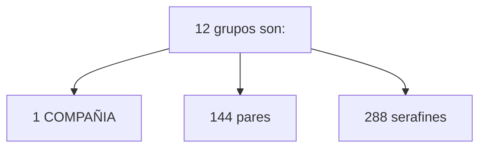
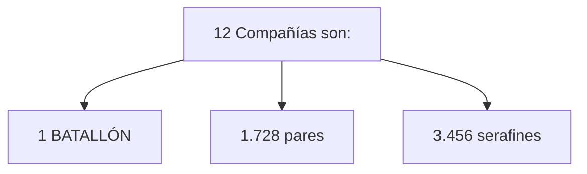
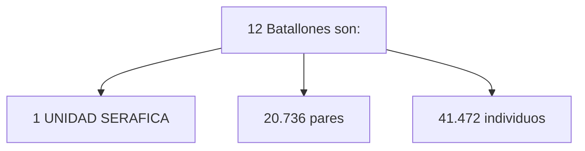
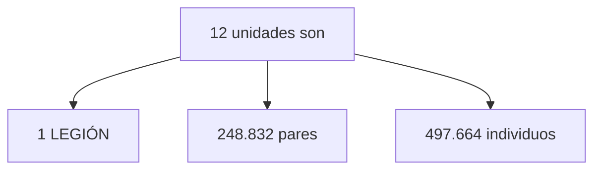
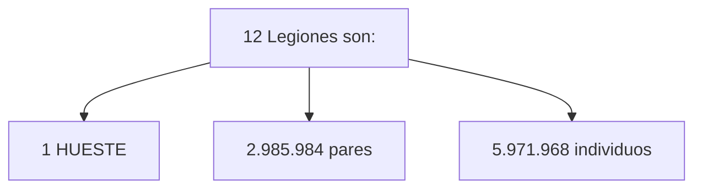
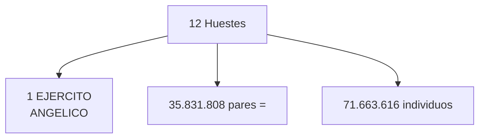
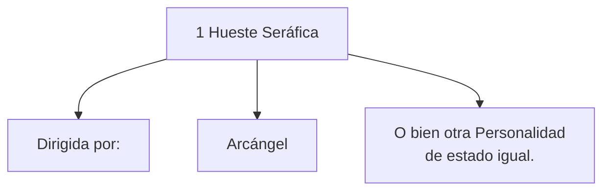
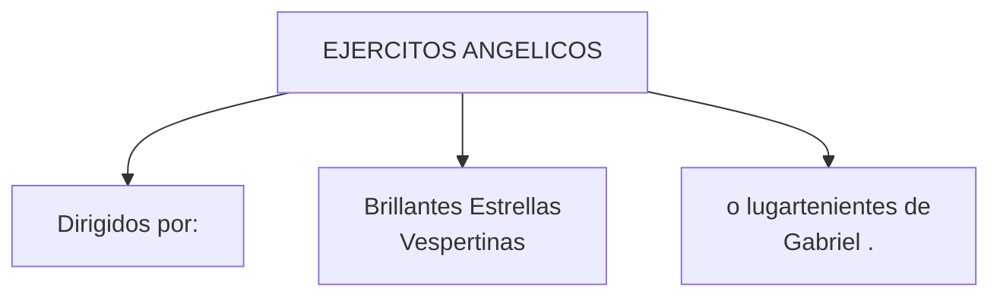
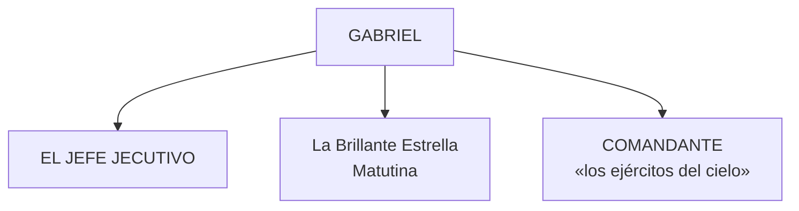

© 2005 Luis Coll © 2005 Asociación Urantia de España

<figure class="table chapter-navigator">
  <table>
    <tbody>
      <tr>
        <td>
        </td>
        <td>
        <a href="/es/index/articles_spain">
          «Asociación Urantia de España» — Índice
        </a>
        </td>
        <td>
        </td>
      </tr>
    </tbody>
  </table>
</figure>

## Documento 38, Pág. 421

Características de los Serafines: Pág. 418, 420, 421

1. Creados por: Espíritu Materno Universal
2. Origen: 7 esferas primarias de Salvingtón
3. Hogar: significa domicilio de 2 serafines (viven en pares)
4. Estado: no son masculino y femenino, son negativo y positivo
5. Características: no están caracterizados por la emoción sexual, aunque son enormemente personales y verdaderamente afectuosos
6. Organización: sedes de grupo, Compañía, Batallón, Unidad
7. Servicios: espíritus ministrantes del tiempo. Servicio en algún sistema local, sus asignaciones pueden comprender Nebadón e incluso Orvontón.

Después del segundo milenio de estadía en las sedes centrales seráficas, los serafines se organizan bajo jefes en grupos de doce (doce pares, 24 serafines), y doce de estos grupos constituyen una compañía (144 pares, 288 serafines) bajo el mando de un líder. Doce compañías bajo un comandante constituyen un batallón (1.728 pares ó 3.456 serafines), y doce batallones bajo un director equivalen a una unidad seráfica (20.736 pares ó 41.472 individuos), mientras que doce unidades, bajo el mando de un supervisor, constituyen una legión, que cuenta con 248.832 pares ó 497.664 individuos. Jesús aludió a un grupo de ángeles de este tipo aquella noche en el jardín de Getsemaní cuando dijo: «_Aún en este mismo momento puedo pedir a mi Padre y él inmediatamente me dará más de doce legiones de ángeles_». Doce legiones de ángeles comprenden una hueste que cuenta con 2.985.984 pares ó 5.971.968 individuos, y doce huestes (35.831.808 pares ó 71.663 .616 individuos) forman la organización más grande de serafines, el ejército angélico. Una hueste seráfica está dirigida por un arcángel o por alguna otra personalidad de estado igual, mientras que los ejércitos angélicos son dirigidos por las Brillantes Estrellas Vespertinas o por otros lugartenientes inmediatos de Gabriel. Y Gabriel es el «comandante supremo de los ejércitos del cielo», el ejecutivo en Jefe del Soberano de Nebadón, «es Dios Señor de las huestes».

Aunque sirven bajo la supervisión directa del Espíritu Infinito tal como está personalizado en Salvington, desde el autootorgamiento de Michael en Urantia, los serafines y todas las demás órdenes del universo local están sometidas ahora a la soberanía del Hijo Mayor. Aún cuando en Urantia nació Michael en la carne, se emitió una transmisión del superuniverso a todo Nebadón que proclamaba _«y dejad que todos los ángeles le adoren_». Todas las categorías de ángeles están sujetas a su soberanía; son parte de ese grupo que se ha denominado «sus ángeles poderosos».

Dirección y Comandantes:

Gabriel de Salvington es el Jefe Ejecutivo del universo de Nebadón - la Brillante Estrella Matutina- Comandante en Jefe de «los ejércitos del cielo» — es decir, las Huestes Celestiales. (Libro de Urantia [LU 33:4.6](/es/The_Urantia_Book/33#p4_6))

## Referencias

- [Este artículo en la web de la Asociación Urantia de España](https://aue.urantia-association.org/wp-content/uploads/sites/6/2018/03/OrganizacionSerafica.pdf)

<figure class="table chapter-navigator">
  <table>
    <tbody>
      <tr>
        <td>
        </td>
        <td>
        <a href="/es/index/articles_spain">
          «Asociación Urantia de España» — Índice
        </a>
        </td>
        <td>
        </td>
      </tr>
    </tbody>
  </table>
</figure>