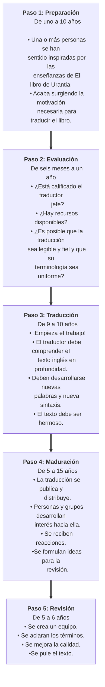

© 2019 Marilynn Kulieke © 2019 Fundación Urantia

<figure class="table chapter-navigator">
  <table>
    <tbody>
      <tr>
        <td>
        <a href="/es/article/UF_News_Online/Welcome_Contact_Details_2019_07">
          Bienvenida e información de contacto
        </a>
        </td>
        <td>
        <a href="/es/index/articles_uf_news_online#volume-13-issue-2-july-2019">
          Volumen 13, Número 2, Julio 2019 — Índice
        </a>
        </td>
        <td>
        <a href="/es/article/Judy_Van_Cleave/Noteworthy_Board_Decisions_from_the_April_2019_Trustees_Meeting">
          Decisiones destacadas de la reunión de abril de la Junta de Fideicomisarios
        </a>
        </td>
      </tr>
    </tbody>
  </table>
</figure>

<figure id="Figure_1" class="image urantiapedia image-style-align-left">

</figure>

_De Marilynn Kulieke, presidenta de Traducciones, vicepresidenta de la Fundación Urantia (Illinois, Estados Unidos)_

_Nota de la redacción: durante el Simposio Cultural celebrado en abril en la Fundación Urantia, Marilynn dio una presentación excelente e informativa sobre el proceso empleado para crear traducciones de calidad. Se grabó en vídeo y pueden_ [_verla aquí_](https://www.youtube.com/watch?v=_ufcn_nmc-A)_. El resultado final es un profundo agradecimiento hacia el increíble trabajo que se necesita para traducir_ El libro de Urantia_._

Un elemento clave para cumplir con el [objeto principal de la Fundación Urantia](https://www.urantia.org/es/fundacion-urantia/declaracion-de-fideicomiso#2) es crear traducciones de _El libro de Urantia_ en los numerosos idiomas de nuestro mundo. Las traducciones son una parte vital de nuestro trabajo para cumplir la misión de sembrar _El libro de Urantia_ y sus enseñanzas por todo el mundo.

Tengo el placer de servir como presidenta del comité de Traducciones. Otros miembros del comité son Georges Michelson-Dupont (responsable de traducciones), Henk Mylanus, Jay Peregrine, Minoo Claire y Tamara Strumfeld. Nuestro trabajo, que incluye la creación de este proceso, es en verdad un trabajo en equipo.

Nuestra meta es crear traducciones de la mayor calidad posible, y por lo tanto el comité de traducciones creó un proceso sistemático basado en nuestro amor por la Revelación Urantia. El desarrollo del proceso comenzó en 2006 y está basado en la Guía Estándar de Control de la Calidad en la Traducción que fue adoptada por ASTM International.

A medida que aplicábamos estos estándares, nos fue quedando claro que se necesitaría un proceso de cinco pasos de aproximadamente 40 años o más para producir una traducción de gran calidad. Estas etapas se resumen como sigue:
 

Al final del proceso, cuando la revisión ha madurado, es el momento de reintegrar el lenguaje ampliado y la claridad de pensamiento en las culturas y los canales evolutivos que esperan esta nueva verdad. La siguiente cita resume el trabajo en el que estamos involucrados:

> La civilización tiene que esperar al idioma para diseminarse. Las lenguas vivas y que se enriquecen aseguran la expansión de las ideas y los proyectos civilizados. Durante las épocas primitivas se hicieron progresos importantes en el lenguaje. Hoy existe la gran necesidad de un desarrollo lingüístico adicional que facilite la expresión del pensamiento en evolución. [LU 81:6.16](/es/The_Urantia_Book/81#p6_16)

## Referencias

- [Noticias en Línea de la Fundación Urantia](https://www.urantia.org/es/fundacion-urantia/archivos-de-boletin)
- [Este artículo](https://www.urantia.org/es/news/2019-06/crear-traducciones-con-amor-el-control-de-calidad-de-la-fundacion-urantia)

<figure class="table chapter-navigator">
  <table>
    <tbody>
      <tr>
        <td>
        <a href="/es/article/UF_News_Online/Welcome_Contact_Details_2019_07">
          Bienvenida e información de contacto
        </a>
        </td>
        <td>
        <a href="/es/index/articles_uf_news_online#volume-13-issue-2-july-2019">
          Volumen 13, Número 2, Julio 2019 — Índice
        </a>
        </td>
        <td>
        <a href="/es/article/Judy_Van_Cleave/Noteworthy_Board_Decisions_from_the_April_2019_Trustees_Meeting">
          Decisiones destacadas de la reunión de abril de la Junta de Fideicomisarios
        </a>
        </td>
      </tr>
    </tbody>
  </table>
</figure>
