© 2001 The Brotherhood of Man Library

<figure class="table chapter-navigator">
  <table>
    <tbody>
      <tr>
        <td>
        <a href="/es/article/William_Trimble/On_Completion">
          Al finalizar
        </a>
        </td>
        <td>
        <a href="/es/index/articles_innerface#volumen-8-no-2">
          Volumen 8 - No. 2 — Índice
        </a>
        </td>
        <td>
        <a href="/es/article/Ken_Glasziou/The_Least_We_Should_Know_about_the_Cross">
          Lo menos que debemos saber sobre la Cruz
        </a>
        </td>
      </tr>
    </tbody>
  </table>
</figure>

> Potenciales y patrones existenciales En la terminología del Universo, un patrón es inmutable, aunque las copias pueden proyectarse como material, espiritual o mental, o en cualquier combinación de estas energías. Puede impregnar personalidades, identidades, entidades o materia no viva. Los patrones son la sustancia de los potenciales. El patrón puede configurar la energía pero no la controla. La gravedad es el único control de la materia energética. Ni el espacio ni el patrón responden a la gravedad y no hay relación entre el espacio y el patrón. La realidad de cualquier patrón consiste en sus energías, su mente, espíritu o componentes materiales. El patrón es un diseño maestro del que se hacen copias. El Paraíso Eterno es el absoluto del patrón; el Hijo Eterno es la personalidad modelo; el Padre Universal es la fuente-ancestro directa de ambos.
{.is-info}

```mermaid
flowchart TB
    P1["
        Fase 1. La Trinidad\n
        Todas las posibilidades, reales y
        potencial, ya sea existencial,
        trascendental, o finito, tienen
        su origen con la Trinidad.
        El aspecto del YO SOY conocido
        como es el Absoluto No Cualificado,
        efectivamente, un gran almacén
        de toda la estática posible
        potencialidades y realidades.
        El mandato inicial para activar
        potenciales estáticos específicos
        deriva de la Trinidad y es
        respondido por la Deidad
        Absoluto.
    "]
    P2["
        Fase 2. El Absoluto de la Deidad\n
        El Absoluto de la Deidad responde
        a las causalidades contenidas en
        el mandato de la Trinidad
        de tal manera que resulte
        en la activación de potenciales,
        estático en el Unqualified
        Absoluto, para convertirse en finito
        reales
    "]
    P3["
        Fase 3. Los no calificados
        Absoluto\n
        Responde a la Deidad
        Absoluto a través de la
        activación de la correspondiente
        causante impregnado estático
        posibilidades y potencialidades.
    "]
    P4["
        Fase 4. El Absoluto Universal\n
        Responde a la nueva causalidad-
        impregnado pero todavía estático
        potenciales, compensando perfectamente
        las diferencias inherentes a la
        diversos aspectos de incompleto
        realidad, y preparándolos para
        volverse activo y receptivo a
        la influencia de ciertos
        agencias trascendentales que
        participar en su transmutación
        a realidades finitas.
    "]
    P5["
        Fase 5. La Deidad Definitiva\n
        La eventuación del universo.
        capacidades como consecuencia de la
        mandatos volitivos originales del
        Trinidad implica la transformación de
        estos potenciales indiferenciados en
        planes segregados y definidos. Esto es
        un acto de la Ultimidad de la Deidad también
        como múltiples agencias del
        nivel trascendental.
        Tales actos son una anticipación perfecta de
        las necesidades futuras del Maestro
        Universo y de acuerdo con el
        planos de los Arquitectos del Maestro
        El universo como encarnación del
        Concepto de deidad de los universos.
    "]
    P6["
        Fase 6. Rol del Actor Conjunto
        (el Espíritu Infinito) como Integrador\n
        El Espíritu Infinito universalmente
        integra las variables funcionales
        aspectos de toda la realidad actualizada en todos
        niveles de manifestación desde lo finito,
        a través de trascendentales, y hasta
        los absolutos.
    "]
    P7["
        Fase 7. Las Triodidades de
        Actualidad y Potencialidad\n
        La Triodidad de la Potencialidad consiste en
        los tres Absolutos del Infinito mientras
        la Triodidad de la Actualidad consiste en
        el Hijo Eterno, el Actor Conjunto
        (Espíritu Infinito) y la Isla del Paraíso.
        (nota: todas las cosas centro impersonal
        y aquí en la Isla del Paraíso.)
        Las triodidades actúan directamente sobre el
        Supremo y también indirectamente a través de la
        nivel eventuado de lo absonito y
        las acciones cooperativas de
        Supremas Personalidades Creadoras.
        Estos parecen ser los últimos pasos en
        la transferencia de lo existencial transmutado
        potenciales a actuales finitos de la realidad a
        El supremo.
    "]
    P8["
        Paso 8. El Supremo—
        Dios experiencial de lo finito
        Universos\n
        Los potenciales existenciales se transmutan en
        reales a medida que encuentran alojamiento con el
        Supremo. Allí, volvieron a ser
        potenciales para ser llamados fothth en
        realidad por el Supremo Creador
        Las personalidades en su función de
        creadores del Universo Maestro.
        aut mucho más que los potenciales finitos
        de la realidad material se derivan de la
        Supremo. El hombre mortal y todos los demás
        Las criaturas finitas son creadas a partir de la
        potencial vivo de energía, mente y
        espíritu existente en el Supremo.
        Y está fuera de la realidad de la
        Supremo que el Dios-espíritu que
        habita en cada individuo humano, con
        el consentimiento de ese individuo, teje esos
        patrones destinados a convertirse en un
        alma ascendente, mientras que esa misma
        individuo utiliza esas cualidades y
        cantidades ya existentes dentro del
        Supremo durante el crecimiento experiencial
        hacia el Padre Universal.
        Sin embargo, la experiencia de la humanidad con
        el Supremo es bidireccional, en que el
        experiencias de crecimiento del alma también
        contribuir a la evolución de la
        Supremo a través de múltiples agencias de
        divinidad.
    "]
    P1 ==> P2
    P2 ==> P3
    P3 ==> P4
    P4 ==> P5
    P5 ==> P6
    P6 ==> P7
    P7 ==> P8
```

## External links

* [Article in Innerface International](https://urantia-book.org/archive/newsletters/innerface/vol8_2/page8.html)

<figure class="table chapter-navigator">
  <table>
    <tbody>
      <tr>
        <td>
        <a href="/es/article/William_Trimble/On_Completion">
          Al finalizar
        </a>
        </td>
        <td>
        <a href="/es/index/articles_innerface#volumen-8-no-2">
          Volumen 8 - No. 2 — Índice
        </a>
        </td>
        <td>
        <a href="/es/article/Ken_Glasziou/The_Least_We_Should_Know_about_the_Cross">
          Lo menos que debemos saber sobre la Cruz
        </a>
        </td>
      </tr>
    </tbody>
  </table>
</figure>
