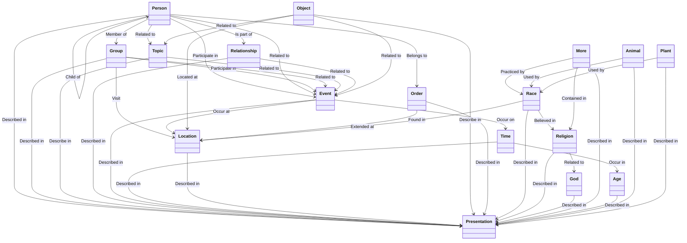

## JM Graph Data Model Extended

```mermaid
classDiagram
    Person --> Person : Relative of
    Person --> Person : Parent of
    Person --> Person : Child of
    Person --> Group : Member of
    Person --> Relationship : Is part of
    Person --> Event : Participate in
    Person --> Event : Related to
    Person --> Presentation : Described in
    Person --> Topic : Related to
    Person --> Order : Belongs to
    Group --> Event : Participate in
    Group --> Event : Related to
    Group --> Presentation : Described in
    Group --> Location : Visit
    Topic --> Presentation : Describe in
    Topic --> Event : Related to
    Relationship --> Presentation : Described in
    Relationship --> Event : Related to
    Event --> Presentation : Described in
    Event --> Time : Occur on
    Event --> Location : Occur at
    Time --> Presentation : Described in
    Time --> Age : Occur in
    Location --> Presentation : Described in
    Object --> Location : Located at
    Object --> Topic : Related to
    Object --> Presentation : Describe in
    Object --> Event : Related to
    Order --> Presentation : Described in
    Order --> Location : Found in
    Race --> Presentation : Described in
    Race --> Location : Extended at
    Race --> Religion : Believed in
    Religion --> Presentation : Described in
    Religion --> God : Related to
    God --> Presentation : Described in
    More --> Presentation : Described in
    More --> Race : Practiced by
    More --> Religion : Contained in
    Age --> Presentation : Described in
    Animal --> Presentation : Described in
    Animal --> Race : Used by
    Plant --> Presentation : Described in
    Plant --> Race : Used by
    Presentation
```