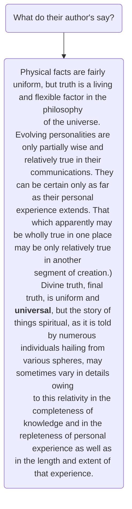

## JM Graph Data Model Extended

$$
\left.
\begin{array}{l}
  \text{7. Totalidad} \\
  \text{6. Personalidad} \\
    \left.
    \begin{array}{l}
      \text{5. Espíritu} \\
      \text{4. Mente} \\
      \left.
      \begin{array}{l}
        \text{3. Profundidad} \\
        \text{2. Altura} \\
        \text{1. Anchura}
      \end{array}
      \right\}
      \begin{array}{l}
      \text{Material,} \\
      \text{1ª integración}
      \end{array}
    \end{array}
    \right\}
    \begin{array}{l}
    \text{Fusión,} \\
    \text{2º integración}
    \end{array}
  \end{array}
\right\}
\begin{array}{l}
\text{Finalidad,} \\
\text{3ª integración}
\end{array}
$$