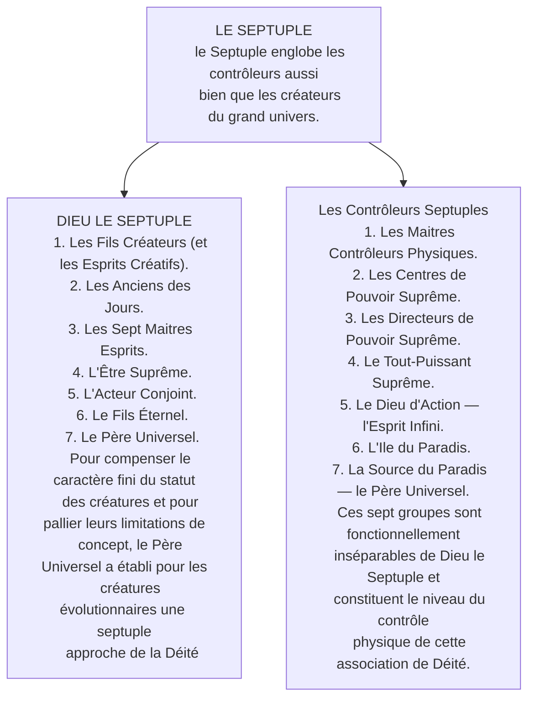

© 2021 Claude Flibotte © 2021 Association Francophone des Lecteurs du Livre d'Urantia

<figure class="table chapter-navigator">
  <table>
    <tbody>
      <tr>
        <td>
        <a href="/fr/article/Dominique_Ronfet/Promets_moi">
          Promets-moi
        </a>
        </td>
        <td>
        <a href="/fr/index/articles_le_lien#le-lien-urantien-numéro-96-décembre-2021">
          Le Lien Urantien — Numéro 96 — Décembre 2021 — Table des matières
        </a>
        </td>
        <td>
        <a href="/fr/article/Jean_Royer/Pause_Philosophique">
          Pause Philosophique
        </a>
        </td>
      </tr>
    </tbody>
  </table>
</figure>

## L'ORIGINE DE CETTE VISION GLOBALE

Ma réflexion a pris naissance lors d'une lecture de la revue Science \& Vie du mois d'aout 2021 aux pages 14 et 15 où il y avait une photographie du cœur de notre galaxie en direction de la constellation du Sagittaire prise, dans un premier temps, par le satellite Chandra de la NASA muni d'un télescope à rayon X. Par la suite, Daniel Wong, astronome, y a superposé une autre photo de la même région en ondes radio prise par le radiotélescope sud-africain MeerKAT. La combinaison des deux longueurs d'onde donne un aperçu des phénomènes de hautes énergies qui y règnent. Nous pouvons y distinguer de gigantesques ponts magnétiques distribuant son énergie du centre galactique vers les autres régions de la Voie lactée. Tout cela m'a remis en mémoire le travail des Centres Suprêmes de Pouvoir décrit dans le fascicule 29.

## Portrait de la réalité

<figure id="Figure_4" class="image urantiapedia image-style-align-right">

<figcaption>Chandra (télescope spatial)  Placé sur une orbite haute elliptique de 10 000 x 140 000 km qui permet de longues périodes d'observation continues, Chandra est utilisé pour étudier le rayonnement X émis par différents objets célestes et des processus tels que l'évolution conjointe des trous noirs supermassifs et des galaxies, la nature de la matiêre noire et de l'énergie noire, la structure interne des étoiles à neutrons, l'évolution des étoiles massives, les protonébuleuses planétaires et l'interaction des exoplanêtes avec leur étoile. (Wikipedia)</figcaption>
</figure>

Dans la description de la réalité telle qu'expliquée par les révélateurs du Liure d'Urantia, nous abordons celle-ci par l'un des pôles de toute la réalité d'existence. Celui-ci se compose de la réalité existentielle, infinie et éternelle de la Déité habitant l'Ile du Paradis et décrite en partie dans les fascicules 1 à 13 . Ces fascicules nous parlent des dieux, de leur nature parfaite, de leur expression à travers la création et du but de l'entremise des Créateurs Suprêmes et de leurs créatures, leurs enfants subinfinis. Ce niveau d'existence paradisiaque est la perfection absolue. L'autre pôle étant comblé par tous les êtres humains primitifs, parfaits dans leur animalité d'origine. Évidemment, cette vision globale de l'existence concerne exclusivement le niveau de conscience d'exister des êtres concernés dans cet exposé excluant la matière inerte.

L'étape suivante de cette réalité est composée de l'Univers Central de Havona décrit dans le fascicule 14. Il s'agit de la création originelle et parfaite des Déités Paradisiaques servant de modèle pour toute la suite du grand plan d'expression divine. Les choses et les êtres y sont éternellement parfaits, mais depuis l'existence des niveaux suivants de réalité, l'ajout des connaissances expérientielles qualifie leur formation.

La suite logique du plan divin consiste en l'existence des sept superunivers, domaine du temps et de l'espace, terrain idéal d'acquisition d'expériences partant de l'imparfait pour devenir parfait. C'est à ce niveau que nous trouvons le deuxième pôle mentionné plus avant. Nous pouvons y trouver une référence dans presque la totalité du _Livre d'Urantia_, soit du fascicule 15 au fascicule 118, et même pouvons-nous y inclure dans la suite du livre les expériences de notre Fils Créateur, modèle idéal pour l'aboutissement humain vers la perfection de divinité.

 

## Du Parfait À L'imparfait

Nous voyons donc selon ce portrait de la réalité que le parfait cherche à travers l'existence imparfaite l'expérience nécessaire pour rendre parfait ce qui ne l'était pas au départ. C'est ainsi qu'une toute nouvelle réalité d'existence d'êtres devenus parfaits est réalisée contrastant avec les êtres parfaits de Havona. Cette diversité créative représentant le summum de la beauté céleste exprimé par la beauté du Créateur parfait rendant possible la beauté d'une créature devenue parfaite!

**L'énergie dans tout cela!**

Dieu n'est pas simplement esprit, il est aussi énergie [^1]. C'est justement cette image du centre de notre galaxie qui m'inspira cette vision plus claire du rôle des Directeurs de Pouvoir d'Univers, principalement de leurs descendants s'occupant activement des univers du temps et de l'espace, les Centres Suprêmes de Pouvoir du grand univers. Ils opèrent en sept groupes ([LU 29:2.2-8](/fr/The_Urantia_Book/29#p2_2) ) contrôlant mentalement tout l'immense réseau des vastes fonctions exercées par les Maitres Contrôleurs Physiques et les Superviseurs de Pouvoir Morontiel ([LU 29:2.9](/fr/The_Urantia_Book/29#p2_9)).

Depuis la création des univers du temps et de l'espace, les Centres de Havona, le deuxième groupe des Centres Suprêmes de Pouvoir, y sont maintenant nécessaires puisque cet évènement a précipité Havona dans son deuxième âge. Pour l'instant, et dans Havona seulement, il existe un contrôle parfait de l'énergie ( [LU 29:2.12](/fr/The_Urantia_Book/29#p2_12) ).

Sur chacune des capitales des sept superunivers, dont Uversa capitale de notre superunivers Orvonton, il y a mille Centres de Superunivers, le troisième groupe. Trois courants d'énergie primaire, qui se subdivisent chacun en dix ségrégations, entrent dans ces centres de pouvoir et sept circuits de pouvoir spécialisés et bien dirigés, bien qu'imparfaitement contrôlés, sortent de leur siège d'action unifiée. C'est l'organisation électronique du pouvoir d'univers ( 29 : 2.13). Ces circuits septuples d'organisation électronique révèlent une sensibilité variable à la gravité locale ou linéaire. Ils sont des mouvements d'énergies dirigés pour des buts spécifiques, analogues au Gulf Stream, qui baigne chaque superunivers ( [LU 29:2.15](/fr/The_Urantia_Book/29#p2_15) ). C'est à ces courants d'énergie que fait référence l'image dont je vous entretenais en début de texte.

## L'ÉNERGIE, ENCORE PLUS PRÈS DE NOUS

En se rapprochant un peu plus de notre existence terrestre, ce sont les cent _Centres d'Univers Local_ stationnés sur les mondes sièges des univers locaux qui opèrent de façon à abaisser et modifier encore d'autres façons les sept circuits de pouvoir émanant du siège de leur superunivers afin de les rendre applicables aux services des constellations et des systèmes. Dans notre cas, ils sont stationnés sur Salvington. Ils sont d'une aide précieuse à notre Fils Créateur, Micaël de Nébadon, pendant les périodes finales d'organisation de l'univers et de mobilisation d'énergie. Imaginez-vous l'espace dans notre univers parcouru par un libre mouvement in-
différencié d'énergies et parmi eux des couloirs d'énergie reliant deux centres de pouvoir ou deux contrôleurs physiques. Ces circuits d'énergie individualisés sont utiles pour les communications interplanétaires entre autres ( [LU 29:2.16](/fr/The_Urantia_Book/29#p2_16) ).

## ENCORE PLUS PRÈS DE NOUS

Le cinquième ordre des _Centres de Pouvoir_, les _Centres de Constellation_, sont au nombre de dix et ils sont stationnés dans chaque constellation. Ils sont des projecteurs d'énergie vers les cent systèmes locaux tributaires. De ces êtres sortent les lignes de pouvoir destinées aux communications, aux transports et comme alimentation énergétique des créatures vivantes qui dépendent de ces énergies physiques ( [LU 29:2.17](/fr/The_Urantia_Book/29#p2_17) ). Je vois dans cette dernière affirmation, les médians et les êtres non-respirateurs.

## EN QUOI CELA NOUS CONCERNE-T-IL?

Un _Centre Suprême de Pouvoir_ est affecté en permanence à chaque système local. Ces centres systémiques envoient les circuits de pouvoir aux mondes habités du temps et de l'espace. Ils coordonnent les activités des contrôleurs physiques subordonnés et agissent aussi pour assurer la distribution satisfaisante du pouvoir dans le système local. Les relais de circuits entre les planètes dépendent de la coordination parfaite de certaines énergies matérielles et de la régulation efficace du pouvoir physique ( [LU 29:2.18](/fr/The_Urantia_Book/29#p2_18) ).

Les planètes individuelles sont confiées aux soins des _Maitres Contrôleurs Physiques_. Ils reçoivent les lignes de pouvoir encircuitées envoyées par les centres de pouvoir de leur système. Sauf exception extrêmement rare, un _Centre non classé_ est affecté à une planète pour cause de relations énergétiques tout à fait extraordinaire ou ce _Centre non classé_ agit comme balancier universel ou gouverneur d'énergie ([LU 29:2.19](/fr/The_Urantia_Book/29#p2_19)). Un corps spatial sur un million est dans ce cas, et je pense qu'Urantia en fait partie puisqu'elle est située à proximité d'un circuit d'énergie extrêmement puissant.

En quoi les _Centres Suprêmes de Pouvoirs_ nous concernent-ils ? Je vous répondrais que sans eux nous n'existerions pas! Puisque tout est énergie, tout ce qui constitue notre monde matériel, les plantes, les animaux, nos corps sont faits d'énergie transformée en atomes, puis en molécules et en cellules vivantes ( [LU 42:1.2](/fr/The_Urantia_Book/42#p1_2) ). La présence des _Maitres Contrôleurs Physique_ est toujours requise lorsque les _Porteurs de Vie_ implantent la vie sur une planète.

## ANATOMIE D'UN CENTRE SUPRÊME DE POUVOIR

Les centres de pouvoir utilisent de vastes mécanismes et des coordinations d'ordre matériel en liaison avec les mécanismes vivants des diverses concentrations d'énergie séparées. Chaque centre de pouvoir individuel est composé exactement d'un million d'unités de contrôle fonctionnel et ces unités modificatrices d'énergie ne sont pas stationnaires comme les organes vitaux du corps physique de l'homme; ces « organes vitaux » de régulation de pouvoir sont mobiles et vraiment kaléidoscopiques dans leurs possibilités d'association ([LU 29:3.7](/fr/The_Urantia_Book/29#p3_7)).

Ces êtres, ainsi que les contrôleurs physiques dont je ferai mention plus loin, sont tous créés parfaits et agissent parfaitement. Ils ne changent jamais de fonction. Ils sont entièrement pratiques dans tous leurs actes et sont toujours en service. Ils ne s'occupent que de pouvoir d'énergie matérielle ou semi-physique. Ils ne l'émettent pas, mais le modifient, le manipulent et l'orientent. Ils ont le pouvoir de résister à la gravité linéaire. Ces contrôleurs suprêmes de pouvoirs opèrent toujours à partir de sphères architecturales conçues pour faciliter leurs opérations ([LU 29:3.9](/fr/The_Urantia_Book/29#p3_9)). Ces êtres sont étroitement associés d'une certaine manière au supercontrôle cosmique de l'Être Suprême ([LU 29:3.3](/fr/The_Urantia_Book/29#p3_3)).

> Les luttes spirituelles du temps et de l'espace concernent l'évolution de la maitrise de l'esprit sur la matière par la médiation du mental (personnel). L'évolution physique (non personnelle) des univers s'occupe d'amener l'énergie cosmique à s'harmoniser avec les concepts mentaux d'équilibre soumis au supercontrôle de l'esprit. L'évolution totale de l'ensemble du grand univers est une affaire d'unification, par la personnalité, du mental contrôlant l'énergie, avec l'intellect coordonné par l'esprit ; elle sera révélée dans la pleine apparition du pouvoir tout-puissant du Suprême. ([LU 116:5.15](/fr/The_Urantia_Book/116#p5_15))

> Dans les superunivers évolutionnaires, l'énergie-matière est dominante sauf dans la personnalité, où l'esprit, par la médiation du mental, lutte pour la maitrise. Le but des univers évolutionnaires est l'assujettissement de l'énergie-matière par le mental, la coordination du mental avec l'esprit, et tout ceci, en vertu de la présence créative et unificatrice de la personnalité. Ainsi, par rapport à la personnalité, les systèmes physiques deviennent subordonnés, les systèmes mentaux deviennent coordonnés et les systèmes spirituels deviennent directifs. ([LU 116:6.1](/fr/The_Urantia_Book/116#p6_1))

## Les Maitres Contrôleurs Physiques

Les _Maitres Contrôleurs Physiques_ sont peutêtre plus intéressants à connaitre pour nous, puisqu'ils opèrent sur les planètes individuelles comme la nôtre. Ils peuvent se métamorphoser afin de s'engager dans une diversité de transports autonomes. Ils peuvent traverser l'espace presque à la vitesse des _Messagers Solitaires_ soit près de 1 354 458 739 000 km / s ce qui n'est pas peu dire! Cependant, comme tous les traverseurs d'espace, il leur faut l'aide de leurs compagnons et de certains autres types d'êtres pour vaincre la gravité de la planète et la résistance de l'inertie lorsqu'ils partent d'une sphère matérielle ([LU 29:4.1](/fr/The_Urantia_Book/29#p4_1)).

Les _Maitres Contrôleurs Physiques_ sont de sept ordres. Les trois premiers sont personnels, mais les quatre derniers paraissent plutôt automatiques, mais super intelligents ([LU 29:4.13](/fr/The_Urantia_Book/29#p4_13)). Ils ajustent les énergies fondamentales non découvertes sur Urantia pour le transport interplanétaire et les communications. Ces énergies sont également employées par les médians ([LU 29:4.14](/fr/The_Urantia_Book/29#p4_14)).

Orvonton compte trois milliards de _Directeurs de pouvoir adjoints_ soit trois millions par secteur mineur. En plus de leurs fonctions énergétiques, ils servent à instruire tous ceux qui étudient les sciences des techniques de contrôle et de transmutation de l'énergie ([LU 29:4.16](/fr/The_Urantia_Book/29#p4_16)).

Des billions et des billions de contrôleurs machinaux sont commissionnés dans Ensa, notre secteur mineur. Ils sont de loin les plus puissants affectés à un monde habité. Ils possèdent le don d'antigravité surpassant tous les autres ordres d'êtres. Dix d'entre eux étaient stationnés sur notre sphère au moment des révélations du _Livre d'Urantia_. Leur fonction principale est de faciliter le départ des transports séraphiques leur permettant d'atteindre la vitesse de 899 580 km / s ([LU 23:3.2](/fr/The_Urantia_Book/23#p3_2)). Pour faire cela, ils agissent tous à l'unisson, pendant qu'une série couplée de mille transmetteurs d'énergie fournit la force vive initiale pour le départ ([LU 29:4.19](/fr/The_Urantia_Book/29#p4_19)). Ensemble ou individuellement, ils agissent sur l'énergie. Pour se faire une idée boiteuse de leurs fonctions, ils agissent comme nos transformateurs électriques, nos interrupteurs, nos amplificateurs, nos transistors électroniques, etc.

Les _Transformateurs d'énergie_ sont habituellement au nombre de cent par monde habité ([LU 29:4.22](/fr/The_Urantia_Book/29#p4_22)). Ce sont les inspecteurs planétaires des départs séraphiques. Ils sont de puissants commutateurs vivants décisionnels d'action. Ils peuvent aussi isoler une planète des puissants courants d'énergies qui passent à proximité.

Les quatre autres ordres de _Maitres Contrôleurs_ sont à peine des personnes comme nous le comprenons. Les _Transmetteurs d'énergie_ pourraient se comparer à nos lignes électriques pour diriger l'énergie vers un nouveau circuit. Ils se disposent sur la trajectoire désirée, et grâce à leur pouvoir d'attraction énergétique, ils redirigent l'énergie là où elle est attendue. Ils peuvent dé- tecter un courant faible, puis l'amplifier afin de le transmettre de manière intelligible pour les receveurs de télédiffusions ([LU 29:4.29](/fr/The_Urantia_Book/29#p4_29)). Ils sont indispensables, avec les transformateurs d'énergie, pour maintenir la vie sur les mondes à atmosphère pauvre et pour les non-respirateurs ([LU 29:4.31](/fr/The_Urantia_Book/29#p4_31)).

Les _Associateurs Primaires_ sont des conservateurs d'énergie un peu semblable aux plantes qui mettent en réserve la lumière solaire. Ils convertissent les énergies de l'espace en un état physique inconnu de nous. Ils sont des catalyseurs vivants capables de transformations jusqu'au point de produire quelques-unes des unités primitives de l'existence matérielle ( 29 : 4.32). Ils manipulent les atomes, les électrons et les ultimatons pour leur faire exprimer des états différents de la matière. Ils libèrent également de l'énergie dans les moments déficitaires.

Les _Dissociateurs Secondaires_ sont l'inverse des Associateurs. Ils sont doués d'immenses facultés antigravitationnelles. Ils sont concernés par l'évolution d'une forme d'énergie peu connue de nous au moment de cette révélation (énergie nucléaire ?) ([LU 29:4.35](/fr/The_Urantia_Book/29#p4_35)).

Les frandalanks ont pour fonction d'enregistrer automatiquement le statut de toutes les formes d'énergie-force, qualitativement et quantitativement. Les chronoldeks sont des frandalanks qui enregistrent en plus la présence du temps ([LU 29:4.37](/fr/The_Urantia_Book/29#p4_37)).

### IDÉES FARFELUES OU PAS！

Dans cette étude, nous venons de voir que l'énergie pure de la Déité se transmue en de multiples formes et manifestations qui ne sont pas toutes reconnues de nous. Lorsque nous aurons découvert la forme d'énergie mentionnée en [LU 42:1.3](/fr/The_Urantia_Book/42#p1_3) et espérant que notre humanité aura atteint un haut niveau de sagesse, nous serons en mesure de maitriser la rotation énergétique des unités électriques de la matière au point d'en modifier les manifestations physiques ([LU 42:1.4](/fr/The_Urantia_Book/42#p1_4)). Imaginer les possibilités inouïes que cela représenterait!

Plusieurs phénomènes étranges pour nous sont rapportés assez régulièrement dans les médias. Je fais allusion ici aux objets volants non identifiés. Notre civilisation est bien jeune, et sans aucun doute à la quantité de mondes habités plus âgés que le nôtre existant dans l'univers, la science y a surement fait des pas de géant comparativement à la nôtre. Sur Jérusem, les adamites se déplacent dans des véhicules atteignant la vitesse de 800 km / h ([LU 46:2.4](/fr/The_Urantia_Book/46#p2_4)). Alors, comment ne pas imaginer que des visiteurs d'autres planètes puissent nous étudier ! Alors, pourquoi ne nous contactent-ils pas ?

La réponse à cette question me semble évidente ! Nous sommes tellement primitifs! Qui voudrait nous contacter ? Le seul véritable intérêt pour eux, c'est de nous étudier comme nous étudions le règne animal. De plus, en sachant que nous sommes tous des frères cosmiques, ne serait-il pas sage de leurs parts de nous laisser grandir sachant qu'un plan divin est à l'œuvre pour nous le permettre! C'est la fameuse di- rective première dans Star Trek!Autre raison, notre monde est en quarantaine gracieuseté de l'insurrection bien connue, ils ne font qu'observer la consigne !

Par contre, et de manière invisible pour nous, nous savons être constamment visités par des estudiantins cosmiques. Une foule d'êtres célestes travaille à notre réhabilitation comprenant les anges, les médians, les Melchizédeks, les Porteurs de Vie et j'en passe! Alors, sommes-nous seuls dans l'univers ? La réponse est définitivement non, nous sommes une multitude !

En faisant une recherche dans _Le Livre d'Urantia_ sur le mot « contrôleurs physiques », pas moins de cent citations font référence à eux. C'est dire à quel point ils sont importants dans l'économie d'une planète et indispensable à notre existence！Nous sommes familiers avec le concept du Père en tant qu'esprit parfait, il serait bien de le concevoir aussi en tant qu'énergie, vie et soutien de sa vaste création

Claude Flibotte

Sainte-Julie — Québec

<figure class="table chapter-navigator">
  <table>
    <tbody>
      <tr>
        <td>
        <a href="/fr/article/Dominique_Ronfet/Promets_moi">
          Promets-moi
        </a>
        </td>
        <td>
        <a href="/fr/index/articles_le_lien#le-lien-urantien-numéro-96-décembre-2021">
          Le Lien Urantien — Numéro 96 — Décembre 2021 — Table des matières
        </a>
        </td>
        <td>
        <a href="/fr/article/Jean_Royer/Pause_Philosophique">
          Pause Philosophique
        </a>
        </td>
      </tr>
    </tbody>
  </table>
</figure>

## Notes

[^1]: ÉNERGIE est employé comme un terme global appliqué aux domaines spirituel, mental et matériel. Le mot force est employé généralement de la même manière. L'emploi du mot pouvoir ne sert habituellement qu'à désigner le niveau électronique de la matière, la matière du grand univers qui réagit à la gravité linéaire. Pouvoir est également utilisé pour désigner la souveraineté. Nous ne pouvons nous conformer à vos définitions généralement acceptées pour la force, l'énergie et le pouvoir. Votre langage est si pauvre qu'il nous faut assigner à ces termes des significations multiples. ([LU 0:6.2](/fr/The_Urantia_Book/0#p6_2))