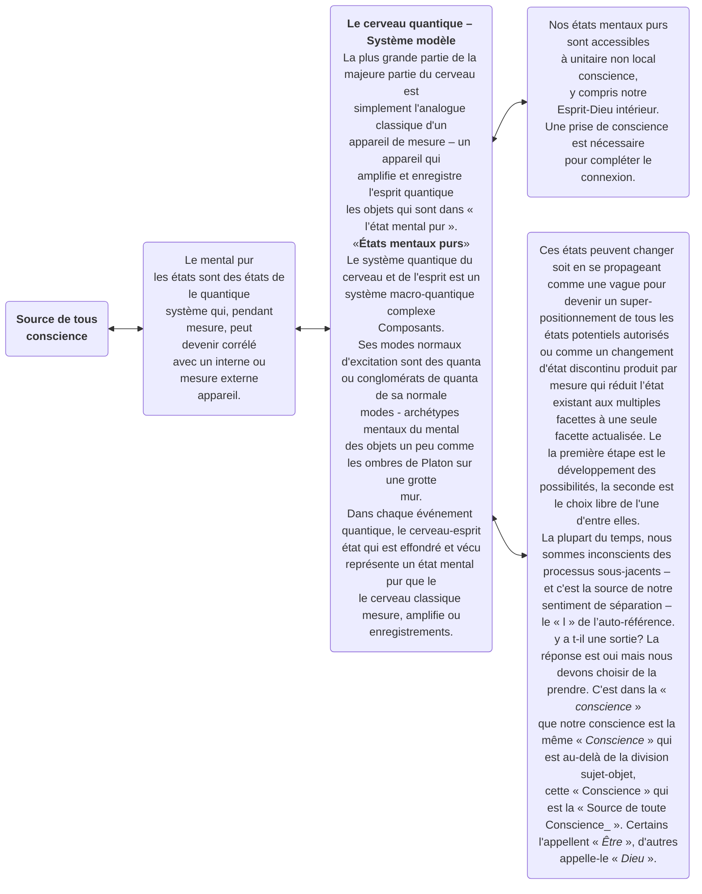

© 2004 Ken Glasziou © 2004 La Bibliothèque de la Confrérie des Hommes

<figure class="table chapter-navigator">
  <table>
    <tbody>
      <tr>
        <td>
        <a href="/fr/article/Ken_Glasziou/The_Challenge">
          Le défi
        </a>
        </td>
        <td>
        <a href="/fr/index/articles_innerface#volume-11-no-5">
          Volume 11 - No. 5 — Table des matières
        </a>
        </td>
        <td>
        <a href="/fr/article/Ken_Glasziou/The_Earth_Moon_System">
          Le système Terre-Lune
        </a>
        </td>
      </tr>
    </tbody>
  </table>
</figure>

La plupart des Occidentaux considèrent comme un fait scientifique l’idée selon laquelle nous vivons dans un monde matérialiste – un monde dans lequel tout est fait de matière et dans lequel la matière est considérée comme la seule réalité fondamentale.

Ce scénario doit en grande partie ses origines au mathématicien français René Descartes, qui, il y a 400 ans, a proposé sa célèbre philosophie du dualisme, qui divise le monde en une sphère objective de la matière et une sphère subjective de l'esprit. Ensemble, ceux-ci consacrent ses idées du monde comme étant simplement une machine.

Pire encore, un siècle plus tard, Newton et ses héritiers établirent de manière concluante le principe du déterminisme causal, le concept selon lequel tout mouvement peut être prédit avec exactitude en utilisant uniquement les lois physiques du mouvement et les conditions initiales du système en mouvement.

Imaginez un tas de boules de billard sur une table de billard parfaitement plane. Compte tenu des équations de mouvement de Newton et des positions initiales, des masses et des vitesses de toutes ces boules à un moment initial, alors, comme le prétend le déterminisme, tout l'avenir de ces boules de billard peut être calculé.

La portée philosophique de ce type de pensée s'est tellement enracinée qu'un autre philosophe-scientifique français, Pierre Laplace, a pu proposer que si une intelligence supérieure, à un moment donné, connaissait toutes les forces par lesquelles la nature est animée , et à un moment initial connaissait également la position et la vitesse de chaque particule de matière, alors, pour cette intelligence supérieure, ni le passé ni l'avenir de l'univers ne seraient incertains.

Laplace a également écrit un livre très réussi sur la mécanique céleste. Cela a attiré l’attention de son empereur, Napoléon, qui a demandé pourquoi il ne faisait aucune mention de Dieu – ce à quoi Laplace a répondu : « Votre Majesté, je n’ai pas besoin de cette hypothèse. » Dans un monde newtonien entièrement déterministe, Dieu n’était plus nécessaire !

A ces principes d’objectivité et de déterminisme de la physique classique, un troisième a été ajouté par Einstein. Cela est dû à sa déclaration selon laquelle la vitesse de la lumière était une vitesse limite dans le vide – la vitesse de la lumière était une constante qu'aucune chose matérielle ne pouvait dépasser.

Les implications de cette limitation de vitesse étaient considérables, la plus importante étant peut-être que toutes les interactions entre les objets matériels dans l'espace-temps doivent voyager à travers l'espace, une pièce à la fois, et avec une vitesse finie. Par conséquent, toutes ces interactions doivent être « localisées » : elles doivent se produire dans les limites fixées par la vitesse de la lumière. Ce fait a reçu le nom de « principe de localité ». Nous apprendrons plus tard que certains événements quantiques importants ignorent le principe et peuvent se produire instantanément, même aux extrémités opposées de l’univers. De tels événements sont dits « non locaux ».

Pendant environ 200 ans, le dualisme cartésien est resté plus ou moins incontesté. Mais ensuite, les scientifiques, en particulier, ont commencé à remettre en question l’aspect mental du dualisme, en lui substituant le principe du monisme matériel, ce qui signifie qu’il n’y a qu’un seul principe central, dans ce cas, la matière. Par conséquent, l’esprit, la conscience et l’esprit étaient relégués au rang d’épiphénomènes, n’existant que comme dérivés de la matière.

Et c’est à peu près là que se trouve aujourd’hui la majorité du monde occidental – sans se rendre compte qu’ils ont plus de cinquante ans de retard sur les découvertes empiriques de la science moderne – ce que nous allons maintenant chercher à démontrer.

<figure class="image urantiapedia image-style-align-left">

<figcaption><em>L'expérience de Thomas Young de 1803. La lumière provenant de la source lumineuse (à l'extrême gauche) passait à travers un petit trou (A), puis à travers deux fentes parallèles (B) pour briller sur un écran (C) et produire un série de barres claires et sombres que Young a interprétées en termes d'ondes lumineuses interférant les unes avec les autres.</em> </figcaption>
</figure>

<figure class="image urantiapedia image-style-align-right">

<figcaption><em>Dans l'expérience de Thomas Young, les ondes lumineuses traversent un sténopé jusqu'à deux fentes, puis se concentrent sur un écran pour produire un motif d'interférence de bandes claires et sombres alternées.</em> </figcaption>
</figure>

## Au-delà de l'espace, au-delà de toute chose

Nous devons d’abord savoir qu’il existe un énorme écart de taille entre le monde microscopique de l’atome et ce monde que nous considérons normalement comme étant microscopique – quelque chose de visible au microscope. Avec un très bon microscope, les bactéries et autres organismes unicellulaires peuvent devenir visibles. Leur taille est généralement comprise entre 1 et 10 x 10^-4^ cm. Un atome mesure environ 10^-8^ cm ; le noyau d’un atome mesure environ 10^-13^ cm ; un électron d'environ 10^-21^ cm. (10^-6^ = un 1 millionième ; 10^-9^ = 1 milliardième)

Peut-être que nos premières indications sur les particularités du monde quantique sont venues au début du 19ème siècle lorsque le Britannique Thomas Young a obtenu des preuves sans équivoque que la lumière avait des caractéristiques similaires à celles observées dans un étang d'eau lorsque des fronts d'ondes émanant de différentes perturbations se rencontrent. Là où leurs pics de vagues se rencontrent, ils se renforcent. Lorsque le creux rencontre le pic, ils s’annulent.

Le concept de Young sur les caractéristiques ondulatoires sous-jacentes de la lumière a dominé la physique pendant les cent années suivantes. Mais ensuite, le jeune Einstein a mis un coup de marteau dans les travaux avec son interprétation de ce qu'on appelle l'effet photoélectrique, qui impliquait que la lumière se comportait également comme si elle était constituée de particules. Il s’est avéré que Young et Einstein avaient raison : la lumière se comporte à la fois comme une onde et comme une particule.

La particule lumineuse reçoit le nom de « photon ». Il est également déterminé qu’il est sans masse. Alors qu’en est-il des autres particules subatomiques, celles qui ont une masse, voire une charge électrique, comme l’électron par exemple ?

Des expériences du même genre que celles de Young, dans lesquelles un faisceau étroit d’électrons passait à travers deux fentes parallèles puis sur un écran, donnaient le même résultat que celui obtenu par Young : un motif d’interférence de barres étroites entrecoupées d’espaces. Ainsi, les électrons semblent également avoir des caractéristiques ondulatoires. Cependant, lorsque des électrons étaient utilisés, il était également techniquement possible de ralentir leur taux de présentation jusqu'à ce qu'un seul électron à la fois soit présenté.

Au début, le résultat semblait être que chaque électron s’enregistrait sur l’écran comme un point unique – celui attendu pour un comportement semblable à celui d’une particule. Mais au fur et à mesure que le temps passait et que des milliers de spots s'accumulaient sur l'écran, le résultat fut extraordinaire : une série de barres entrecoupées de vides se creusant lentement (voir ci-dessous). Et puisque chaque électron passait par les fentes, un à la fois, pour que ce motif de barres claires et sombres se forme, chaque électron devait sûrement passer par les deux fentes et interférer d’une manière ou d’une autre avec lui-même !!

De nombreuses années d’expérimentations assez ingénieuses ont été nécessaires pour cataloguer ce qui se passe.

> Dieu possède un pouvoir illimité de connaitre toutes choses. Sa conscience est universelle. ([LU 3:3.3](/fr/The_Urantia_Book/3#p3_3))

<figure class="image urantiapedia image-style-align-right">

<figcaption><em>Avec notre dispositif expérimental similaire à celui de Thomas Young mais en utilisant des électrons au lieu de la lumière pour bombarder les fentes, nous obtenons des résultats similaires à ceux de la lumière : un motif interférent lorsque les deux fentes sont ouvertes et une seule barre pour une seule fente. ouvrir. Mais le taux de présentation des électrons pourrait être ralenti jusqu'à ce qu'un seul électron soit présenté à la fois. Initialement, cela donnait une seule barre directement derrière chaque fente. Mais au fur et à mesure que le temps avançait, le schéma interférentiel s’est à nouveau lentement construit. La conclusion : chaque électron interfère avec lui-même !</em> </figcaption>
</figure>

## Un choix différé équivaut à une « nécromancie ? »

Au vu des résultats surprenants déjà obtenus, il était inévitable que, tôt ou tard, quelqu'un pose la question apparemment stupide : « Que se passerait-il si la deuxième fente n'était pas ouverte avant que son photon ou son électron n'ait déjà traversé la fente ouverte alternative ? »

Le résultat réel du test de cette hypothèse est illustré ci-dessous. Avec une seule fente ouverte, une seule barre a été obtenue (non représentée).

Lorsque la deuxième fente a été ouverte, mais seulement après que le photon ait déjà traversé et dépassé la première fente, les points individuels se sont progressivement accumulés dans les barres du motif d'interférence. Cela restait vrai lorsque tout signal pour ouvrir la deuxième fente devait dépasser la vitesse de la lumière. Ainsi, un tel signal devrait être non local. (réf. Hellmuth et al, 1986)

Appelée « nécromancie » (utilisation d’informations provenant des morts) lorsqu’elle a été proposée pour la première fois, la véritable preuve expérimentale de « non-localité » a dû attendre le développement d’une technologie appropriée avant de devenir réalisable. Entre-temps, les progrès de la théorie et de la technologie indiquaient déjà quel serait le résultat probable.

> Tout doit être rendu aussi simple que possible, mais pas plus simple.
> &nbsp; &nbsp; &nbsp; Albert Einstein

<figure class="image urantiapedia image-style-align-right">

<figcaption><em>Le diagramme ci-dessus illustre les principes du « choix différé ». Avec une fente fermée, il n'y a aucune interférence et une seule barre apparaît à l'écran. Avec 2 fentes toutes deux ouvertes, nous avons une répétition du travail de Thomas Young. Que se passerait-il si l'ouverture de la deuxième fente était retardée jusqu'à ce que le photon soit déjà passé par la fente ouverte ? La réponse? Nous obtenons le motif interférent, même lorsqu'il n'y a pas suffisamment de temps pour qu'un signal lumineux se déplace du point de prise de décision (flèche) jusqu'à la fente.</em> </figcaption>
</figure>

## Variables cachées et non-localité

L’avancée théorique cruciale est venue du physicien irlandais John Bell, dont le théorème de 1965, entre autres prédictions importantes, montrait que pour être compatibles avec la théorie quantique, les variables cachées devaient être non locales. Ceci était contraire à la critique de la théorie quantique par Einstein qui insistait sur le fait que la théorie était incomplète, qu’il devait y avoir des « variables cachées » non découvertes qui compléteraient la théorie et rendraient rationnels ses résultats extraordinaires. Jusqu'à sa mort, Einstein n'accepterait pas le concept de signaux non locaux. Pour lui, tout devait être prévisible, déterministe et dans les limites fixées par la signalisation locale, la vitesse de la lumière étant la limite supérieure.

Einstein était mort depuis longtemps avant que la technologie ne soit suffisamment avancée pour permettre de soumettre le concept de non-localité à des tests empiriques.

Bien que le théorème de Bell ait été examiné en laboratoire et ait donné des résultats positifs, ce n’est qu’en 1982 que des preuves irréfutables, acceptables pour un examen minutieux, sont devenues disponibles grâce aux travaux d’un groupe de physiciens français dirigé par Alain Aspect.

Ce groupe français a profité du fait qu'un isotope radioactif du calcium émettait des paires jumelles de photons corrélés dans des directions opposées. Être corrélés signifie qu'ils partagent certaines propriétés, de sorte que si l'ampleur d'une telle propriété pour l'un des jumeaux est connue, celle pour l'autre peut également être déterminée.

Le résultat de leurs expériences fut de montrer que quoi qu’il arrive à l’un des photons corrélés affectait son jumeau même si aucun signal à la vitesse de la lumière ou moins ne pouvait passer entre eux – ce qui impliquait qu’une communication instantanée se produisait d’une manière ou d’une autre et qu’elle continuerait à se produire même si les photons étaient aux extrémités opposées de l'univers...

Ainsi, le groupe d’Aspect a démontré que les critiques d’Einstein et de ses collègues Podolsky et Rosen concernant les variables cachées et les propriétés corrélées étaient totalement fausses. Cela a également établi la réalité hors de tout doute du phénomène de non-localité et démontré que si des variables cachées existaient, elles devaient être non locales, c'est-à-dire dans une dimension transcendante en dehors de notre espace-temps...

L'expérience Aspect a depuis été confirmée par des chercheurs indépendants, notamment en Suisse, où le système de fibre optique entre deux villages séparés par une haute montagne a été utilisé. La distance qui les séparait était d'environ 15 kilomètres. Mais c'était il y a quelque temps. Le bilan est probablement beaucoup plus important à l’heure actuelle.

Parmi les nombreuses expériences de confirmation démontrant la réalité des effets non locaux, il y a un groupe de tests optiques qui ont « fait courir » des photons jumeaux vers une cible, dont l’un devait traverser une barrière placée sur son passage. Curieusement, le photon traversant la barrière est arrivé à la cible avant son jumeau (qui voyageait à la vitesse de la lumière). Pour le jumeau qui a traversé la barrière, la vitesse moyenne de tunneling était 1,7 fois celle de la lumière, donc un « non- effet local ». Une deuxième curiosité était que le jumeau réalisant le tunnel était capable de « sentir » l'autre côté de la barrière et de la traverser dans le même laps de temps, quelle que soit l'épaisseur de la barrière. (voir Chiao et al. 1993)

Requête : comment un simple photon « détecte » l'épaisseur d'une barrière ?

<figure class="image urantiapedia image-style-align-right">

<figcaption><em>L'expérience Aspect. Le calcium radioactif émet des paires jumelles de photons corrélés dans des directions opposées. Chacun d'une paire passe à travers un polariseur avant que sa polarisation ne soit mesurée. Le polariseur de droite est doté d'un dispositif de commutation qui modifie l'angle de polarisation tous les dix milliardièmes de seconde. Cet intervalle de temps est trop court pour qu’un signal se déplaçant à la vitesse de la lumière couvre la distance entre les appareils de mesure.  L'expérience a montré que ce qui est arrivé au photon passant à travers le polariseur commuté se reflétait dans son jumeau. Ce résultat est attendu même si les photons corrélés se trouvaient aux côtés opposés de l’univers. Qualifié d'effet non local, le comportement lié des photons corrélés est cohérent avec la théorie quantique et réfute directement l'attente d'Einstein-Podolsky-Rosen selon laquelle il n'y aurait aucun effet non local.</em> </figcaption>
</figure>

<figure class="image urantiapedia image-style-align-right">

<figcaption><em>Lorsque nous essayons d'identifier par quelle fente passe la particule. l'utilisation de certains moyens pour identifier quelle fente est le photon ou l'électron montre sa nature particulaire et ne donne que les deux barres directement derrière les fentes. Conclusion : toute tentative de découvrir « quel chemin » entraînera un comportement semblable à celui d'une particule.</em> </figcaption>
</figure>

## La non-localité : son importance suprême

La théorie quantique présente de nombreuses bizarreries étranges qui sont à juste titre qualifiées de « hors de ce monde ». Parmi celles-ci, la plus significative pour nous, êtres humains, est sûrement la preuve de la réalité de la non-localité par l’Aspect Cloche – c’est-à-dire une arène transcendante de la réalité en dehors de l’espace-temps – dont l’existence constitue le défi ultime au matérialisme.

Poussée à une conclusion logique, la non-localité implique l’existence d’une conscience universelle transcendante (c’est-à-dire comment un simple photon « sent »-t-il l’épaisseur d’une barrière ?) – et cette conscience est à la fois à l’intérieur et au-delà de ce monde matériel. Pour les réalistes matériels, les interprétations alternatives sont :

Accepter qu’il existe des signaux plus rapides que la lumière dans un domaine transcendant dans lequel existent des variables cachées. Soit on abandonne une forte objectivité, soit on accepte un rôle pour la conscience de l’observateur. Balayez le travail Bell-Aspect sous le tapis.

Les résultats de Bell-Aspect et leur confirmation indépendante ont eu lieu il y a plus de 20 ans. Et bien qu’ils aient brisé les fondements du matérialisme, ils peuvent donner un sens à la vie, voire ouvrir la voie vers Dieu, et constituent de loin les réalisations les plus significatives de la science quantique pour l’humanité jusqu’à ce jour – ils restent néanmoins ignorés et presque inconnus. 

### Ce que pensent la plupart des physiciens quantiques

En 1911, Ernest Rutherford proposait un modèle planétaire pour les électrons atomiques qui, selon lui, circulaient autour du noyau de l’atome de la même manière que les planètes tournent autour du soleil.

Cependant, ce modèle avait une faiblesse dans la mesure où il était intrinsèquement instable et devait éventuellement entraîner l'écrasement d'électrons dans le noyau ou leur perte par son atome.

Supposons, a déclaré le physicien norvégien Neils Bohr, que les orbites décrites par les électrons soient discrètes. Chacune de ces orbites, du niveau d'énergie le plus bas au plus élevé, a un chemin fixe et inaltérable – une orbite stationnaire, dont la valeur énergétique ne change pas. Pour changer cette orbite, l’énergie doit être absorbée ou émise en quanta discrets. Mais ce faisant, il s’agit d’un saut quantique, sans que cet électron ne se trouve jamais entre les deux.

Ces orbites électroniques ont également été visualisées comme des ondes stationnaires, dont chacune, selon Max Born, était en réalité une onde de probabilité qui nous indique où nous sommes susceptibles de trouver un électron lors de toute tentative d'observation. Cependant, pour pouvoir le faire pour un seul électron, l’observateur est obligé de réduire le modèle d’onde. Ainsi, les électrons uniques ne peuvent être observés que sous forme de particules.

Ces concepts ont été lentement développés par des physiciens tels que Heisenberg, Dirac et Schrödinger : l’équation des ondes de la matière, connue sous le nom d’équation de Schrödinger, est devenue la connexion entre les mathématiques qui ont remplacé les lois de Newton dans la nouvelle physique.

La révolution dans tout cela réside dans le fait que le passage de la physique classique à la physique quantique a introduit l’incertitude, car nous ne pouvons plus penser en termes de position et d’impulsion absolues d’un objet. Aujourd'hui, et probablement pour toujours, nous ne pouvons fournir qu'une estimation probabiliste de ces paramètres, et celles-ci doivent être en accord avec le principe d'incertitude de Heisenberg qui stipule que plus nous connaissons avec précision la position d'un objet, moins nous pouvons en savoir sur sa quantité de mouvement. ou la vitesse – et vice versa.

Nous vivons une époque « incertaine » dans laquelle l’atome et ses composants subatomiques appartiennent au monde quantique – un monde de composants qui existent dans des états « n’étant ni ceci ni cela » et qui ne sont délogés de ces états que lorsqu’ils sont observés.

<figure class="image urantiapedia image-style-align-left">

<figcaption><em>Les résultats de mesures répétées de la position d'un électron d'hydrogène sur son orbite de plus basse énergie. La distribution illustre la distribution probabiliste de l'électron.</em> </figcaption>
</figure>

<figure class="image urantiapedia image-style-align-right">

<figcaption><em>La vision de De Broglie des électrons sous forme d'ondes stationnaires entourant le noyau dans le confinement de l'atome.</em> </figcaption>
</figure>

## Décisions : qui ou quoi les prend ?

Au-delà de tout cela se pose le problème de la prise de décision. Qui, quoi et où sont prises les décisions sur les actions à entreprendre. Et qui ou quoi tient les registres ? Une fois qu'une onde électronique est réduite par un observateur pour devenir une particule afin d'effectuer une mesure, une particule électronique se propagera, d'elle-même, assez rapidement, mais uniquement sous forme d'onde de probabilité.

Avec suffisamment de temps, il pourrait se propager dans tout l'univers – pour ensuite recevoir l'ordre de s'effondrer instantanément à l'état de particule parce qu'un être humain curieux veut faire une mesure. Qui a le registre de sa distribution de probabilité afin que l'effondrement puisse se produire instantanément et de manière ordonnée ?

Dans l’expérience Aspect, c’est la mesure de la polarisation de l’un des deux photons corrélés qui a fait effondrer sa fonction d’onde et a provoqué instantanément et automatiquement l’alignement de la polarisation sur le même axe de son partenaire corrélé. Pourtant, aucun signal à la vitesse de la lumière ou moins ne pouvait passer entre eux.

C’est la décision consciente des expérimentateurs qui a déclenché la chaîne et déclenché le deuxième effondrement. Une conscience qui peut déclencher les deux effondrements, le second effondrement recevant d’une manière ou d’une autre ses instructions au-delà de l’espace et du temps, doit sûrement elle-même être non locale ou transcendante, ou du moins être contiguë à une conscience qui en est si capable.

La physique quantique a démoli le matérialisme en tant que concept valable. Alors, quelles sont les alternatives qui soient cohérentes avec les « faits » actuellement connus ? Une possibilité est une forme d’idéalisme moniste, comme la version platonique bien connue de personnes assises dans une grotte sombre et observant les ombres sur le mur du fond. Selon Platon, c'est la réalité, car ce que nous expérimentons dans ce monde n'est que le reflet de la réalité du monde parfait qui se trouve au-delà de notre vision.

Notre science est-elle compatible avec une forme appropriée d’idéalisme (basée sur des idées), et si oui, pouvons-nous interpréter la science et la philosophie selon une formulation mutuellement compatible ?

Au moins superficiellement, il existe une ressemblance entre les réponses aux questions clés données par la physique quantique et celles données par les maîtres Zen :

« Qu'est-ce que Bouddha ? » demanda un moine étudiant. « L'esprit est Bouddha », répondit le maître. « Alors qu'est-ce que l'esprit ? » » a demandé un autre étudiant. « L'esprit n'est pas Bouddha », répondit le maître.

Imaginez un étudiant demandant au fantôme du physicien Neils Bohr si un électron est une particule. «C'est vrai», est sa réponse probable. Un autre étudiant lui demande : « Un électron est-il une onde ? Bohr répond à nouveau : « C'est vrai ». « Où pouvons-nous trouver une telle vague ? demande un autre. « Au-delà du temps et de l'espace », dit Bohr. « Et où c'est? » » Telle est la question suivante, à laquelle Bohr répond énigmatiquement : « Où est la vague ? »

Lorsque nous tirons des électrons, un à la fois, à travers des fentes parallèles, d’abord des impacts uniques s’enregistrent sur notre écran, ce qui est cohérent avec l’électron en tant que particule. Mais si nous tirons des milliers d’électrons, un à la fois, à travers les mêmes fentes, nous obtenons un motif d’interférence qui correspond à l’électron sous forme d’onde. Cet aspect ondulatoire persiste, même pour un seul électron – une ondulation ? Où était cet aspect ondulatoire avant que les milliers d’autres électrons uniques ne soient émis, avant que le motif d’interférence ne commence à s’enregistrer ? Elle ne se manifeste jamais dans l’espace ordinaire, alors où se cachait-elle et comment se manifeste-t-elle sous forme de diffraction seulement après l’événement ?

> Ni le feu ni le vent, la naissance ni la mort ne peuvent effacer nos bonnes actions.
> &nbsp; &nbsp; &nbsp; Bouddha

<figure class="image urantiapedia image-style-align-left">

<figcaption><em>Ce diagramme de diffraction a été produit en faisant passer un faisceau d'électrons à travers un cristal et illustre la nature ondulatoire des électrons.</em> </figcaption>
</figure>

Si nous souhaitons observer l’électron unique d’un atome d’hydrogène, nous ne pouvons le faire qu’en réduisant sa forme d’onde et en l’observant comme une particule. Dès que nous cessons d’observer, elle commence à s’étendre de manière probabiliste conformément à l’équation de Schrödinger. Où est-ce que ça va? Où qu’il se trouve, dès que nous choisissons à nouveau de l’observer, il s’effondre instantanément.

Selon les physiciens, l’effondrement d’une telle onde est tout simplement trop rapide pour se situer dans les limites fixées par la vitesse de la lumière ; elle ne peut donc pas se produire dans notre espace-temps. Alors, où était-il ? Heisenberg a nommé son emplacement « potentia », un mot qu'il a emprunté à Aristote. Être en « potentia », c’est être dans un domaine transcendant qui semble être conceptuellement identique à la « non-localité » telle que définie par les travaux de Bell-Aspect.

Les idéalistes considèrent également qu'être non local, c'est être dans le domaine de la « conscience », qui, pour eux, est aussi le « fondement de tout être » – un domaine qui est « original, autonome et constitutif de tout ». choses, se manifestant comme le sujet qui choisit, expérimente ce qu’il choisit et qui effondre la fonction d’onde en présence d’une conscience cérébrale.

La théorie quantique, interprétée selon la métaphysique idéaliste, ouvre la voie à une science idéaliste dans laquelle la conscience est « tout l’être » – et la matière et le matérialisme n’ont qu’une importance secondaire.

Cependant, l’une des principales contributions de la physique quantique à ce scénario est qu’elle a démontré positivement une nouvelle dimension, la non-localité, montrant qu’il y a plus dans ce monde que la simple matière, l’espace-temps einsteinien et un univers mécaniste prédéterminé.

> L’univers des univers, considéré *comme un tout,* est conçu par le mental, construit par le mental et administré par le mental. ([LU 42:11.2](/fr/The_Urantia_Book/42#p11_2))

## Concilier réalisme et idéalisme

Dans ce qui semblait être une idée absurde, les philosophes Gottfried Leibniz et Bertrand Russell ont tous deux suggéré que les points de vue des réalistes et des idéalistes pouvaient être réconciliés si chacun de nous avait deux têtes. Les objets empiriques, les objets ordinaires de notre vie quotidienne, se trouveraient à l'extérieur de notre « petite tête » pour être utilisés ou expérimentés. Mais en même temps, ces mêmes objets seraient des idées théoriques à l’intérieur de notre « grosse tête » – qui embrasse également notre « petite tête » – et deviendraient ainsi eux-mêmes un objet d’examen empirique.

En réalité, cette « Grosse Tête » ne doit pas nécessairement être la nôtre seule, mais peut être composée de toutes ces Têtes. Et puisque cette super-tête contiendrait toute la réalité en elle, nous pourrions tous partager la seule « grosse tête ».

Ce concept nous offre deux manières de partager la réalité. Un aspect, toutes nos petites têtes, est « local » : il se situe dans les limites de l’espace-temps einsteinien avec une accessibilité limitée par la vitesse de la lumière. Mais Big Head est non local, accessible instantanément et englobe les expériences de chaque objet empirique, y compris nos Small Heads, nos cerveaux empiriques.

Étant donné l’existence d’aspects à la fois locaux et non locaux de l’esprit, ce dernier étant un principe organisateur reliant le cerveau-esprit et la conscience locale et non locale, l’idéalisme et le réalisme peuvent tous deux être valables – car si le cerveau-esprit est un objet dans une conscience non locale qui englobe toute la réalité, alors ce que les matérialistes désignent comme réalité empirique objective se trouve également dans cette même conscience.

Mais pourquoi y a-t-il tant de consensus sur un monde objectif apparemment matériel et déterministe qui semble si permanent ? S’il est vrai que la Lune n’est là que lorsque nous la regardons – comme l’affirmeront la plupart des physiciens quantiques – pourquoi cette lune semble-t-elle si réelle, si permanente ?

Premièrement, même les plus petits objets classiques, par rapport aux objets quantiques, ont des masses énormes, ce qui signifie que leurs ondes de probabilité quantique ne se propagent que très lentement. Une propagation aussi lente rend la trajectoire de leur centre de masse approximatif hautement prévisible. Ainsi, chaque fois que nous regardons la lune, nous la trouvons là où nous l’attendons. De plus, la complexité des macrocorps se traduit par un temps de régénération très long de leur fonction d’onde, ce qui nous amène à les considérer en termes causals.

Dans la conscience universelle non locale, tous les phénomènes, même les objets empiriques dits classiques, sont simplement des objets dans la conscience.

**Le monde, l'univers entier, est fait de conscience et n'existe que dans la conscience**. C’est une leçon de physique quantique et de sa différenciation entre localité et non-localité.

Avec la science idéaliste, nous sommes parvenus à une science qui n’exclut ni le subjectif ni l’objectif, ni l’esprit ni la matière – et qui est ainsi capable de résoudre les profonds schismes de notre pensée.

> Dieu a constamment dans sa conscience tous les mondes de chaque univers. ([LU 3:3.2](/fr/The_Urantia_Book/3#p3_2))

> L'Univers entier est créé à partir de la conscience et n'existe que dans la conscience.
> &nbsp; &nbsp; &nbsp; Idéalisme moniste

## Que dit la Révélation Urantia ?

(Veuillez noter que les mots « conscience » et « esprit » ne sont définis avec précision ni dans la philosophie ni dans la révélation d'Urantia et ont tendance à être interchangeables.)

> En évaluant et en reconnaissant le mental, il faut se rappeler que **l’univers** n’est ni machinal ni magique ; il **est une création du mental** ... ([LU 42:11.1](/fr/The_Urantia_Book/42#p11_1))

> « Les mécanismes ne dominent pas absolument toute la création. **L’univers des univers, considéré *comme un tout,* est conçu par le mental, construit par le mental et administré par le mental**. Mais le mécanisme divin de l’univers des univers est beaucoup trop parfait pour que les méthodes scientifiques du mental humain fini puissent discerner même une trace de la domination du mental infini. Car ce mental créateur, contrôlant et sustentateur n’est ni un mental matériel ni un mental de créature ; il est le mental-esprit fonctionnant sur et depuis les niveaux créateurs de la réalité divine. » ([LU 42:11.2](/fr/The_Urantia_Book/42#p11_2))

> « *Le mental cosmique.* C’est le septuple mental diversifié du temps et de l’espace, et, pour chacune de ses phases, l’un des Sept Maitres Esprits apporte son ministère à l’un des sept superunivers. Le mental cosmique englobe tous les niveaux de mental fini et se coordonne expérientiellement avec les niveaux de déité évolutionnaires du Mental Suprême, et transcendantalement avec les niveaux existentiels du mental absolu — les circuits directs de l’Acteur Conjoint. » ([LU 42:10.6](/fr/The_Urantia_Book/42#p10_6))

> « Le Père Universel est la seule personnalité dans tout l’univers qui connaisse effectivement le nombre des étoiles et des planètes de l’espace. Dieu a constamment dans sa **conscience** tous les mondes de chaque univers. » ([LU 3:3.2](/fr/The_Urantia_Book/3#p3_2))

> « Dieu possède un pouvoir illimité de connaitre toutes choses. Sa ++ est universelle. Son circuit personnel embrasse toutes les personnalités, et sa connaissance des créatures, même inférieures, est complétée indirectement par la série descendante des Fils divins, et directement par les Ajusteurs de Pensée intérieurs. En outre, l’Esprit Infini est constamment présent partout. » ([LU 3:3.3](/fr/The_Urantia_Book/3#p3_3))

> « Le Père Universel réalise dans la plénitude de la **conscience** divine toute l’expérience individuelle gagnée au cours des luttes progressives soutenues par les forces mentales croissantes et les esprits ascendants de chaque entité, être et personnalité de l’ensemble de la création évolutionnaire du temps et de l’espace. Et tout ceci est littéralement vrai, car « **en Lui nous vivons tous, nous nous mouvons et nous avons notre existence** ». » ([LU 1:5.16](/fr/The_Urantia_Book/1#p5_16))

> Avec du lien et de la patience, la feuille de mûrier devient soie.
> &nbsp; &nbsp; &nbsp; Proverbe chinois

## La théorie quantique et l'observateur

Dans les expériences de Chaio et al. présentée ci-dessous, la configuration de base utilisait un convertisseur abaisseur, un instrument qui divise un photon en jumeaux ayant la même énergie. Ceux-ci ont ensuite été dirigés vers un séparateur de faisceau qui présentait deux voies alternatives vers un système de détection mesurant l’arrivée simultanée de la paire de jumeaux – un événement qui signalait un comportement ondulatoire.

L’ajout d’un polariseur à une seule des voies alternatives a étiqueté cette voie et a immédiatement détruit toutes les propriétés ondulatoires des photons. La question alors posée était : « que se passerait-il si l’information sur le chemin balisé restait intacte pendant que les photons traversaient le polariseur P1, mais était détruite par les polariseurs P2 juste avant d’arriver au système de détection ? La réponse était sans équivoque : le comportement des vagues a été restauré.

Une version plus élaborée de ce type d'expérience a été réalisée à l'Université de Rochester qui a démontré que même lorsqu'il n'y avait aucune différence observable dans les photons arrivant au système de détection, s'il était même théoriquement possible de retracer leur chemin, alors cela était suffisant pour effondrer la fonction d’onde et provoquer un comportement semblable à celui des particules.

### Plus rapide que la lumière

Les expériences Aspect qui ont confirmé les résultats théoriques prédits par Bell ont démontré que tout signal passant entre la paire jumelle de photons corrélés émis par le calcium radioactif doit dépasser la vitesse de la lumière.

Des expériences optiques de haute technologie ont confirmé cette conclusion. Pour ce faire, des paires de photons jumeaux ont été affrontées. Après avoir ajusté leurs traces pour qu'elles soient identiques, une barrière a été placée sur un chemin pour profiter de l'effet tunnel, un effet utilisé depuis longtemps en électronique avec la diode tunnel dans laquelle les relations de probabilité pour la distribution d'énergie permettent à un électron occasionnel de surmonter « l'impossible ». barrières énergétiques.

Il est intéressant de noter que le photon traversant une barrière est arrivé à sa cible avant son jumeau sans entrave, la vitesse moyenne au cours de nombreux essais étant 1,7 fois supérieure à la vitesse de la lumière. Il a également été découvert que, lors du processus de tunnelisation, un photon est capable de détecter le côté éloigné de la barrière et de la traverser dans le même laps de temps, quelle que soit l'épaisseur de la barrière. Étrange, n'est-ce pas ? Un photon est-il conscient d’une manière ou d’une autre ?

<figure class="image urantiapedia image-style-align-left">

<figcaption><em>Expérience Pritchard au niveau atomique : un faisceau d'atomes de sodium vaporisés envoie les atomes vers un interféromètre fournissant des voies alternatives permettant aux atomes individuels d'entrer dans un système de détection pour signaler un comportement ondulatoire. Lorsqu’une lumière laser brille sur une seule voie (B), donnant ainsi une connaissance « dans quelle direction », le signal d’onde est perdu. Mais lorsque la longueur d’onde de la lumière laser est raccourcie de manière à éclairer les deux trajets, il n’est plus possible de déterminer « quel trajet » et le comportement ondulatoire des atomes de sodium est restauré. « L’information » semble être la seule variable logique qui affecte les différences dans le comportement ondulatoire de l’expérience. Mais qui ou quoi interprète ? Ce résultat avec des atomes entiers qui sont de l'ordre d'un milliard de fois plus gros qu'un électron introduit un comportement de type quantique dans le macro-monde.</em> </figcaption>
</figure>

<figure class="image urantiapedia image-style-align-right">

<figcaption><em>Chian et al (1992). Comment l'effacement et l'information peuvent uniquement modifier le comportement des photons d'une onde à une particule et inversement. Pl et P2 sont des polariseurs amovibles. Sans aucun photon en place, la paire jumelle de photons provenant d'un convertisseur abaisseur frappe un séparateur de faisceau et, de là, peut être transmise à un système de détection de coïncidence qui signale le comportement des ondes ou des particules. En l’absence de polariseurs, chaque photon emprunte les deux chemins et le comportement des vagues est observé. Ajoutez le polariseur P1 et une voie devient étiquetée. Nous observons désormais uniquement le comportement des particules. En laissant Pl là où il est mais en ajoutant des polariseurs identiques, P2 et le label permettant de distinguer les voies est détruit. Le comportement des vagues est restauré.</em> </figcaption>
</figure>

## À la recherche de l'esprit quantique

Les preuves empiriques issues de la recherche en théorie quantique ont montré qu'aux niveaux moléculaire, atomique et subatomique, avant l'observation, les objets sont composés de quelque chose d'indéterminé qui n'est ni une onde ni une particule, n'est ni ici ni là mais est distribué « qui sait ». où' comme une distribution de probabilité qui se matérialisera instantanément à la demande d'un observateur. Et il le fait soit sous forme d'onde ou de particule, soit sous forme d'un conglomérat de particules selon la méthodologie de l'observateur.

Dans leur format indéterminé de « ni onde ni particule », de tels objets peuvent être distribués dans, voire dans tout le monde de l’espace-temps, ou bien dans une dimension au-delà de l’espace-temps que certains qualifient de « non-locale ».

Non local est une zone, une dimension ou autre, dans laquelle le temps semble inexistant, une zone de réalité qui est instantanément accessible sur demande depuis l'espace-temps.

### Le cerveau-esprit à la fois comme système quantique et comme appareil de mesure.

Nous considérons le système quantique cerveau-esprit comme un système macro-quantique complexe composé de nombreux composants.

On peut représenter les états d'un système quantique complexe par ses modes d'excitation dits normaux, ses quanta, ou plus généralement, par des conglomérats de modes normaux. Supposons que ces modes normaux représentent des archétypes mentaux d’objets mentaux (un peu comme les ombres de Platon sur le mur de la grotte). Appelons ces états du système cérébral des états mentaux purs.

Supposons également que la majeure partie du cerveau soit l’analogue classique d’un appareil de mesure et que cet appareil classique du cerveau amplifie et enregistre les objets de l’esprit quantique.

Dans ce modèle quantique, les états mentaux sont des états du système quantique qui, avec une mesure, deviennent corrélés aux états de son appareil de mesure.

Ainsi, dans chaque événement quantique, l’état cérébral effondré et expérimenté représente un état mental pur que le cerveau classique mesure, amplifie ou enregistre.

Le concept selon lequel la majeure partie du cerveau est simplement un appareil de mesure conduit à une manière nouvelle et utile de penser au cerveau et aux événements conscients.

Se pourrait-il donc qu’un mécanisme quantique dans notre tête ouvre la voie au dépassement d’une conscience non locale ?

Grinberg-Zyllerbaum et ses collègues ont fourni des preuves expérimentales définitives d'un système quantique non local dans le cerveau-esprit, dans lesquelles deux sujets maintiennent leur contact direct alors que chacun se trouve dans une cage de Faraday, à distance l'un de l'autre. Lorsque le cerveau de l’un répond à un stimulus externe avec un potentiel évoqué, le cerveau de l’autre présente également un potentiel, dans sa forme, similaire à ce potentiel évoqué.

Ceci est interprété comme un exemple de non-localité quantique due à la corrélation entre deux cerveaux qui est établie par leur conscience non locale.

Les concepts classiques sur le système cerveau-esprit traitent principalement le cerveau lui-même comme un matériel informatique, l’esprit étant le logiciel. Dans le modèle idéaliste, les états mentaux que nous expérimentons découlent de l’interaction des systèmes classique et quantique.

Il est important de noter que chez tout individu, la puissance causale du système quantique cerveau-esprit découle d’une conscience non locale qui à la fois effondre la fonction d’onde de l’esprit et en expérimente le résultat. Les objets apparaissent d'un domaine transcendant de possibilité dans le domaine de manifestation lorsque la conscience unitive non locale effondre leur fonction d'onde.

Cependant, pour que l'effondrement soit complet, il doit se faire en présence d'une conscience du cerveau-esprit afin que la « mesure » soit effectuée. Nous nous trouvons donc dans une situation de circularité : il n’y a pas d’achèvement de la mesure sans prise de conscience, mais il n’y a pas de prise de conscience sans achèvement de la mesure.

Pour sortir de cette circularité, nous pouvons appliquer la théorie de la mesure quantique au cerveau-esprit. Selon von Neumann, l’état d’un système quantique change de deux manières. La première consiste à se propager comme une vague pour devenir une superposition cohérente de tous les états potentiels autorisés. La seconde est un changement d’état discontinu produit par une mesure réduisant ainsi l’état existant aux multiples facettes à une seule facette actualisée. Cette première étape est le développement d'un pool de possibilités et la seconde, le choix de l'une d'entre elles.

La plupart des physiciens considèrent cela comme un choix aléatoire, mais selon l’interprétation idéaliste, c’est la conscience qui fait le choix – une conscience, dotée d’une conscience, qui peut transcender la localité pour devenir à la fois non-locale et unitive.

Alors que c'est notre conscience qui choisit cette issue de l'effondrement de l'état quantique de notre cerveau-esprit, nous restons néanmoins assez inconscients du processus sous-jacent. Et c’est cette même inconscience qui conduit à notre sentiment de séparation – le « je » de circularité, d’auto-référence et de hiérarchie enchevêtrée plutôt que le « nous » de la conscience unitive.

Existe-t-il un moyen de sortir de la circularité et de l’autoréférence ? La réponse est oui mais nous devons choisir de la prendre. C’est la reconnaissance que notre conscience est la même conscience qui est au-delà de la division sujet-objet – la conscience de la source de toute conscience. Certains l’appellent « Être » ; d’autres l’appellent « Dieu ».

Le fait que la physique quantique ait fourni une preuve empirique incontestable de l’existence d’ordres transcendants de réalité que le matérialisme niait totalement est d’une valeur inestimable pour l’humanité. Et ce faisant, nous, mortels, avons été libérés de la rigidité du déterminisme et avons eu notre esprit libéré pour explorer le chemin de la croyance en une Cause Première qui, à son tour, peut nous conduire à découvrir le Dieu qui est amour.

> De nombreux détails naît l'unité, et de l'unité naissent tous les nombreux détails.
> &nbsp; &nbsp; &nbsp; Héracite

> La conscience est le fondement de tout être.
> (Idéalisme moniste)

## Que dit la révélation Urantia sur notre esprit et notre contact avec la « non-localité »

Tout l’esprit de l’univers dérive initialement de la troisième personne de la Trinité : l’Esprit Infini. La distribution générale de l'esprit dans les univers s'effectue comme l'Esprit Cosmique, mais dans un univers individuel, elle se fait via l'Esprit Mère de l'Univers.

L'exception concerne l'esprit mécanique non enseignable, présent dans les formes les plus primitives de la vie matérielle et exercé par les Maîtres Contrôleurs Physiques. Ce niveau mental peut également être fonctionnel à un certain niveau, même parmi les formes de vie animale les plus avancées.

La vie animale, y compris les êtres humains, est administrée par les sept esprits mentaux adjoints qui sont des dérivés non personnels de l'Esprit-Mère de l'Univers. Ceux-ci sont connus sous des noms qui reflètent leur fonctionnalité : les adjudants de l'intuition, de la compréhension, du courage, de la connaissance, du conseil, de l'adoration et de la sagesse.

L'homme mortel expérimente pour la première fois le ministère de l'esprit en conjonction avec le mental lorsque le mental purement animal des créatures évolutionnaires développe une capacité de réception pour les adjudants du culte et de la sagesse. Ce ministère des sixième et septième adjudants indique une évolution de l'esprit franchissant le seuil du ministère spirituel.

Mais pour recevoir un soi-disant Ajusteur de Pensée, l’Esprit de Dieu qui l’habite, l’esprit de la créature doit faire preuve d’un sens d’adoration et indiquer sa fonction de sagesse en démontrant la capacité de choisir entre les valeurs émergentes du bien et du mal – un choix moral.

Depuis la fête de la Pentecôte qui a suivi la résurrection de Jésus, tous les individus à l'esprit normal ont reçu l'Esprit du Père qui les habite. Le plus souvent, cela s'est produit à la suite de la première décision morale de l'individu, actuellement en moyenne vers l'âge de 6 ans.

Cet Esprit intérieur forme évidemment un lien direct reliant à la fois l’esprit et la conscience de chaque individu à la conscience de Dieu. Cet Esprit de Dieu, parce qu'il occupe une place centrale dans le cerveau-esprit de l'individu, forme un lien par lequel l'Esprit de Vérité et d'autres forces spirituelles peuvent accéder au cerveau-esprit humain.

Nous concluons ainsi que les concepts de l'idéalisme moniste et les pensées qui nous sont présentées dans la révélation Urantia sont complémentaires.

> Dans le cœur de chaque homme se trouve un nerf secret qui répond aux vibrations de la beauté.
> &nbsp; &nbsp; &nbsp; Christophe Morley

## Tiré de la révélation Urantia

> La conscience cosmique implique la reconnaissance d’une Cause Première, la seule et unique réalité sans cause. Dieu, le Père Universel, fonctionne sur trois niveaux de Déité-personnalité, de valeur subinfinie et d’expression de divinité relative :
> 
> 1. *Prépersonnel —* comme dans le ministère des fragments du Père, tels que les Ajusteurs de Pensée.
> 2. *Personnel —* comme dans l’expérience évolutionnaire des êtres créés et procréés.
> 3. *Superpersonnel —* comme dans l’existence extériorisée de certains êtres absonites et associés. ([LU 0:2.2-5](/fr/The_Urantia_Book/0#p2_2))

> Dieu possède un pouvoir illimité de connaitre toutes choses. Sa conscience est universelle. Son circuit personnel embrasse toutes les personnalités, et sa connaissance des créatures, même inférieures, est complétée indirectement par la série descendante des Fils divins, et directement par les Ajusteurs de Pensée intérieurs. En outre, l’Esprit Infini est constamment présent partout. ([LU 3:3.3](/fr/The_Urantia_Book/3#p3_3))

> Le Père Universel est la seule personnalité dans tout l’univers qui connaisse effectivement le nombre des étoiles et des planètes de l’espace. Dieu a constamment dans sa conscience tous les mondes de chaque univers. » ([LU 3:3.2](/fr/The_Urantia_Book/3#p3_2))

> Le mental cosmique englobe tous les niveaux de mental fini et se coordonne expérientiellement avec les niveaux de déité évolutionnaires du Mental Suprême, et transcendantalement avec les niveaux existentiels du mental absolu — les circuits directs de l’Acteur Conjoint. ([LU 42:10.6](/fr/The_Urantia_Book/42#p10_6))

> Le mental implique toujours l’activité de présence d’un ministère vivant auquel s’ajoutent des systèmes énergétiques variés, et ceci est vrai du mental quels qu’en soient les niveaux ou les sortes. Mais, au-delà du mental cosmique, il devient de plus en plus difficile de dépeindre les relations du mental avec l’énergie non spirituelle. ... Le mental du Paradis dépasse la compréhension humaine ; il est existentiel, non spatial et non temporel. ([LU 42:10.7](/fr/The_Urantia_Book/42#p10_7))

> La foi transmue les potentiels en actuels dans le monde spirituel, mais les potentiels ne deviennent des actuels, dans les domaines finis du Suprême, que par la réalisation de l’expérience du choix et grâce à elle. ([LU 110:6.17](/fr/The_Urantia_Book/110#p6_17))

> La conscience humaine repose doucement sur le mécanisme électrochimique sous-jacent, et touche délicatement le système énergétique morontiel-spirituel sur-jacent. Au cours de sa vie de mortel, l’être humain n’est jamais complètement conscient d’aucun de ces deux systèmes, et c’est pourquoi il lui faut travailler dans le mental dont il est conscient. Ce qui assure la survie n’est pas tellement ce que le mental comprend, mais plutôt ce que le mental cherche à comprendre. Ce n’est pas tellement ce à quoi le mental ressemble, mais ce à quoi le mental s’efforce de ressembler, qui constitue son identification à l’esprit. Ce n’est pas tant le fait pour l’homme d’être conscient de Dieu qui se traduit par son ascension de l’univers, mais plutôt son désir ardent de rencontrer Dieu. Ce que vous êtes aujourd’hui n’est pas aussi important que ce que vous devenez jour après jour et dans l’éternité. ([LU 111:1.5](/fr/The_Urantia_Book/111#p1_5))

> La conscience de Dieu, telle que l’éprouvent les mortels évoluant des royaumes, doit consister en trois facteurs variables, trois niveaux différentiels de réalisation de la réalité. Il y a d’abord la conscience mentale — la compréhension de l’*idée* de Dieu. Vient ensuite la conscience de l’âme — la réalisation de l’*idéal* de Dieu. Enfin se met à poindre la conscience de l’esprit — la réalisation de la *réalité spirituelle* de Dieu. ([LU 5:5.11](/fr/The_Urantia_Book/5#p5_11))

> L’attribution de la personnalité est la fonction exclusive du Père Universel, elle consiste en la personnalisation des systèmes énergétiques vivants auxquels il confère les attributs d’une conscience créative relative et le contrôle par libre arbitre de ces attributs. ([LU 5:6.4](/fr/The_Urantia_Book/5#p6_4))

> L’homme n’a pas été créé par l’Être Suprême, mais, littéralement, à partir de la potentialité du Suprême et sa vie même dérive de cette potentialité. Le Suprême ne fait pas non plus évoluer l’homme, et cependant le Suprême est l’essence même de l’évolution. Du point de vue fini, nous vivons, nous nous mouvons et nous avons effectivement notre existence dans l’immanence du Suprême. ([LU 117:3.12](/fr/The_Urantia_Book/117#p3_12))

> l’âme évoluante des mortels est créée grâce à la possibilité préexistante de cette expérience à l’intérieur du Suprême.
> 
> De cette manière, les multiples expériences de toute la création deviennent une partie de l’évolution de la Suprématie. Les créatures utilisent simplement les qualités et quantités du domaine fini dans leur ascension vers le Père ; les conséquences impersonnelles de cette utilisation restent pour toujours une partie du cosmos vivant, la personne Suprême. ([LU 117:5.11-12](/fr/The_Urantia_Book/117#p5_11))

> Le temps, l’espace et l’expérience sont les plus grands auxiliaires de l’homme pour la perception de la réalité relative, et ils sont cependant ses plus formidables obstacles pour la perception de la réalité complète. Les mortels et beaucoup d’autres créatures de l’univers trouvent nécessaire de penser aux potentiels comme étant actualisés dans l’espace et évoluant jusqu’à maturité dans le temps, mais tout ce processus n’est qu’un phénomène de l’espace-temps, qui ne se passe pas effectivement au Paradis et dans l’éternité. Sur le niveau absolu, il n’y a ni temps ni espace ; tous les potentiels peuvent y être perçus comme des actuels. ([LU 106:9.3](/fr/The_Urantia_Book/106#p9_3))

> Ceux qui connaissent Dieu ont expérimenté le fait de sa présence. Ces mortels connaissant Dieu possèdent, dans leur expérience personnelle, la seule preuve positive de l’existence du Dieu vivant qu’un être humain puisse offrir à un autre. L’existence de Dieu dépasse complètement toute possibilité de démonstration, si ce n’est par le contact entre la conscience de Dieu dans le mental humain et la présence de Dieu de l’Ajusteur de Pensée qui habite l’intellect mortel et qui est effusé sur l’homme à titre de don gratuit du Père Universel. ([LU 1:2.8](/fr/The_Urantia_Book/1#p2_8))

> Nous sommes pleinement conscients des difficultés de la tâche qui nous a été assignée. Nous reconnaissons qu’il est impossible de traduire complètement le langage des concepts de divinité et d’éternité dans les symboles linguistiques des concepts limités du mental des mortels. Mais nous savons qu’un fragment de Dieu habite dans le mental humain et que l’Esprit de Vérité séjourne avec l’âme humaine. De plus, nous savons que ces forces spirituelles conspirent pour rendre l’homme matériel apte à saisir la réalité des valeurs spirituelles et à comprendre la philosophie des significations de l’univers. Mais, avec plus de certitude encore, nous savons que ces esprits de la Présence Divine peuvent aider l’homme à s’approprier spirituellement toute la vérité contribuant à rehausser la réalité toujours progressante de l’expérience religieuse personnelle — la conscience de Dieu. ([LU 0:12.13](/fr/The_Urantia_Book/0#p12_13))

### La création de valeur

> Le mental humain ne crée pas de valeurs réelles ; l’expérience humaine ne procure pas la clairvoyance de l’univers. En ce qui concerne la clairvoyance, la récognition des valeurs morales et le discernement des significations spirituelles, tout ce que le mental humain peut faire consiste à découvrir, reconnaitre, interpréter et *choisir.*
> 
> Les valeurs morales de l’univers deviennent des acquis intellectuels par l’exercice des trois jugements, ou choix fondamentaux, du mental des mortels :
> 
> 1. Le jugement de soi — le choix moral.
> 2. Le jugement social — le choix éthique.
> 3. Le jugement de Dieu — le choix religieux.
> 
> Il en ressort que tout progrès humain est effectué par une technique conjointe d’*évolution-révélation.*
> 
> Si un amant divin ne vivait pas en lui, l’homme ne pourrait aimer généreusement et spirituellement. Si un interprète ne vivait pas dans son mental, l’homme ne pourrait pas vraiment se rendre compte de l’unité de l’univers. Si un estimateur ne demeurait pas en lui, l’homme serait dans l’impossibilité d’apprécier les valeurs morales et de reconnaitre les significations spirituelles. Or, cet amant divin vient de la source même de l’amour infini ; cet interprète est une fraction de l’Unité Universelle ; cet estimateur est l’enfant du Centre-Source de toutes les valeurs absolues de la réalité éternelle et divine.
> 
> ...La survie humaine dépend, dans une grande mesure, de la consécration de la volonté humaine à choisir les valeurs triées par le sélecteur des valeurs spirituelles — l’interprète et l’unificateur intérieur. ([LU 196:3.10-17](/fr/The_Urantia_Book/196#p3_10))

## Qu'est-ce que tout cela veut dire?

**Tout d'abord**, nous avons examiné la confirmation expérimentale de la réalité de la « non-localité » en tant que phénomène scientifique établi existant indépendamment de l'espace-temps de l'univers et libre de ses restrictions telles que la vitesse limite imposée par les propriétés de la lumière.

Alors que les nouvelles propriétés étranges de la non-localité semblaient confinées au domaine subatomique, une technologie intelligente a désormais porté l'étrangeté quantique, au minimum, au niveau moléculaire et a renforcé la conviction de la plupart des physiciens quantiques selon laquelle elle s'étend au niveau moléculaire. tout cela, y compris le fait que même nous-mêmes avons un comportement à la fois « particulaire » et ondulatoire.

**Deuxièmement**, nous avons appris que, pour être fonctionnelle, la non-localité doit souvent à la fois contenir et rendre disponible une multitude d'informations pertinentes pour la situation observée. Par exemple, pour le type d'expérience à choix différé (p. 5), son auteur, le prix Nobel John Wheeler, suggère que l'expérience pourrait être réalisée en utilisant la lumière d'un quasar (un objet exceptionnellement brillant semblable à une étoile) focalisée en deux faisceaux autour de lui. une galaxie agissant comme une lentille gravitationnelle (il en existe plusieurs). Si cela était fait, ce serait avec des photons émis il y a des milliards d’années, mais néanmoins capables de présenter un comportement de particule ou d’onde à la demande de l’observateur. (Remarque : cette expérience a depuis été réalisée en utilisant le quasar 0956+A,B.)

Ce potentiel remarquable pour qu'un photon semble posséder des informations sur toutes les possibilités actuellement disponibles ou susceptibles de le devenir est également illustré par les expériences de Chiao et al. présenté p.10.

Imaginez que vous étiez un photon devant vous comporter de cette façon. De combien de pages d’instructions auriez-vous besoin pour pouvoir accomplir toute tâche susceptible de vous être confiée ?

**Troisièmement**, la complexité même de ces résultats possibles est telle qu'il semble que le photon individuel ait un aperçu de l'esprit de l'observateur et une connaissance des intentions de l'observateur, ce qui lui permet de les réaliser ou de les contrecarrer.

Un simple photon pourrait-il avoir de telles informations et capacités ? La plupart d’entre nous tireraient sûrement une conclusion négative. Alors quelle est notre explication ?

En suivant le principe du rasoir d’Occam consistant à sélectionner l’hypothèse la plus simple, nous pourrions faire bien pire que d’accepter l’hypothèse idéaliste selon laquelle l’univers tout entier est créé à partir de la conscience et n’existe que dans la conscience. Ou la révélation urantienne parallèle selon laquelle l’univers des univers est créé par l’esprit, planifié par l’esprit et administré par l’esprit.

Philosophiquement et scientifiquement, la révélation d'Urantia s'accorde bien avec ce que beaucoup considèrent comme la pensée humaine la plus avancée du 21ème siècle (c'est-à-dire l'idéalisme moniste). Après tout, c’est ce à quoi la plupart des lecteurs devraient s’attendre.

<figure class="image urantiapedia image-style-align-left">

<figcaption><em>Dieu a dit : « Que la lumière soit. » Et il y eut de la lumière. Et Dieu vit que c'était bon.</em> </figcaption>
</figure>

> Les idéalistes monistes (MI) postulent la primauté de la conscience, l'esprit et le corps étant des épiphénomènes.
> 
> La Révélation Urantia (UR) déclare que l'univers des univers est planifié par l'esprit, créé par l'esprit et administré par l'esprit.
> 
> L'univers entier est créé à partir de la conscience et n'existe que dans la conscience. (MI)
> 
> Tous les mondes de chaque univers sont constamment dans la conscience de Dieu. (UR)
> 
> La conscience est le fondement de tout être. (MI)
> 
> L'univers n'est ni mécanique ni magique ; c'est une création de l'esprit. (UR)
> 
> Dans la philosophie idéaliste, la conscience est fondamentale ; ainsi notre spiritualité et notre expérience spirituelle ont un sens. (MI)
> 
> Dieu, le fait d'exister par soi-même est également explicite. Dieu vit en réalité au sein de chaque mortel rationnel, et son but est de se révéler. (UR)

## Références

-R.Y. Chiao, P.G. Kwiat, &AMP; SUIS. Steinberg (1993) Scientific American 269, (2), 52.
- J. Horgan (1992) _Philosophie quantique_, Scientific American 267 (1) 72
- Goswami, A., RE. Reed, &AMP ; M. Goswami 1993. _L'univers conscient de soi_ (Simon &amp; Schuster.)
- Hellmuth, T., Zajonc, A. G. et H. Walther. Dans _Nouvelles techniques et idées en théorie de la mesure quantique_. Éditeur. Greenberger. (Académie des sciences de New York)
- Grinberg-Zylberbaum et al. _Le paradoxe EPR dans le cerveau humain_. Essais de physique 7 (4) 1994.

## Liens externes

- Article dans Innerface International : https://urantia-book.org/archive/newsletters/innerface/vol11_5/page3.html

<figure class="table chapter-navigator">
  <table>
    <tbody>
      <tr>
        <td>
        <a href="/fr/article/Ken_Glasziou/The_Challenge">
          Le défi
        </a>
        </td>
        <td>
        <a href="/fr/index/articles_innerface#volume-11-no-5">
          Volume 11 - No. 5 — Table des matières
        </a>
        </td>
        <td>
        <a href="/fr/article/Ken_Glasziou/The_Earth_Moon_System">
          Le système Terre-Lune
        </a>
        </td>
      </tr>
    </tbody>
  </table>
</figure>
