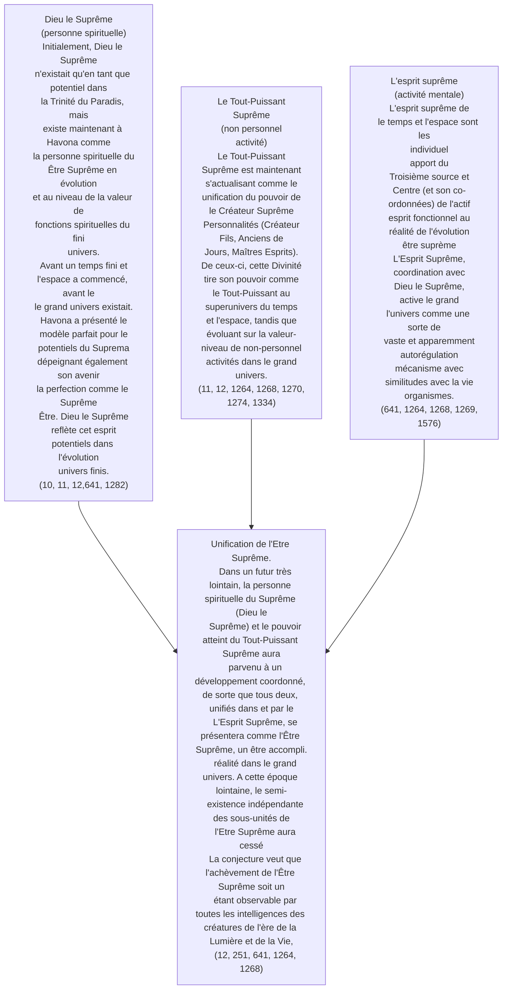

© 2000 Ken Glasziou © 2000 La Bibliothèque de la Confrérie des Hommes

Dans les Cahiers d'Urantia, certains auteurs ont tendance à se référer à l'Être Suprême comme étant à la fois existant et non encore existant – donc d'une manière similaire à la manière dont les physiciens des particules traitent les particules comme étant simultanément à la fois des ondes et des particules.

Bien que l’Être Suprême en évolution n’ait pas encore achevé son existence et demeure encore dans une réalité finie sous des formes fragmentées en tant que Dieu le Suprême, le Tout-Puissant Suprême et l’Esprit Suprême, néanmoins, dans les domaines transcendants du Paradis, l’Être Suprême « est déjà ». »

Il est vrai que dans certains articles, une distinction très concise est faite entre l'Être Suprême incomplet et les parties qui sont maintenant fonctionnelles au cours des étapes évolutives du grand univers. Dans d’autres, le terme « le Suprême » ou « l’Être suprême » peut être utilisé de manière à laisser le lecteur comprendre ce que l’on entend réellement. Un autre terme parfois utilisé est « Suprématie » et fait principalement référence aux effets conjoints de l’Être Suprême et de la Trinité Paradisiaque.

Pour ceux qui ont un intérêt naissant pour la philosophie et la théologie, les concepts exprimés dans les Cahiers d'Urantia sur les relations entre la Déité finie (immanente) et transcendante ont certaines similitudes avec les idées actuelles de philosophie des processus et de théologie. Cependant, dans les détails et dans le concept, les Cahiers d'Urantia semblent être bien en avance sur tous les travaux actuels.

Même une modeste connaissance de la théologie du processus telle que celle présentée, par exemple, dans l'Encyclopedia Britannica, peut être très utile pour approfondir notre compréhension des Cahiers d'Urantia.

Dans les Cahiers, nous apprenons que la créativité de nous, humains, se limite au tri des idées de base plutôt qu'à leur création. Cela confirme peut-être ce que beaucoup de nos plus grands mathématiciens ont toujours cru : ils ne « créent » pas de nouveaux théorèmes ou lois, mais plutôt les « découvrent ». Naturellement, cela soulève de nombreux débats sur la situation de ces théorèmes avant leur découverte, ainsi que sur celui qui les a créés.

Les Cahiers nous informent que toutes les idées originales, concepts, etc. possibles, sont déjà présents en tant que potentiels et possibilités dans la conservation des Absolus de l'Infini. ([LU 115:2.1](/fr/The_Urantia_Book/115#p2_1), [LU 115:4.6](/fr/The_Urantia_Book/115#p4_6))

Ceux qui deviennent disponibles pour nous, les humains, le font apparemment parce qu’ils ont déjà été « traités » et qu’ils sont présents et disponibles dans l’Esprit Suprême désormais fonctionnel. ([LU 117:5.10](/fr/The_Urantia_Book/117#p5_10))

À travers l’esprit cosmique de l’Esprit Infini et les esprits mentaux adjudants de l’Esprit Mère de l’Univers, ces pensées préexistantes sont présentées pour notre sélection, notre tri, notre recombinaison et notre prise de décision. ([LU 117:4.8](/fr/The_Urantia_Book/117#p4_8), [LU 117:5.11](/fr/The_Urantia_Book/117#p5_11))

Du moins, c'est ainsi que cela semble être. Les tableaux qui suivent peuvent être utiles pour réaliser certains tris auto-effectués.

> C’est en utilisant la réalité même du Suprême que l’Ajusteur, avec le consentement de la volonté humaine, tisse les modèles de la nature éternelle d’un fils ascendant de Dieu. ([LU 117:4.8](/fr/The_Urantia_Book/117#p4_8))

## La création des univers

```mermaid
flowchart TB
    P1["Les Absolus de l'Infini
    Toutes les possibilités et potentiels, qu'ils soient de la matière,
    esprit, esprit, événement ou idée, tous sont initialement et
    existant en permanence dans les Absolus de l'Infini,
    y compris tout ce qui est ou peut devenir fini.
    C'est à partir de ces possibilités et potentiels que
    superunivers (et tout ce qu'ils contiennent), plus les
    les corps spatiaux, sont créés comme notre réalité finie.
    (1155, 1261, 1264, 1298)"]
    P2["Transmuter le transcendant
    Puisque ces possibilités et potentiels résident avec
    les Absolus sont transcendants, c'est-à-dire « hors » de
    l'espace et le temps, pour devenir une réalité finie, ils doivent être
    transmuté (transformé) pour apparaître comme actualisé
    réalité dans un espace et un temps finis.
    Il s'agit d'une tâche partagée dont l'intégration est la
    fonction de l’Esprit Infini. Pour les questions de non-
    réalité personnelle, la réalisation initiale est
    entrepris par les Architectes du Maître Univers,
    puis par les Personnalités Créatrices Suprêmes (les
    Fils Créateurs, Anciens des Jours et Maîtres Esprits),
    qui impliquent l'Etre Suprême.
    (1150, 1264, 1284, 1287, 1298)"]
    P3["L'Être Suprême Évolutionnaire
    Maintenant présent en tant que Dieu. le Suprême (esprit), le Mental
    du Suprême (esprit) et du Tout-Puissant Suprême
    (pouvoir et activités non personnelles), ces aspects
    de la Déité finie sont fonctionnels au cours de l'évolution de
    le Grand Univers à la Lumière et à la Vie.
    Quand tout sera parfait, l'évolution du Suprême
    est terminé. Les aspects transitoires du Suprême
    Sera alors uni dans l'immanent et
    Dieu parfait des Univers finis, le Suprême
    Être (251, 1268, 1269)"]
    P1 --> P2
    P2 --> P3
```

## Evolution de l'Être Suprême

## Liens externes

- Article dans Innerface International : https://urantia-book.org/archive/newsletters/innerface/vol7_3/page7.html

