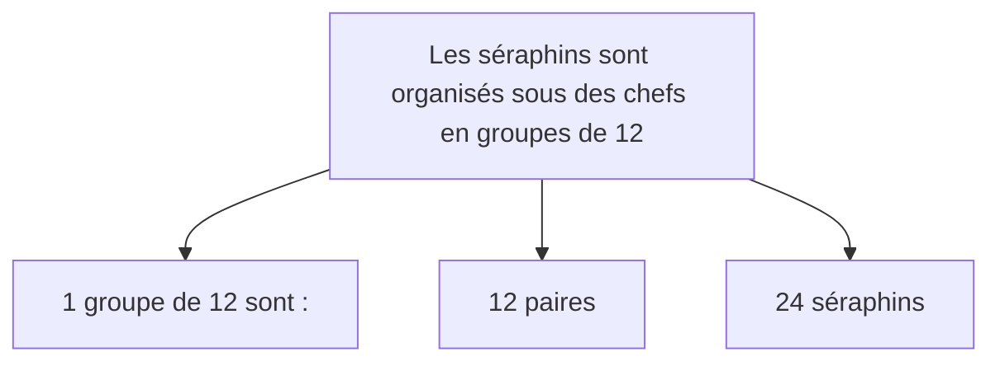
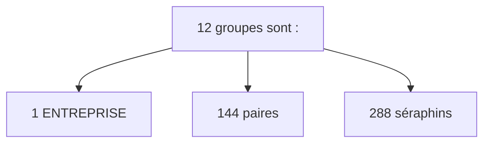
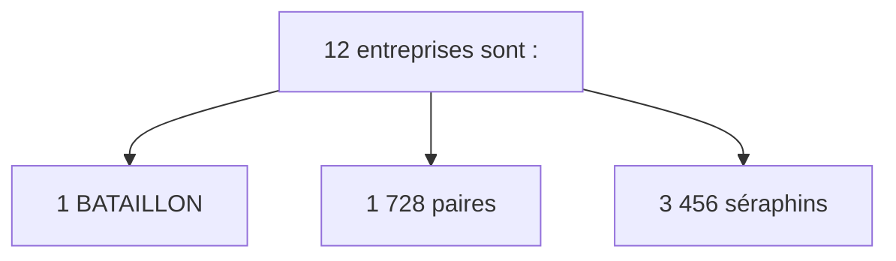
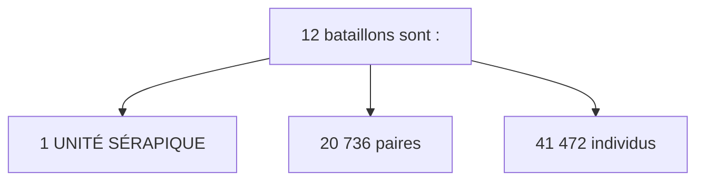
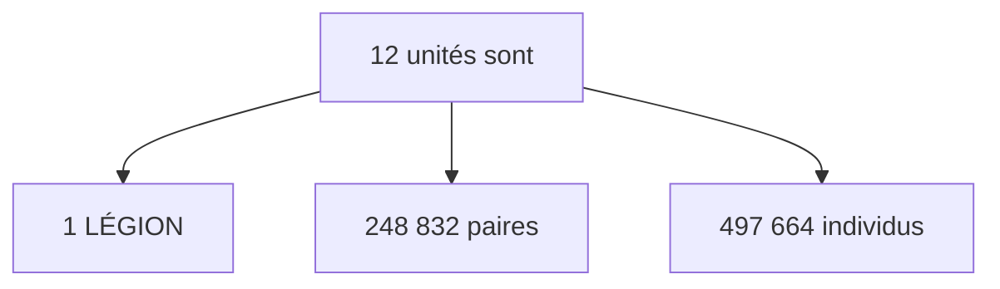
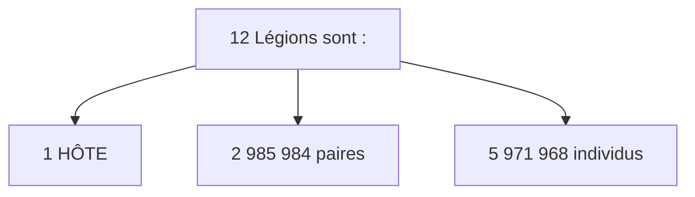
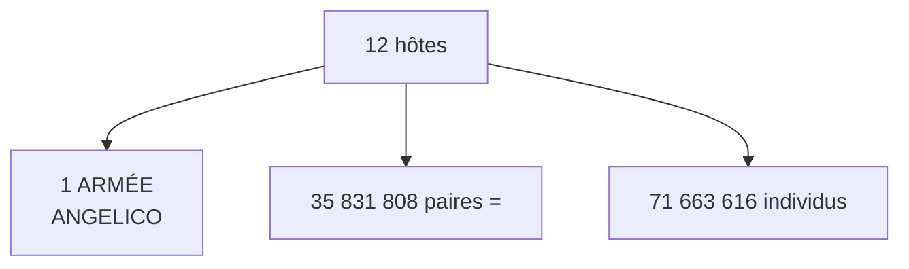
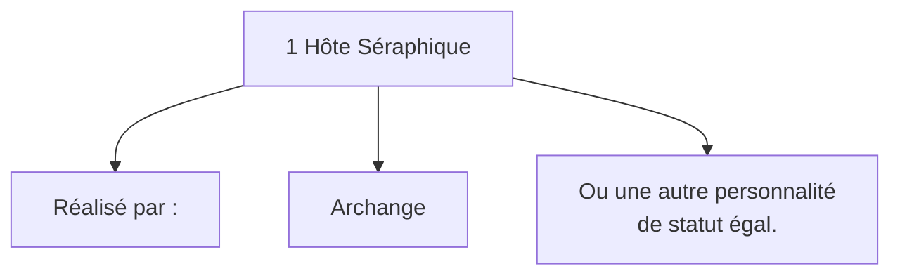
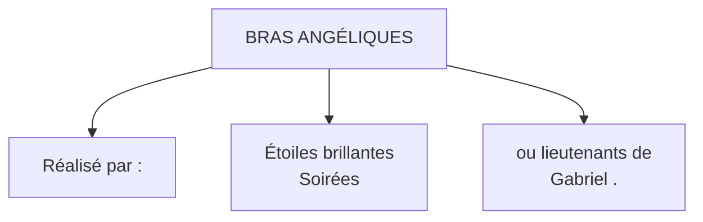
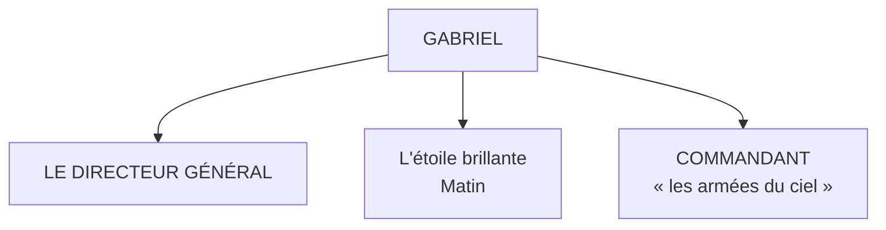

© 2005 Luis Coll © 2005 Association Urantia d'Espagne
 
<figure class="table chapter-navigator">
  <table>
    <tbody>
      <tr>
        <td>
        </td>
        <td>
        <a href="/fr/index/articles_spain">
          « Association Urantia d'Espagne » — Index 
        </a>
        </td>
        <td>
        </td>
      </tr>
    </tbody>
  </table>
</figure>

## Document 38, page 421

Caractéristiques des Séraphins : Page 418, 420, 421

1. Créé par : Esprit Mère Universel
2. Origine : 7 sphères primaires de Salvington
3. Maison : signifie la maison de 2 séraphins (ils vivent en couple)
4. Etat : ils ne sont pas masculins et féminins, ils sont négatifs et positifs
5. Caractéristiques : Ils ne sont pas caractérisés par l'émotion sexuelle, bien qu'ils soient extrêmement personnels et vraiment affectueux.
6. Organisation : Groupe, Compagnie, Bataillon, Quartier général d'unité
7. Services : Esprits tutélaires du temps. Service dans un système local ; leurs affectations peuvent inclure Nébadon et même Orvonton.

Après le deuxième millénaire de leur séjour au siège séraphique, les séraphins sont organisés sous la direction de chefs en groupes de douze (douze couples, 24 séraphins), et douze de ces groupes constituent une compagnie (144 couples, 288 séraphins) sous le commandement d'un chef. Douze compagnies sous un commandant constituent un bataillon (1 728 couples, soit 3 456 séraphins), et douze bataillons sous un directeur constituent une unité séraphique (20 736 couples, soit 41 472 individus), tandis que douze unités, sous le commandement d'un surveillant, constituent une légion, qui compte 248 832 couples, soit 497 664 individus. Jésus fit allusion à un tel groupe d'anges cette nuit-là, au jardin de Gethsémani, lorsqu'il dit : « _À l'instant même, je peux prier mon Père, et il me donnera aussitôt plus de douze légions d'anges._ » Douze légions d'anges composent une armée de 2 985 984 couples, soit 5 971 968 individus. Douze armées (35 831 808 couples, soit 71 663 616 individus) forment la plus grande organisation de séraphins : l'armée angélique. Une armée séraphique est dirigée par un archange ou une autre personnalité de même rang, tandis que les armées angéliques sont dirigées par les Étoiles Brillantes et les Étoiles du Soir, ou d'autres lieutenants immédiats de Gabriel. Gabriel est le « commandant suprême des armées du ciel », le chef exécutif du Souverain de Nébadon, « il est Dieu, Seigneur des armées ».

Bien que servant sous la supervision directe de l'Esprit Infini tel qu'il est personnalisé sur Salvington, depuis l'effusion de Micaël sur Urantia, les séraphins et tous les autres ordres de l'univers local sont désormais soumis à la souveraineté du Fils Maître. Dès la naissance de Micaël sur Urantia, une émission superuniverselle fut diffusée dans tout Nébadon proclamant « _et que tous les anges l'adorent_ ». Toutes les catégories d'anges sont soumises à sa souveraineté ; elles font partie de ce groupe appelé « ses puissants anges ».

Direction et Commandants :

Gabriel de Salvington est le chef exécutif de l'univers de Nébadon – l'Étoile brillante du matin –, commandant en chef des « armées du ciel », c'est-à-dire des armées célestes. (Livre d'Urantia [UB 33:4.6](/fr/The_Urantia_Book/33#p4_6))

## Références 

- [Cet article est sur le site web de l'Association Urantia d'Espagne](https://aue.urantia-association.org/wp-content/uploads/sites/6/2018/03/OrganizacionSerafica.pdf)

<figure class="table chapter-navigator">
  <table>
    <tbody>
      <tr>
        <td>
        </td>
        <td>
        <a href="/fr/index/articles_spain">
          « Association Urantia d'Espagne » — Index 
        </a>
        </td>
        <td>
        </td>
      </tr>
    </tbody>
  </table>
</figure>