© 2019 Marilynn Kulieke © 2019 Fondation Urantia

<figure class="table chapter-navigator">
  <table>
    <tbody>
      <tr>
        <td>
        <a href="/fr/article/UF_News_Online/Welcome_Contact_Details_2019_07">
          Bienvenue et coordonnées
        </a>
        </td>
        <td>
        <a href="/fr/index/articles_uf_news_online#volume-13-numéro-2-july-2019">
          Volume 13, numéro 2, July 2019 — Table des matières
        </a>
        </td>
        <td>
        <a href="/fr/article/Judy_Van_Cleave/Noteworthy_Board_Decisions_from_the_April_2019_Trustees_Meeting">
          Importantes décisions de la réunion du conseil d’administration des Trustees d’avril 2019
        </a>
        </td>
      </tr>
    </tbody>
  </table>
</figure>

<figure id="Figure_1" class="image urantiapedia image-style-align-left">

</figure>

_Par Marilynn Kulieke, présidente des traductions, vice-présidente de la Fondation Urantia, Illinois, États-Unis_

_Note de l’éditeur : Durant le Symposium Culturel qui se tint à la Fondation Urantia, en avril dernier, Marilynn donna une excellente et informative présentation sur le processus utilisé pour produire des traductions de qualité. Elle fut enregistrée en vidéo, regardez la, s’il vous plaît, ici. Le résultat final est une appréciation plus intense du travail incroyable requis pour traduire le Livre d’Urantia._
 

https://www.youtube.com/watch?v=_ufcn_nmc-A

La voie fondamentale pour remplir l’objectif principal de la Fondation Urantia, est la production de traductions du _Livre d’Urantia_ en de nombreuses langues de notre monde. Elles sont une partie vitale de notre travail de remplir la mission de semer _Le Livre d’Urantia_ et ses enseignements mondialement.

Je suis ravie de servir comme présidente du Comité des Traductions. Les autres membres sont Georges Michelson-Dupont (directeur des traductions), Henk Mylanus, Jay Peregrine, Minoo Claire et Tamara Strumfeld. Notre travail, ainsi que la création de ce processus est réellement un travail d’équipe.

Notre but est d’être le producteur de traductions de la plus haute qualité et c’est pourquoi notre comité des traductions créa un processus systématique, basé sur notre amour pour la Révélation Urantia. Le processus de développement débuta en 2006 et est basé sur Le Guide Standard d’Assurance de Qualité pour les Traductions qui fut adopté par ASTM International.

En appliquant ces standards, il devint évident qu’un processus de cinq étapes d’approximativement 40 ans ou plus, était nécessaire pour produire une traduction de haute qualité. Ces étapes sont précisées comme suit :

```mermaid
flowchart TB
    P1["
        Étape Une : Préparation
        1 à 10 ans\n
        &bull; Un ou plusieurs individus ont
        été inspirés par les
        enseignements du Livre
        d'Urantia.
        &bull; La motivation requise pour
        traduire livre est enfin vivace. 
    "]
    P2["
        Étape Deux : Apprentissage
        6 mois à 1 an\n
        Le chef traducteur est-il
        qualifié ?
        &bull; Des ressources sont
        disponibles ?
        &bull; La traduction est-elle lisible,
        fidêle et uniforme en
        terminologie ?
    "]
    P3["
        Étape Trois : Traduire
        9 à 10 ans\n
        &bull; Le travail commence !
        &bull; Le traducteur doit comprendre
        le texte anglais en profondeur.
        &bull; De nouveaux mots et la
        syntaxe doivent être développés.
        &bull; Cela doit être beau.
    "]
    P4["
        Étape Quatre : Maturation
        5 à 15 ans\n
        &bull; La traduction est publiée et
        distribuée
        &bull; L'intérêt se développe parmi
        les groupes et les individus.
        &bull; Un ressenti est donné .
        &bull; Des idées de révision sont
        formulées .
    "]
    P5["
        Étape Cinq : La Révision
        5 à 6 ans\n
        &bull; Une équipe est développée.
        &bull; Des termes sont clarifiés.
        &bull; La qualité est améliorée.
        &bull; Le texte est peaufiné.
    "]
    P1 ==> P2
    P2 ==> P3
    P3 ==> P4
    P4 ==> P5
```

À la fin du processus, quand la révision est à maturité, il est temps de réintégrer le langage amélioré et la clarté de pensée, dans les canaux et les cultures évolutionnaires, en attente de cette nouvelle vérité. La citation suivante résume vraiment le travail dans lequel nous sommes engagés :

> « La civilisation doit attendre le langage pour se répandre. Des langues qui vivent et qui s’enrichissent assurent l’expansion de la pensée et des projets civilisés. Durant les âges primitifs, d’importants progrès furent apportés au langage. Aujourd’hui, il y a grand besoin d’un développement linguistique additionnel pour faciliter l’expression de la pensée en évolution. » [LU 81:6.16](/fr/The_Urantia_Book/81#p6_16)

## Références

- [Nouvelles en Ligne de la Fondation Urantia](https://www.urantia.org/fr/la-fondation-urantia/le-bulletin-officiel-de-la-fondation-urantia)
- [Cet article](https://www.urantia.org/fr/news/2019-06/creer-des-traductions-par-amour-le-processus-de-qualite-de-la-fondation-urantia)

 
<figure class="table chapter-navigator">
  <table>
    <tbody>
      <tr>
        <td>
        <a href="/fr/article/UF_News_Online/Welcome_Contact_Details_2019_07">
          Bienvenue et coordonnées
        </a>
        </td>
        <td>
        <a href="/fr/index/articles_uf_news_online#volume-13-numéro-2-july-2019">
          Volume 13, numéro 2, July 2019 — Table des matières
        </a>
        </td>
        <td>
        <a href="/fr/article/Judy_Van_Cleave/Noteworthy_Board_Decisions_from_the_April_2019_Trustees_Meeting">
          Importantes décisions de la réunion du conseil d’administration des Trustees d’avril 2019
        </a>
        </td>
      </tr>
    </tbody>
  </table>
</figure>
