© 2001 La Bibliothèque de la Confrérie des Hommes

> Potentiels et modèles existentiels Dans la terminologie de l'Univers, un modèle est immuable bien que des copies puissent être projetées comme matérielles, spirituelles ou mentales – ou dans n'importe quelle combinaison de ces énergies. Il peut imprégner les personnalités, les identités, les entités ou la matière non vivante. Les modèles sont la substance des potentiels. Le modèle peut configurer l’énergie mais ne la contrôle pas. La gravité est le seul contrôle de la matière énergétique. Ni l'espace ni le motif ne réagissent à la gravité et il n'y a aucune relation entre l'espace et le motif. La réalité de tout modèle est constituée de ses énergies, de son mental, de son esprit ou de ses composants matériels. Le modèle est un modèle à partir duquel des copies sont réalisées. Le Paradis éternel est l'absolu du modèle ; le Fils Éternel est la personnalité modèle ; le Père Universel est l’ancêtre-source direct des deux. Mais le Paradis ne confère pas de modèle et le Fils ne confère pas de personnalité. Cette qualité d'énergie ou de personnalité en vertu de laquelle le modèle apparaît peut être attribuée à Dieu et à la coexistence de la personnalité et du pouvoir.
{.is-info}

```mermaid
flowchart TB
    P1["
        Phase 1. La Trinité\n
        Toutes les possibilités, réelles et
        potentiel, qu'il soit existentiel,
        transcendantal, ou fini, ont
        leur origine avec la Trinité.
        L'aspect du JE SUIS connu
        comme l'est l'Absolu Non Qualifié,
        effectivement, un vaste entrepôt
        de toutes les charges statiques possibles
        potentialités et réalités.
        Le mandat initial pour activer
        potentiels statiques spécifiques
        dérive de la Trinité et est
        répondu par la Divinité
        Absolu.
    "]
    P2["
        Phase 2. L'Absolu de Déité\n
        La Déité Absolue répond
        aux causalités contenues dans
        le mandat de la Trinité
        de telle manière qu'il en résultera
        en activation des potentiels,
        statique dans le Non qualifié
        Absolu, devenir fini
        faits réels
    "]
    P3["
        Phase 3. Les non qualifiés
        Absolu\n
        Est sensible à la divinité
        Absolu à travers le
        activation du approprié
        statique imprégnée causale
        possibilités et potentiels.
    "]
    P4["
        Phase 4. L'Absolu Universel\n
        Répond à la nouvelle cause-
        imprégné mais toujours statique
        potentiels, compensant parfaitement
        les différentiels inhérents à
        divers aspects de l'incomplétude
        réalité, et se préparer à
        devenir actif et réactif
        l'influence de certains
        agences transcendantales qui
        être impliqué dans leur transmutation
        aux réalités finies.
    "]
    P5["
        Phase 5. L'ultime divinité\n
        L'éventualité de l'univers
        capacités en conséquence de la
        mandats volontaires originaux du
        La Trinité implique la transformation de
        ces potentiels indifférenciés en
        plans distincts et définis. C'est
        un acte de l'Ultimité de la Déité également
        comme de multiples agences du
        niveau transcendantal.
        De tels actes anticipent parfaitement
        les besoins futurs du Master
        Univers et conformément à l'
        plans des Architectes du Maître
        L'univers comme incarnation du
        Concept de divinité des univers.
    "]
    P6["
        Phase 6. Rôle de l'acteur conjoint
        (l'Esprit Infini) en tant qu'intégrateur\n
        L'Esprit Infini universellement
        intègre les différentes fonctionnalités
        aspects de tous actualisent la réalité sur tous
        niveaux de manifestation à partir de finis,
        à travers les transcendantaux, et jusqu'à
        les absolus.
    "]
    P7["
        Phase 7. Les Triodités de
        Actualité et Potentialité\n
        La Triodité de Potentialité consiste en
        les trois Absolus de l'Infini tandis que
        la Triodité de l'Actualité consiste en
        le Fils Éternel, l'Acteur Conjoint
        (Infinite Sprit) et l'île paradisiaque.
        (remarque : tout ce qui est impersonnel est au centre
        et inhérent à l'île paradisiaque.)
        Les triodités agissent directement sur
        Suprême et aussi indirectement via le
        niveau éventuel de l'absonite et
        les actions coopératives des
        Personnalités Créatrices Suprêmes.
        Il semble que ce soient les dernières étapes de
        le transfert de l'existentiel transmué
        potentiels aux réels finis de la réalité à
        le suprême.
    "]
    P8["
        Étape 8. Le Suprême—
        Dieu expérientiel du fini
        Univers\n
        Les potentiels existentiels se transmuent en
        réels lorsqu'ils trouvent un logement auprès du
        Suprême. Là, ils redevinrent
        potentiels à intégrer
        réalité par le Créateur Suprême
        Des personnalités dans leur fonction de
        créateurs du Maître Univers.
        aut bien plus que les potentiels finis
        de la réalité matérielle dérivent de la
        Suprême. L'homme mortel et tous les autres
        les créatures finies sont créées à partir du
        potentiel vivant d'énergie, d'esprit et
        esprit existant dans le Suprême.
        Et c'est hors de la réalité du
        Suprême que l'Esprit-Dieu qui
        habite chaque individu humain, avec
        le consentement de cet individu, tisse ces
        des modèles destinés à devenir un
        âme ascendante, tandis que cette même
        l'individu utilise ces qualités et
        quantités déjà existantes au sein du
        Suprême pendant la croissance expérientielle
        vers le Père Universel.
        Cependant, l'expérience de l'humanité avec
        le Suprême est à double sens, en ce sens que le
        des expériences de croissance de l'âme également
        contribuer à l'évolution du
        Suprême à travers de multiples agences de
        divinité.
    "]
    P1 ==> P2
    P2 ==> P3
    P3 ==> P4
    P4 ==> P5
    P5 ==> P6
    P6 ==> P7
    P7 ==> P8
```

## Liens externes

* Article dans Innerface International : https://urantia-book.org/archive/newsletters/innerface/vol8_2/page8.html

